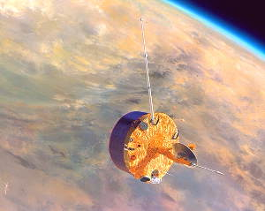
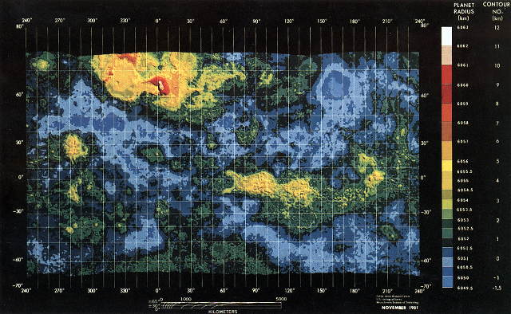
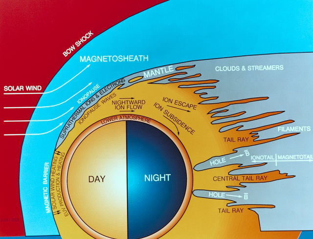
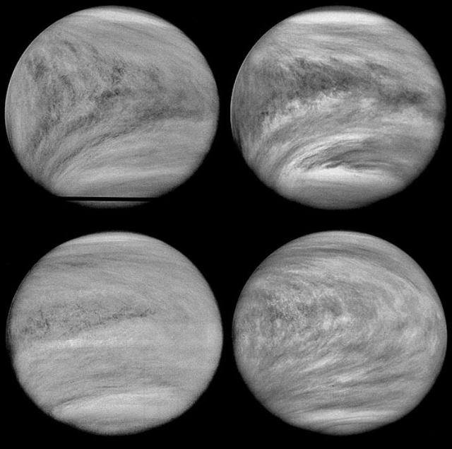
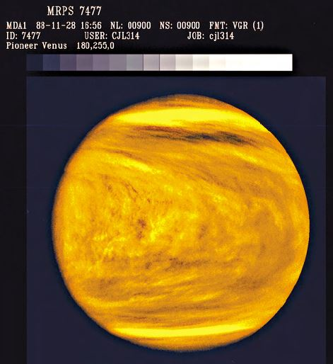
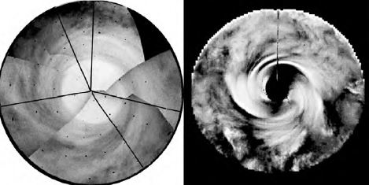

# Pioneer Venus 1
> 2019.12.16 ┊ **🚀 [despace](index.md)** → [Venus](venus.md), **[Project](project.md)**

[TOC]

---

> <small>*Terms:* **Pioneer Venus Orbiter (Pioneer Venus 1, Pioneer 12)** — English term with no analogues in Russian. **Пионер-Венера-1** — Russian equivalent.</small>

**Pioneer Venus Orbiter**, also known as *Pioneer Venus 1* or *Pioneer 12*, was a mission to Venus conducted by the United States as part of the Pioneer Venus project. Launched in May 1978 atop an Atlas-Centaur rocket, the spacecraft was inserted into an elliptical orbit around Venus on December 4, 1978. It returned data on Venus until October 1992.

 

|*Type*|*[Param.](si.md)*|
|:--|:--|
||**`Mission properties`**|
|Cost| US $125 million or 20 126 kg of [gold](sc_price.md) |
|Development| … |
|Duration| 14 years 4 months 18 days |
|Launch| May 20, 1978, 13:13:00 UTC, Rocket Atlas SLV-3D Centaur-D1AR |
|Operator| NASA / ARC |
|Programme| Pioneer Venus project |
|Similar  missions| • Proposed: …   • Current: [Magellan](magellan.md)  • Past: [Venera-9 -10](venera_9_10.md), [Mariner 10](mariner_10.md) |
|Target| Mapping the surface of Venus, studying the atmosphere (including observation of the rotation of the atmosphere) |
|[Type](sc.md)| Orbiter spacecraft |
||**`Spacecraft properties`**|
|Comms| High-gain antenna; S-band, X-Band |
|Composition| Orbiter |
|Contractor| United Launch Alliance |
|[ID](spaceid.md)| NSSDC ID (COSPAR ID): [1978-051A ⎆](https://nssdc.gsfc.nasa.gov/nmc/spacecraft/display.action?id=1978-051A), SCN: [10911 ⎆](http://www.n2yo.com/satellite/?s=10911) |
|Manufacturer| Hughes |
|Mass| Dry: 360 kg ([minisatellite](sc.md), [EVN‑070](venus.md)) |
|Orbit / Site| Cytherocentric; 142 — 253 × 66 900 km; T = 24 h; i = 105 ° |
|Payload| Radio science, Photo polarimeter, Radar, Infrared radiometer, Spectrometers, Analzer plasma, Magnetometer, Measure the electric fields of Venus, Electron temperature gauge, Ion charge meter, Gamma-ray burst detector |
|Power| 312 W |

Achieved targets & investigations:

   - **T** — technical; **Draft** — minimum for working with object. **D** — distant exploration; **C** — contact exploration; **F** — fly‑by; **H** — manned flight; **S** — soil sampe return; **X** — technology demonstration
   - **Sections of measurement and observation:**
      - Atmospheric/climate — **Ac** composition, **Ai** imaging, **Am** mapping, **Ap** pressure, **As** samples, **At** temperature, **Aw** wind speed/direction.
      - General — **Gi** planet’s interactions with outer space.
      - Soil/surface — **Sc** composition, **Si** imaging, **Sm** mapping, **Ss** samples.

<small>

|*EVN‑XXX*|*T*|*EN*|*Section of m&o*|*D*|*C*|*F*|*H*|*S*|
|:--|:--|:--|:--|:--:|:--:|:--:|:--:|:--:|
|EVN‑002||Surface: map, draft.|  |D|C||||
|EVN‑005|T|Exploration: from Venusian orbit.|  |D||F|||
|EVN‑010||Atmosphere: vertical model.|  |D|||||
|EVN‑012||Atmosphere: lightnings.|  |D|||||
|EVN‑014||Atmosphere: composition.|  |D|||F||
|EVN‑017||Atmosphere: structure.|  |D|||||
|EVN‑025||Surface: structure.|  ||C||||
|EVN‑028||Magnetosphere structure.|  |D||F|||
|EVN‑029||Is Venus geologically active?|  |D|C|F|||
|EVN‑034||Atmosphere: nature of the superrotation.|  |D|||||
|EVN‑067||Atmosphere: nature of the polar turbulence.|  |D|||||
|EVN‑070|T|Exploration with [satellites](sc.md): minisatellites.|  |D||F|||
|EVN‑089||Measuring the planetary gravitational field.|  |D||F|||
|EVN‑096||Atmosphere: ionosphere.|  |D||F|||
|EVN‑097||Atmosphere: the effect of solar radiation & interplanetary space on the atmo.|  |D||F|||

</small>

 

## Mission
The Pioneer Venus 1 (also known as the Pioneer Venus orbiter) was the first of a two-spacecraft orbiter-probe combination designed to conduct a comprehensive investigation of the atmosphere of Venus. The orbiter spacecraft was launched by an Atlas SLV-3D Centaur-D1AR rocket, which flew from Launch Complex 36A at the Cape Canaveral Air Force Station. The launch occurred at 13:13:00 on May 20, 1978, and deployed the Orbiter into heliocentric orbit for its coast to Venus.

The orbiter went into orbit around Venus on Dec. 4, 1978 ([EVN‑005](venus.md)). The orbiter peered through the clouds and produced the first radar topographic map of most of the surface, at a resolution of 75 km (([EVN-002](venus.md)). It reflected 80% of the surface of Venus. The missing 20% belonged to the poles of the planet.

On Venus, as on Earth, there are mountains, plains, lowlands. Mountain areas occupy 8% of the planet's surface. About 27% of the surface of Venus is lowland. They are concentrated in two intersecting belts, the outlines of which resemble the letter "X". On Venus, as on Earth, traces of tectonic activity were found. The volcanic activity of Venus is evidenced by the «youth» of some details of its relief. But it was also concluded that tectonic activity on Venus is less active than on Earth ([EVN‑029](venus.md)).

Also, from its orbit of Venus, the Pioneer Venus Orbiter was able to observe Halley's Comet when it was unobservable from Earth due to its proximity to the sun during February 1986. UV spectrometer observations monitored the loss of water from the comet's nucleus at perihelion on February 9.

The Pioneer Venus orbiter measured the detailed structure of the upper atmosphere ([EVN‑017](venus.md)) and ionosphere of Venus ([EVN-096](venus.md)), investigated the interaction of the solar wind with the ionosphere and the magnetic field in the vicinity of Venus ([EVN‑097](venus.md)), determined the characteristics of the atmosphere and surface of Venus on a planetary scale, determined the planet's gravitational field harmonics from perturbations of the spacecraft orbit ([EVN‑089](venus.md)), and detected gamma-ray bursts.

The diagram illustrates the solar wind, shock wave, magnetic field, ion and electron clouds and streams from Venus. The impact of solar wind on the atmosphere of Venus according to the data from the Board Pioneer Venus 1.

The most mysterious properties had a cloud formation in the form of Y, discovered in the early 60s and only in ultraviolet images. It had two symmetrical arms relative to the equator and extended to latitudes of 45°. Initially, this formation was associated with zonal advection of UV markers due to the superfluid atmosphere of Venus. The researchers concluded that such a large structure is an atmospheric wave. Determining the nature of this wave has become a crucial problem, as its enormous size may indicate an explanation for why Venus' atmosphere rotates 60 times faster than the planet itself — atmospheric superrotation. The spacecraft provided new data on the dynamics of the planet's cloud cover and its four-day atmospheric superrotation ([EVN‑034](venus.md)). In addition, frequent thunderstorms were detected, concentrated in limited areas ([EVN-012](venus.md)).

The Orbiter was transmitting ultraviolet images of the planet's cloud cover.

Synthesized images of the Venus pole from the Pioneer Venus Orbiter and Mariner 10 spacecraft. The image below shows the polar vortex in Venus' atmosphere. ([EVN‑067](venus.md))

Also Pioneer Venus Orbiter participated in the international network for search and registration of gamma-ray bursts.

From Venus orbit insertion on December 4, 1978, to July 1980, periapsis was held between 142 and 253 km to facilitate radar and ionospheric measurements. Orbiter's mass spectrometer detected single-charge and double-charge atomic oxygen in the ionosphere of Venus, as well as ions of molecular oxygen, atomic and molecular hydrogen, helium, carbon, nitrogen and carbon dioxide ([EVN-096](venus.md)). Thereafter, the periapsis was allowed to rise to 2 290 km at maximum and then fall, to conserve fuel. In In 1991, the Radar Mapper was reactivated to investigate previously inaccessible southern portions of the planet, in conjunction with the recently arrived Magellan spacecraft. In May 1992 Pioneer Venus began the final phase of its mission, in which the periapsis was held between 150 and 250 km until the fuel ran out. The Pioneer Venus Orbiter disintegrated upon entering the atmosphere of Venus on October 22, 1992. The orbiter cost $125 million to build and operate for the first 10 years.

 

## Science goals & payload
It was planned that it would be operational at least one Venusian day (243 Earth days).

The Pioneer Venus Orbiter carried 17 experiments:

   - a cloud photo-polarimeter (**OCPP**) to measure the vertical distribution of the clouds ([EVN‑010](venus.md)), similar to Pioneer 10 and Pioneer 11 imaging photo-polarimeter;
   - a surface radar mapper (**ORAD**) to determine topography and surface characteristics ([EVN‑025](venus.md)). Observations could only be conducted when the probe was closer than 4 700 km over the planet. A 20 W S-band signal (1.757 GHz) was sent to the surface that reflected it, with the probe analyzing the echo. Resolution at periapsis was 23 × 7 km;
   - an infrared radiometer (**OIR**) to measure IR emissions from Venus' atmosphere (an experiment to obtain a heat map of the atmosphere. The radiometer failed after several months of operation, so the distribution was obtained only on the illuminated side of the planet);
   - an airglow ultraviolet spectrometer (**OUVS**) to measure scattered and emitted UV light;
   - a neutral mass spectrometer (**ONMS**) to determine the composition of the upper atmosphere ([EVN‑014](venus.md));
   - a solar wind plasma analyzer (**OPA**) to measure properties of the solar wind;
   - a magnetometer (**OMAG**) to characterize the magnetic field at Venus ([EVN‑028](venus.md));
   - an electric field detector (**OEFD**) to study the solar wind and its interactions;
   - an electron temperature (**OETP**) to study the thermal properties of the ionosphere ([EVN-096](Венера.mg));
   - an ion mass spectrometer (**OIMS**) to characterize the ionospheric ion population ([EVN-096](Венера.mg));
   - a charged particle retarding potential analyzer (**ORPA**) to study ionospheric particles ([EVN-096](Венера.mg));
   - two radio science experiments to determine the gravity field of Venus ([EVN-089](Венера.mg));
   - a radio occultation experiment to characterize the atmosphere;
   - an atmospheric drag experiment to study the upper atmosphere;
   - a radio science atmospheric and solar wind turbulence experiment;
   - a gamma ray burst (**OGBD**) detector to record gamma ray burst events.

**Synthesis of the instruments**

|*Name*|*Complete designation*|*Type*|*Manufacturer*|*Responsible scientist*|*Mass*|*Electrical consumption*|
|:--|:--|:--|:--|:--|:--|:--|
| **OCPP** | Orbiter Cloud Photopolarimeter	 | Photo polarimeter | GISS | J. Hansen | 5 kg  | 5.4 W |
| **ORAD** | Orbiter Radar Mapper Instrument | Radar | MIT | G. Pettengill | 9 kg  | 18 W |
| **OIR** | Orbiter Infrared Radiometer | Infrared radiometer | JPL | F. Taylor | 5.9 kg  | 5.2 W |
| **OUVS** | Orbiter Ultraviolet Spectrometer | Ultraviolet spectrometer | LASP | A. Stewart | 3.1 kg | 1.7 W |
| **ONMS** | Orbiter Neutral Mass Spectrometer | Neutral mass spectrometer | GSFC | H. Neimann | 3.8 kg | 12 W |
| **OPA** | Orbiter Plasma Analyzer | Analzer plasma | ARC | J. Wolfe | 3.9 kg | 5 W |
| **OMAG** | Orbiter Magnetometer | Magnetometer | UCLA | C. Russell | 2 kg | 2.2 W |
| **OEFD** | Orbiter Electric Field Detector | Measure the electric fields of Venus | TRW | F. Scarf | 0.8 kg | 0.7 W |
| **OETP** | Orbiter Electron Temperature Probe | Electron temperature gauge | GSFC | L. Brace | 2.2 kg | 4.8 W|
| **OIMS** | Orbiter Ion Mass Spectrometer | Ion mass spectrometer | GSFC | H. Taylor | 3 kg | 1.5 W |
| **ORPA** | Orbiter Retarding Potential Analyzer | Ion charge meter | LPARL | W. Knudsen | 2.8 kg | 2.4 W |
| **OGBD** | Orbiter Gamma-Ray Burst Detector | Gamma-ray burst detector | LASL | W. Evans | 2.8 kg | 1.3 W |

 

## Spacecraft
Pioneer Venus Orbiter was based on the HS-507 bus. The spacecraft was a flat cylinder, 2.54 m in diameter and 1.22 m height. The total height of the station is 4.5 m. Solar cells are mounted on the side surface of the hull, providing more than 300 W of power in orbit around Venus. There are also NiCd batteries used during the shadow periods of Venus. The station is stabilized by rotation. To high-gain antenna is always facing the Earth, the antenna unit is mounted on a hinge and equipped with a counter-rotation system. The de-spun antenna had 1.09 m diameter and provided S- and X-band communication with Earth. The set rotation speed, the orientation of the axis of rotation, as well as the correction of the trajectory on the Earth-Venus flight path and the correction of the orbit around Venus were provided by hydrazine micro-engines. The supply of hydrazine (32 kg) is the main factor limiting the duration of the station in orbit around Venus. The micro-engines were activated automatically by the commands of the solar and stellar sensors or by commands from the Earth. The spacecraft was transferred from the flight path to orbit around Venus by a braking solid-fuel engine «Звезда‑24» with a thrust of 18 kN capable of reducing the speed by more than 1 km/s. The instruments were mounted on a shelf within the spacecraft except for a magnetometer mounted at the end of a boom to ensure against magnetic interference from the spacecraft.

 

## Community, library, links

**PEOPLE:**

   - **Leaders:**
      1. Lawrence Colin — project scientist, NASA Ames Research Center, Moffett Field, Calif.
      1. John W. Dyer — NASA Ames Research Center, Moffett Field, Calif.
      1. Richard O. Fimmel — project manager, NASA Ames Research Center, Moffett Field, Calif.
      1. Robert W. Jackson — NASA Ames Research Center, Moffett Field, Calif.
   - **Scientists responsible for the scientific equipment:**
      1. L. Brace
      1. T. Croft
      1. W. Evans
      1. J. Hansen
      1. G. Keating
      1. A. Kliore
      1. W. Knudsen
      1. H. Neimann
      1. G. Pettengill
      1. R. Phillips
      1. [C. Russell](02_russell_001.md)
      1. F. Scarf
      1. I. Shapiro
      1. A. Stewart
      1. F. Taylor
      1. H. Taylor
      1. J. Wolfe

**COMMUNITY:**

<mark>TBD</mark>

 

## Docs & links
|…°·•¹²³±×÷≤≥≈≠ ‑ −— ⎆✉ ❐“”’«»✔→✘☐☑├┕┆ 1 lb = 0.453592 kg; 1 g = 9.80665 m/s²|
|:--|
|<small>**[FAQ](faq.md)**, **[Cable](cable.md)**·БКС, **[Camera](camera.md)**·Камера, **[Comms](comms.md)**·Радиосв., **[Contact](contact.md)**·Контакт, **[Control](control.md)**·Управ., **[Doc](doc.md)**·Док., **[Doppler](doppler.md)**·ИСР, **[DS](ds.md)**·ЗУ, **[EB](eb.md)**·ХИТ, **[ECO](ecology.md)**·Экол., **[EF](ef.md)**·ВВФ, **[ElC](elc.md)**·ЭКБ, **[EMC](emc.md)**·ЭМС, **[Errors](error.md)**·Ошибки, **[Events](event.md)**·События, **[FS](fs.md)**·ТЭО, **[Fuel](fuel.md)**·Топливо, **[GNC](gnc.md)**·БКУ, **[GS](scs.md)**·НС, **[HF&E](hfe.md)**·Эргоном., **[IMU](imu.md)**·Гироскоп, **[Incubator](incubator.md)**·Инкуб., **[KT](kt.md)**·КТЕХ, **[LAG](lag.md)**·ПУC, **[LES](les.md)**·САСП, **[LS](ls.md)**·СЖО, **[LV](lv.md)**·РН, **[MAG](mag.md)**·Магнитом., **[MCC](mcc.md)**·ЦУП, **[Model](model.md)**·Модель, **[MSC](sc.md)**·ПКА, **[N&B](nnb.md)**·БНО, **[NR](nr.md)**·ЯР, **[OBC](obc.md)**·ЦВМ, **[OE](oe.md)**·БА, **[Patent](патент.md)**·Патент, **[Project](project.md)**·Проект, **[PS](ps.md)**·ДУ, **[QA](quality.md)**·QA, **[R&D](rnd.md)**·НИОКР, **[RAMS](rams.md)**·НиБ, **[Risk](risk.md)**·Риск, **[Robot](robotics.md)**·Робот, **[Rover](rover.md)**·Планетоход, **[RTG](rtg.md)**·РИТЭГ, **[RW](rw.md)**·ДМ, **[SARC](sarc.md)**·ПСК, **[Sensor](sensor.md)**·Датчик, **[SC](sc.md)**·КА, **[SCS](scs.md)**·КК, **[SGM](sgm.md)**·КММ, **[SI](si.md)**·СИ, **[Soft](soft.md)**·ПО, **[SP](sp.md)**·БС, **[Spaceport](spaceport.md)**·Космодром, **[SPS](sps.md)**·СЭС, **[SSS](sss.md)**·ГЗУ, **[TCS](tcs.md)**·СОТР, **[Test](test.md)**·ЭО, **[Timeline](timeline.md)**·Циклограмма, **[TMS](tms.md)**·ТМС, **[TOR](tor.md)**·ТЗ, **[TRL](trl.md)**·УГТ</small>|
|*Sections & pages*|
|**··•  •··**  <mark>NOCAT</mark> |

**Docs:**

   1. П. С. Шубин — Венера. Неукротимая планета. Издание второе, расширенное и дополненное. М.: Издательство «Голос‑Пресс»; Кемерово: издатель П. С. Шубин, 2018. – 352 стр.: ил.

**Links:**

   1. Notable interwikies — …
   1. <https://en.wikipedia.org/wiki/Pioneer_Venus_Orbiter>
   1. <http://galspace.spb.ru/index503.html>
   1. <https://www.nasa.gov/centers/ames/missions/archive/pioneer-venus.html>
