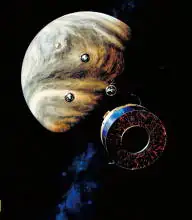
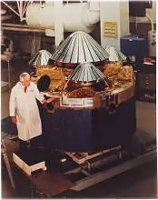
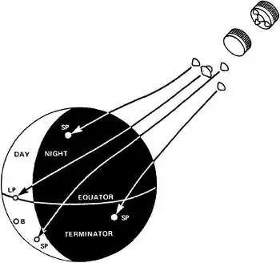
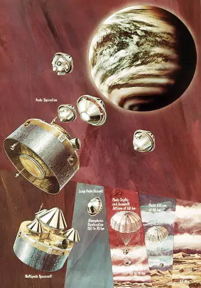
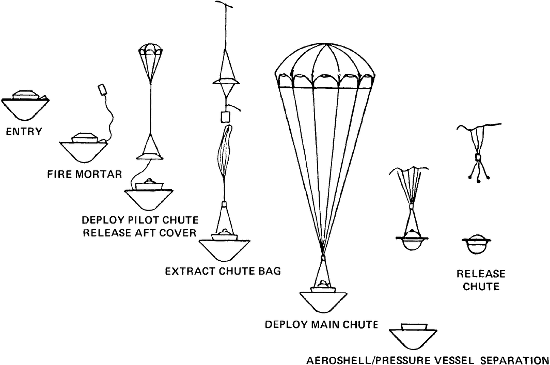
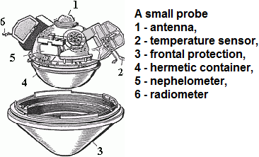

# Pioneer Venus 2
> 2019.12.16 [🚀](../index/index.md) [despace](index.md) → [Venus](venus.md), **[Project](project.md)**

**Table of contents:**

[TOC]

---

> <small>**Pioneer Venus Multiprobe (Pioneer Venus 2, Pioneer 13)** — EN term. **Пионер‑Венера‑2** — rough RU analogue.</small>

**The Pioneer Venus Multiprobe**, also known as *Pioneer Venus 2* or *Pioneer 13*, was a spacecraft launched in 1978 to explore Venus as part of NASA’s Pioneer program. This part of the mission included a spacecraft bus which was launched from Earth carrying one large and three smaller probes, which after separating penetrated the Venusian atmosphere at a different location, returning data as they descended into the planet’s thick atmosphere. The entry occurred on December 9, 1978.

 

 

|*Type*|*[Param.](si.md)*|
|:-|:-|
|**【Mission】**|• • •|
|Cost|… or … ㎏ of [gold](sc_price.md)|
|Development|…|
|Duration|4 months, 1 day, 13 hours, 22 minutes|
|Launch|August 8, 1978, 07:33 UTC, Rocket Atlas SLV-3D Centaur-D1AR|
|Operator|NASA / ARC|
|Programme|Pioneer Venus project|
|Similar to|・Proposed: [Magellan](magellan.md), [Galileo Probe](galileo.md)   ・Current: …   ・Past: …|
|Target|Studying the structure and composition of clouds from inside the atmosphere|
|[Type](sc.md)|Atmospheric spacecraft|
|**【Spacecraft】**|• • •|
|Comms|S‑band, X‑band|
|Composition|Spacecraft Bus, one large and three smaller probes|
|Contractor|United Launch Alliance|
|[ID](spaceid.md)|NSSDC ID (COSPAR ID): [1978-078A ⎆](https://nssdc.gsfc.nasa.gov/nmc/spacecraft/display.action?:id=1978-078A), SCN: [11001 ⎆](http://www.n2yo.com/satellite/?:s=11001)|
|Manufacturer|Hughes|
|Mass|Dry mass: 904 ㎏ (bus 290 ㎏ [minisatellite](sc.md), [EVN‑070](venus.md)), large probe 315 ㎏, small probe 3 × 90 ㎏)|
|Orbit / Site|Heliocentric; 0.69 × 1.01 AU; T = 284 days; i = 2.3°|
|Payload|Instruments for determining the composition of the atmosphere, temperature and pressure; detection and observation of particles; studying the interaction of the atmosphere with the solar wind|
|Power|241 W|

Achieved targets & investigations:

   - **T** — technical; **C** — contact research; **D** — distant research; **F** — fly‑by; **H** — manned; **S** — soil sample return; **X** — technology demonstration
   - **Sections of measurement and observation:**
      - Atmospheric/climate — **Ac** composition, **Ai** imaging, **Am** mapping, **Ap** pressure, **As** samples, **At** temperature, **Aw** wind speed/direction.
      - General — **Gi** planet’s interactions with outer space.
      - Soil/surface — **Sc** composition, **Si** imaging, **Sm** mapping, **Ss** samples.

<small>

|*EVN‑XXX*|*T*|*EN*|*Section of m&o*|*D*|*C*|*F*|*H*|*S*|
|:-|:-|:-|:-|:-|:-|:-|:-|:-|
|EVN‑001| |Atmosphere: preliminary model.| |D|C|F| | |
|EVN‑003|T|Exploration: from inside of atmosphere.| |D|C| | | |
|EVN‑005|T|Exploration: from Venusian orbit.| |D| |F| | |
|EVN‑006|T|Exploration: from surface.| | |C| | | |
|EVN‑010| |Atmosphere: vertical model.| |D| | | | |
|EVN‑014| |Atmosphere: composition.| |D| | |F| |
|EVN‑016| |Atmosphere: clouds, their structure.| |D| |F| | |
|EVN‑017| |Atmosphere: structure.| |D| | | | |
|EVN‑018| |Atmosphere: clouds, their chemistry.| |D| |F| | |
|EVN‑019| |Atmosphere: energetic balance.| |D| | | | |
|EVN‑027| |The causes why Venus evolved in a planet so different from Earth.| |D|C|F| | |
|EVN‑042| |History & causes of the planet’s volcanic & tectonic evolution.| |D| | | | |
|EVN‑070|T|Exploration with [satellites](sc.md): minisatellites.| |D| |F| | |
|EVN‑074| |Meteorological model.| |D| |F| | |
|EVN‑075| |Atmosphere: clouds, their nature.| |D| |F| | |
|EVN‑091| |The loss rate of water from Venus.| |D| |F| | |
|EVN‑097| |Atmosphere: effect of solar Rad & interplanetary space on the atmo.| |D| |F| | |

</small>

 

## Mission
There was also an orbiter launched this year, part of the overall Pioneer Venus project along with this entry probe mission. Whereas the probes entered the atmosphere in 1978, the orbiter would stay in orbit throughout the 1980s and the early 1990s (see [Pioneer Venus 1](pioneer_venus_1.md)). The next major mission was the [Magellan](magellan.md) spacecraft, which was an orbiter capable of mapping Venus by seeing through its opaque clouds with radar.

The Pioneer Venus Multiprobe was launched by an Atlas SLV-3D Centaur-D1AR rocket, which flew from Launch Complex 36A at the Cape Canaveral Air Force Station. The launch occurred at 07:33 on August 8, 1978, and deployed the Multiprobe into heliocentric orbit for its coast to Venus. It consisted of five separate probes: the probe transporter (referred to as the Bus), a large atmospheric entry probe (called Sounder), and three identical small probes (called North, Day and Night).

Prior to the Multiprobe reaching Venus, the four probes were deployed from the main Bus. The large probe was released on November 15, 1978, and the three small probes on November 19.

All probes entered the venusian atmosphere within 11 minutes of each other, and descended toward the surface over approximately an hour-long period, sending back data to the Earth ([EVN‑003](venus.md)). Two of the probes survived impact, and one of them transmitted data for 67 minutes before being crushed ([EVN‑006](venus.md)). These probes confirmed clouds composed mainly of sulfuric acid droplets ([EVN‑018](venus.md)). The Bus entered the atmosphere at 20:21:52 UTC, and returned its last signal at 20:22:55 from an altitude of 110 ㎞.

**Scientific results**

Below the altitude of 50 ㎞ the temperatures measured by the four probes are identical to within a few degrees. They are between +448 ℃ and +459 ℃ on the surface. The ground pressure is between 86.2 ㍴ and 94.5 ㍴ ([EVN‑001](venus.md)). The reconstituted trajectory of atmospheric probes was determined that the wind averaged a speed of 200 ㎧ in the middle cloud layer at 50 ㎧ at the base of these clouds and just 1 ㎧ at the ground ([EVN‑074](venus.md)). Overall data from airborne sensors confirmed, while specifying the data obtained by the Soviet space probe Venera program that preceded this mission.

Nephelometers identified three cloud layers with different characteristics ([EVN‑016](venus.md)). The upper layer (height 65 — 70 ㎞), contains drops of concentrated sulfuric acid. The middle layer in addition to sulfuric acid contains a large number of liquid and solid sulfur particles. The lower layer (height about 50 ㎞) contains larger sulfur particles ([EVN‑018](venus.md)). It has been determined that at a level below 30 ㎞ the atmosphere is relatively transparent.

Measurements of temperatures at different altitudes confirmed the hypothesis of a greenhouse effect. The upper atmosphere of Venus was colder than previously thought: at an altitude of 100 ㎞ — 93 ℃ below zero, on the upper boundary of the clouds — 40 — 60 ℃ below zero ([EVN‑010](venus.md)).

The most remarkable discovery was that the ratio of 36argon/40argon isotopes much higher than in the atmosphere of Earth (exceeds 50 — 500 times) which seems to indicate that the genesis of the Venusian atmosphere is very different from that of Earth — the concentration of inert gases can be judged on the evolution of the planet and volcanic activity ([EVN‑027](venus.md), [EVN‑042](venus.md)).

An important discovery was the detection of lower cloud layers of water vapor and high (compared to the expected) concentration of molecular oxygen. This spoke in favor of more water in the geological past of the planet ([EVN‑091](venus.md)).

 

## Science goals & payload
The objective of the Bus was to study the structure ([EVN‑017](venus.md)) and composition ([EVN‑014](venus.md)) of the atmosphere down to the surface, the nature ([EVN‑075](venus.md)) and composition ([EVN‑018](venus.md)) of the clouds, the radiation field and energy exchange in the lower atmosphere ([EVN‑019](venus.md)), and local information on atmospheric circulation patterns.

One of the main experiments conducted by the probes was temperature — it is necessary to clarify the previously measured temperature values to build a model of the atmosphere of Venus ([EVN‑074](venus.md)).

All four probes were to enter the planet’s atmosphere at the same time and conduct parallel probes at four points as far apart as possible. The radio signals from probes were used to characterize the winds, turbulence, and propagation in the atmosphere.

The instrument composition of the large probe included a neutral particle mass spectrometer, a gas chromatograph, temperature, pressure, acceleration sensors, solar and infrared radiometers, a cloud particle spectrometer and a nephelometer. Three small probes, weighing 90 ㎏ each, using temperature sensors, pressure, acceleration, nephelometers and balance radiometer to study the radiation balance in the atmosphere.

**HS-507 Bus**

With no heat shield or parachute, the Bus made upper atmospheric measurements with two instruments: ([EVN‑005](venus.md))

   - **BIMS** — an ion mass spectrometer to determine the origin and long-term development of the Venusian atmosphere, the dynamics of the upper atmosphere layers, its energy balance ([EVN‑019](venus.md)) and the effect of solar radiation and interplanetary space ([EVN‑097](venus.md)) on those layers. This instrument had a range of 1 to 46 u, used 6 W of power and weighed 5 ㎏.
   - **BNMS** — a neutral mass spectrometer. This made measurements of the interaction between the solar wind and Venus ([EVN‑097](venus.md)), the photochemistry of the upper layers of and heat distribution in the Venusian atmosphere ([EVN‑019](venus.md)). It had a range of 1 to 60 u, weighed 1 ㎏, and used ~1 W of power.

**Large probe**

   - **LNMS** — neutral mass spectrometer to measure the atmospheric composition ([EVN‑014](venus.md));
   - **LGC** — gas chromatograph to measure the atmospheric composition ([EVN‑014](venus.md));
   - **LSFR** — solar flux radiometer to measure solar flux penetration in the atmosphere ([EVN‑097](venus.md));
   - **LIR** — infrared radiometer to measure distribution of infrared radiation;
   - **LCPS** — cloud particle size spectrometer to measure particle size and shape;
   - **LN** — nephelometer to search for cloud particles ([EVN‑018](venus.md));
   - temperature, pressure, and acceleration sensors.

**Small probes**

   - temperature, pressure, and acceleration sensors;
   - nephelometer to search for cloud particles ([EVN‑018](venus.md));
   - balance radiometer to study the radiation balance in the atmosphere.

 

## Spacecraft
**HS-507 Bus**

The Pioneer Venus Multiprobe Bus was constructed by the Hughes Aircraft Company, built around the HS-507 Bus. It was cylindrical in shape, with a diameter of 2.5 m and a mass of 290 ㎏. Unlike the probes, which did not begin making direct measurements until they had decelerated lower in the atmosphere, the Bus returned data on Venus’ upper atmosphere.

The Bus was targeted to enter the Venusian atmosphere at a shallow entry angle and transmit data until destruction by the heat of atmospheric friction ([EVN‑003](venus.md)).

**Probes**

The spacecraft carried one large and three small atmospheric probes, designed to collect data as they descended into the atmosphere of Venus. The probes did not carry photographic instruments, and were not designed to survive landing. All four probes continued transmitting data until impact ([EVN‑003](venus.md)); however, one survived and continued to transmit data from the surface ([EVN‑006](venus.md)).

**Large probe**

This pressure vessel was encased in a nose cone and aft protective cover. After deceleration from initial atmospheric entry at about 11.5 ㎞/s near the equator on the night side of Venus, a parachute was deployed at 67 ㎞ altitude. The large probe was about 150 ㎝ in diameter and the pressure vessel itself was 73.2 ㎝ in diameter. The 315 ㎏ spherical titanium alloy container was fitted with a detachable brake shield and two exhaust chutes. Had a large set of scientific equipment, compared with small probes.

The service equipment of the large probe included a silver-oxide battery with a capacity of 40 A·h, a software-time device designed to operate for 24 days with an accuracy of ±32 s, a transmitter and antenna for transmitting information to Earth, as well as a recording device for recording information during the period of signal loss, when the plasma cloud formed around the probe at the entrance to the atmosphere of Venus, prevents communication with the Earth.

**Small probes**

Three identical small probes, around 0.8 m in diameter, were deployed. These probes consisted of spherical pressure vessels surrounded by an aeroshell, but unlike the large probe, they had no parachutes and the aeroshells did not separate from the probes.

The small probes were each targeted at different parts of the planet and were named accordingly.

   - The North probe entered the atmosphere at about 60 degrees north latitude on the day side.
   - The Night probe entered on the night side.
   - The Day probe entered well into the day side, and was the only one of the four probes which continued to send radio signals back after impact, for over an hour.

 

## Community, library, links

**PEOPLE:**

   1. Lawrence Colin — project scientist, NASA Ames Research Center, Moffett Field, Calif.
   1. John W. Dyer — NASA Ames Research Center, Moffett Field, Calif.
   1. Richard O. Fimmel — project manager, NASA Ames Research Center, Moffett Field, Calif.
   1. Robert W. Jackson — NASA Ames Research Center, Moffett Field, Calif.
   1. Vance Oyama — head of gas chromatograph development for Pioneer Venus 2.

**COMMUNITY:**

<mark>TBD</mark>

 

## Docs & links
|Navigation|
|:-|
|**[FAQ](faq.md)**【**[SCS](scs.md)**·КК, **[SC (OE+SGM)](sc.md)**·КА】**[CON](contact.md)·[Pers](person.md)**·Контакт, **[Ctrl](control.md)**·Упр., **[Doc](doc.md)**·Док., **[Drawing](drawing.md)**·Чертёж, **[EF](ef.md)**·ВВФ, **[Error](error.md)**·Ошибки, **[Event](event.md)**·Событ., **[FS](fs.md)**·ТЭО, **[HF&E](hfe.md)**·Эрго., **[KT](kt.md)**·КТ, **[N&B](nnb.md)**·БНО, **[Project](project.md)**·Проект, **[QM](qm.md)**·БКНР, **[R&D](rnd.md)**·НИОКР, **[SI](si.md)**·СИ, **[Test](test.md)**·ЭО, **[TRL](trl.md)**·УГТ|
|*Sections & pages*|
|**【】**  <mark>NOCAT</mark>|

   1. Docs: …
      - П. С. Шубин — Венера. Неукротимая планета. Издание второе, расширенное и дополненное. М.: Издательство «Голос‑Пресс»; Кемерово: издатель П. С. Шубин, 2018. – 352 стр.
   1. <https://en.wikipedia.org/wiki/Pioneer_Venus_Multiprobe>
   1. <http://galspace.spb.ru/index503.html>
   1. <https://www.nasa.gov/centers/ames/missions/archive/pioneer-venus.html>
