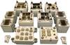

# Пирит
> 2019.05.12 [🚀](../index/index.md) [despace](index.md) → **[ТМС](tms.md)**

[TOC]

---

> <small>**«Пирит»** — русскоязычный термин, не имеющий аналога в английском языке. **Pirit** — дословный перевод с русского на английский.</small>

**Бортовая информационно‑вычислительная система «Пирит»** — [телеметрическая система](tms.md) (ТМС) — совокупность устройств, обеспечивающих сбор сигналов со средств первичного преобразования, формирование телеметрических сигналов, передачу их по каналу связи, регистрацию и отображение телеметрических сообщений на приёмной стороне.  
*Разработчик:* [НПО ИТ](zz_npoit.md). Разработано  …

| |
|:--|
||

<small>

|*Характеристика*|*Значение  (ПП)*|*Значение  (ЛК)*|
|:--|:--|:--|
|[TRL](trl.md)| | |
|Исполнение|Сборная структура из моноблоков:  программируемого модуля (ПП);  локального коммутатора (ЛК).|Сборная структура из моноблоков:  программируемого модуля (ПП);  локального коммутатора (ЛК).|
|Кол‑во разовых команд| | |
|Объём памяти, кбайт|86 016 (84 Мбайт)|86 016 (84 Мбайт)|
|Скорость|1 024 — записи;  1 024 — НП|1 024 — записи;  1 024 — НП|
|Кол‑во входов информации|—|—|
|<small>• аналоговых генераторных с напряжением положительной полярности</small>| | |
|<small>• аналоговых генераторных милливольтового диапазона (термопар) и параметрических (термометров сопротивления)</small>| | |
|<small>• аналоговых параметрических (потенциометров)</small>| |64|
|<small>• сигнальных</small>| |128|
|<small>• цифровых датчиков температуры</small>|16| |
|<small>• цифровых датчиков давления</small>| | |
|<small>• массивов цифровой информации</small>| | |
|**Etc:**|• • •|• • •|
|[ВБР](qa.md) за САС| | |
|Dimensions, L×W×H, mm| | |
|Интерфейсы|[МКО](mil_std_1553.md);  RS-232;  BS-4421|[МКО](mil_std_1553.md);  RS-232;  BS-4421|
|Mass, kg|от 1.5 до 1.7|от 0.8 до 0.9|
|[Voltage](voltage.md), V|27 (23 ‑ 34)|27 (23 ‑ 34)|
|Overload, g| | |
|[Rad.resist](ion_rad.md), Gy (rad)| | |
|Resource, h (y)|25 000 (2.8)|25 000 (2.8)|
|[Lifetime](lifetime.md), h (y)| | |
|[Temp. range](tcs.md), ℃|от –50 до +50 ℃|от –50 до +50 ℃|
|Consumption, W|от 2.7 до 6.8|от 1.2 до 3.3|

</small>

 

## Примечания
   1. …

## Применяемость
   1. …

 

## Docs & links (TRANSLATEME ALREADY)
|Navigation|
|:--|
|**[FAQ](faq.md)**, **[Cable](cable.md)**·БКС, **[Camera](cam.md)**·Камера, **[Comms](comms.md)**·Радио, **[CON](contact.md)·[Pers](person.md)**·Контакт, **[Control](control.md)**·Упр., **[Doc](doc.md)**·Док., **[Doppler](doppler.md)**·ИСР, **[DS](ds.md)**·ЗУ, **[EB](eb.md)**·ХИТ, **[ECO](ecology.md)**·Экол., **[EF](ef.md)**·ВВФ, **[ElC](elc.md)**·ЭКБ, **[EMC](emc.md)**·ЭМС, **[Error](error.md)**·Ошибки, **[Event](event.md)**·События, **[FS](fs.md)**·ТЭО, **[Fuel](fuel.md)**·Топливо, **[GNC](gnc.md)**·БКУ, **[GS](scs.md)**·НС, **[HF&E](hfe.md)**·Эрго., **[IU](iu.md)**·Гиро., **[KT](kt.md)**·КТЕХ, **[LAG](lag.md)**·ПУC, **[LES](les.md)**·САСП, **[LS](ls.md)**·СЖО, **[LV](lv.md)**·РН, **[MCC](mcc.md)**·ЦУП, **[Model](model.md)**·Модель, **[MSC](sc.md)**·ПКА, **[N&B](nnb.md)**·БНО, **[NR](nr.md)**·ЯР, **[OBC](obc.md)**·ЦВМ, **[OE](oe.md)**·БА, **[Pat.](патент.md)**·Патент, **[Proj.](project.md)**·Проект, **[PS](ps.md)**·ДУ, **[QA](qa.md)**·БКНР, **[R&D](rnd.md)**·НИОКР, **[Robot](robotics.md)**·Робот, **[Rover](rover.md)**·Ровер, **[RTG](rtg.md)**·РИТЭГ, **[SARC](sarc.md)**·ПСК, **[SE](se.md)**·СЭ, **[Sens.](sensor.md)**·Датч., **[SC](sc.md)**·КА, **[SCS](scs.md)**·КК, **[SGM](sgm.md)**·КММ, **[SI](si.md)**·СИ, **[Soft](soft.md)**·ПО, **[SP](sp.md)**·БС, **[Spaceport](spaceport.md)**·Космодр., **[SPS](sps.md)**·СЭС, **[SSS](sss.md)**·ГЗУ, **[TCS](tcs.md)**·СОТР, **[Test](test.md)**·ЭО, **[Timeline](timeline.md)**·ЦГМ, **[TMS](tms.md)**·ТМС, **[TOR](tor.md)**·ТЗ, **[TRL](trl.md)**·УГТ|
|*Sections & pages*|
|**`Телеметрическая система (ТМС):`**  …  • • •  **РФ:** [ТМС-Л](tms_l.md) (8.5)┊ [ТМС-УФ](tms_uf.md) (7.25)┊ [ТМС-РГ](tms_rg.md) (5)┊ [Пирит](pirit.md) (2.6)┊ [Оникс](onyx.md) (1.1)┊ [Астра](astra.md) ()|

   1. Docs: …
   1. Notable interwikies — …
   1. <http://www.npoit.ru/products/telemetricheskie-sistemy/malogabaritnaya-bortovaya-radiotelemetricheskaya-sistema-oniks> — [archive ❐](f/tms/p/pirit_npoit_ru.djvu.pdf) of 2018.03.27)

