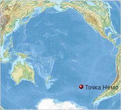
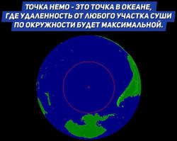

# Точка Немо
> 2019.05.12 ┊ **🚀 [despace](index.md)** → [Земля](earth.md), [Space](index.md)

[TOC]

---

> <small>*Термины:* **Точка Немо** — русскоязычный термин. **Point Nemo** — англоязычный эквивалент.</small>

**Точка Немо** — условная точка в Мировом океане, наиболее удалённая от какой‑либо суши на Земле. Расположена в южной части Тихого океана, координаты 48°52′ ю.ш. 123°23′ з.д. Три ближайшие точки суши находятся в 2 688 км.

| | |
|:--|:--|
|  |  |
| Точка Немо в Тихом океане | И [в большом разрешении ❐](f/aob/earth/point_nemo_01.jpg) |

## История
Точка Немо была вычислена методом компьютерного моделирования в 1992 году хорватским инженером‑исследователем Хрвойе Лукатела (Hrvoje Lukatela). Им же было предложено название этой условной точки, отсылающее к имени решившего отдалиться от человечества капитана Немо, героя романов Жюль Верна.

Ближайшими к Точке Немо точками суши являются необитаемые атолл Дюси, остров Моту‑Нуи и Maher Island — все они находятся на расстоянии 2 688 км от Точки Немо. Ближайшее населённое место — остров Пасхи, к северо‑востоку от Моту‑Нуи. Точка Немо входит в список земных полюсов недоступности как Океанский полюс недоступности.

Интересным фактом является то, что над Точкой Немо может проходить орбита Международной космической станции, поскольку её наклонение больше широты Точки Немо — так что время от времени ближайшее к точке населённое место оказывается примерно в 400 км, но в космосе.

## Значение
Многие космические агентства, как сообщает BBC, используют этот район в качестве «кладбища космических кораблей», так как здесь минимален риск ущерба людям и природе. В окрестностях Точки Немо на дне океана находится уже не менее сотни отслуживших своё космических аппаратов и их частей.

Начиная с 1971 года в районе «Точки Немо» было затоплено уже 263 космических аппарата. Когда срок службы МКС подойдет к концу, она будет тоже затоплена.

## В культуре
   - В опубликованном в 1928 году рассказе Говарда Лавкрафта «Зов Ктулху» впервые упоминается таинственный затонувший город Р'льех. Лавкрафт поместил его в точке 47° 9' южной широты и 126° 43' западной долготы. Поклонник и популяризатор творчества Лавкрафта Август Дерлет предложил слегка изменённые координаты: 49° 51' южной широты и 128° 34' западной долготы. Обе эти точки не совпадают с Точкой Немо, но весьма близки к ней.
   - К третьему студийному альбому виртуальной группы Gorillaz «Plastic Beach» («Берег Пластика») создатели приложили историю, по которой Мёрдок обнаружил в Точке Немо плавающий остров из бытовых отходов, на котором организовал новую студию.

 

## Docs & links (TRANSLATEME ALREADY)
|…°·•¹²³±×÷≤≥≈≠ ‑ −— ⎆✉ ❐“”’«»✔→✘☐☑├┕┆ 1 lb = 0.453592 kg; 1 g = 9.80665 m/s²|
|:--|
|<small>**[FAQ](faq.md)**, **[Cable](cable.md)**·БКС, **[Camera](camera.md)**·Камера, **[Comms](comms.md)**·Радиосв., **[Contact](contact.md)**·Контакт, **[Control](control.md)**·Управ., **[Doc](doc.md)**·Док., **[Doppler](doppler.md)**·ИСР, **[DS](ds.md)**·ЗУ, **[EB](eb.md)**·ХИТ, **[ECO](ecology.md)**·Экол., **[EF](ef.md)**·ВВФ, **[ElC](elc.md)**·ЭКБ, **[EMC](emc.md)**·ЭМС, **[Errors](error.md)**·Ошибки, **[Events](event.md)**·События, **[FS](fs.md)**·ТЭО, **[Fuel](fuel.md)**·Топливо, **[GNC](gnc.md)**·БКУ, **[GS](scs.md)**·НС, **[HF&E](hfe.md)**·Эргоном., **[IMU](imu.md)**·Гироскоп, **[Incubator](incubator.md)**·Инкуб., **[KT](kt.md)**·КТЕХ, **[LAG](lag.md)**·ПУC, **[LES](les.md)**·САСП, **[LS](ls.md)**·СЖО, **[LV](lv.md)**·РН, **[MAG](mag.md)**·Магнитом., **[MCC](mcc.md)**·ЦУП, **[Model](model.md)**·Модель, **[MSC](sc.md)**·ПКА, **[N&B](nnb.md)**·БНО, **[NR](nr.md)**·ЯР, **[OBC](obc.md)**·ЦВМ, **[OE](oe.md)**·БА, **[Patent](патент.md)**·Патент, **[Project](project.md)**·Проект, **[PS](ps.md)**·ДУ, **[QA](quality.md)**·QA, **[R&D](rnd.md)**·НИОКР, **[RAMS](rams.md)**·НиБ, **[Risk](risk.md)**·Риск, **[Robot](robotics.md)**·Робот, **[Rover](rover.md)**·Планетоход, **[RTG](rtg.md)**·РИТЭГ, **[RW](rw.md)**·ДМ, **[SARC](sarc.md)**·ПСК, **[Sensor](sensor.md)**·Датчик, **[SC](sc.md)**·КА, **[SCS](scs.md)**·КК, **[SGM](sgm.md)**·КММ, **[SI](si.md)**·СИ, **[Soft](soft.md)**·ПО, **[SP](sp.md)**·БС, **[Spaceport](spaceport.md)**·Космодром, **[SPS](sps.md)**·СЭС, **[SSS](sss.md)**·ГЗУ, **[TCS](tcs.md)**·СОТР, **[Test](test.md)**·ЭО, **[Timeline](timeline.md)**·Циклограмма, **[TMS](tms.md)**·ТМС, **[TOR](tor.md)**·ТЗ, **[TRL](trl.md)**·УГТ</small>|
|*Sections & pages*|
|**··• [Space](index.md) •··**  [Apparent magnitude](app_mag.md) ┊ [Blue Marble](blue_marble.md) ┊ [Cosmic rays](cr.md) ┊ [Ecliptic](ecliptic.md) ┊ [Escape velocity](esc_vel.md) ┊ [Health](health.md) ┊ [Hill sphere](hill_sphere.md) ┊ [Information](info.md) ┊ [Lagrangian points](l_points.md) ┊ [Near space](near_sys.md) ┊ [Pale Blue Dot](pale_blue_dot.md) ┊ [Parallax](parallax.md) ┊ [Point Nemo](point_nemo.md) ┊ [Silver Snoopy award](silver_snoopy_award.md) ┊ [Solar constant](solar_const.md) ┊ [Terminator](terminator.md) ┊ [Time](time.md) ┊ [Timezones](timezone.md) ┊ [Wormhole](wormhole.md)  ▮  **Solar system:** [Ariel](ariel.md) ┊ [Callisto](callisto.md) ┊ [Ceres](ceres.md) ┊ [Deimos](deimos.md) ┊ [Earth](earth.md) ┊ [Enceladus](enceladus.md) ┊ [Eris](eris.md) ┊ [Europa](europa.md) ┊ [Ganymede](ganymede.md) ┊ [Haumea](haumea.md) ┊ [Iapetus](iapetus.md) ┊ [Io](io.md) ┊ [Jupiter](jupiter.md) ┊ [Makemake](makemake.md) ┊ [Mars](mars.md) ┊ [Mercury](mercury.md) ┊ [Moon](moon.md) ┊ [Neptune](neptune.md) ┊ [Nereid](nereid.md) ┊ [Nibiru](nibiru.md) ┊ [Oberon](oberon.md) ┊ [Phobos](phobos.md) ┊ [Pluto](pluto.md) ┊ [Proteus](proteus.md) ┊ [Rhea](rhea.md) ┊ [Saturn](saturn.md) ┊ [Sedna](sedna.md) ┊ [Solar day](solar_day.md) ┊ [Sun](sun.md) ┊ [Titan](titan.md) ┊ [Titania](titania.md) ┊ [Triton](triton.md) ┊ [Umbriel](umbriel.md) ┊ [Uranus](uranus.md) ┊ [Venus](venus.md)|

**Docs:**

   1. …

**Links:**

   1. Notable interwikies — …
   1. <https://ru.wikipedia.org/wiki/Точка_Немо>
   1. <https://en.wikipedia.org/wiki/Pole_of_inaccessibility#Oceanic_pole_of_inaccessibility>

