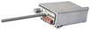

# ПРИЗЫВ-1
> 2019.05.12 [🚀](../index/index.md) [despace](index.md) → **[Радиосвязь](comms.md)**

[TOC]

---

> <small>**ПРИЗЫВ‑1** — русскоязычный термин, не имеющий аналога в английском языке. **PRIZYV‑1** — дословный перевод с русского на английский.</small>

**ПРИЗЫВ‑1** — приёмо‑передающая радиоаппаратура, радиомаяк коротковолнового диапазона. Предназначен для радиопеленгации подвижных и стационарных объектов. Приём сигнала, излучаемого радиомаяком, может вестись радиопоисковыми самолётными (вертолётными) системами АРК‑УД, ЮР‑46 и другими подобными системами.  
Разработчик [НПО ИТ](zz_npoit.md). Разработано  Покупное изделие (на 2018.03.19)

|*Characteristics*|*[Value](si.md)  <small>(ПРИЗЫВ-1)</small>*|
|:--|:--|
|Composition|Single unit|
|Consumption, W|0.765 для 9 В; 2.3 для 27 В|
|Dimensions, ㎜|70 × 34 × 24|
|[Interfaces](interface.md)| |
|[Lifetime](lifetime.md)/Resource, h(y)|… / 105 120 (12)|
|Mass, ㎏|0.075|
|[Overload](vibration.md), Grms| |
|[Rad.resist](ion_rad.md), ㏉ (㎭)| |
|[Reliability](qm.md) per [lifetime](lifetime.md)|0.99 за 2 000 часов|
|[Thermal range](tcs.md), ℃|–50 ‑ +65|
|[TRL](trl.md)|9|
|[Voltage](voltage.md), V|9 или 27|
|**【Specific】**|• • •|
|[Bitrate](bitrate.md), bit/s| |
|Continuous work, h|определяется ресурсом батареи питания|
|Distance, ㎞| |
|Frequency instability|± 50 × 10⁻⁶|
|[Frequency range](rf.md), ㎐|100 ‑ 250|
|Modulation type| |
|Out. power, W|0.3 (при [КСВ](swr.md) ≤ 2)|
|Signal structure|посылка непрерывной несущей в течение 0.5 ± 0.3 s и посылка АИМ сигнала с частотой следования импульсов 1 500 Гц в течение 0.8 ± 0.2 с|
| ||

**Notes:**

   1. …
   1. **Applicability:** …

 

## Docs & links (TRANSLATEME ALREADY)
|Navigation|
|:--|
|**[FAQ](faq.md)**【**[SCS](scs.md)**·КК, **[SC](sc.md)**·КА, **[OE](oe.md)**·БА, **[SGM](sgm.md)**·КММ】**[CON](contact.md)·[Pers](person.md)**·Контакт, **[Ctrl](control.md)**·Упр., **[Doc](doc.md)**·Док., **[EF](ef.md)**·ВВФ, **[Error](error.md)**·Ошибки, **[Event](event.md)**·События, **[FS](fs.md)**·ТЭО, **[HF&E](hfe.md)**·Эрго., **[KT](kt.md)**·КТ, **[Model](model.md)**·Модель, **[N&B](nnb.md)**·БНО, **[Patent](патент.md)**·Патент, **[Project](project.md)**·Проект, **[QM](qm.md)**·БКНР, **[R&D](rnd.md)**·НИОКР, **[SI](si.md)**·СИ, **[Test](test.md)**·ЭО, **[Timeline](timeline.md)**·ЦГМ, **[TRL](trl.md)**·УГТ|
|*Sections & pages*|
|**【[Communications](comms.md)】**  [CCSDS](ccsds.md)・ [Антенна](antenna.md)・ [АФУ](afdev.md)・ [Битрейт](bitrate.md)・ [ВОЛП](ofts.md)・ [ДНА](дна.md)・ [Диапазоны частот](rf.md)・ [Зрение](view.md)・ [Интерферометр](interferometer.md)・ [Информация](info.md)・ [КНД](directivity.md)・ [Код Рида‑Соломона](rsco.md)・ [КПДА](antenna_ap.md)・ [КСВ](swr.md)・ [КУ](ку.md)・ [ЛКС, АОЛС, FSO](fso.md)・ [Несущий сигнал](carrwave.md)・ [ПНА, ПОНА, ПСНА](devd.md)・ [Помехи](emi.md) (EMI, RFI)・ [Последняя миля](last_mile.md)・ [Регламент радиосвязи](rf.md)・ [СИТ](etedp.md)・ [Фидер](feeder.md)  • • •  **РФ:** [БА КИС](ба_кис.md) (21)・ [БРК](brk_lav.md) (12)・ [РУ ПНИ](ру_пни.md) ()・ [HSXBDT](hsxbdt.md) (1.8)・ [CSXBT](csxbt.md) (0.38)・ [ПРИЗЫВ-3](prizyv_3.md) (0.17) *([ПРИЗЫВ-1](prizyv_1.md) (0.075))*|

   1. Docs: …
   1. Notable interwikies — …
   1. <http://www.npoit.ru/products/telemetricheskie-sistemy/radiomayak-metrovogo-diapazona-prizyv-1>
