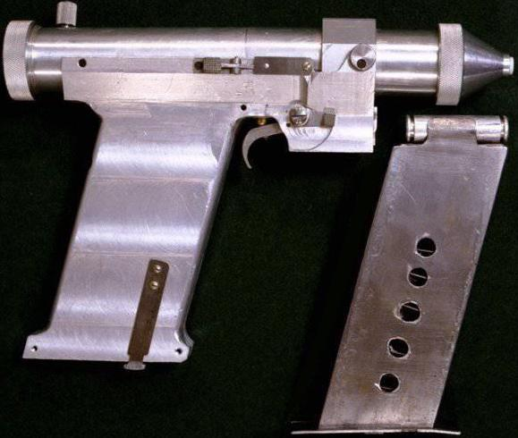

# Проекты
> 2019.03.20 ┊ **🚀 [despace](index.md)** → **[Project](project.md)**

[TOC]

---

> <small>*Термины:* **Проекты** — русскоязычный термин. **Projects** — англоязычный эквивалент.</small>

> <small>Здесь, тем не менее, мы оглядываемся назад, но не стоим на месте. Мы стремимся вперёд, открываем новые пути, берёмся за новые дела, потому что мы любопытны… и любопытство гонит нас по новым дорогам. **Только вперёд.**  «Around here, however, we don’t look backwards for very long. We keep moving forward, opening up new doors and doing new things, because we’re curious… and curiosity keeps leading us down new paths. Keep moving forward.»  *(Уолт Дисней)*</small>

Список стандартных формулировок описаний ОКР:  
Контактные исследования *«планеты»*; Дистанционные исследования *«планеты»*; Исследование космоса; Гидрометеорология, мониторинг климата Земли.

---

## В НПОЛ
**Актуальные**  
> <small>У настоящего художника должно быть горячее сердце, чистые руки и холодная голова.  *(почти Ф.Э. Дзержинский, 1926 г.)*</small>

|*Проект*|*План*|*Описание ([Номер полёта](spaceid.md), [Номер по СПК](spaceid.md))*|
|:--|:--|:--|
| [Аракс](araks.md)  |   | Земля  |
| [Арктика‑М](арктика_м.md) №1, 2  | 2019  | Земля  |
| [МКА-ФКИ](мка_фки.md) (АРКА)  | 2024  | Земля  |
| [Нивелир](nivelir.md)  |   | Земля  |
| [Резонанс](резонанс.md)  | 2021  | Земля  |
| [Электро‑Л](электро_л.md) №3  |   | Земля  |
| [Гамма‑400](гамма_400.md)  | 2023  | Космос  |
| [Интергелиозонд](интергелиозонд.md)  | 2024  | Космос  |
| [Спектр‑М](спектр_м.md)  | 2026  | Космос  |
| [Спектр‑РГ](спектр_рг.md)  | 2019  | Космос  |
| [Спектр‑УФ](спектр_уф.md)  | 2021  | Космос  |
| [Электро‑М](электро_м.md) №1-4  | 2018, 2020, 2021, 2022  | Космос  |
| [Венера‑Д](venera_d.md)  | 2026  | Планеты  |
| [Луна‑Глоб](луна_25.md)  | 2019  | Планеты  |
| [Луна‑Грунт](luna_28.md)  | 2024  | Планеты  |
| [Луна‑Ресурс‑1 (ОА)](луна_26.md)  | 2020  | Планеты  |
| [Луна‑Ресурс‑1 (ПА)](луна_27.md)  | 2021  | Планеты  |
| [Экспедиция‑М](экспедиция_м.md)  | 2024  | Планеты  |
| [ЭкзоМарс‑2020](экзомарс_2020.md)  | 2020  | Планеты  |
| [MetNet](metnet.md)  | 2019  | Планеты  |
|**`КА в стазисе`**|• • •|• • •|
| [Лаплас‑П](лаплас_п.md)  | 2026  | Земля  |
| [Эллипс‑ВКК](эллипс_вкк.md) №1, 2  | 2019  | Земля  |

**Прочая продукция НПОЛ:**  
[Двина‑ТМ](двина_тм.md) ┊ [Карат](карат.md) ┊ [Навигатор](навигатор.md) ┊ [Фрегат](фрегат.md)

**Гипотетические**  
> <small>Не забывайте мечтать!</small>

Ниже представлены проекты, разрабатываемые нами на инициативной основе.

   - **Наше всё:**
      1. [ВГВ](hptc_vgv.md). Возврат грунта Венеры. 2017 ‑ …
      1. [ДСВСД](hptc_dsvsd.md). Технологии длительного существования на Венере. 2017 ‑ …
      1. [НСДАЕМ](hptc_nsdaem.md). Новая схема деления на американо‑европейский манер. 2017 ‑ …
      1. [MEAEM](hptc_meaem.md). Аналог Moon Express MX‑1. Малый лунный перелётно‑посадочный КА. 2018 ‑ …
      1. [ОЧБПЛИЕГ](hptc_ochbplieg.md). Лунная обитаемая база. 2018 ‑ …
   - **Неактуальное наше всё:**
      1. [Лунагрузик](hptc_lunagruzik.md). КА для автоматической доставки грузов на/с Луну. 2017 ‑ 2018.

---

## В мире
**Глобальные программы:**

   - *Освоение планет:*
      - **[Venus](venus.md)**
      - **[Луна](moon.md)**
      - **[Марс](mars.md)**
      - **[Меркурий](mercury.md)**
      - **[Сатурн](saturn.md)**
      - **[Юпитер](jupiter.md)**
   - *Платформы:*
      - **РФ:** [Двина‑ТМ](двина_тм.md) ┊ [Карат](карат.md) ┊ [Навигатор](навигатор.md)
      - **США:** [MCSB](mcsb.md)
   - [Deep space gateway](deep_space_gateway.md)
   - [Deep space network](deep_space_network.md)
   - [Dragon](dragon.md)
   - [Future Launchers Preparatory Programme](flpp.md)
   - [Lunar Precursor Robotic Program](lprp.md)
   - [Mars global surveyor](mars_global_surveyor.md)
   - [Mars climate orbiter](mars_climate_orbiter.md)
   - [NASA Innovative Advanced Concepts (NIAC)](niac_program.md)
   - [Planetary Science Decadal Survey](us_psds.md)
   - [Безракетный космический запуск](nrs.md)

**Мировой приоритет исследования глубокого космоса:** (по убыванию)

   1. Луна
   1. Общий обзор вселенной
   1. Марс
   1. Венера
   1. Солнце
   1. Разработка астероидов
   1. Прочие объекты

**Общие задачи КА и наземного сегмента**

|*EVN‑XXX*|*T*|*RU*|*EN*|
|:--|:--|:--|:--|
||| **`Не проводилось`** | **`Never occured`** |
| [EVN‑](project.md) ||  |  <mark>TBD</mark> |
|• • •|•|• • •|• • •|
||| **`Завершено частично`** | **`Was tried`** |
| [ECT‑001](project.md) |T| Увеличение эффективности систем с тепловыми трубами. | Getting heat-pipe systems more effective. |
| [ECT‑002](project.md) || Распределение пыли в Солнечной Системе. | Dust distribution in Solar system. |
|• • •|•|• • •|• • •|
||| **`В целом завершено`** | **`Mostly done`** |
| [ECT‑](project.md) ||  |  <mark>TBD</mark> |

**Таблица.** Аппараты прошлого НПОЛ.

|*Страна*|*Проект*|*Дата*|*Описание ([Номер полёта](spaceid.md), [Номер по СПК](spaceid.md))*|
|:--|:--|:--|:--|
| Европа, РФ  | [ЭкзоМарс‑2016](экзомарс_2016.md)  | 2016.03.14  | Планеты  |
| РФ | [Электро‑Л](электро_л.md) №2  | 2015.12.11  |Гидрометеорология, мониторинг климата Земли.  |
| РФ | [МКА-ФКИ](мка‑фки.md) ПН2  | 2014.06.08  |Гидрометеорология, мониторинг климата Земли.  |
| РФ | [МКА-ФКИ](мка‑фки.md) ПН1  | 2012.06.22  |Гидрометеорология, мониторинг климата Земли.  |
| РФ  | [Чибис‑М](чибис_м.md)  | 2012.01.25  | Земля  |
| РФ  | [Фобос‑Грунт](фобос_грунт.md)  | 2011.11.08  | Планеты  |
| РФ  | [Спектр‑Р](спектр_р.md)  | 2011.07.18  | Земля  |
| Россия | [Электро‑Л](электро_л.md) №1  | 2011.01.20  |Гидрометеорология, мониторинг климата Земли.  |
| США  | [Voyager](voyager.md)  | 1977.09.05  1977.08.20   | Планеты  |

## Астроинженерные сооружения
> <small>*Термины:* **Космическое поселение** — русскоязычный термин. **Space habitat** — англоязычный эквивалент.</small>
> <small>**Астроинженерные сооружения** — русскоязычный термин. **Space megastructure** — англоязычный эквивалент.</small>

**Астроинжене́рные сооруже́ния** — гипотетические инженерные сооружения астрономических масштабов. Как правило, в такую категорию включают искусственные объекты размерами в десятки тысяч километров и более. Астроинженерные сооружения представляют интерес как проекты освоения космоса, как примеры масштабных инженерных задач, как объекты поиска следов деятельности внеземных цивилизаций.

**Безракетный космический запуск:**

   - [Космический лифт](space_elev.md)

**Космическое поселение** — космическая станция, предназначенная для постоянного проживания, а не в качестве простого полуста́нка или другого подобного объекта. Ни одного космического поселения до сих пор не построено, однако существует большое количество проектов разной степени реалистичности. Естественно, что они должны выполнять различные функции и, соответственно, иметь разные виды и размеры.

   - [Nautilus-X](nautilus_x.md)
   - [Космические города‑бублики](rwss.md)
   - [Стэнфордский тор](stanford_torus.md)
   - [Сфера Бернала](bernal_sphere.md)
   - [Сфера Дайсона](dyson_sphere.md)
   - [Цилиндр О’Нилла](oneill_cyl.md)

**Проблемы**  
Космическому поселению необходимо решить ряд проблем для поддержания нормальной жизни людей:

   - начальные капитальные затраты;
   - внутренние системы жизнеобеспечения;
   - создание искусственной силы тяжести;
   - защиту от враждебных внешних условий:
       - от радиации;
       - обеспечение тепла;
       - от инородных объектов;
   - транспорт и маневрирование;
       - орбитальная поддержка станции;
   - мобильность самой станции.

## Исследования
> <small>*Термины:* **Исследования** — русскоязычный термин. **Research** — англоязычный эквивалент.</small>

**Иссле́дование** («следование изнутри»):

   - в широком смысле — поиск новых знаний или систематическое расследование с целью установления фактов;
   - в узком смысле — научный метод (процесс) изучения чего‑либо;
   - результат исследования — научный труд, документ с описанием изученного предмета.

Разновидности научных исследований:

   - [Рамановская спектроскопия](raman_spsc.md)
   - [Рентгенофлуоресцентный анализ](xrf.md) (РФА, X-ray fluorescence, XRF)

Основные архивы информации:

   - [NASA open](nasa_open.md)
   - [NASA STI program](nasa_sti.md)
   - [Скунсовые фабрики](skunk_works.md)

 

### По годам, первые и знаковые

|*Дата*|*Событие*|
|:--|:--|
|**2020.05.30**| Crew Drafon 2 — 1st US manned SC (since Shuttle) launched to ISS |
|**2020.02.25**| 1st service satellite docks to another satellite |
|**2018.02.06**| испытательный пуск СТРН Falcon Heavy (США) |
|**2011.03.17**| первый искусственный спутник [Меркурия](mercury.md) (MESSENGER, США) |
|**2010.06.03**| КА с солнечным парусом (IKAROS, Япония) |
|**2006.01.15**| доставка на Землю образцов кометы (Вильда 2, Stardust, США) |
|**2004.06.30**| первый искусственный спутник [Сатурна](saturn.md) (Cassini, Европа‑США) |
|**2001.03.23**| затопление станции «Мир» (Россия) |
|**2000.06.24**| первый искусственый спутник астероида (433 Эрос, NEAR Shoemaker, США) |
|**1998.11.20**| запуск первого блока МКС (Заря, Россия) |
|**1995.12.07**| первый искусственный спутник [Юпитера](jupiter.md) (Galileo, США) |
|**1993.02.24**| солнечный парус раскрыт в космосе (Знамя‑2, Россия) |
|**1988.11.15**| единственный полёт [МТКК](sc.md) «Буран» в автоматическом режиме (СССР) |
|**1986.02.20**| вывод на орбиту базового модуля АКА «Мир» (СССР) |
|**1981.04.12**| полёт ПКА Space Shuttle (Columbia, США) |
|**1975.10**| фото поверхности Венеры, мягкая посадка АКА ([Венера‑9](venera_9_10.md) и [Венера‑10](venera_9_10.md), СССР) |
|**1975.10.20**| первый ИСВ ([Венера‑9](venera_9_10.md), СССР) |
|**1972.03.03**| КА, покинувший в итоге Солнечную систему (Пионер‑10, США) |
|**1971.04.19**| орбитальная станция (Салют‑1, СССР) |
|**1970.12.15**| мягкая посадка на Венеру ([Венера‑7](venera_7.md), СССР) |
|**1971.12.02**| мягкая посадка АКА на Марс (Марс‑3, СССР) |
|**1971.11.27**| посадка АКА на Марс (Марс‑2, СССР) |
|**1970.11.17**| посадка и работа управляемого с Земли [планетохода](rover.md) (Луноход‑1, СССР) |
|**1971.11.13**| первый [ИСМ](mars.md) (Маринер‑9, СССР) |
|**1970.09.24**| забор и доставка на Землю породы с космического тела (Луна‑16, СССР) |
|**1969.07.21**| высадка человека на Луну; пробы грунта (Н. Армстронг, Аполлон‑11, США) |
|**1969.01.16**| стыковка двух ПКА (Союз‑4 и Союз‑5, СССР) |
|**1968**| работоспособный [ЯРД](ярд.md) (NERVA, США) |
|**1968.09.15**| возвращение АКА на Землю после облёта Луны (Зонд‑5, СССР) |
|**1967.11.09**| пуск СТРН Saturn V (США) |
|**1967.10.30**| стыковка двух АКА (Космос‑186 и Космос‑188, СССР) |
|**1966.10.01**| КА с [ЭРД](epsp.md) (Янтарь‑1, СССР) |
|**1966.04.03**| первый ИСЛ (Луна‑10, СССР) |
|**1966.03.01**| посадка АКА на [Венеру](venus.md); полёт КА на планету ([Венера‑3](venera_2_3.md), СССР) |
|**1966.02.03**| мягкая посадка на Луну; панорамные фото Луны (Луна‑9, СССР) |
|**1965.03.18**| выход человека в открытый космос (А. Леонов, Восход‑2, СССР) |
|**1964.10.12**| полёт многоместного [ПКА](sc.md) (Восход‑1, СССР) |
|**1963.06.16**| полёт в космос женщины‑космонавта (В. Терешкова, Восток‑6, СССР) |
|**1962.08.12**| групповой полёт на ПКА (Восток‑3 и Восток‑4, СССР).
|**1961.04.12**| полёт человека в космос (Ю. Гагарин, Восток‑1, СССР) |
|**1959.10.04**| фото обратной стороны Луны; осуществлён [гравманёвр](gravass.md) (Луна‑3, СССР) |
|**1959.09.14**| посадка [АКА](sc.md) на Луну (Луна‑2, СССР) |
|**1959.01.04**| полёт над Луной; первый искусственный спутник [Солнца](sun.md) (Луна‑1, СССР) |
|**1958**| начало разработки [ТЯРД](тярд.md) |
|**1957.10.04**| первый [ИСЗ](earth.md) (Спутник‑1, СССР) |
|**1947.02.20**| отправлена жизнь в космос (плодовые мушки, V‑2, США) |
|**1934.05.23**| ракета с [ГБРД](гбрд.md) (СССР) |
|**1903 — 1930‑е**| ракеты с ЖРД, иссл. жидкого [топлива](fuel.md); Фау‑2 — первая управляемая ракета |
|**Конец XIX — начало XX вв**| пионеры космонавтики: Циолковский, Цандер, Оберт, Годдард и пр. Обосновано использование [ракет](lv.md) и [ЖРД](ps.md) для космоса, многоступенчатые ракеты. Изучение жизнеобеспечения в космосе, влияния перегрузок и невесомости |
|**1881.03.23**| Н. Кибальчич выдвинул идею (опубл. в 1918) ракетного космического летательного аппарата с качающейся камерой сгорания |
|**1865 — 1869**| романы Жюля Верна «С Земли на Луну» и «Вокруг Луны» верно описывают полёт Земля‑Луна с точки зрения небесной механики, но техническая сторона хромает |
|**1687**| основы космонавтики описаны в Ньютоновых «Математических началах натуральной философии». Вклад в расчёты движения тел в космосе внесли также Эйлер и Лагранж |
|**1609**| первое печатное описание жизни человека на [Луне](moon.md) — повесть Кеплера «Somnium» (опубл. 1634). Путешествия в космос описывали Фрэнсис Годвин, Сирано де Бержерак и др. |

 

### Это уже было в Симпсонах

Для общих вопросов: [Проекты](project.md) (ECT).  
Для конкретных небесных тел:

   - [Venus](venus.md) (EVN)
   - [Деймос](deimos.md) (EMD)
   - [Луна](moon.md) (EMN)
   - [Марс](mars.md) (EMA)
   - [Фобос](phobos.md) (EMP)

<mark>TBD</mark>

|**Солнечная система**  | [Солнце](sun.md), [Макемаке](makemake.md) ┊ [Нибиру](nibiru.md) ┊ [Плутон](pluto.md) ┊ [Седна](sedna.md) ┊ [Хаумеа](haumea.md) ┊ [Церера](ceres.md) ┊ [Эрида](eris.md)  |
|| [Меркурий](mercury.md)  |
|| [Venus](venus.md)  |
|| [Земля](earth.md), спутник:  |
|| [Юпитер](jupiter.md), спутники: [Ганимед](ganymede.md), [Европа](europa.md), [Ио](io.md), [Каллисто](callisto.md) и ещё 63 поменьше.  |
|| [Сатурн](saturn.md), спутники: [Рея](rhea.md), [Титан](titan.md), [Япет](iapetus.md), [Энцелад](enceladus.md) и ещё 59 поменьше.  |
|| [Уран](uranus.md), спутники: [Ариэль](ariel.md), [Оберон](oberon.md), [Титания](titania.md), [Умбриэль](umbriel.md) и ещё 23 поменьше.  |
|| [Нептун](neptune.md), спутники: [Нереида](nereid.md), [Протей](proteus.md), [Тритон](triton.md) и ещё 11 поменьше.  |

 

## Ключевые вопросы

### 1. Бесконтактная электропередача между КА на Венере
<mark>TBD</mark>

Для: [Venus](venus.md)

**Итоги и выводы**

**ИСТОРИЯ**

**2019.04.13:** [NASA финансирует ⎆](https://www.forbes.com/sites/brucedorminey/2019/04/13/nasa-looks-into-rechargeable-venus-lander-powered-by-microwave-beaming-atmospheric-balloon/) НИР по бесконтактной передаче электричества с борта плавающего в атмосфере баллона с солнечными батареями на борт находящегося на поверхности Венеры КА ([изображение ❐](f/exp/001/20190416_1.jpg)) в микроволновом или радиодиапазоне. <small>— [archive ❐](f/exp/001/20190413_1.pdf) of 2019.04.16)*</small>  
Финансируется в рамках программы NASA’s Innovative Advanced Concepts (NIAC). Руководитель — Erik Brandon, a NASA Jet Propulsion Laboratory (JPL) power technologist. Солнечная радиация оценена в 2 636 Вт/m², солнечная постоянная — 1 367 Вт/m². Принимаемое посадочным КА электричество будет напрямую сконвертировано специальной антенной. Будут использованы высокотемпературные материалы, в т.ч. диоды из карбида кремния. Орбитальный баллон будет плавать в атмосфере, поднимаясь для зарядки себя и опускаясь для зарядки посадочного.

 

### 2. Оружие в космосе
<mark>TBD</mark>

**Итоги и выводы**

**ИСТОРИЯ**

**Пистолет от РВСН (1984).** <https://habr.com/ru/company/mailru/blog/448210/>

В 1984 году в академии РВСН разработали лазерный пистолет — компактное оружие для защиты орбитальных станций и отключения наблюдательных оптических систем вероятного противника.  
Разработчики установили, что для расчетных целей достаточно довольно небольшой мощности излучения. Поэтому в качестве источника энергии использовали пиротехнические заряды, вмонтированные в патрон калибра 10 мм. В результате воспламенения возникала вспышка с температурой несколько тысяч градусов по Цельсию. Расстояние эффективного выстрела — порядка 20 метров. В магазине было 8 патронов. Бластер не мог поразить «живую силу и технику», но мог легко вывести из строя оптические элементы космических кораблей и ослепить вражеского астронавта. Разработку прекратили в связи с конверсией вооружений, а опытный образец выставлен в музее академии РВСН.

 

### 3. Лунная база
<mark>TBD</mark>

<https://ru.wikipedia.org/wiki/Звезда_(лунная_база)>

**Итоги и выводы**

Во все времена было проведено несколько проектов лунных баз:

   - Вулкан (1960‑е, СССР)
   - Звезда (1964 ‑ 1974, СССР)

**ИСТОРИЯ**

**Звезда (1964‑1974, СССР)**  
**Звезда** — проект советской лунной базы (1964 ‑ 1974 год), первый в мире детально проработанный подобный проект. Программа предусматривала запуск на Луну в беспилотном режиме основного модуля лунной базы. После этого запускалось бы несколько автоматических аппаратов, один из которых доставил бы на Землю образцы лунного грунта в месте посадки основного базового обитаемого модуля, а второй представлял собой подвижный луноход, который обследовал бы внешнюю поверхность первого модуля базы. В перспективе обитаемые модули лунной базы могли устанавливаться на колёсные шасси, сцепляться друг с другом и образовывать целый подвижный поезд, работающий на электроэнергии, производимой ядерным реактором.

В 1962 году [Сергей Павлович Королёв](02_korolev1.md) поручил ГСКБ «Спецмаш», которым руководил [Владимир Бармин](02_barmin1.md), разработать проект лунной базы. Проектировщики Бармина приступили к работе. Она заняла более десяти лет. В документах ГСКБ «Спецмаш» проект проходил под обозначением «ДЛБ» (Долговременная лунная база), в ОКБ‑1 его знали под названием «Звезда». Неофициально проект также именовался «Барминград».

В конструкторском бюро «Спецмаша» изучался самый широкий круг вопросов:

   - цели базы;
   - принципы строительства;
   - стадии развертывания;
   - состав научного и строительного оборудования;
   - возможные военные перспективы.

[Материалы из Википедии ❐](f/exp/003/zvezda_wikipedia_1.pdf)

 

### 4. Материалы для Венеры
<mark>TBD</mark>

Для: [Venus](venus.md)

Кремниевая электроника

Углерод‑углеродная ткань для надувных конструкций

 

### 5. Обитание в космосе в замкнутых пространствах
<mark>TBD</mark>

 

### 6. Межзвёздные корабли
<mark>TBD</mark>

 

### 7. Строительство в космосе
<mark>TBD</mark>

 

### 8. Утилизация КА и СЧ
<mark>TBD</mark>

 

### 9. Шутливые расчёты
<mark>TBD</mark>

**1) Байты в A4**

**Задача:** оценить количество форматок A4, если необходимо распечатать бинарным кодом файл.

**Оценка.**

В стандартной коробке 2 500 ф.A4.  
Одна коробка весит 13 кг.

Пример: для записи 100 Мбайт потребуется:

   - Вариант 1: Times New Roman, 14, полуторный интервал, односторонняя печать; на ф.A4 умещается 2 310 бит (35 строк по 66 символов). Требуется 363 144 ф.A4, или 146 коробок общим весом 1 890 кг.
   - Вариант 2: Times New Roman, 12, одинарный интервал, односторонняя печать; на ф.A4 умещается 4 004 бита (52 строки по 77 символов). Требуется 209 506 ф.A4, или 84 коробки общим весом 1 090 кг.
   - Вариант 3: Times New Roman, 12, одинарный интервал, двухсторонняя печать; на ф.A4 умещается 8 008 бит (52 строки по 77 символов). Требуется 104 753 ф.A4, или 42 коробки общим весом 545 кг.

 

### 10. Добыча ископаемых на небесных телах
<mark>TBD</mark>

 

### 11. Перезаправка в космосе (топливо, вода и пр.)
<mark>TBD</mark>

<https://techcrunch.com/2019/10/03/orbit-fab-gas-stations-in-space-seed-funding/>

 

### 12. Человек на Венере
<mark>TBD</mark>

Для: [Venus](venus.md)

   - [Пилотируемые исследования Венеры водородными аэростатами. Н.Н. Жолонко](book_jolonko_pivva.md) (2013, Москва)

 

## Docs & links (TRANSLATEME ALREADY)
|…°·•¹²³±×÷≤≥≈≠ ‑ −— ⎆✉ ❐“”’«»✔→✘☐☑├┕┆ 1 lb = 0.453592 kg; 1 g = 9.80665 m/s²|
|:--|
|<small>**[FAQ](faq.md)**, **[Cable](cable.md)**·БКС, **[Camera](camera.md)**·Камера, **[Comms](comms.md)**·Радиосв., **[Contact](contact.md)**·Контакт, **[Control](control.md)**·Управ., **[Doc](doc.md)**·Док., **[Doppler](doppler.md)**·ИСР, **[DS](ds.md)**·ЗУ, **[EB](eb.md)**·ХИТ, **[ECO](ecology.md)**·Экол., **[EF](ef.md)**·ВВФ, **[ElC](elc.md)**·ЭКБ, **[EMC](emc.md)**·ЭМС, **[Errors](error.md)**·Ошибки, **[Events](event.md)**·События, **[FS](fs.md)**·ТЭО, **[Fuel](fuel.md)**·Топливо, **[GNC](gnc.md)**·БКУ, **[GS](scs.md)**·НС, **[HF&E](hfe.md)**·Эргоном., **[IMU](imu.md)**·Гироскоп, **[Incubator](incubator.md)**·Инкуб., **[KT](kt.md)**·КТЕХ, **[LAG](lag.md)**·ПУC, **[LES](les.md)**·САСП, **[LS](ls.md)**·СЖО, **[LV](lv.md)**·РН, **[MAG](mag.md)**·Магнитом., **[MCC](mcc.md)**·ЦУП, **[Model](model.md)**·Модель, **[MSC](sc.md)**·ПКА, **[N&B](nnb.md)**·БНО, **[NR](nr.md)**·ЯР, **[OBC](obc.md)**·ЦВМ, **[OE](oe.md)**·БА, **[Patent](патент.md)**·Патент, **[Project](project.md)**·Проект, **[PS](ps.md)**·ДУ, **[QA](quality.md)**·QA, **[R&D](rnd.md)**·НИОКР, **[RAMS](rams.md)**·НиБ, **[Risk](risk.md)**·Риск, **[Robot](robotics.md)**·Робот, **[Rover](rover.md)**·Планетоход, **[RTG](rtg.md)**·РИТЭГ, **[RW](rw.md)**·ДМ, **[SARC](sarc.md)**·ПСК, **[Sensor](sensor.md)**·Датчик, **[SC](sc.md)**·КА, **[SCS](scs.md)**·КК, **[SGM](sgm.md)**·КММ, **[SI](si.md)**·СИ, **[Soft](soft.md)**·ПО, **[SP](sp.md)**·БС, **[Spaceport](spaceport.md)**·Космодром, **[SPS](sps.md)**·СЭС, **[SSS](sss.md)**·ГЗУ, **[TCS](tcs.md)**·СОТР, **[Test](test.md)**·ЭО, **[Timeline](timeline.md)**·Циклограмма, **[TMS](tms.md)**·ТМС, **[TOR](tor.md)**·ТЗ, **[TRL](trl.md)**·УГТ</small>|
|*Sections & pages*|
|**··• [Project](project.md) •··**  [Interferometer](interferometer.md) ┊ [NASA open](nasa_open.md) ┊ [NASA STI](nasa_sti.md) ┊ [NIH](nih.md) ┊ [Past, future and everything](pfaeverything.md) ┊ [PSDS](us_psds.md) [MGSC](mgsc.md) ┊ [Raman spectroscopy](raman_spsc.md) ┊ [SC price](sc_price.md) ┊ [SC typical forms](sc_ts.md) ┊ [Tech derivative laws](td_laws.md) ┊ [View](view.md) ┊ [XRF](xrf.md)|

**Docs:**

   1. [Проект, шаблон](template_project.md)

**Links:**

   1. Notable interwikies — …
   1. <http://realcoffeemaker.com/index.php/china-in-space/pronun>
   1. <https://en.wikipedia.org/wiki/Megastructure>
   1. <https://en.wikipedia.org/wiki/Space_habitat>
   1. <https://ru.wikipedia.org/wiki/Космическое_поселение>
   1. <https://ru.wikipedia.org/wiki/Астроинженерные_сооружения>
   1. <https://apolloinrealtime.org/>
   1. <https://en.wikipedia.org/wiki/Research>
   1. <https://ru.wikipedia.org/wiki/Исследование>
   1. <https://ru.wikipedia.org/wiki/Космонавтика>
   1. <https://ru.wikipedia.org/wiki/Освоение_космоса>
