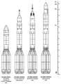
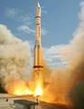
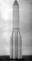
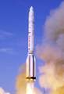

# Протон
> 2019.07.01 ┊ **🚀 [despace](index.md)** → **[LV](lv.md)**

[TOC]

---

> <small>*Термины:* **Протон** — англоязычный термин, не имеющий аналога в русском языке. **Proton** — дословный перевод с английского на русский.</small>

**Прото́н** **Универсальная ракета (УР)‑500** — Универсальная ракета, «Протон‑К», «Протон‑М», также **8К82, 8К82К, 8К82КМ** — семейство советско‑российских одноразовых жидкостных ракет‑носителей тяжёлого класса. Разработано в 1961‑1967 годах в подразделении ОКБ‑23 (ныне [ГКНПЦ Хруничева](03_khrunichev.md)), являвшемся частью ОКБ‑52 В.Н. Челомея.

|*Version*|*Description*|*Activity*|
|:--|:--|:--|
|Протон  (УР‑500, 8К82)  |Базовый вариант. | Экспл. завершена (1965 ‑ 1966)  |
|├ Протон‑К  (УР‑500К, 8К82К)  |Модификация Протон. | Экспл. завершена (1967 ‑ 2012)  |
|┕ Протон‑М  (8К82КМ)  |Модификация Протон‑К. |**Активен** (2001 ‑ …)  |

В июне 2018 года генеральный директор «Роскосмоса» Дмитрий Рогозин поставил задачу прекратить производство РН «Протон» после выполнения контрактов, далее летать исключительно на «Ангаре». До 2025 года планируется отказ от использования «Протона» по причинам:
   1. пуски возможны только с космодрома «Байконур», который находится за пределами РФ; РН «[Ангара](angara.md)» может стартовать также с Плесецка и Восточного;
   1. изготовление некоторых СЧ «Протона» производится за рубежом, что неприемлемо для основного заказчика РН — МинОбороны РФ; РН «Ангара» полностью изготовляется российскими предприятиями;
   1. «Протон» использует высокотоксичное топливо ([АТ + НДМГ](at_plus.md)); поля падения находятся в Казахстане, и после каждого аварийного пуска приходится проводить дорогостоящие очистки территории. В «Ангаре» используется менее опасное топливо [Кислород + Керосин](o_plus.md);
   1. «Ангара‑5» — должна быть проще и дешевле «Протон‑М» (в основном из‑за меньшего количества двигателей, самой дорогой СЧ РН).

---

 

## Протон‑М
**Прото́н‑М**, также **8К82КМ** — советско‑российская одноразовая жидкостная ракета‑носитель тяжёлого класса. Отличается от предшественника (Протон‑К) повышенной экологичностью, цифровой системой управления и новым РБ 14С43 [Бриз‑М](бриз.md), увеличением тяги двигателей, снижением массы конструкции РН, а также возможностью установки обтекателей бо́льших размеров, что позволило заметно увеличить ПН на ГПО и ГСО.

   1. Устанавливаемый в РН КА не должен создавать изгибающий момент более 18 т×м.

|*Characteristic*|*[Value](si.md)*|
|:--|:--|
|Активность  |**Активен** (2001.04.07 ‑ …)  |
|[Аналоги](analogue.md)  | [Ariane 5](arian.md) (Европа) ┊ [Atlas 5](atlas.md) (США) ┊ [Delta‑4 Heavy](delta.md) (США) ┊ [Falcon 9](falcon.md) (США) ┊ [GSLV Mk.III](gslv.md) (Индия) ┊ [H‑IIB](h2.md) (Япония) ┊ [Long March 3B](long_march.md) (Китай) ┊ [Long March 5](long_march.md) (Китай) ┊ [Ангара‑А5](angara.md) (РФ) ┊ [Зенит‑3SL](zenit.md) (РФ)  |
|Длина/диаметр  | 58.2 м / 4.1 ‑ 7.4 м  |
|[Космодромы](spaceport.md)  | [Байконур](baikonur.md) ┊ [Восточный](vostochny.md)  |
|Масса старт./сух.  | 705 000 кг / 30 600 кг  |
|Разраб./изготов.  | [ГКНПЦ Хруничева](03_khrunichev.md) (КБ «Салют», Россия) / [ГКНПЦ Хруничева](03_khrunichev.md) (КБ «Салют», Россия)  |
|Ступени  | 3‑4 (РБ: [Блок ДМ](блок_д.md), [Бриз‑М](бриз.md))  |
|[Топливо](fuel.md)  | [АТ + НДМГ](at_plus.md)  |
||   |

**Выводимые массы.**

|*Космодром*|*РН*|<small>*Масса,  [НОО](nnb.md), т*</small>|<small>*Масса,  [ГСО](nnb.md), т*</small>|<small>*Масса к  [Луне](moon.md), т*</small>|<small>*Масса к  [Венере](venus.md), т*</small>|<small>*Масса к  [Марсу](mars.md), т*</small>|*Примечания*|
|:--|:--|:--|:--|:--|:--|:--|:--|
| [Байконур](baikonur.md)  | Протон‑М  + [Бриз‑М](бриз.md)  | 23 | 3.7 | 5.5 ‑ 5.7 | 5.05 ‑ 5.6 | 5.05 ‑ 5.6 | Пуск — $ 65 млн (2017 г);  ПН 3.26 % от ст.массы  |
| [Байконур](baikonur.md)  | Протон‑М  + [ДМ-03](блок‑д.md)  | 21.38  |  3.44  |  5.7 ‑ 5.9  |  5.12 ‑ 5.75  |  5.12 ‑ 5.75 | Пуск — $ 65 млн (2017 г);  ПН 3.03 % от ст.массы  |
| [Восточный](vostochny.md)  | Протон‑М  + [Бриз‑М](бриз.md)  | 23  |  3.7  |  5.5 ‑ 5.7  |  5.05 ‑ 5.6  |  5.05 ‑ 5.6 | Пуск — $ 65 млн (2017 г);  ПН 3.26 % от ст.массы  |
| [Восточный](vostochny.md)  | Протон‑М  + [ДМ-03](блок‑д.md)  | 21.38  |  3.44  |  5.7 ‑ 5.9  |  5.12 ‑ 5.75  |  5.12 ‑ 5.75 | Пуск — $ 65 млн (2017 г);  ПН 3.03 % от ст.массы  |

<small>Примечания:  **1)** Указана масса для наихудших условий старта.  **2)** В скобках указана масса для наилучших условий старта.</small>

 

## Архивные

### Протон

**Прото́н** **Универсальная ракета (УР)‑500** — Универсальная ракета, также **8К82** — советская одноразовая жидкостная ракета‑носитель тяжёлого класса.

|*Characteristic*|*[Value](si.md)*|
|:--|:--|
|Активность  | Экспл. завершена (1965.07.16 ‑ 1966.07.06)  |
|[Аналоги](analogue.md)  | в годы активности отсутствуют  |
|Длина/диаметр  | 58.2 м / 4.1 ‑ 7.4 м  |
|[Космодромы](spaceport.md)  | [Байконур](baikonur.md)  |
|Масса старт./сух.  | 656 000 кг / 42 500 кг  |
|Разраб./изготов.  | [ОКБ‑23](03_khrunichev.md) (СССР) / [ОКБ‑23](03_khrunichev.md) (СССР)  |
|Ступени  | 2  |
|[Топливо](fuel.md)  | [АТ + НДМГ](at_plus.md)  |
||   |

 

### Протон‑К
**Прото́н‑К**, также **8К82К** — советско‑российская одноразовая жидкостная ракета‑носитель тяжёлого класса. Разработана на базе УР‑500 с изменениями на 1‑й и 2‑й ступеней и с добавлением 3‑й и 4‑й ступеней. Это позволило увеличить массу ПН на НОО и выводить КА на более высокие орбиты. «Протон‑К» унаследовала первую ступень УР‑500; позже тяга двигателей первой ступени РД-253 была увеличена на 7.7 %. 2‑я ступень «Протон‑К» была разработана на базе 2‑й ступени УР‑500; для увеличения массы ПН были увеличены топливные баки и изменена конструкция переходного отсека, соединяющего её с 1‑й ступенью.

|*Characteristic*|*[Value](si.md)*|
|:--|:--|
|Активность  | Экспл. завершена (1967.03.10 ‑ 2012.03.30)  |
|[Аналоги](analogue.md)  | [Ariane 5](arian.md) (Европа) ┊ [Atlas 5](atlas.md) (США) ┊ [Delta‑4 Heavy](delta.md) (США) ┊ [H‑IIB](h2.md) (Япония) ┊ [Long March 3B](long_march.md) (Китай) ┊ [Зенит‑3SL](zenit.md) (РФ)  |
|Длина/диаметр  | 58.2 м / 4.1 ‑ 7.4 м  |
|[Космодромы](spaceport.md)  | [Байконур](baikonur.md)  |
|Масса старт./сух.  | 700 000 кг / 31 000 кг  |
|Разраб./изготов.  | [ОКБ‑23](03_khrunichev.md) (СССР) / [ОКБ‑23](03_khrunichev.md) (СССР, в России — [ГКНПЦ Хруничева](03_khrunichev.md))  |
|Ступени  | 3 (РБ: [Блок Д](блок_д.md), [Блок ДМ](блок_д.md))  |
|[Топливо](fuel.md)  | [АТ + НДМГ](at_plus.md)  |
||   |

**Выводимые массы.**

|*Космодром*|*РН*|<small>*Масса,  [НОО](nnb.md), т*</small>|<small>*Масса,  [ГСО](nnb.md), т*</small>|<small>*Масса к  [Луне](moon.md), т*</small>|<small>*Масса к  [Венере](venus.md), т*</small>|<small>*Масса к  [Марсу](mars.md), т*</small>|*Примечания*|
|:--|:--|:--|:--|:--|:--|:--|:--|
| [Байконур](baikonur.md)  | Протон‑К  + [ДМ](блок‑д.md)  | 19.76 | … | … | … | … | Пуск — $ … млн (… г);  ПН 2.82 % от ст.массы  |
| [Байконур](baikonur.md)  | Протон‑К  + [ДМ-2М](блок‑д.md)  | 20.7 ‑ 20.9 | … | … | … | … | Пуск — $ … млн (… г);  ПН 2.97 % от ст.массы  |

<small>Примечания:  **1)** Указана масса для наихудших условий старта.  **2)** В скобках указана масса для наилучших условий старта.</small>

 

## Docs & links (TRANSLATEME ALREADY)
|…°·•¹²³±×÷≤≥≈≠ ‑ −— ⎆✉ ❐“”’«»✔→✘☐☑├┕┆ 1 lb = 0.453592 kg; 1 g = 9.80665 m/s²|
|:--|
|<small>**[FAQ](faq.md)**, **[Cable](cable.md)**·БКС, **[Camera](camera.md)**·Камера, **[Comms](comms.md)**·Радиосв., **[Contact](contact.md)**·Контакт, **[Control](control.md)**·Управ., **[Doc](doc.md)**·Док., **[Doppler](doppler.md)**·ИСР, **[DS](ds.md)**·ЗУ, **[EB](eb.md)**·ХИТ, **[ECO](ecology.md)**·Экол., **[EF](ef.md)**·ВВФ, **[ElC](elc.md)**·ЭКБ, **[EMC](emc.md)**·ЭМС, **[Errors](error.md)**·Ошибки, **[Events](event.md)**·События, **[FS](fs.md)**·ТЭО, **[Fuel](fuel.md)**·Топливо, **[GNC](gnc.md)**·БКУ, **[GS](scs.md)**·НС, **[HF&E](hfe.md)**·Эргоном., **[IMU](imu.md)**·Гироскоп, **[Incubator](incubator.md)**·Инкуб., **[KT](kt.md)**·КТЕХ, **[LAG](lag.md)**·ПУC, **[LES](les.md)**·САСП, **[LS](ls.md)**·СЖО, **[LV](lv.md)**·РН, **[MAG](mag.md)**·Магнитом., **[MCC](mcc.md)**·ЦУП, **[Model](model.md)**·Модель, **[MSC](sc.md)**·ПКА, **[N&B](nnb.md)**·БНО, **[NR](nr.md)**·ЯР, **[OBC](obc.md)**·ЦВМ, **[OE](oe.md)**·БА, **[Patent](патент.md)**·Патент, **[Project](project.md)**·Проект, **[PS](ps.md)**·ДУ, **[QA](quality.md)**·QA, **[R&D](rnd.md)**·НИОКР, **[RAMS](rams.md)**·НиБ, **[Risk](risk.md)**·Риск, **[Robot](robotics.md)**·Робот, **[Rover](rover.md)**·Планетоход, **[RTG](rtg.md)**·РИТЭГ, **[RW](rw.md)**·ДМ, **[SARC](sarc.md)**·ПСК, **[Sensor](sensor.md)**·Датчик, **[SC](sc.md)**·КА, **[SCS](scs.md)**·КК, **[SGM](sgm.md)**·КММ, **[SI](si.md)**·СИ, **[Soft](soft.md)**·ПО, **[SP](sp.md)**·БС, **[Spaceport](spaceport.md)**·Космодром, **[SPS](sps.md)**·СЭС, **[SSS](sss.md)**·ГЗУ, **[TCS](tcs.md)**·СОТР, **[Test](test.md)**·ЭО, **[Timeline](timeline.md)**·Циклограмма, **[TMS](tms.md)**·ТМС, **[TOR](tor.md)**·ТЗ, **[TRL](trl.md)**·УГТ</small>|
|*Sections & pages*|
|**··• [Launch vehicle (LV)](lv.md) •··**  [ICBM](icbm.md) ┊ [Integrated payload unit](lv.md) ┊ [Non‑rocket spacelaunch](nrs.md) ┊ [Throw weight](throw_weight.md) • • •  **China:** [Long March](long_march.md) ┊ **EU:** [Arian](arian.md), [Vega](vega.md) ┊ **India:** [GSLV](gslv.md), [PSLV](pslv.md) ┊ **Israel:** [Shavit](shavit.md) ┊ **Japan:** [Epsilon](epsilon.md), [H2](h2.md), [H3](h3.md) ┊ **Korea N.:** [Unha](unha.md) ┊ **Korea S.:** *([Naro‑1](naro_1.md))* ┊ **RF,CIF:** [Angara](angara.md), [Proton](proton.md), [Soyuz](soyuz.md), [Yenisei](yenisei.md), [Zenit](zenit.md) *([Energia](energia.md), [Korona](korona.md), [N‑1](n_1.md), [R‑1](r_7.md))* ┊ **USA:** [Antares](antares.md), [Atlas](atlas.md), [BFR](bfr.md), [Delta](delta.md), [Electron](electron.md), [Falcon](falcon.md), [Firefly Alpha](firefly_alpha.md), [LauncherOne](launcherone.md), [New Armstrong](new_armstrong.md), [New Glenn](new_glenn.md), [Minotaur](minotaur.md), [Pegasus](pegasus.md), [Shuttle](shuttle.md), [SLS](sls.md), [Vulcan](vulcan.md) *([Saturn](saturn_lv.md), [Sea Dragon](sea_dragon.md))* |

**Docs:**

   1. …

**Links:**

   1. Notable interwikies — …
   1. <https://en.wikipedia.org/wiki/Proton_(rocket_family)>
   1. <https://ru.wikipedia.org/wiki/Протон_(ракета‑носитель)>
   1. 2014.04.03 [УР‑500 / 8К82 Протон — SL‑9 ⎆](http://militaryrussia.ru/blog/topic-799.html)
   1. 2017.06.18 [«Протон‑М» (УР‑500) — РН тяжёлого класса ⎆](http://www.arms-expo.ru/articles/124/86874/)

