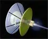
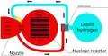

# Propulsion system
> 2019.05.12 [🚀](../index/index.md) [despace](index.md) → [PS](ps.md), [Control](control.md)

[TOC]

---
> <small>**Propulsion system (PS)** — EN term. **Двигательная установка (ДУ)** — RU analogue.  **Stabilization engine (STEN)** — EN term. **Двигатель стабилизации (ДСТ)** — RU analogue.  **Low thrust engine (LTEN)** — EN term. **Двигатель малой тяги (ДМТ)** — RU analogue.</small>

**Rocket engine** — a jet engine, the energy source & working matter of which are located in the vehicle itself. The only practically mastered method of launching a payload into the Earth's orbit.

**Propulsion system (PS) of the SC** — [SC](sc.md) system, providing its acceleration. Designed for: ➀ creating thrust during active SC maneuvers & landing; ➁ creation of reactive control torques around the three axes of the SC for the purpose of orientation & stabilization of the SC, calming the SC after separation from [LV](lv.md), constructing solar orientation & stabilizing the SC in solar orientation, stabilizing the SC during unloading [RW](iu.md) & conducting active maneuvers.

| | |
|:-|:-|
|**Varieries**|・**combined propulsion system (CPS)** *(ru. объединённая двигательная установка, ОДУ)* — propulsion system of the orbiter, designed to perform all dynamic operations in flight  ・**corrective braking propulsion system (CBPS)** *(ru. корректирующая тормозная двигательная установка, КТДУ)*  ・**cruise propulsion system (CRPS)** *(ru. маршевая двигательная установка, МДУ)*  ・**propulsion system for stabilization, orientation & launch support (PS SOL)** *(ru. двигательная установка стабилизации, ориентации и обеспечения запуска, ДУ СОЗ)*|
|**Common  engines**|・Bussard Engine (hypothetical)  ・Electrical  ・Gas  ・[Hybrid](гбрд.md)  ・[Ion](иод.md)  ・Liquid  ・Nuclear  ・[Photonic](фотонный_двигатель.md) (hypothetical)  ・[Solar sail](солнечный_парус.md)  ・Solid fuel  ・[Thermonuclear](тярд.md)  ・Warp Drive (hypothetical)  ・**electric propulsion system (EPP)** — an OE, incl.: the propulsion system itself (consists of propulsion blocks), a power supply, a storage & supply system for a working fluid (SSSWF), an automatic control system (ACS)  ・**nuclear rocket propulsion system (NRPS)** — a PS that uses the energy of fission or nuclear fusion to create jet thrust|
|**Programs  & techs**|・NASA’s [TALOS](talos.md) (Thruster Advancement for Low-temperature operation in space)|
|**Structures  & units**|・**Fuel, etc.** — [CINU](cinu.md)・ [CGS](cgs.md)・ [Bellows](сильфон.md)・ [Fuel membranes](топливные_мембраны.md)・ [Fuel bags](топливные_мешки.md)  ・*Aggregates* — [STSY](соз.md)・ [SOIS](соис.md)・ [Turbopump](turbopump.md)|

【**Table.** Manufacturers】

| | |
|:-|:-|
|**AE**|…|
|**AU**|…|
|**CA**|・[Baryon Dynamics](contact/baryon_dyn.md) — mostly for CubeSats  ・[Pratt & Whitney](contact/pratt_n_whitney.md)  ・[Space Engine Systems](contact/space_engs.md) — SSTO propulsion, pumps, compressors, gear boxes, Permanent Magnet Motors|
|**CN**|…|
|**EU**|・[Exotrail](contact/exotrail.md)  ・[OPC LAM](contact/opc_lam.md)  ・[Safran](contact/safran.md)|
|**IL**|…|
|**IN**|…|
|**JP**|・[IHI](contact/ihi.md)  ・JAXA [Kakuda Space Center](contact/kakuda_sc.md)  ・JAXA [Noshiro Rocket Testing Center](contact/noshiro_rtc.md)  ・[Pale Blue Inc.](contact/pale_blue_inc.md) — PS for small sats  ・[Warpspace](contact/warpspace.md) — ion engines|
|**KR**|・[Hanwha](contact/hanwha.md)  ・[INNOSPACE](contact/innospace.md)  ・[Satrec Initiative](contact/satreci.md)|
|**RU**|・PS can produce anyone who produce SC ([VNIIEM](contact/vniiem.md), [ISS](contact/iss_r.md), [LAV](contact/lav.md) и т.д.)  ・[KBHM](contact/kbhm.md) — engines, valves  ・[NIIMASH](contact/niimash.md) — engines, valves  ・[NIIFI](contact/niifi.md) — sensors  ・[NPO IT](contact/npoit.md) — level switches  ・[Progress](contact/progress_rsc.md) — valves  ・[RSC AC](contact/rsc_ac.md) — fuel, coatings  ・[Safit](contact/safit.md) — tanks  ・[Fakel](contact/edb_fakel.md) — engines, valves|
|**SA**|…|
|**SG**|…|
|**US**|・[Blue Origin](blue_origin.md) — engines, components  ・[Moog inc](contact/moog_inc.md) — engines, components  ・[Pratt & Whitney](contact/pratt_n_whitney.md)  ・[SpaceX](contact/spacex.md) — engines, components|
|**VN**|…|

## ➀ Engines
【**Table.** Engines】

| |*[Company](contact.md)*|*Models of engines (thrust, N), ordered ascending thrust*|
|:-|:-|:-|
|**EU**|[OPC LAM](contact/opc_lam.md)|**Liq. (1c.)** — [1NMHT](engine_lst.md) (1)・ [20NMHT](engine_lst.md) (20)・ [400NMHT](engine_lst.md) (400);  **Liq. (2c.)** — [S10](engine_lst.md) (10)・ [S200](engine_lst.md) (216)・ [S400](engine_lst.md) (420);  **El.** — [RIT µX](engine_lst.md) (0.00005 ‑ 0.0005)・ [RIT 10](engine_lst.md) (0.005 ‑ 0.025)・ [RIT 2X](engine_lst.md) (0.07 ‑ 0.215)|
| |[Safran](contact/safran.md)|**El.** — …|
|•|• • • • • • • •|• • •|
|**JP**|[IHI](contact/ihi.md)|**Liq. (1c.)** — [MT-9](engine_lst.md) (1)・ [MT-8A](engine_lst.md) (4)・ [MT-2](engine_lst.md) (20)・ [MT-6](engine_lst.md) (50);  **Liq. (2c.)** — [IHI 22N](engine_lst.md) (22)・ [IHI 120N](engine_lst.md) (120)・ [IHI 450N](engine_lst.md) (450)・ [IHI 490N](engine_lst.md) (490)・ [BT‑4](engine_lst.md) (500)|
| |[Mitsubishi HVI](contact/mitsubishi.md)| |
| |[Pale Blue](contact/pale_blue_inc.md)|**El.** — [WIT](engine_lst.md) (0.000221)・ [WRT](engine_lst.md) (0.002)|
|•|• • • • • • • •|• • •|
|**RU**|[AvantSpace](contact/avantspace.md)|**El.** — [GT-50](engine_lst.md) (0.006)|
| |[Energomash](энергомаш.md)|**Liq. (2c.)** — …;  **Nuc.** — …|
| |[Fakel](contact/edb_fakel.md)|**Liq. (1c.)** — [K10](engine_lst.md) (0.1)・ [K50](engine_lst.md) (0.54)・ [TK500M](engine_lst.md) (1.0 - 5.6);  **El.** — [SPD‑25](engine_lst.md) (0.007)・ [SPD‑50](engine_lst.md) (0.014)・ [SPD‑70](engine_lst.md) (0.04)・ [SPD‑100](engine_lst.md) (0.083)・ [SPD‑140](engine_lst.md) (0.193 ‑ 0.29)・ [SPD‑230](engine_lst.md) (0.785)|
| |[KBHM](contact/kbhm.md)|**Liq. (1c.)** — [DOT‑5](engine_lst.md) (5)・ [DOC‑10](engine_lst.md) (10)・ [DOT‑25](engine_lst.md) (25)・ [DOC‑50](engine_lst.md) (50);  **Liq. (2c.)** — [S5.140](engine_lst.md) (6)・ [S5.142](engine_lst.md) (25)・ [S5.145](engine_lst.md) (50)・ [S5.144](engine_lst.md) (100)・ [S5.146](engine_lst.md) (200)・ [DMT‑500](engine_lst.md) (500)・ [255U.487](engine_lst.md) (600)・ [255U.530](engine_lst.md) (600)・ [DMT‑1000](engine_lst.md) (1 000)・ [DMT‑2200](engine_lst.md) (2 200)・ [S5.154](engine_lst.md) (4 300)・ [S5.175](engine_lst.md) (4 650)・ [S5.120](engine_lst.md) (5 880)・ [14D30](engine_lst.md) (19 620)・ [S5.92](engine_lst.md) (19 620)・ [KVD1](engine_lst.md) (69 650)・ [S5.86](engine_lst.md) (73 570);  **【Archived】** *Liq. (2c.) — [S5.78](engine_lst.md) (6 000)*|
| |[NIIMASH](contact/niimash.md)|**Liq (2c.)** — [17D58E](engine_lst.md) (13)・ [11D457](engine_lst.md) (54)・ [11D428A‑16](engine_lst.md) (126)・ [17D16](engine_lst.md) (196)・ [11D458](engine_lst.md) (392);  **Gas** — [MD08](engine_lst.md) (0.8)・ [MD5](engine_lst.md) (5);  **【Archived】** *Liq. (2c.) — [RDMT3](engine_lst.md) (3)・ [RDMT10](engine_lst.md) (10)・ [RDMT50](engine_lst.md) (50)・ [RDMT100](engine_lst.md) (100)・ [RDMT2600](engine_lst.md) (2 600)*|
|•|• • • • • • • •|• • •|
|**US**|[Aerojet R/D](aerojet_rocketdyne.md)|**Liq. (2c.)** — [R‑6](engine_lst.md) (22)・ [R‑1E](engine_lst.md) (111)・ [HiPAT](engine_lst.md) (445)・ [R‑4D](engine_lst.md) (490)・ [AMBR](engine_lst.md) (667)・ [R‑42](engine_lst.md) (890)・ [R‑40](engine_lst.md) (3 930)・ [RS‑25](engine_lst.md) (1 980 000)|
| |[Blue Origin](blue_origin.md)|**Liq. (2c.)** — [BE‑7](engine_lst.md) (40 000)・ [BE‑3](engine_lst.md) (580 000)・ [BE‑4](engine_lst.md) (2 400 000);  **【Archived】**  *Liq. (1c.) — [BE‑1](engine_lst.md) (9 000);  Liq. (2c.) — [BE‑2](engine_lst.md) (140 000)*|
| |[Nammo](nammo.md)|**Liq. (2c.)** — [LEROS 1b](engine_lst.md) (635)・ [LEROS 1c](engine_lst.md) (458)・ [LEROS 2b](engine_lst.md) (407)・ [LEROS 4](engine_lst.md) (1 100)|
| |[SpaceX](contact/spacex.md)|**Liq. (2c.)** — [Draco](engine_lst.md) (400 ‑ 71 000)・ [Merlin](engine_lst.md) (410 000 ‑ 480 000)・ [Raptor](engine_lst.md) (1 700 000 ‑ 3 500 000);  **【Archived】** *Liq. (2c.) — [Kestrel](engine_lst.md) (3 110)*|

### Bussard ramjet
> <small>**Межзвёздный прямоточный двигатель Бассарда** — русскоязычный термин, не имеющий аналога в английском языке. **Bussard ramjet** — дословный перевод с русского на английский.</small>

**Межзвёздный прямоточный двигатель Бассарда (англ. Bussard ramjet)** — концепция ракетного двигателя для межзвёздных полётов, предложенная в 1960 году физиком Робертом Бассардом (Robert W. Bussard).

  
*Межзвёздный прямоточный двигатель Бассарда (поле коллектора показано видимым) в представлении художника*

**Notes:**

   1. <https://en.wikipedia.org/wiki/Bussard_ramjet>
   1. <https://ru.wikipedia.org/wiki/Межзвёздный_прямоточный_двигатель_Бассарда>

Основой концепции является захват вещества межзвёздной среды (водорода и пыли) идущим на высокой скорости космическим кораблём и использование этого вещества в качестве рабочего тела (либо непосредственно топлива) в термоядерном ракетном двигателе корабля. Захват вещества межзвёздной среды осуществляется мощным электромагнитным полем, в приближении имеющим конфигурацию широкой воронки, направленной вперёд по вектору скорости корабля. Предположительно, диаметр собирающего поля должен составлять тысячи или десятки тысяч километров. Существенной особенностью такой схемы будет являться практически полная топливная автономность корабля: будучи разогнанным имеющимся на борту запасом топлива до некоторой скорости, обеспечивающей достаточный приток межзвёздного водорода во входной коллектор, то есть после входа в «прямоточный режим», корабль сможет двигаться далее с постоянным ускорением, не выключая привода и не переходя на инерционный полёт.

Предложены два основных варианта использования захваченного межзвёздного водорода:

   1. В качестве рабочего тела для термоядерного ракетного двигателя, при собственном запасе термоядерного топлива на борту (RAIR).
   1. Непосредственно в качестве термоядерного топлива.

Основные проблемы:

   1. Ключевая проблема «прямоточника» также в том, что «магнитная воронка» отнюдь не будет выполнять функцию массозаборника так, как предполагалось автором концепции. Скорее, она будет вести себя как «тормоз».
   1. Ещё одним недостатком термоядерного прямоточного двигателя (даже на наиболее эффективном протон‑протонном цикле) является ограниченность скорости, которой может достичь оснащённый им корабль (не более 0.119 c = 35 700 ㎞/s).

 

### Cold gas thruster
> <small>**Газовый ракетный двигатель (ГРД)** — русскоязычный термин. **Cold gas thruster (CGT)** — англоязычный эквивалент.</small>

**Газовый ракетный двигатель (ГРД)** — ракетный двигатель, принцип работы которого основан на создании направленного ускорения при помощи расширения сжатого газа (азот, гелий, воздух и т.д.).

В КА обычно применяются для точной ориентации и стабилизации, и питаются от баков наддува.

Имеют следующие особенности:
   1. по уровню тяги занимают место между ЖРД и ЭРД;
   1. по удельному импульсу проигрывают ЖРД и ЭРД;
   1. конструктивно проще ЖРД и ЭРД;
   1. по мере опорожнения бака с газом, эффективность ГРД снижается;
   1. имеют невысокую температуру работы.

 

### Electrically-powered
> <small>**Электрический ракетный двигатель (ЭРД)** — русскоязычный термин. **Electrically-powered spacecraft propulsion (EPSP)** — англоязычный эквивалент.</small>

**Электри́ческий раке́тный дви́гатель (ЭРД)** — ракетный двигатель, принцип работы которого основан на преобразовании электрической энергии в направленную кинетическую энергию частиц.

Комплекс, состоящий из набора ЭРД, системы хранения и подачи рабочего тела (СХиП), системы автоматического управления (САУ), системы электропитания (СЭП), называется **электроракетной двигательной установкой (ЭРДУ)**.

**Notes:**

   1. <https://en.wikipedia.org/wiki/Electrically_powered_spacecraft_propulsion>
   1. <https://ru.wikipedia.org/wiki/Электрический_ракетный_двигатель>
   1. <https://en.wikipedia.org/wiki/Ion_thruster>
   1. <https://ru.wikipedia.org/wiki/Ионный_двигатель>

Классификация ЭРД не устоялась, однако в русскоязычной литературе обычно принято классифицировать ЭРД по преобладающему механизму ускорения частиц. Различают следующие типы двигателей:

   1. электротермические ракетные двигатели (ЭТД):
      - электронагревной (ЭНД);
      - электродуговой (ЭДД);
   1. электростатические двигатели (ЭСД):
      - ионный (в т.ч. коллоидные) (ИД);
      - стационарный плазменный (СПД);
      - линейный холловский, холловский (ЛХД);
   1. сильноточные (электромагнитные, магнитодинамические) двигатели:
      - торцевой холловский (ТХД);
   1. импульсные двигатели.

Импульсные двигатели используют кинетическую энергию газов, появляющихся при испарении твёрдого тела в электрическом разряде.

В качестве рабочего тела в ЭРД могут применяться любые жидкости и газы, а также их смеси. Тем не менее, для каждого типа двигателей существуют рабочие тела, применение которых позволяет достигнуть наилучших результатов. Для ЭТД традиционно используется аммиак, для электростатических — ксенон, для сильноточных — литий, для импульсных — фторопласт.

Недостатком ксенона является его стоимость, обусловленная небольшим годовым производством (менее 10 т в год во всём мире). В качестве основного кандидата на замену рассматривается аргон. Он, в отличие от ксенона, имеет большую энергию ионизации при меньшей атомной массе. Энергия, затраченная на ионизацию на единицу ускоренной массы, является одним из источников потерь КПД.

**Ядерная электродвигательная установка (ЯЭДУ)** — двигательная установка космического аппарата, включающая в себя комплекс бортовых систем космического аппарата (КА), таких как: электрический ракетный двигатель (ЭРД), система электропитания, обеспечиваемого ядерным реактором, система хранения и подачи рабочего тела (СХиП), система автоматического управления (САУ).

**Ионный двигатель (ИД)** — тип ЭРД, принцип работы которого основан на создании реактивной тяги на базе ионизированного газа, разогнанного до высоких скоростей в электрическом поле.

**Краткие технические характеристики**

ЭРД характеризуются малым массовым расходом рабочего тела и высокой скоростью истечения ускоренного потока частиц. Нижняя граница скорости истечения примерно совпадает с верхней границей скорости истечения струи химического двигателя и составляет около 3 ㎞/s. Верхняя граница теоретически неограничена (в пределах скорости света), однако для перспективных моделей двигателей рассматривается скорость, не превышающая 200 ㎞/s. В настоящее время для двигателей различных типов оптимальной считается скорость истечения от 16 до 60 ㎞/s.

В связи с тем, что процесс ускорения в ЭРД проходит при низком давлении в ускорительном канале (концентрация частиц не превышает 10²⁰ частиц/m³), плотность тяги довольно мала, что ограничивает применение ЭРД: внешнее давление не должно превышать давление в ускорительном канале, а ускорение КА очень мало (десятые или даже сотые g). Исключением из этого правила могут быть ЭРД на малых КА.

Электрическая мощность ЭРД колеблется от сотен Вт до мегаватт. Применяемые в настоящее время на КА ЭРД имеют мощность от 800 до 2 000 Вт.

ЭРД характеризуются КПД — от 30 до 60 %.

Технические характеристики **ионного двигателя**: потребляемая мощность 1‑7 ㎾, скорость истечения ионов 20‑50 ㎞/s, тяга 20‑250 мН, КПД 60‑80 %. Рабочим телом, как правило, является ионизированный инертный газ (аргон, ксенон и т.п.), но иногда и ртуть. Достоинством этого типа двигателей является малый расход топлива и продолжительное время функционирования (максимальный срок непрерывной работы самых современных образцов ионных двигателей составляет более 3 лет). По сравнению с двигателями с СПД ионный двигатель обладает большим энергопотреблением при равном уровне тяги. Ионные двигатели используют повышенные напряжения, обладают более сложной схемой и конструкцией, что усложняет решение задачи обеспечения высокой надёжности и электрической прочности двигателя.

**Перспективы:**

   - Хотя ЭРД имеют малую тягу по сравнению с ЖРД, они способны работать длительное время и осуществлять медленные полёты на большие расстояния. Самые совершенные на сегодняшний день ЭРД имеют ΔV до 100 ㎞/s и при использовании ядерных источников энергии пригодны для полётов к внешним планетам Солнечной системы, но недостаточно мощные для межзвёздного полёта.
   - В настоящее время многими странами исследуются вопросы создания пилотируемых межпланетных кораблей с ЭРДУ. Существующие ЭРД не являются оптимальными для использования в качестве маршевых двигателей для таких кораблей, в связи с чем в ближайшем будущем следует ожидать возобновления интереса к разработке сильноточных ЭРД на жидкометаллическом РТ (висмут, литий, калий, цезий) с электрической мощностью до 1 ㎿, способных длительно работать при токах силой до 5 ‑ 10 ㎄. Эти РД должны развивать тягу до 20 ‑ 30 Н и скорость истечения 20 ‑ 30 ㎞/s при КПД 30 % и более. В 1975 г. подобный РД испытан в СССР на ИСЗ «Космос‑728» (РД электрической мощностью 3 ㎾, работающий на калии, развил скорость истечения ~ 30 ㎞/s).
   - Кроме России и США исследованиями и разработкой ЭРД занимаются также в Великобритании, ФРГ, Франции, Японии, Италии. Основные направления деятельности этих стран: ИД (наиболее успешны разработки Великобритании и Германии, особенно — совместные); СПД и ДАС (Япония, Франция); ЭТД (Франция). В основном эти двигатели предназначены для ИСЗ.

 

### Liquid-propellant rocket
> <small>**Жидкостной ракетный двигатель (ЖРД)** — русскоязычный термин. **Liquid-propellant rocket / liquid rocket (LPR)** — англоязычный эквивалент.</small>

**Жидкостной ракетный двигатель (ЖРД)** — химический ракетный двигатель, принцип работы которого основан на создании направленного ускорения при помощи расширения сгорающих жидкостей. По количеству используемых компонентов различаются 1‑, 2‑ и 3‑компонентные ЖРД.

В КА и РН обычно применяются для всех областей использования двигателей (маршевые, ориентации, стабилизации, посадки и т.д.). В настоящее время ЖРД широко используются в космических программах. Как правило, это двухкомпонентные ЖРД с криогенными компонентами. В военной технике ЖРД применяются относительно редко, преимущественно на тяжёлых ракетах. Чаще всего это двухкомпонентные ЖРД на высококипящих компонентах.

Принцип работы **однокомпонентного двигателя** основан на разложении топлива в камере сгорания в присутствии катализатора; образующийся высокотемпературный газ при истечении из сопла создаёт тягу. Диапазон тяг, развиваемых им,  0.2 ‑ 3 000 Н.

   1. <https://en.wikipedia.org/wiki/Liquid-propellant_rocket>
   1. <https://ru.wikipedia.org/wiki/Жидкостный_ракетный_двигатель>
   1. <http://wmpt.narod.ru/zz16.htm>
   1. **Преимущества ЖРД:**
      1. Самый высокий удельный импульс в классе химических ракетных двигателей (свыше 4 500 ㎧ для пары кислород‑водород, для керосин‑кислород — 3 500 ㎧).
      1. Управляемость по тяге: регулируя расход топлива, можно изменять величину тяги в большом диапазоне и полностью прекращать работу двигателя с последующим повторным запуском. Это необходимо при маневрировании аппарата в космическом пространстве.
      1. При создании больших ракет использование ЖРД позволяет добиться весового преимущества по сравнению с РДТТ. Во‑первых, за счёт более высокого удельного импульса, а во‑вторых, за счёт того, что жидкое топливо на ракете содержится в отдельных баках, из которых оно подаётся в камеру сгорания с помощью насосов. За счёт этого давление в баках существенно ниже, чем в камере сгорания, а сами баки выполняются тонкостенными и относительно лёгкими. В РДТТ контейнер топлива является одновременно и камерой сгорания, и должен выдерживать высокое давление (десятки атмосфер), что влечёт за собой увеличение веса. Чем больше топлива в ракете, тем больше размер контейнеров для его хранения, и тем больше сказывается весовое преимущество ЖРД по сравнению с РДТТ, и наоборот: для малых ракет наличие турбонасосного агрегата сводит на нет это преимущество.
   1. **Недостатки ЖРД:**
      1. ЖРД и ракета на его основе значительно более сложно устроены, и более дорогостоящи, чем твердотопливные (несмотря на то, что 1 ㎏ жидкого топлива в несколько раз дешевле твёрдого). Транспортировать жидкостную ракету необходимо с бо́льшими предосторожностями, а технология подготовки её к пуску более сложна, трудоёмка и требует больше времени (особенно при использовании сжиженных газов в качестве компонентов топлива), поэтому для ракет военного назначения предпочтение в настоящее время оказывается твердотопливным двигателям ввиду их более высокой надёжности, мобильности и боеготовности.
      1. Компоненты жидкого топлива в невесомости неуправляемо перемещаются в пространстве баков. Для их осаждения необходимо применять специальные меры, например включать вспомогательные двигатели, работающие на твёрдом топливе или на газе, или использовать систему удержания топлива.
      1. В настоящее время для химических ракетных двигателей (в том числе и для ЖРД) достигнут предел энергетических возможностей топлива, и поэтому теоретически не предвидится возможности существенного увеличения их удельного импульса, что ограничивает возможности ракетной техники, базирующейся на использовании химических двигателей, уже освоенными двумя направлениями:
        1. космические полёты в околоземном пространстве (как пилотируемые, так и беспилотные).
        1. исследование космоса в пределах Солнечной системы с помощью автоматических аппаратов.

 

### Nuclear rocket
> <small>**Ядерная ракетная двигательная установка (ЯРДУ)** — русскоязычный термин. **Nuclear thermal rocket (NTR)** — англоязычный эквивалент.</small>

**Ядерная ракетная двигательная установка (ЯРДУ)**, англ. **Nuclear thermal rocket (NTR)** — разновидность ракетного двигателя, которая использует энергию деления или синтеза ядер для создания реактивной тяги. Бывают жидкостными (нагрев жидкого рабочего тела в нагревательной камере от [ядерного реактора](nr.md) и вывод газа через сопло) и импульсно‑взрывными (ядерные взрывы малой мощности при равном промежутке времени).

   - **Ядерная электродвигательная установка (ЯЭДУ)** — двигательная установка космического аппарата, включающая в себя комплекс бортовых систем КА, таких как: электрический ракетный двигатель (ЭРД), система электропитания, обеспечиваемого ядерным реактором, система хранения и подачи рабочего тела (СХиП), система автоматического управления (САУ). ЯЭДУ иногда путают с ЯРДУ, что не корректно, т.к. ядерный реактор в ЯЭДУ используется только для выработки электроэнергии. Она, в свою очередь, используется для запуска и питания электрического ракетного двигателя (ЭРД) и обеспечивает электропитание бортовых систем КА.
   - **Термоядерный ракетный двигатель (ТЯРД)** — перспективный ракетный двигатель для КА, в котором для создания тяги предполагается использовать истечение продуктов управляемой термоядерной реакции или рабочего тела, нагретого за счёт энергии термоядерной реакции.

**Notes:**

   1. <https://ru.wikipedia.org/wiki/Ядерная_электродвигательная_установка>
   1. <https://ru.wikipedia.org/wiki/Ядерная_энергодвигательная_установка_мегаваттного_класса>
   1. <https://ru.wikipedia.org/wiki/Термоядерный_ракетный_двигатель>
   1. <https://en.wikipedia.org/wiki/Nuclear_thermal_rocket>

 

### Solid-propellant rocket
> <small>**Ракетный двигатель твёрдого топлива (РДТТ)** — русскоязычный термин. **Solid-propellant rocket (SPR)** — англоязычный эквивалент.</small>

**Твердотопливный ракетный двигатель (РДТТ)** — химический ракетный двигатель, принцип работы которого основан на создании направленного ускорения при помощи расширения газов от сгорания твёрдых горючего и окислителя. В КА и РН обычно применяются в качестве одноразовых двигателей невысокой точности.

   1. <https://en.wikipedia.org/wiki/Solid-propellant_rocket>
   1. **Достоинства:**
      - возможность долговременного хранения
      - надёжность
      - низкая пожароопасность
      - относительная простота
      - отсутствие проблемы возможных утечек топлива
   1. **Недостатки:**
      - больший вес топливных баков, так как баки являются одновременно и камерой сгорания
      - большое количество агрессивных веществ в выхлопе наиболее распространённых видов топлива с перхлоратом аммония
      - невысокий удельный импульс и относительные сложности с управлением тягой двигателя (дросселированием), его остановкой (отсечка тяги) и повторным запуском
      - необходимость аккуратной работы в земных условиях, чтобы топливо не трескалось
      - по сравнению с ЖРД, как правило, больший уровень вибраций при работе
   1. **Топливо:**
      - Гомогенные топлива. Представляют собой твёрдые растворы (обычно — нитроцеллюлозы) в нелетучем растворителе (обычно в нитроглицерине). Применяются в небольших ракетах.
      - Смесевые топлива. Это смесь твёрдых окислителя и горючего. Наиболее значимы:
         - Дымный порох. Исторически первое ракетное топливо. Состав: селитра, древесный уголь, сера.
         - Смесевые топлива на основе перхлората аммония (окислитель) и полимерного горючего. Наиболее широко применяемое топливо тяжелых ракет военного и космического назначения.
         - В ракетомоделизме получило распространение самодельное смесевое топливо на основе нитрата калия и органических связующих, доступных в быту (сорбит, сахар и тому подобных).

Топливо РДТТ американских межконтинентальных ракет состояло из смеси на основе перхлората аммония в качестве окислителя и горючего полиуретана с алюминием (первая ступень), с присадками (связующего **НТРВ**), улучшающими стабильность скорости горения, формование и хранения заряда и смесью на основе перхлората аммония в качестве окислителя и горючего полиуретана в смеси с сополимером полибутадиена и акриловой кислоты (вторая ступень).

 

### Warp drive
> <small>**Варп‑двигатель** — русскоязычный термин, не имеющий аналога в английском языке. **Warp drive** — дословный перевод с русского на английский.</small>

**Варп‑двигатель** *(англ. Warp drive, двигатель искривления)* — вымышленная технология, которая, согласно гипотезе, позволит космическому аппарату, оснащённому таким двигателем, перемещаться со скоростью выше скорости света, и таким образом преодолевать межзвёздные расстояния за приемлемое время.

Реализация двигателя предполагается с использованием **пузыря Алькубьерре** — идеи, основанная на решении уравнений Эйнштейна, предложенная мексиканским физиком‑теоретиком Мигелем Алькубьерре, в которой космический аппарат может достичь сверхсветовой скорости.

Движение выше скорости света невозможно для объектов с действительной ненулевой массой в нормальном пространстве‑времени. Однако вместо перемещения выше скорости света в пределах локальной системы координат космический корабль может двигаться, сжимая пространство перед собой и расширяя его позади, что позволяет ему фактически перемещаться с любой скоростью, в том числе быстрее света.

При этом само судно оказывается в своеобразном «пузыре», оставаясь защищённым от воздействия пространственных деформаций. Также корабль внутри области такого искажения пространства фактически физически неподвижен, — перемещается сама область искажённого пространства, внутри которой корабль пребывает словно в контейнере. Естественно, корабль не разгоняется — локально — даже до околосветовых скоростей, но тем не менее движется быстрее, чем плоская электромагнитная волна в вакууме.

| |
|:-|
||

**Notes:**

   1. <https://en.wikipedia.org/wiki/Alcubierre_drive>
   1. <https://en.wikipedia.org/wiki/Warp_drive>
   1. <https://ru.wikipedia.org/wiki/Варп‑двигатель>
   1. <https://ru.wikipedia.org/wiki/Пузырь_Алькубьерре>

## ➁ Fuel
> <small>**Топливо** — русскоязычный термин. **Fuel** — англоязычный эквивалент.</small>

**Ракетное топливо** — вещества, используемые в ракетных двигателях различных конструкций для получения тяги и ускорения ракеты посредством энергии химической реакции (горения).

|*Тип*|*Описание*|
|:-|:-|
|ЖРД, 2 комп.|[АТ + Hydrazine](nto_plus.md)・ [АТ + MMH](nto_plus.md)・ [АТ + НДМГ](nto_plus.md)|
| |[O + H](o_plus.md)・ [Кислород + Керосин](o_plus.md)・ [Кислород + …](o_plus.md)・ [Кислород + Синтин](o_plus.md)|
|ЖРД, 1 комп.|[Hydrazine](hydrazine.md)・ [ММГ](mmh.md)・ [Перекись водорода](hydrogen.md)|
|ТРД|[HTPB](ps.md)|
|ЭРД|[Xenon](xenon.md)|
| | |
|Компоненты|**Газ:** [Азот](азот.md)・ [Водород](водород.md)・ [Воздух](воздух.md)・ [Гелий](гелий.md)・ [Кислород](кислород.md)・ [Криптон](криптон.md)|
| |**Жидкость:** [АТ](nto.md)・ [НДМГ](udmh.md)・ [Синтин](syntin.md)|

### HTPB
> <small>**Полибутадиен с концевыми гидроксильными группами** — русскоязычный термин. **Hydroxyl‑terminated polybutadiene (HTPB)** — англоязычный эквивалент.</small>

**Полибутадиен с концевыми гидроксильными группами**, иногда используется англоязычное сокращение **HTPB** (англ. **hydroxyl‑terminated polybutadiene**) — олигомер бутадиена, каждый конец молекулярной цепочки которого завершается гидроксильной функциональной группой. При реакции с диизоцианатами он образует полиуретаны.

HTPB применяется в качестве связующего окислителя с горючим в твёрдотопливных двигателях.

|<small>*Наименование*|*Компоненты топлива*|<small>*Продукты  горения*|*[Isp](ps.md), с*|*Плотность,  ㎏/m³*|<small>*Т в камере  сгорания, К*|
|:-|:-|:-|:-|:-|:-|
|**TP‑H1148**|HTPB 18 %  Fe₂O₃ 0.28 %  алюм. порошок 16 %  алюм. перхлорат 69.72 %|HCl  Al₂O₃  CO  и пр.|268|1 757|2 000|
|**DL‑H396**|HTPB 11.02 %  Fe₂O₃ 0.2 %  алюм. порошок 19 %  алюм. перхлорат 68.92 %|HCl  Al₂O₃  CO  и пр.|280|1 801|2 000|

**Применение:**

   - HTPB часто применяется в твердотопливных ракетных двигателях в качестве связующего вещества между топливом и окислителем, позволяя создать однородную массу. К примеру, это вещество использовалось во всех 3 и 4 ступенях японских [LV](lv.md) Мю‑5 и индийских [PSLV](pslv.md). [JAXA](contact/jaxa.md) описывает состав топлива как «HTPB/AP/Al = 12/68/20», что расшифровывается как 12 % HTPB по массе (связующее вещество и топливо), 68 % перхлората аммония (окислитель), и 20 % алюминиевого порошка (топливо).
   - HTPB используется и в качестве топлива для гибридных ракетных двигателей. С N₂O (закись азота, или «веселящий газ») в качестве окислителя, HTPB использовался в двигателе, разработанном компанией SpaceDev для корабля SpaceShipTwo, но позднее он был заменён на полиамид.

### Жидкое и твёрдое
Не путайте ракетное топливо с рабочим телом нехимических ракетных двигателей, например ядерных или электрических. Ниже приведены некоторые примечательные топлива, применяемые в двигателях и ДУ. С учётом токсичности топливо делится на 4 класса опасности ([ГОСТ 12.1.007](гост_12_1_007.md), по мере убывания опасности):

   1. первый класс — горючие гидразинового ряда ([Hydrazine](hydrazine.md), [НДМГ](udmh.md) и продукт Люминал‑А);
   1. второй класс — модификации керосина и синтетические горючие, и окислитель [H₂O₂](hydrogen.md);
   1. третий класс — окислители [NTO](nto.md) и АК-27И (смесь HNO₃ — 69.8 %, N₂O₄ — 28 %, J — 0.12 ‑ 0.16 %);
   1. четвертый класс — углеводородное горючее РГ-1 (керосин), спирт этиловый и бензин авиационный.

【**Таблица.** Жидкостное топливо с классификацией опасности по [ГОСТ 12.1.007](гост_12_1_007.md)】

|*Окислитель*|*Горючее*|*Isp, с*|<small>*Т in comb.  chamber, K*|<small>*Density, ㎏/m³*<small>|<small>*Toxicity  class*|
|:-|:-|:-|:-|:-|:-|
|**—**|[Hydrazine](hydrazine.md)|300|1 000|1 010|1|
| |[Перекись водорода](hydrogen.md) **80 %**|161|500|1 350|2|
| |Перекись водорода **99 %**|210|1 000|1 448|2|
| |AF-M315E *(green fuel)* **⁽²⁾**|332|1 850|1 470 |4|
| |SHP163 *(green fuel)* **⁽²⁾**|346|2 055|1 400|4|
| |HNP221 *(green fuel)* **⁽²⁾**|303|1 195|1 220|4|
| |HNP225 *(green fuel)* **⁽²⁾**|268|845|1 160|4|
| |DL‑H396 *(HTPB)*|280|2 000|1 801| |
| |TP‑H1148 *(HTPB)*|268|2 000|1 757| |
| | | | | | |
|**Fluorine (liquid)**|Аммиак|405|4 100| |1|
| |Водород жидкий **⁽¹⁾**|449|4 707|621|1|
| |Гидразин|402|4 775|1 314|1|
| |Литий + водород **⁽¹⁾**|542|2 200| |1|
| | | | | | |
|**Hydrogen peroxide**|Керосин|310| | |2|
| |Пентаборан|375| | |1|
| |Спирт|300| | |2|
| | | | | | |
|**Nitric acid**|Анилин + фурфуриловый спирт|313|3 050| |1|
| |Hydrazine|279| |1 254|1|
| |Керосин|313|2 980| |1|
| |ТГ‑02|310|3 000| |1|
| | | | | | |
|**[NTO](nto_plus.md)**|Hydrazine|322|3 287|1 228|1|
| |Керосин|309|3 516|1 269|2|
| |ММГ|325|3 385| |1|
| |НДМГ|318|3 469|1 185|1|
| |НДМГ + Гидразин (50:50)|354| | |1|
| | | | | | |
|**[Oxygen (liquid)](o_plus.md) ⁽¹⁾**|Аммиак жидкий|323|3 070|839|—|
| |Водород жидкий **⁽¹⁾**|428|3 250|315|—|
| |Гидразин|346|3 446|1 071|1|
| |Керосин (нафтил)|335|3 755|1 036|2|
| |Метан|318|3 250| |—|
| |НДМГ|344|3 670|991|1|
| |Синтин|344|3 755| |2|
| |Спирт|255|3 300| |4|

**Notes:**

   1. **(1)** Криогенное топливо
   1. **(2)** <https://encyclopedia.pub/7693>
   1. **Недостатки:**
      - **Жидкий кислород**. Сжижается при температуре −183 ℃. Быстро испаряется даже в специализированной таре. В связи с чем ракета не может долго стоять заправленной; заправка производится незадолго до пуска.

### Ядерное
Часто применяемые:

   - [Гелий‑3](helium.md)
   - изотопы урана ²³⁵U, ²³⁸U, ²³³U
   - изотоп плутония ²³⁹Pu, также изотопы ²³⁹⁻²⁴²Pu в виде смеси с ²³⁸U (MOX‑топливо)
   - изотоп тория ²³²Th (посредством преобразования в ²³³U)

## ➂ Specific impulse (Isp)
> <small>**Удельный импульс (УИ)** — русскоязычный термин. **Specific impulse (Isp)** — англоязычный эквивалент.</small>

**Уде́льный и́мпульс** — показатель эффективности реактивного двигателя. Иногда для реактивных двигателей используется синоним «удельная тяга» (термин имеет и другие значения), при этом удельная тяга применяется обычно во внутренней баллистике, в то время как удельный импульс — во внешней баллистике. Размерность удельного импульса есть размерность скорости, в системе единиц СИ это метр в секунду.

Влияет на количество расходуемого топлива при данной тяге. Чем выше удельный импульс, тем меньше топлива расходуется. Физический смысл примерно таков — это время, которое двигатель сможет обеспечить тягу в 1 Н, используя 1 ㎏ топлива.

Удельный импульс (тяги) двигателя — это отношение тяги двигателя к массовому расходу топлива, измеряемое в м/с.

【**Table.** ЧаВо】

| | |
|:-|:-|
|**1**|**Q:** *Почему у российских двигателей тягой, например, 400‑600 N удельный импульс 315 с, а у аналогичных европейских аж 328 с?*  **A:** По трём факторам. Во‑первых, культура изготовления — у российских производителей нет технологий для достижения высоких точностей изготовления двигателей и высокой чистоты изготовления топлива. Во‑вторых, культура сборки — у российских потребителей отсутствуют сборочные цеха и заправочное оборудование требуемого класса чистоты. В‑третьих, мало просят или мало дают — производитель двигателей делает то, что ему заказывают, а за последующие увеличения характеристик может просить много денег.|
|**2**|**Q:** *Как посчитать топливо?*  **A:** См. [Некоторые формулы](si.md).|

 

## ➃ Docs & links
|Navigation|
|:-|
|**[FAQ](faq.md)**【**[SCS](scs.md)**·КК, **[SC (OE+SGM)](sc.md)**·КА】**[CON](contact.md)·[Pers](person.md)**·Контакт, **[Ctrl](control.md)**·Упр., **[Doc](doc.md)**·Док., **[Drawing](drawing.md)**·Чертёж, **[EF](ef.md)**·ВВФ, **[Error](error.md)**·Ошибки, **[Event](event.md)**·События, **[FS](fs.md)**·ТЭО, **[HF&E](hfe.md)**·Эрго., **[KT](kt.md)**·КТ, **[N&B](nnb.md)**·БНО, **[Project](project.md)**·Проект, **[QM](qm.md)**·БКНР, **[R&D](rnd.md)**·НИОКР, **[SI](si.md)**·СИ, **[Test](test.md)**·ЭО, **[TRL](trl.md)**·УГТ, **[Way](way.md)**·Пути|
|*Sections & pages*|
|**`Двигательная установка (ДУ):`**  [HTAE](htae.md)・ [TALOS](talos.md)・ [Баки топливные](fuel_tank.md)・ [Варп‑двигатель](ps.md)・ [Газовый двигатель](ps.md)・ [Гибридный двигатель](гбрд.md)・ [Двигатель Бассарда](ps.md)・ [ЖРД](ps.md)・ [ИПТ](ing.md)・ [Ионный двигатель](иод.md)・ [Как считать топливо?](si.md)・ [КЗУ](cinu.md)・ [КХГ](cgs.md)・ [Номинал](nominal.md)・ [Мятый газ](exhsteam.md)・ [РДТТ](ps.md)・ [Сильфон](сильфон.md)・ [СОЗ](соз.md)・ [СОИС](соис.md)・ [Солнечный парус](солнечный_парус.md)・ [ТНА](turbopump.md)・ [Топливные мембраны](топливные_мембраны.md)・ [Топливные мешки](топливные_мешки.md)・ [Топливо](ps.md)・ [Тяговооружённость](ttwr.md)・ [ТЯРД](тярд.md)・ [УИ](ps.md)・ [Фотонный двигатель](фотонный_двигатель.md)・ [ЭРД](ps.md)・ [Эффект Оберта](oberth_eff.md)・ [ЯРД](ps.md)|

   1. Docs:
      - [Warm Gas Propulsion for Small Satellites ❐](f/ps/warm_gas_propulsion_for_small_satellites.djvu)
      - [List of KBKhM current & historical engines (2010) ❐](f/ps/kbhm_engines.ods)
      - [ГОСТ 53802](гост_53802.md), п. 11
      - [PROPEP ❐](f/doc/propep.7z) — ПО для расчёта характеристик топлива
      - [Solid propellants: AP/HTPB composite propellants ❐](f/fuel/htpb_1-s2.0-s1878535215000106-main.djvu)
   1. <https://en.wikipedia.org/wiki/Electrically_powered_spacecraft_propulsion>
   1. <https://en.wikipedia.org/wiki/Spacecraft_propulsion>
   1. 2010.11.01 [Чем заправляют ракеты?: ⎆](http://him.1september.ru/view_article.php?:ID=201001109) — [archived ❐](f/archive/20101101_1.pdf) 2019.02.11
   1. <http://www.braeunig.us/space/propel.htm> — [archived ❐](f/ps/specific_impulse_basics_of_space_flight_rocket_propellants.djvu) 2018.01.28
   1. 2016.01.29 [В погоне за удельным импульсом ⎆](https://alex-anpilogov.livejournal.com/115661.html) — [archived ❐](f/archive/20160129_1.pdf) 2019.02.17
   1. <https://en.wikipedia.org/wiki/Rocket_propellant>
   1. <https://ru.wikipedia.org/wiki/Ракетное_топливо>
   1. <http://rocketpolk44.narod.ru/stran/toplivo.htm> — [archived ❐](f/archive/rocketpolk44_narodru_stran_toplivo.pdf) 2019.02.11
   1. 2017.02.22 [Сага о ракетных топливах ⎆](https://habr.com/ru/post/401795/) — [archived ❐](f/archive/20170222_1.pdf) 2019.02.11
   1. 2017.02.28 [Сага о ракетных топливах — обратная сторона медали ⎆](https://habr.com/ru/post/401927/) — [archived ❐](f/archive/20170228_1.pdf) 2019.02.11
   1. <https://encyclopedia.pub/7693> — [archived ❐](f/archive/encyclopedia_pub_7693.pdf) 2021.10.18
   1. <https://en.wikipedia.org/wiki/Hydroxyl-terminated_polybutadiene>
   1. <https://ru.wikipedia.org/wiki/Полибутадиен_с_концевыми_гидроксильными_группами>
   1. <http://www.alternatewars.com/BBOW/Space/Propellants.htm> — [archived ❐](f/fuel/alternatewars_com_spacecraft_propellants.djvu) 2017.12.25

