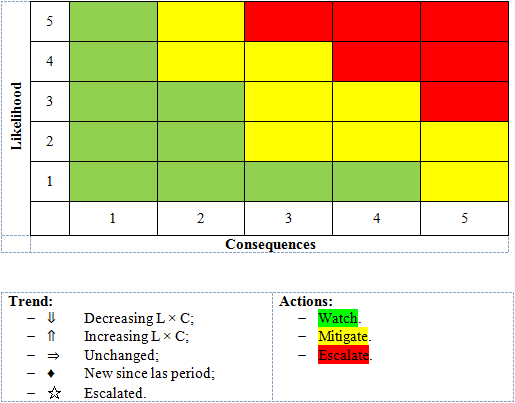
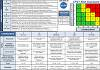

# Quality management
> 2019.05.12 [🚀](../index/index.md) [despace](index.md) → [QM](qm.md), [Риск](qm.md)

[TOC]

---

> <small>**Quality management (QM)** — EN term. **Управление качеством** — RU analogue.</small>

**Quality management (QM)** ensures that an organization, product or service is consistent. It has four main components: **quality planning**, **quality assurance**, **quality control** & **quality improvement**. QM is focused not only on product & service quality, but also on the means to achieve it. QM, therefore, uses quality assurance & control of processes as well as products to achieve more consistent quality. What a customer wants & is willing to pay for it determines quality. It is a written or unwritten commitment to a known or unknown consumer in the market. Thus, quality can be defined as fitness for intended use or, in other words, how well the product performs its intended function.

   - **Human factors**
   - **Quality assurance (QA)** is a way of preventing mistakes & defects in manufactured products & avoiding problems when delivering products or services to customers; which ISO 9000 defines as “part of quality management focused on providing confidence that quality requirements will be fulfilled”. This defect prevention in quality assurance differs subtly from defect detection & rejection in quality control & has been referred to as a shift left since it focuses on quality earlier in the process (i.e., to the left of a linear process diagram reading left to right).
   - **Quality control (QC)** is a process by which entities review the quality of all factors involved in production. ISO 9000 defines quality control as “A part of quality management focused on fulfilling quality requirements”. This approach places emphasis on three aspects (enshrined in standards such as ISO 9001):  ➀ Elements (controls, job management, defined & well managed processes, performance & integrity criteria, identification of records, etc.).  ➁ Competence (knowledge, skills, experience, qualifications, etc.).  ➂ Soft elements (personnel, integrity, confidence, organiz. culture, motivation, team spirit, quality relationships, etc.).  Inspection is a major component of quality control, where physical product is examined visually (or the end results of a service are analyzed). Product inspectors will be provided with lists & descriptions of unacceptable product defects such as cracks or surface blemishes for example.
   - **Reliability**
   - **Risks**
   - **Safety**

## Safety
> <small>**Безопасность** — русскоязычный термин. **Safety** — англоязычный эквивалент.</small>

**Безопа́сность** — отсутствие какого‑либо риска, в случае реализации которого возникают негативные последствия (вред) в отношении кого‑либо или чего‑либо.

Для классификации опасности применяются:

   - [NFPA 704](nfpa_704.md)
   - [Класс опасности](danger_goods.md)

SC and OE must meet the safety requirements for avoiding the hazards listed in the table below:

|*Danger*|*What caused*|
|:--|:--|
|**Electrical**|➀ Work with electrical equipment during testing;  ➁ Static electricity;  ➂ Supply voltage of the SC|
|**Electro- magnetic**|➀ The presence of radio transmitting and emitting devices in the composition of:  ・ground control facilities of the cosmodrome, as well as ground segment SUIs;  ・launch vehicles;  ・SC — radio transmitting devices of given ranges|
|**Explosion hazard**|➀ The following are considered as potential sources of explosion hazard:  ・UDMH — capable of forming explosive mixtures with air; concentration limits of ignition with air: lower — 3 % of the volume, upper — 84 %;  ・pyrotechnic SUIs in the SC and LV;  ・the presence of high pressure systems (≥ 5·10¹⁴ ㎩) in the propulsion system of SC and LV;  ・process of filling SC and LV with compressed gases and fuel;   ・availability of high pressure systems (≥ 5·10¹⁴ ㎩) as part of filling and pneumatic equipment;   ・presence of electric batteries as part of the SC and the last stage of the LV — hazardous substances of I‑IV hazard categories (lithium cobalt, which is the active substance of the positive electrode, lithium hexafluorophosphate is a salt in the electrolyte)|
|**Fire hazard**|➀ Using the fuel:  ・UDMH — self‑igniting poisonous liquid;  ・a large amount of heat and abundant vaporization occurs during water in nitric tetraxide; the spilling of the oxidizer is able to cause a fire;  ・liquid oxygen is not toxic, not flammable, does not explode, however, being a strong oxidizing agent, dramatically increases the ability of other materials to burning.  ➁ The greatest danger represent cases of leakage of fuel‑containing elements of refueling systems, leading To the straits, accumulation of fuel vapor and, as a result, accumulating fire‑hazardous mixtures.  ➂ The presence of pyrotechnic agents in the SC and LV;  ➃ The presence of an electric battery in the SC and the last stage of the LV.|
|**Functional**|➀ Unauthorized or erroneous actions of personnel|
|**Laser**|➀ Presence of laser radiation sources in the SC (Dopplers, payload, etc.), which is a danger to the human eyes|
|**Toxic hazard**|➀ Using toxic fuel as part of the LV:  ・hazard class №1 — UDMH and hydrazine as part of the last stage of the LV;  ・hazard class №2 — AT and hydrogen peroxide as part of a LV;  ・hazard class №4 — hydrocarbon fuels in the LV;  ➁ The use of toxic fuel as part of the SC:  ・hazard class №1 — UDMH;  ・hazard class №2 — nitrogen tetroxide.  ➂ The greatest danger represents cases of leakage of the fuel‑containing elements of refueling systems, leading to the sheds and, as a result, their getting into other systems, as well as to the formation of spaces.  Helium, used as a gas in charge of SC and LV, are non‑combustible, explosion‑proof, non‑union inert gas. However, it may be a serious danger as asphyxant.|

### ПОБ (программа обеспечения безопасности)
**ПОБ** — программа обеспечения безопасности.

**Таблица.** Разработка и согласование

|*Этап*|*Документ*|*Разраб.*|*Согл.*|*Утвер.*|*Основание*|
|:--|:--|:--|:--|:--|:--|
|[НИР](rnd_0.md)|—|—|—|—| |
|[АП](rnd_ap.md)|Предвари&shy;тельная ПОБ|Испол&shy;нитель|Испол&shy;нитель|Испол&shy;нитель| |
|[ЭП](rnd_ep.md)|ПОБ|Испол&shy;нитель|Испол&shy;нитель|Испол&shy;нитель| |
|[ТП](rnd_tp.md)| | | | | |
|[РКД](ркд.md)| | | | | |
|[НЭО](test.md)| | | | | |
|[ЛИ](rnd_e.md)| | | | | |

### ВБР (вероятность безотказной работы)
> <small>**Вероятность безотказной работы (ВБР)** — русскоязычный термин. **Reliability** — англоязычный эквивалент.</small>

**Вероятность безотказной работы (ВБР)** — это вероятность того, что в пределах заданной наработки или заданном интервале времени отказ объекта не возникает. Вероятность безотказной работы обратна вероятности отказа и вместе с интенсивностью отказов определяет безотказность объекта.

Показатель вероятности безотказной работы определяется статистической оценкой:  
`P(t) = (N₀ − n(t)) / N₀ = 1 − n(t)/N₀`, где  
N₀ — исходное число работоспособных объектов, n(t) — число отказавших объектов за время t.

**Связь с FIT:**  
`P(t) = 100 − (t • FIT / 1000 000 000)`, где  
t — САС (ч)

### FIT (failures in time)
> <small>**Failures in time** — EN term. **Вероятность безотказной работы / Отказов в единицу времени (ВБР)** — RU analogue.</small>

**Failure rate** is the frequency with which an engineered system or component fails, expressed in failures per unit of time. It is usually denoted by the Greek letter λ (lambda) & is often used in reliability engineering.

   1. <https://en.wikipedia.org/wiki/Failure_rate>
   1. <https://electronics.stackexchange.com/questions/59774/what-are-fits-and-how-they-used-in-reliability-calculations>

The failure rate of a system usually depends on time, with the rate varying over the life cycle of the system. For example, an automobile’s failure rate in its fifth year of service may be many times greater than its failure rate during its first year of service. One does not expect to replace an exhaust pipe, overhaul the brakes, or have major transmission problems in a new vehicle.

In practice, the mean time between failures (MTBF, 1/λ) is often reported instead of the failure rate. This is valid & useful if the failure rate may be assumed constant — often used for complex units / systems, electronics — & is a general agreement in some reliability standards (Military & Aerospace). It does in this case only relate to the flat region of the bathtub curve, which is also called the “useful life period”. Because of this, it is incorrect to extrapolate MTBF to give an estimate of the service lifetime of a component, which will typically be much less than suggested by the MTBF due to the much higher failure rates in the “end-of-life wearout” part of the “bathtub curve”.

The **Failures In Time (FIT)** rate of a device is the number of failures that can be expected in one billion (10⁹) device‑hours of operation. (E.g. 1 000 devices for 1 million hours, or 1 million devices for 1 000 hours each, or some other combination.) This term is used particularly by the semiconductor industry.

The relationship of FIT to MTBF may be expressed as: `MTBF = 1 000 000 000 × 1 / FIT`.

The relationship of FIT to ВБР: `P(t) = 100 − (t × FIT / 1000 000 000)`, where  
t — Lifetime (h)

 

## Reliability
> <small>**Надёжность** — русскоязычный термин. **Reliability** — англоязычный эквивалент.</small>

**Надёжность** — свойство объекта сохранять во времени в установленных пределах значения всех параметров, характеризующих способность выполнять требуемые функции в заданных режимах и условиях применения, технического обслуживания, хранения и транспортирования. <small>(ГОСТ 27.002‑89 «Надёжность в технике. Основные понятия. Термины и определения» 1. Общие понятия)</small>

|*Прочие страницы*|*в данной категории:*|
|:--|:--|
|・[Авторский надзор](des_spv.md)  ・[АВПКО](fmeca.md)|・[Ионизирующее излучение](ion_rad.md)  ・[Критичные элементы](sens_elem.md)|

Интуитивно надёжность объектов связывают с недопустимостью отказов в работе. Это есть понимание надёжности в «узком» смысле — свойство объекта сохранять работоспособное состояние в течение некоторого времени или некоторой наработки. Иначе говоря, надёжность объекта заключается в отсутствии непредвиденных недопустимых изменений его качества в процессе эксплуатации и хранения. Надёжность тесно связана с различными сторонами процесса эксплуатации. Надёжность в «широком» смысле — комплексное свойство, которое в зависимости от назначения объекта и условий его эксплуатации может включать в себя свойства безотказности, долговечности, ремонтопригодности и сохраняемости, а также определённое сочетание этих свойств.

Для количественной оценки надёжности используют так называемые единичные показатели надёжности (характеризуют только одно свойство надёжности) и комплексные показатели надёжности (характеризуют несколько свойств надёжности).

**Основные определения:**

   - Аппаратура — комплекс приборов, имеющих общее эксплуатационное назначение. Различают (не)/обслуживаемые, разового и многократного действия.
   - Неисправность — состояние аппаратуры, при котором затрудняется её эксплуатация, но основные параметры находятся в пределах, заданных техническими условиями
   - Безотказность — свойство объекта непрерывно сохранять работоспособное состояние в течение некоторого времени или наработки.
   - Ремонтопригодность — свойство объекта, заключающееся в приспособленности к поддержанию и восстановлению работоспособного состояния путем технического обслуживания и ремонта.
   - Долговечность — свойство объекта непрерывно сохранять работоспособность от начала эксплуатации до наступления предельного состояния, то есть такого состояния, когда объект изымается из эксплуатации.
   - Сохраняемость — свойство объекта сохранять работоспособность в течение всего периода хранения и транспортировки.
   - Живучесть — свойство объекта сохранять работоспособность при отказе отдельных функциональных узлов.
   - Достоверность.
   - Отказ — событие, заключающееся в полной или частичной утрате работоспособности.
   - Сбой — самоустраняющийся отказ или однократный отказ, устраняемый незначительным вмешательством оператора.
   - Наработка на отказ — величина, (время или объём работы) принятая для измерения продолжительности работы аппаратуры.
   - Ресурс — наработка от начала эксплуатации до наступления предельного состояния.
   - Срок службы — календарная продолжительность от начала эксплуатации до наступления предельного состояния.
   - Рабочее время аппаратуры — время в течение которого аппаратура может находиться во включенном состоянии (минуты/годы) Соответственно выделяют: кратковременного и длительного действия

### ПОН (программа обеспечения надёжности)
**Программа обеспечения надёжности (ПОН)** — по [ГОСТ 20.39.302](гост_20_39_302.md) — документ, определяющий комплекс взаимосвязанных организационно‑технических мероприятий, подлежащих реализации на определённых стадиях жизненного цикла объекта, направленных на выполнение заданных требований к надёжности.
   - **ПОНр** — программа обеспечения надёжности при разработке;
   - **ПОНп** — программа обеспечения надёжности при производстве;
   - **ПОНэ** — программа обеспечения надёжности при эксплуатации;
   - **ПОНкр** — программа обеспечения надёжности при капитальном ремонте.

**Таблица. Разработка и согласование**

|*Этап*|*Документ*|*Разраб.*|*Согл.*|*Утвер.*|*Основание*|
|:--|:--|:--|:--|:--|:--|
|[НИР](rnd_0.md)|—|—|—|—|[ГОСТ 20.39.302](гост_20_39_302.md) п.4.2|
|[АП](rnd_ap.md)|Предвари&shy;тельная ПОН| | | |[ГОСТ 20.39.302](гост_20_39_302.md) п.4.2|
|[ЭП](rnd_ep.md)|ПОНр|Испол&shy;нитель|ГИ|Испол&shy;нитель|[ГОСТ 20.39.302](гост_20_39_302.md) п.4.2., [ГОСТ 15.203](гост_15_203.md) т.А.2 п.7|
|[ТП](rnd_tp.md)|ПОНр (коррек&shy;тировка)| | | |[ГОСТ 20.39.302](гост_20_39_302.md) п.4.2|
|[РКД](ркд.md)|ПОНп| | | |[ГОСТ 20.39.302](гост_20_39_302.md) п.5.2|
|[НЭО](test.md)|ПОНэ (при необх.)| | | |[ГОСТ 20.39.302](гост_20_39_302.md) п.5.3|
|[ЛИ](rnd_e.md)|—|—|—|—|[ГОСТ 20.39.302](гост_20_39_302.md) п.4.2|

**Оценка стоимости документа.**  
ПОН оценивается по [тарифу №2](zz_lav.md).

### ПОСТ (программа обеспечения стойкости)
**Программа обеспечения стойкости (ПОСТ)** — по [ГОСТ 20.39.302](гост_20_39_302.md) — документ, определяющий комплекс взаимосвязанных организационно‑технических мероприятий, подлежащих реализации на определённых стадиях жизненного цикла объекта, направленных на выполнение заданных требований к стойкости.

**Стойкость аппаратуры** — свойство аппаратуры сохранять свои параметры в пределах установленных норм во время и после воздействия на неё определённого [внешнего фактора](ef.md) (группы факторов) с уровнем, установленным в НД.

**Таблица. Разработка и согласование**

|*Этап*|*Документ*|*Разраб.*|*Согл.*|*Утвер.*|*Основание*|
|:--|:--|:--|:--|:--|:--|
|[НИР](rnd_0.md)|—|—|—|—|[ГОСТ 20.39.302](гост_20_39_302.md) п.4.2|
|[АП](rnd_ap.md)|Предвари&shy;тельная ПОСТ|Испол&shy;нитель|Испол&shy;нитель|Испол&shy;нитель|[ГОСТ 20.39.302](гост_20_39_302.md) п.4.2|
|[ЭП](rnd_ep.md)|ПОСТ|Испол&shy;нитель|ГИ|Испол&shy;нитель|[ГОСТ 20.39.302](гост_20_39_302.md) п.4.2, [ГОСТ 15.203](гост_15_203.md) т.А.2 п.7|
|[ТП](rnd_tp.md)|ПОСТ|Испол&shy;нитель|ГИ|Испол&shy;нитель|[ГОСТ 20.39.302](гост_20_39_302.md) п.4.2|
|[РКД](ркд.md)|ПОСТ|Испол&shy;нитель|ГИ|Испол&shy;нитель|[ГОСТ 20.39.302](гост_20_39_302.md) п.4.2|
|[НЭО](test.md)|ПОСТ|Испол&shy;нитель|ГИ|Испол&shy;нитель|[ГОСТ 20.39.302](гост_20_39_302.md) п.4.2|
|[ЛИ](rnd_e.md)|—|—|—|—|[ГОСТ 20.39.302](гост_20_39_302.md) п.4.2|

**Содержание.** В ПОН и ПОСТ должны быть определены:

   1. конкретные организационные и технические мероприятия по обеспечению установленных в ТТЗ (ТЗ) требований к надежности и стойкости аппаратуры;
   1. перечень документов, которыми необходимо руководствоваться при выполнении указанных мероприятий;
   1. исполнители мероприятий (с указанием ответственного лица);
   1. форма отчетности о выполнении мероприятий;
   1. контрольные этапы, после завершения которых проводится оценка достигнутых показателей надежности и стойкости и рассматривается ход реализации программ.

При составлении ПОН и ПОСТ необходимо учитывать:

   1. состав и заданные уровни требований к надежности и стойкости;
   1. степень сложности аппаратуры и принципы её действия;
   1. стоимость аппаратуры с учетом стоимости работ, планируемых в ПОН и ПОСТ;
   1. условия эксплуатации и применения аппаратуры (однократного или многократного применения, восстанавливаемая или невосстанавливаемая и т.п.).

ПОСТ аппаратуры должна содержать мероприятия, включающие оценку и обеспечение стойкости составных частей и аппаратуры в целом за счет рационального выбора и применения ЭРИ и конструкционных материалов, специальных схемных решений и структурно‑функционального построения аппаратуры, применения в аппаратуре локальной или общей защиты от действия ионизирующих и электромагнитных излучений, а также других мер. В ПОСТ должны быть включены следующие работы:

   1. уточнение ожидаемых условий функционирования аппаратуры и особенностей воздействия на неё ионизирующих и электромагнитных излучений и конкретизация требований стойкости;
   1. сбор и анализ информации о стойкости отечественных и зарубежных аналогов разрабатываемой аппаратуры;
   1. прогнозирование стойкости возможных вариантов схемного, конструктивного и структурно‑функционального построения аппаратуры, выбор оптимального варианта её построения;
   1. выбор и обоснование номенклатуры ЭРИ и конструкционных материалов применительно к выбранному варианту построения аппаратуры;
   1. определение критериев стойкости и установление допусков на выходные параметры подсистем и комплектующих ЭРИ исходя из требований к выходным параметрам аппаратуры;
   1. определение подсистем, критичных к воздействию рассматриваемых видов излучений, и выявление возможных видов отказов аппаратуры;
   1. проведение расчетной оценки ожидаемых показателей стойкости критичных подсистем и аппаратуры в целом;
   1. разработка технических решений по обеспечению требуемых показателей стойкости аппаратуры;
   1. определение состава подсистем аппаратуры для проведения предварительных и (или) зачетных (государственных) испытаний (далее в тексте — испытания) или оценка возможности испытаний аппаратуры в целом, составление программ и методик испытаний и проведение испытаний на воздействие ионизирующих и электромагнитных излучений;
   1. проведение схемно‑конструктивных доработок подсистем и аппаратуры в целом, уточнение номенклатуры ЭРИ и конструкционных материалов, а также допусков на параметры ЭРИ, подсистем и аппаратуры в целом;
   1. определение показателей стойкости аппаратуры по результатам расчёта и испытаний и подготовка материалов для составления заключения о соответствии аппаратуры заданным требованиям.

**Оценка стоимости документа.**  
ПОСТ оценивается по [тарифу №2](zz_lav.md).

### Расчёт надёжности
**Расчёт надёжности** — по [ГОСТ 20.39.302](гост_20_39_302.md) — процедура определения значений показателей надёжности объекта методами, основанными на их вычислении по справочным данным о надёжности элементов объекта, о надёжности объектов‑[аналогов](analogue.md), о свойствах материалов и другой информации, имеющейся к моменту расчёта. В результате расчёта определяются количественные значения показателей надёжности и производится оценка соответствия полученной надёжности требованиям [ТЗ](tor.md).

**Таблица. Разработка и согласование**

|*Этап*|*Документ*|*Разраб.*|*Согл.*|*Утвер.*|*Основание*|
|:--|:--|:--|:--|:--|:--|
|[НИР](rnd_0.md)|—|—|—|—|[ГОСТ 20.39.302](гост_20_39_302.md) п.6|
|[АП](rnd_ap.md)|—|—|—|—|[ГОСТ 20.39.302](гост_20_39_302.md) п.6|
|[ЭП](rnd_ep.md)|Расчёт надёжности| | | |Опыт работы с [ЦНИИмаш](zz_tsniimash.md)|
|[ТП](rnd_tp.md)|Расчёт надёжности| | | |[ГОСТ 20.39.302](гост_20_39_302.md) п.6.3|
|[РКД](ркд.md)|—|—|—|—|[ГОСТ 20.39.302](гост_20_39_302.md) п.6|
|[НЭО](test.md)|—|—|—|—|[ГОСТ 20.39.302](гост_20_39_302.md) п.6|
|[ЛИ](rnd_e.md)|—|—|—|—|[ГОСТ 20.39.302](гост_20_39_302.md) п.6|

Формулы:

   - Пересчёта имеющегося времени 1 и ВБР 1 в целевое время 2 и искомый ВБР 2: **ВБР2 = EXP((время2/время1) × LN(ВБР1))**

**Оценка стоимости документа.** Расчёт надёжности оценивается по [тарифу №2](zz_lav.md).

   1. <mark>TBD</mark>

### Redundancy
In engineering, **redundancy** is the duplication of critical components or functions of a system with the intention of increasing reliability of the system, usually in the form of a backup or fail‑safe, or to improve actual system performance, such as in the case of GNSS receivers, or multi‑threaded computer processing.

In many safety‑critical systems, such as fly‑by‑wire & hydraulic systems in aircraft, some parts of the control system may be triplicated, which is formally termed triple modular redundancy (TMR). An error in one component may then be out‑voted by the other two. In a triply redundant system, the system has three sub components, all three of which must fail before the system fails. Since each one rarely fails, & the sub components are expected to fail independently, the probability of all three failing is calculated to be extraordinarily small; often outweighed by other risk factors, such as human error. Redundancy may also be known by the terms “majority voting systems” or “voting logic”.

Redundancy sometimes produces less, instead of greater reliability — it creates a more complex system which is prone to various issues, it may lead to human neglect of duty, & may lead to higher production demands which by overstressing the system may make it less safe.

**Резерви́рование** — это метод повышения надёжности систем, объектов. Основные виды резервирования:

   - Аппаратное резервирование, например, дублирование.
   - Информационное резервирование, например — методы обнаружения и коррекции ошибок.
   - Временное резервирование, например, методы альтернативной логики.
   - Программное резервирование, применение независимых функционально равноценных программ.

**Резервирование в технике** — метод повышения характеристик надёжности технических устройств или поддержания их на требуемом уровне посредством введения аппаратной избыточности за счёт включения запасных (резервных) элементов и связей, дополнительных по сравнению с минимально необходимым для выполнения заданных функций в данных условиях работы. По состоянию резервных элементов до момента включения их в работу различают:

   - нагруженный (горячий) резерв — резервные элементы нагружены так же, как и основные;
   - облегчённый (ждущий) резерв — резервные элементы нагружены меньше, чем основные;
   - ненагруженный (холодный) резерв — резервные элементы практически не несут нагрузки.

 

## Risk
> <small>**Риск** — русскоязычный термин. **Risk** — англоязычный эквивалент.</small>

**Риск** *(от лат. resecō — «отсекать», «сокращать» или др.‑греч. ῥιζικόν — «опасность»)* — сочетание вероятности и последствий наступления неблагоприятных событий.

   - **Анализ рисков** — процедуры выявления факторов рисков и оценки их значимости; по сути, анализ вероятности того, что произойдут определённые нежелательные события и отрицательно повлияют на достижение целей проекта. Анализ включает оценку рисков и методы снижения рисков или уменьшения связанных с ним неблагоприятных последствий.
   - **Оценка рисков** — определение количественным/качественным способом величины (степени) рисков.
   - **Continuous Risk Management (CRM)** — жизненный цикл выявления и управления рисками.

В общем и целом надо выявить (придумать, спросить и т.д.) какие существуют риски, определить как они влияют на проект, что с этим надо делать. После чего заполнить табличку и периодически её обновлять:

|**Таблица.** Риски КК|
|:--|
||

Рисунки.

|*Общий вид*|*Методика определения В×П*|
|:--|:--|
|||

### Возможные риски КК и КА

**Main:**

   1. Design Requirements/Constraints
   1. Communications
   1. Compatibility
   1. Conversion
   1. Converter performance
   1. Deviate from goals
   1. Effects of waste heat
   1. Efficiency Tradeoffs
   1. Environments
   1. Failure impacts to operations
   1. G‑loads
   1. Heat transfer
   1. Installation timing & accessibility
   1. Integration
   1. Load tolerance
   1. Manufacturing for Flight
   1. Mass
   1. Material composition
   1. Mission objective tradeoff
   1. Power interruptions/failures
   1. Schedule/timeline
   1. Vibration effects

**Secondary:**

   1. Unrealistic schedule estimates or allocation
   1. Unrealistic cost estimates or budget allocation
   1. Inadequate staffing or skills
   1. Uncertain or inadequate contractor capability
   1. Uncertain or inadequate vendor capability
   1. Insufficient production capacity
   1. Operational hazards
   1. Unprecedented efforts without estimates
   1. Poorly defined requirements
   1. No bidirectional traceability of requirements
   1. Infeasible design
   1. Inadequate configuration management
   1. Inadequate test planning
   1. Inadequate quality assurance
   1. Inconsistent or incomplete requirements
   1. Inadequate design
   1. Workmanship issues
   1. Inadequate accounting of environmental effects
   1. Software errors
   1. Inadequate analyses

 

### Классификация проектных рисков
Зная конкретные характеристики риска, можно провести классификацию рисков.

Таблица. Основные виды рисков, определенных на основе функциональных признаков.

|*Классификационный признак*|*Вид рисков*|
|:--|:--|
|Характер учёта|Внешние;  Внутренние|
|Источник возникновения|Статические (чистые);  Динамические (спекулятивные)|
|Влияние на затраты на управление|Единичные;  Портфельные|
|Возможности диверсификации|Систематические (недиверсифицируемые);  Несистематические (диверсифицируемые)|
|Влияние на стоимость|Несущественные;  Существенные|
|Возможность страхования|Нестрахуемые;  Страхуемые|
|Управляемость|Полностью управляемые;  Частично управляемые;  Неуправляемые|

**Внешние риски** непосредственно не связаны с деятельностью компании. На их уровень влияет большое количество факторов, в т.ч.:

   - факторы прямого воздействия (поставщики, потребители, конкуренты, профсоюзы, государственные органы):
   - факторы косвенного воздействия (политические, экономические, демографические, социальные и др.).

**Внутренние риски** обусловлены деятельностью самой компании и её стейкхолдеров (заинтересованных лиц). На их уровень влияют:

   - качество управления;
   - уровень специализации;
   - уровень производительности труда;
   - уровень техники безопасности;
   - эффективность логистических схем;
   - недооценка конкурентов;
   - ошибочная ценовая политика и др.

**Статические (чистые) риски** характерны тем, что всегда обусловливают убытки реализации проекта. Эти риски обладают относительно постоянным характером проявления, имея при этом стабильную и устойчивую динамику основных ключевых экономических показателей. Их также называют чистыми рисками, потому что они отражают возможность получения отрицательного финансового результата. Основными факторами статических рисков являются:

   - негативное воздействие результатов стихийных бедствий (пожаров, землетрясений, наводнений и т.п.);
   - угроза собственности третьих лиц (например, вынужденное прекращение деятельности основного поставщика);
   - несчастные случаи (потеря вследствие смерти/недееспособности ключевых сотрудников).

Риски оцениваются вероятностью риска возникновения убытков (потерь) и их размером.

   - **Динамические (спекулятивные) риски** означают возможность получения как положительного, так и отрицательного результата реализации проекта, т.е. обеспечивают как дополнительную прибыль, так и чистые убытки (потери). Для этих рисков характерно наличие следующих возможных исходов: появление отрицательного результата, сохранение ситуации в прежнем состоянии и появление положительного результата. Наиболее ярко динамические риски проявляются в областях реализации проекта, которые зависят от рыночной конъюнктуры (изменение курса валют, изменение курсовой стоимости акций, изменение стоимости деривативов, изменение учётной ставки ЦБ РФ и др.).
   - **Единичные риски** возникают тогда, когда компания осуществляет анализ и оценку проектных рисков по отдельному виду деятельности (например, производственной), вне связи с другими видами деятельности (финансовой и инвестиционной), без учёта изменения доходности портфеля рисков в целом.
   - **Портфельные риски** учитываются в том случае, когда компания разрабатывает и управляет различными портфелями своих проектов. В этом случае риск портфеля связан с общим ухудшением его качества и показывает возможность убытков (потерь) при вложении в определённый проект по сравнению с другими проектами.
   - **Систематические (недиверсифицируемые) риски** возникают для всех участников бизнес‑деятельности. Они, как правило, определяются сменой стадий производственно‑экономического цикла, уровнем платёжеспособного спроса, изменениями налогового законодательства и другими факторами, на которые компания повлиять не может. Например, к систематическим рискам следует отнести риски изменения рыночных цен (обменные курсы иностранных валют, ставки процента и т.п.), которые влияют на изменение прибыли.
   - **Несистематические (диверсифицируемые) риски** характерны для каждого конкретного проекта. Они связаны с низкой эффективностью управления (компетенцией персонала), усилением конкуренции на данном сегменте рынка, нерациональной структурой капитала компании, а также другими факторами, негативных последствий которых можно в существенной степени избежать при повышении общего уровня корпоративного управления. Например, компания может осуществлять операции хеджирования с тем, чтобы регулировать волатильность показателей прибыли или убытка. В таблице ниже приведены некоторые примеры систематических и несистематических рисков.

Таблица. Некоторые виды систематических и несистематических рисков

|*Примеры систематического риска*|*Примеры несистематического риска*|
|:--|:--|
|Рост валового внутреннего продукта (ВВП) происходит более высокими темпами, чем ожидалось|Строительство нового завода обходится дороже, чем предполагалось|
|Процентные ставки растут|Забастовка рабочих на заводе|
|Растет курс обмена национальной валюты|Партию продукции приходится уничтожить из‑за несоответствия требованиям безопасности|
|Темпы инфляции снижаются|Компания‑конкурент сворачивает свою деятельность|
|Наблюдается рост мировых цен на нефть|Запас нефти в пробуренной скважине не соответствует ожидаемым параметрам|

   - **Несущественные риски** обусловливают убытки (потери) от бизнес‑деятельности в пределах значений риска (уровня приемлемости), при которых сохраняется высокий уровень эффективности бизнеса. Это допустимый риск потери части прибыли (дохода), при котором проект может быть конкурентоспособным.
   - **Существенные риски** обуславливают убытки (потери), которые значительно превышают прогнозируемую прибыль (доход) и могут привести к значительному уменьшению стоимости проекта и компании в целом.
   - **Нестрахуемые риски** — те риски, которые не берутся страховать страховые компании. Основными факторами (событиями) нестрахуемых рисков, например, являются передача сотрудниками компании коммерческой информации конкурентам. В случае наступления нестрахуемых рисков потери возмещаются за счёт собственного капитала и специально создаваемых резервных фондов компании, т.е. используется так называемое самострахование.
   - **Страхуемые риски** — те, по которым проводится страхование. Основными факторами (событиями) страхового риска являются пожары и другие стихийные бедствия; порча и уничтожение продукции при транспортировке; невыполнение обязательств субподрядчиков; приостановка деловой активности компании; смерть или заболевание руководителя или ведущих сотрудников и др.
   - **Полностью управляемые риски** — условия возникновения, причины и следствия, вероятность и тяжесть последствий которых известны, существуют известные и апробированные многократно в деятельности конкретного предприятия методы управления.
   - **Частично управляемые риски** — идентификация которых не является абсолютно точной, количественный анализ вызывает затруднения, методы управления известны, но не получили широкого применения на данном предприятии или у данной проектной команды.
   - **Неуправляемые риски** — условия возникновения которых неизвестны, апробированных мер противодействия не существует.

Такая классификация позволяет лицу, принимающему решения, определиться с приоритетами при управлении рисками. Очевидно, что частично управляемые риски нуждаются в дальнейшем изучении, идентификация же и анализ неуправляемых рисков с позиций приемлемого риска являются чересчур дорогостоящими и длительными действиями и потому нецелесообразны.

 

## Quality
> <small>**Качество** — русскоязычный термин. **Quality** — англоязычный эквивалент.</small>

**Качество** или **качество продукции** — совокупность свойств продукции, обусловливающих её пригодность удовлетворять определённые потребности в соответствии с её назначением.

Термин **качество продукции** имеет несколько различных определений, например:

   - В ГОСТ 15467‑79: совокупность свойств продукции, обусловливающих её пригодность удовлетворять определённые потребности в соответствии с её назначением.
   - В ИСО 8402‑86: «Качество — совокупность свойств и характеристик продукции/услуги, которые придают им способность удовлетворять обусловленные/предполагаемые потребности потребителя».
   - В ГОСТ ISO 9001‑2011: «Качество — степень соответствия совокупности присущих характеристик требованиям».
   - В учебнике Огвоздина В.Ю.: Качество продукции — это совокупность объективно присущих продукции свойств и характеристик, уровень или вариант которых формируется при создании продукции с целью удовлетворения существующих потребностей.

**Оценка в despace.**

Методики расчёта подготовлены для следующих документов:

   - [ПЗ](report.md)
   - [ТЗ](tor.md)

 

## Docs & links (TRANSLATEME ALREADY)
|Navigation|
|:--|
|**[FAQ](faq.md)**【**[SCS](scs.md)**·КК, **[SC](sc.md)**·КА, **[OE](oe.md)**·БА, **[SGM](sgm.md)**·КММ】**[CON](contact.md)·[Pers](person.md)**·Контакт, **[Ctrl](control.md)**·Упр., **[Doc](doc.md)**·Док., **[EF](ef.md)**·ВВФ, **[Error](error.md)**·Ошибки, **[Event](event.md)**·События, **[FS](fs.md)**·ТЭО, **[HF&E](hfe.md)**·Эрго., **[KT](kt.md)**·КТ, **[Model](model.md)**·Модель, **[N&B](nnb.md)**·БНО, **[Patent](патент.md)**·Патент, **[Project](project.md)**·Проект, **[QM](qm.md)**·БКНР, **[R&D](rnd.md)**·НИОКР, **[SI](si.md)**·СИ, **[Test](test.md)**·ЭО, **[Timeline](timeline.md)**·ЦГМ, **[TRL](trl.md)**·УГТ|
|*Sections & pages*|
|**`Безопасность:`**  [NFPA 704](nfpa_704.md)・ [Класс опасности](danger_goods.md)・ [Класс чистоты](clean_lvl.md)|
|**`Качество:`**  [Bus factor](bus_factor.md)・ [АВПКО](fmeca.md)・ [Авторский надзор](des_spv.md)・ [Бережливое производство](lean_man.md)・ [Валидация, верификация](val_ver.md)・ [Класс чистоты](clean_lvl.md)・ [Конструктивное совершенство](con_vel.md)・ [Крит. технологии](kt.md)・ [Крит. элементы](sens_elem.md)・ [Метрология](metrology.md)・ [Надёжность](qm.md)・ [Нештатная ситуация](emergency.md)・ [Ошибки](error.md)・ [Система менеджмента качества](qms.md)・ [УГТ](trl.md)/[TRL](trl.md)|
|**`Риск:`**  [Критичные элементы](sens_elem.md)|

   1. Docs:
      - [ГОСТ 16504](гост_16504.md)
      - [ГОСТ 20.39.302](гост_20_39_302.md) «Требования к ПОН и ПОСТ.»
      - [ГОСТ 27.1.02](гост_27_1_02.md) «ПОН. Общие требования.»
      - [Оценка рисков в проекте «Венера‑Д» ❐](f/srrq/20180322_venera-d_risk_summary_briefing.djvu) (2018.03.22, презентация)
      - Шаблоны: [таблица рисков ❐](f/srrq/risks_summary.docx), [карточка риска ❐](f/srrq/risk_card_template.docx)
      - [NASA Risk management handbook ❐](f/srrq/nasa_sp_2011_3422.pdf)
      - [S3001: Guidelines for Risk Management ❐](f/srrq/s3001_guidelines_for_risk_management.pdf)
   1. Notable interwikies — …
   1. <https://en.wikipedia.org/wiki/Quality_management>
   1. <http://ru.wikipedia.org/wiki/Качество_продукции>
   1. <http://ru.wikipedia.org/wiki/Надёжность>
   1. <https://ru.wikipedia.org/wiki/Расчёт_надёжности>
   1. <https://en.wikipedia.org/wiki/Safety>
   1. <https://ru.wikipedia.org/wiki/Безопасность>
   1. <https://ru.wikipedia.org/wiki/Вероятность_безотказной_работы>
   1. <https://en.wikipedia.org/wiki/Risk_management>
   1. <https://ru.wikipedia.org/wiki/Управление_рисками>
   1. [ГОСТ ИСО 31010](gost_iso_31010.md) «Менеджмент риска. Методы оценки риска».
   1. 2018.11.10 [Хабр: Управление рисками — почему процедуры так редко работают?:](https://habr.com/ru/post/429356/) — [archive ❐](f/archive/20181110_1.pdf) of 2019.04.22
   1. 2009.03.22 [Хабр: Немного теории об управлении рисками ⎆](https://habr.com/ru/post/55105/) — [archive ❐](f/archive/20090322_1.pdf) of 2019.01.30
   1. <https://studme.org/1970070521055/menedzhment/klassifikatsiya_proektnyh_riskov>
   1. <https://en.wikipedia.org/wiki/Redundancy_(engineering)>
