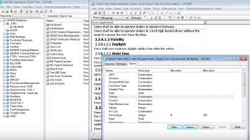

# R
> 2019.12.16 [🚀](../index/index.md) [despace](index.md) → **[Soft](soft.md)**

[TOC]

---

> <small>**R** — англоязычный термин, не имеющий аналога в русском языке. **R** — дословный перевод с английского на русский.</small>

**R** — язык программирования для статистической обработки данных и работы с графикой, а также свободная программная среда вычислений с открытым исходным кодом в рамках проекта GNU. Язык создавался как аналогичный языку S, разработанному в Bell Labs, и является его альтернативной реализацией, хотя между языками есть существенные отличия, но в большинстве своём код на языке S работает в среде R.

 

## Описание
R — мультипарадигмальный интерпретируемый динамически типизируемый язык программирования. Появился в 1993 г., испытал влияние S, Scheme. Работает под ОС Linux, Microsoft Windows и macOS.

Широко используется как статистическое программное обеспечение для анализа данных и фактически стал стандартом для статистических программ.

Язык и среда доступны под лицензией GNU GPL; распространяются в виде исходных кодов, а также откомпилированных приложений под ряд операционных систем: FreeBSD, Solaris и другие дистрибутивы Unix и Linux, Microsoft Windows, Mac OS X.

В R используется интерфейс командной строки, хотя доступны и несколько графических интерфейсов пользователя, например пакет R Commander, RKWard, RStudio, Weka, Rapid Miner, KNIME, а также средства интеграции в офисные пакеты.

Язык поддерживает минимальный набор примитивных типов данных: символьный (character), числовой (numeric), логический (logical) и комплексный (complex). Числовые переменные, помимо обычных чисел, могут принимать специальные значения NaN (Not a Number — «не число») и Inf (Infinity — «бесконечность»). Бесконечность (положительная или отрицательная) получается при выходе результата вычислений за пределы представимого реализацией диапазона, NaN — при операциях с неопределённым результатом. Помимо этих, имеется ещё одно очень важное специальное значение, NA (Not Available — «не доступно»). Оно может быть использовано для фиксации того факта, что соответствующее значение, участвующее в вычислениях, по какой‑либо причине не было получено (достаточно обычная в статистических расчётах ситуация, когда из‑за сбоев в сборе данных некоторые наблюдения остаются без результатов).

Значения примитивных типов могут объединяться в векторы (vector), списки (list), матрицы или массивы (matrix), в том числе многомерные; эти комбинированные типы хранят наборы данных одного и того же примитивного типа. Помимо этого язык содержит понятие факторов (factor) — наборов категориальных или шкальных данных, принимающих строго определённый набор значений. Наконец, могут создаваться таблицы (data frame) — структуры данных, которые для каждой строки (индивида) хранят набор различных (и имеющих разные типы) параметров (признаков). Особенностью R является то, что операции с векторами и матрицами поддерживаются на уровне самого языка, как, например, в APL.

Существует операция извлечения и записи данных (аналог присваивания) «<-», а также обычные операции работы с данными, в том числе арифметические. Доступ по индексу к элементам векторов и массивов осуществляется с помощью квадратных скобок, доступ к атрибутам списков — посредством оператора «$». Имеется минимальный набор обычных конструкций императивного программирования: условный оператор if, циклы while и for. Выражения на R можно описывать как отдельные объекты и вычислять по мере необходимости. На этом же механизме основано описание функций. Имеются встроенные в язык средства применения выражений и функций к векторам и массивам.

Функции R могут объединяться в пакеты — загружаемые модули, которые подключаются к любой программе и предоставляют объединённые в них вычислительные средства. Пакеты для R могут разрабатываться на других языках программирования, в том числе на Си, что позволяет, с одной стороны, скомпенсировать ограниченность изобразительных средств самого языка R, а с другой — при необходимости достигнуть высоких показателей вычислительной производительности.

Сам язык имеет довольно ограниченные и не слишком удобные средства описания данных, но это компенсируется наличием библиотечных средств, которые позволяют загружать в виде таблиц R наборы данных, представленных в большинстве открытых и многих проприетарных форматах. Так, в R могут быть легко загружены таблицы в простом текстовом формате, таблицы Excel различных версий, данные в форматах CSV, XML и многих других.

В целом, как язык программирования, R довольно прост и даже примитивен. Его наиболее сильная сторона — возможность неограниченного расширения с помощью пакетов. В базовую поставку R включен основной набор пакетов, а всего по состоянию на 2019 год доступно более 15 316 пакетов. В R реализованы практически все актуальные средства универсальных статистических вычислений, такие как регрессионный анализ и анализ временных рядов, а также множество специфических алгоритмов для решения узкоспециализированных задач и исследований в отдельных областях.

Ещё одна особенность языка — возможность создания качественной графики типографского уровня, которая может быть экспортирована в распространённые графические форматы и использована для презентаций или публикаций. Имеются готовые пакеты, связывающие R с GUI‑фреймворками (например, основанными на Tcl/Tk) и позволяющие создавать специализированные утилиты статистического анализа с графическим интерфейсом пользователя и отображением результатов в виде графиков и диаграмм.

**Базовый синтаксис**

    x <- c(1,2,3,4,5,6)   # Создать упорядоченную коллекцию
    y <- x^2              # Возвести в квадрат элементы из x
    print(y)              # Вывести y
    [1]  1  4  9 16 25 36
    mean(y)               # Рассчитать среднее арифметическое y; результат — число
    [1] 15.16667
    var(y)                # Рассчитать дисперсию
    [1] 178.9667

 

## Docs & links (TRANSLATEME ALREADY)
|Navigation|
|:--|
|**[FAQ](faq.md)**【**[SCS](scs.md)**·КК, **[SC (OE+SGM)](sc.md)**·КА】**[CON](contact.md)·[Pers](person.md)**·Контакт, **[Ctrl](control.md)**·Упр., **[Doc](doc.md)**·Док., **[EF](ef.md)**·ВВФ, **[Error](error.md)**·Ошибки, **[Event](event.md)**·События, **[FS](fs.md)**·ТЭО, **[HF&E](hfe.md)**·Эрго., **[KT](kt.md)**·КТ, **[Model](model.md)**·Модель, **[N&B](nnb.md)**·БНО, **[Patent](патент.md)**·Пат., **[Project](project.md)**·Проект, **[QM](qm.md)**·БКНР, **[R&D](rnd.md)**·НИОКР, **[SI](si.md)**·СИ, **[Test](test.md)**·ЭО, **[TRL](trl.md)**·УГТ, **[Way](way.md)**·Пути|
|*Sections & pages*|
|**【[Software](soft.md)】**  [ASP](asp.md)・ [Blender](blender.md)・ [C](c.md)・ [Cosmographia](cosmographia.md)・ [DOORS](doors.md)・ [DWG](cad_f.md)・ [GIMP](gimp.md)・ [Git](git.md)・ [IGES](cad_f.md)・ [ISIS](isis.md)・ [JT](cad_f.md)・ [NGT](neogeography_toolkit.md)・ [NX](nx.md)・ [Octave](gnu_octave.md)・ [PDF](pdf.md)・ [Python](python.md)・ [R](r.md)・ [SPICE](spice.md)・ [STEP](cad_f.md)・ [STL](systems_tool_kit.md)・ [SVG](cad_f.md)・ [Syncthing](syncthing.md)・ [SysML](sysml.md)・ [Teamcenter](teamcenter.md)・ [Система управления версиями](vcs.md)・ [ХРИП](adra.md)|

   1. Docs: …
   1. Notable interwikies — …
   1. <https://ru.wikipedia.org/wiki/R_(язык_программирования)>
   1. <https://www.r-project.org/>
