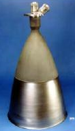

# R-42
> 2019.05.12 [🚀](../index/index.md) [despace](index.md) → [PS](ps.md)

[TOC]

---

**R-42** — 2‑компонентный [двигатель](ps.md) производства [Aerojet Rocketdyne](aerojet_rocketdyne.md).

Характеристики указаны для вакуума и номинальных условий работы в непрерывном режиме.

|*Характеристика*|*[Значение](si.md) <small>(R-42)</small>*|
|:--|:--|
|Габариты, длина × ⌀ среза сопла, ㎜|790 × 390|
|Давление: вход в двигатель, ㎫ (kgf/㎝²)|0.7 ‑ 2.98 (6.9 ‑ 29.3)|
|Давление: камера сгорания, ㎫ (kgf/㎝²)|0.72 (7.1)|
|Давление: срез сопла, ㎫ (kgf/㎝²)| |
|Длительность одного включения, с|3 940|
|[Res.impulse](ing.md), N·s (kgf·s), ≤| |
|Макс. расход, ㎏/s, ≤|0.3|
|Макс. частота включений, Гц| |
|Mass, ㎏, ≤|4.53|
|Массовое соотношение КРТ| |
|Мощность потребляемая, W|46 (при 28 В)|
|Обороты ТНА|—|
|Продукты горения| |
|Раствор пучка, °| |
|Ресурс: количество включений, ≥|134|
|Ресурс: сумм. длит. включений, c, ≥|27 000|
|Ресурс: сумм. импульс, Н·с (кгс·с), ≥| |
|Ресурс: сумм. тяга, Н (кгс), ≥|24 271 000 (2 474 100)|
|Ресурс: топливо, ㎏, ≥|8 100|
|[САС](lifetime.md) в космосе, ч (лет)| |
|Температура: камера сгорания, 10³ К (℃)| |
|Температура: срез сопла, 10³ К (℃)| |
|[Топливо](fuel.md)|[АТ + ММГ](at_plus.md) (R-42);  [АТ + Гидразин](at_plus.md) (R-42 DM)|
|Тяга: номинальная, N (kgf)|890 (90.7)|
|Тяга: отклонение, %| |
|[TRL](trl.md)|9|
|[УИ тяги](isp.md), Н·с/кг (с), ≥|2 970 (303)|
|Число Маха / [Показатель адиабаты](heat_cr.md)| |
|Изображения||

**Примечания:**

   1. Существует в 2 вариациях:
      - **R-42**.
      - **R-42 DM**.

**Применяемость:**

   1. …

 

## Docs & links (TRANSLATEME ALREADY)
|Navigation|
|:--|
|**[FAQ](faq.md)**, **[Cable](cable.md)**·БКС, **[Camera](cam.md)**·Камера, **[Comms](comms.md)**·Радио, **[Contact](contact.md)**·Контакт, **[Control](control.md)**·Упр., **[Doc](doc.md)**·Док., **[Doppler](doppler.md)**·ИСР, **[DS](ds.md)**·ЗУ, **[EB](eb.md)**·ХИТ, **[ECO](ecology.md)**·Экол., **[EF](ef.md)**·ВВФ, **[ElC](elc.md)**·ЭКБ, **[EMC](emc.md)**·ЭМС, **[Error](error.md)**·Ошибки, **[Event](event.md)**·События, **[FS](fs.md)**·ТЭО, **[Fuel](fuel.md)**·Топливо, **[GNC](gnc.md)**·БКУ, **[GS](scs.md)**·НС, **[HF&E](hfe.md)**·Эрго., **[IU](iu.md)**·Гиро., **[KT](kt.md)**·КТЕХ, **[LAG](lag.md)**·ПУC, **[LES](les.md)**·САСП, **[LS](ls.md)**·СЖО, **[LV](lv.md)**·РН, **[MCC](mcc.md)**·ЦУП, **[Model](model.md)**·Модель, **[MSC](sc.md)**·ПКА, **[N&B](nnb.md)**·БНО, **[NR](nr.md)**·ЯР, **[OBC](obc.md)**·ЦВМ, **[OE](oe.md)**·БА, **[Pat.](патент.md)**·Патент, **[Proj.](project.md)**·Проект, **[PS](ps.md)**·ДУ, **[R&D](rnd.md)**·НИОКР, **[Robot](robotics.md)**·Робот, **[Rover](rover.md)**·Ровер, **[RTG](rtg.md)**·РИТЭГ, **[SARC](sarc.md)**·ПСК, **[SE](se.md)**·СЭ, **[Sens.](sensor.md)**·Датч., **[SC](sc.md)**·КА, **[SCS](scs.md)**·КК, **[SGM](sgm.md)**·КММ, **[SI](si.md)**·СИ, **[Soft](soft.md)**·ПО, **[SP](sp.md)**·БС, **[Spaceport](spaceport.md)**·Космодр., **[SPS](sps.md)**·СЭС, **[SRRQ](srrq.md)**·БКНР, **[SSS](sss.md)**·ГЗУ, **[TCS](tcs.md)**·СОТР, **[Test](test.md)**·ЭО, **[Timeline](timeline.md)**·ЦГМ, **[TMS](tms.md)**·ТМС, **[TOR](tor.md)**·ТЗ, **[TRL](trl.md)**·УГТ|
|*Sections & pages*|
|**`Двигательная установка (ДУ):`**  [HTAE](htae.md) ┊ [TALOS](talos.md) ┊ [Баки топливные](fuel_tank.md) ┊ [Варп‑двигатель](warp_drive.md) ┊ [Газовый двигатель](cgt.md) ┊ [Гибридный двигатель](гбрд.md) ┊ [Двигатель Бассарда](bussard_ramjet.md) ┊ [ЖРД](lpr.md) ┊ [ИПТ](ing.md) ┊ [Ионный двигатель](иод.md) ┊ [Как считать топливо?](si.md) ┊ [КЗУ](cinu.md) ┊ [КХГ](cgs.md) ┊ [Номинал](nominal.md) ┊ [Мятый газ](exhsteam.md) ┊ [РДТТ](spr.md) ┊ [Сильфон](сильфон.md) ┊ [СОЗ](соз.md) ┊ [СОИС](соис.md) ┊ [Солнечный парус](солнечный_парус.md) ┊ [ТНА](turbopump.md) ┊ [Топливные мембраны](топливные_мембраны.md) ┊ [Топливные мешки](топливные_мешки.md) ┊ [Топливо](fuel.md) ┊ [Тяговооружённость](ttwr.md) ┊ [ТЯРД](тярд.md) ┊ [УИ](isp.md) ┊ [Фотонный двигатель](фотонный_двигатель.md) ┊ [ЭРД](epsp.md) ┊ [Эффект Оберта](oberth_eff.md) ┊ [ЯРД](ntr.md)|

   1. Docs:
      - [Промо‑спецификации ❐](f/ps/r/r-42_spec1.jpg)
   1. Notable interwikies — …
   1. <http://www.astronautix.com/r/r-42.html>
   1. <http://www.rocket.com/propulsion-systems/bipropellant-rockets>

