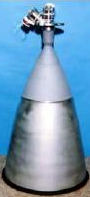

# R-4D
> 2019.05.12 **[🚀](../index/index.md) [despace](index.md)** → **[ДУ](ps.md)**

[TOC]

---

**R-4D** — 2‑компонентный [двигатель](ps.md) производства [Aerojet Rocketdyne](aerojet_rocketdyne.md).

<small>

Характеристики указаны для вакуума и номинальных условий работы в непрерывном режиме.

|*Характеристика*|*[Значение](si.md) <small>(R-4D)</small>*|
|:--|:--|
|Габариты, длина × ∅ среза сопла, мм  | 550 × 280  |
|Давление: вход в двигатель, МПа (кгс/cm²)  | 0.41 ‑ 2.93 (4 ‑ 28.74)  |
|Давление: камера сгорания, МПа (кгс/cm²)  | 0.76 (7.45)  |
|Давление: срез сопла, МПа (кгс/cm²)  |   |
|Длительность одного включения, с  | 3 600  |
|[ИПТ](ing.md), Н·с (кгс·с), не более  |   |
|Макс. расход, кг/с, не более  | 0.158  |
|Макс. частота включений, Гц  |   |
|Масса, кг, не более  | 3.4 (44:1 nozzle),  3.76 (164:1 nozzle),  4.31 (300:1 nozzle)  |
|Массовое соотношение КРТ  | 1.65 (1.0 ‑ 2.4)  |
|Мощность потребляемая, Вт  | 46 (при 28 В)  |
|Обороты ТНА  |—|
|Продукты горения  |   |
|Раствор пучка, °  |  |
|Ресурс: количество включений, не менее  | 20 700  |
|Ресурс: сумм. длит. включений, c, не менее  | 40 850  |
|Ресурс: сумм. импульс, Н·с (кгс·с), не менее  |   |
|Ресурс: сумм. тяга, Н (кгс), не менее  | 20 016 000 (2 040 300)  |
|Ресурс: топливо, кг, не менее  | 6 450  |
|[САС](lifetime.md) в космосе, ч (лет)  |   |
|Температура: камера сгорания, тыс. К (°C)  |   |
|Температура: срез сопла, тыс. К (°C)  |   |
|[Топливо](fuel.md)  |  [АТ + ММГ](at_plus.md)  |
|Тяга: номинальная, Н (кгс)  | 490 (50)  |
|Тяга: отклонение, %  |   |
|[УГТ](trl.md)| 9  |
|[УИ тяги](isp.md), Н·с/кг (с), не менее  | 3 060 (312)  |
|Число Маха / [Показатель адиабаты](heat_cr.md)  |   |
|Изображения  |   |

</small>

 

## Примечания
   1. Разработан в 1966 году.

## Применяемость
Apollo ┊ Cassini ┊ H-II Transfer Vehicle ┊ Orion ┊ Space Shuttle

 

## Docs & links (TRANSLATEME ALREADY)
|…°·•¹²³±×÷≤≥≈≠ ‑ −— ⎆✉ ❐“”’«»✔→✘☐☑├┕┆ 1 lb = 0.453592 kg; 1 g = 9.80665 m/s²|
|:--|
|<small>**[FAQ](faq.md)**, **[Cable](cable.md)**·БКС, **[Camera](camera.md)**·Камера, **[Comms](comms.md)**·Радиосв., **[Contact](contact.md)**·Контакт, **[Control](control.md)**·Управ., **[Doc](doc.md)**·Док., **[Doppler](doppler.md)**·ИСР, **[DS](ds.md)**·ЗУ, **[EB](eb.md)**·ХИТ, **[ECO](ecology.md)**·Экол., **[EF](ef.md)**·ВВФ, **[ElC](elc.md)**·ЭКБ, **[EMC](emc.md)**·ЭМС, **[Errors](error.md)**·Ошибки, **[Events](event.md)**·События, **[FS](fs.md)**·ТЭО, **[Fuel](fuel.md)**·Топливо, **[GNC](gnc.md)**·БКУ, **[GS](scs.md)**·НС, **[HF&E](hfe.md)**·Эргоном., **[IMU](imu.md)**·Гироскоп, **[Incubator](incubator.md)**·Инкуб., **[KT](kt.md)**·КТЕХ, **[LAG](lag.md)**·ПУC, **[LES](les.md)**·САСП, **[LS](ls.md)**·СЖО, **[LV](lv.md)**·РН, **[MAG](mag.md)**·Магнитом., **[MCC](mcc.md)**·ЦУП, **[Model](model.md)**·Модель, **[MSC](sc.md)**·ПКА, **[N&B](nnb.md)**·БНО, **[NR](nr.md)**·ЯР, **[OBC](obc.md)**·ЦВМ, **[OE](oe.md)**·БА, **[Patent](патент.md)**·Патент, **[Project](project.md)**·Проект, **[PS](ps.md)**·ДУ, **[QA](quality.md)**·QA, **[R&D](rnd.md)**·НИОКР, **[RAMS](rams.md)**·НиБ, **[Risk](risk.md)**·Риск, **[Robot](robotics.md)**·Робот, **[Rover](rover.md)**·Планетоход, **[RTG](rtg.md)**·РИТЭГ, **[RW](rw.md)**·ДМ, **[SARC](sarc.md)**·ПСК, **[Sensor](sensor.md)**·Датчик, **[SC](sc.md)**·КА, **[SCS](scs.md)**·КК, **[SGM](sgm.md)**·КММ, **[SI](si.md)**·СИ, **[Soft](soft.md)**·ПО, **[SP](sp.md)**·БС, **[Spaceport](spaceport.md)**·Космодром, **[SPS](sps.md)**·СЭС, **[SSS](sss.md)**·ГЗУ, **[TCS](tcs.md)**·СОТР, **[Test](test.md)**·ЭО, **[Timeline](timeline.md)**·Циклограмма, **[TMS](tms.md)**·ТМС, **[TOR](tor.md)**·ТЗ, **[TRL](trl.md)**·УГТ</small>|
|*Sections & pages*|
|**`Двигательная установка (ДУ):`**  [HTAE](htae.md) ┊ [TALOS](talos.md) ┊ [Баки топливные](fuel_tank.md) ┊ [Варп‑двигатель](warp_drive.md) ┊ [Газовый двигатель](cgt.md) ┊ [Гибридный двигатель](гбрд.md) ┊ [Двигатель Бассарда](bussard_ramjet.md) ┊ [ЖРД](lpr.md) ┊ [ИПТ](ing.md) ┊ [Ионный двигатель](иод.md) ┊ [Как считать топливо?](si.md) ┊ [КЗУ](cinu.md) ┊ [КХГ](cgs.md) ┊ [Номинал](nominal.md) ┊ [Мятый газ](exhsteam.md) ┊ [РДТТ](spr.md) ┊ [Сильфон](сильфон.md) ┊ [СОЗ](соз.md) ┊ [СОИС](соис.md) ┊ [Солнечный парус](солнечный_парус.md) ┊ [ТНА](turbopump.md) ┊ [Топливные мембраны](топливные_мембраны.md) ┊ [Топливные мешки](топливные_мешки.md) ┊ [Топливо](fuel.md) ┊ [Тяговооружённость](ttwr.md) ┊ [ТЯРД](тярд.md) ┊ [УИ](isp.md) ┊ [Фотонный двигатель](фотонный_двигатель.md) ┊ [ЭРД](epsp.md) ┊ [Эффект Оберта](oberth_eff.md) ┊ [ЯРД](ntr.md) |

   1. Docs:
      - [Промо‑спецификации ❐](f/ps/r/r-4d_spec1.jpg)
   1. Notable interwikies — …
   1. <https://en.wikipedia.org/wiki/R-4D>
   1. <http://www.astronautix.com/r/r-4d.html>

