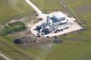
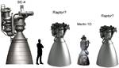

# Raptor
> 2019.05.12 [🚀](../index/index.md) [despace](index.md) → **[ДУ](ps.md)**

[TOC]

---

**Raptor** — семейство 2‑компонентных [двигателей](ps.md) производства [SpaceX](zz_spacex.md).  
Является наследником двигателя [Merlin](merlin.md). В отличие от него работает на топливе <small>[Кислород + Метан](o_plus.md)</small> и имеет полнопоточный закрытый цикл. На 2017 год — единственный в мире двигатель с полнопоточным закрытым циклом.

<small>

Характеристики указаны для вакуума и номинальных условий работы в непрерывном режиме. Режим работы считать установившимся со 2‑й секунды подачи напряжения на электроклапаны.

|*Характеристика*|*[Значение](si.md) <small>(ER40)</small>*|*[Значение](si.md) <small>(ER200)</small>*|*[Значение](si.md) <small>(Raptor 2017‑SL)</small>*|*[Значение](si.md) <small>(Raptor 2017‑V)</small>*|
|:--|:--|:--|:--|:--|
|Габариты, длина × ⌀ среза сопла, mm|3 300 × 1 730|6 400 × 3 870|… × 1 300|… × 2 400|
|Давление: вход в двигатель, МПа (kgf/cm²)|||||
|Давление: камера сгорания, МПа (kgf/cm²)|5.9 (57) - 30.6 (300)|5.9 (57) - 30.6 (300)|||
|Давление: срез сопла, МПа (kgf/cm²)|0.0735 (0.721)|0.09 (0.883)|||
|Длительность одного включения, с|||||
|[Res.impulse](ing.md), N·s (kgf·s), ≤|||||
|Макс. расход, kg/с, ≤|922.5|934.08|486.82|516.58|
|Макс. частота включений, Гц|||||
|Mass, kg, ≤|1 000|2 300|||
|Массовое соотношение КРТ|3.5 ‑ 3.8|3.5 ‑ 3.8|3.5 ‑ 3.8|3.5 ‑ 3.8|
|Мощность потребляемая, W|||||
|Обороты ТНА|—|—|—|—|
|Продукты горения|||||
|Раствор пучка, °|||||
|Ресурс: количество включений, ≥|||||
|Ресурс: сумм. длит. включений, c, ≥|||||
|Ресурс: сумм. импульс, Н·с (кгс·с), ≥||
|Ресурс: сумм. тяга, Н (кгс), ≥|||||
|Ресурс: топливо, kg, ≥|||||
|[САС](lifetime.md) в космосе, ч (лет)|||||
|Температура: камера сгорания, 10³ К (℃)|3 250|3 250|3 250|3 250|
|Температура: срез сопла, 10³ К (℃)|||||
|[Топливо](fuel.md)|<small>[Кислород + Метан](o_plus.md)</small>|<small>[Кислород + Метан](o_plus.md)|<small>[Кислород + Метан](o_plus.md)|<small>[Кислород + Метан](o_plus.md)|
|Тяга: номинальная, N (kgf)|3 285 000  (334 860)|3 500 000  (356 770)|1 700 000  (173 290)|1 900 000  (193 680)|
|Тяга: отклонение, % |20 ‑ 100|20 ‑ 100|||
|[TRL](trl.md)|3|3|6|6|
|[УИ тяги](isp.md), Н·с/кг (с), ≥|3 561 (363)|3 747 (382)|3 492 (356)|3 678 (375)|
|Число Маха / [Показатель адиабаты](heat_cr.md)|||||

</small>

 

## Примечания
   1. Существует в 4 вариациях:
      - **ER40** — базовая версия, работает и в атмосфере и в вакууме.
      - **ER200** — вариант ER40 для работы в вакууме.
      - **Raptor 2017‑SL** — разработка 2017 года, работает и в атмосфере и в вакууме.
      - **Raptor 2017‑V** — вариант 2017 для работы в вакууме.
   1. **[1]** — …

|Тестовая площадка двигателя Raptor, 2017.01.30  [Источник 1 ⎆](https://www.reddit.com/r/engineteststands/comments/43lmbn/spacexs_raptor_test_stand_under_construction_at/), [Источник 2 ⎆](http://pictures.jtbuice.com/SpaceX-2/McGregor-Flyover-1-30-2016/)|Сравнение [BE‑4](be_4.md), [Raptor](raptor.md), Merlin 1D|
|:--|:--|
|||

## Применяемость
   1. [BFR](bfr.md)
   1. [ITC](itc.md)

 

## Docs & links (TRANSLATEME ALREADY)
|Navigation|
|:--|
|<small>**[FAQ](faq.md)**, **[Cable](cable.md)**·БКС, **[Camera](cam.md)**·Камера, **[Comms](comms.md)**·Радио, **[Contact](contact.md)**·Контакт, **[Control](control.md)**·Упр., **[Doc](doc.md)**·Док., **[Doppler](doppler.md)**·ИСР, **[DS](ds.md)**·ЗУ, **[EB](eb.md)**·ХИТ, **[ECO](ecology.md)**·Экол., **[EF](ef.md)**·ВВФ, **[ElC](elc.md)**·ЭКБ, **[EMC](emc.md)**·ЭМС, **[Error](error.md)**·Ошибки, **[Event](event.md)**·События, **[FS](fs.md)**·ТЭО, **[Fuel](fuel.md)**·Топливо, **[GNC](gnc.md)**·БКУ, **[GS](scs.md)**·НС, **[HF&E](hfe.md)**·Эрго., **[IU](iu.md)**·Гиро., **[KT](kt.md)**·КТЕХ, **[LAG](lag.md)**·ПУC, **[LES](les.md)**·САСП, **[LS](ls.md)**·СЖО, **[LV](lv.md)**·РН, **[MCC](mcc.md)**·ЦУП, **[Model](model.md)**·Модель, **[MSC](sc.md)**·ПКА, **[N&B](nnb.md)**·БНО, **[NR](nr.md)**·ЯР, **[OBC](obc.md)**·ЦВМ, **[OE](oe.md)**·БА, **[Pat.](патент.md)**·Патент, **[Project](project.md)**·Проект, **[PS](ps.md)**·ДУ, **[R&D](rnd.md)**·НИОКР, **[SRRQ](srrq.md)**·БКНР, **[Robot](robotics.md)**·Робот, **[Rover](rover.md)**·Планетоход, **[RTG](rtg.md)**·РИТЭГ, **[SARC](sarc.md)**·ПСК, **[Sensor](sensor.md)**·Датчик, **[SC](sc.md)**·КА, **[SCS](scs.md)**·КК, **[SGM](sgm.md)**·КММ, **[SI](si.md)**·СИ, **[Soft](soft.md)**·ПО, **[SP](sp.md)**·БС, **[Spaceport](spaceport.md)**·Космодром, **[SPS](sps.md)**·СЭС, **[SSS](sss.md)**·ГЗУ, **[TCS](tcs.md)**·СОТР, **[Test](test.md)**·ЭО, **[Timeline](timeline.md)**·ЦГМ, **[TMS](tms.md)**·ТМС, **[TOR](tor.md)**·ТЗ, **[TRL](trl.md)**·УГТ</small>|
|*Sections & pages*|
|**`Двигательная установка (ДУ):`**  [HTAE](htae.md) ┊ [TALOS](talos.md) ┊ [Баки топливные](fuel_tank.md) ┊ [Варп‑двигатель](warp_drive.md) ┊ [Газовый двигатель](cgt.md) ┊ [Гибридный двигатель](гбрд.md) ┊ [Двигатель Бассарда](bussard_ramjet.md) ┊ [ЖРД](lpr.md) ┊ [ИПТ](ing.md) ┊ [Ионный двигатель](иод.md) ┊ [Как считать топливо?:](si.md) ┊ [КЗУ](cinu.md) ┊ [КХГ](cgs.md) ┊ [Номинал](nominal.md) ┊ [Мятый газ](exhsteam.md) ┊ [РДТТ](spr.md) ┊ [Сильфон](сильфон.md) ┊ [СОЗ](соз.md) ┊ [СОИС](соис.md) ┊ [Солнечный парус](солнечный_парус.md) ┊ [ТНА](turbopump.md) ┊ [Топливные мембраны](топливные_мембраны.md) ┊ [Топливные мешки](топливные_мешки.md) ┊ [Топливо](fuel.md) ┊ [Тяговооружённость](ttwr.md) ┊ [ТЯРД](тярд.md) ┊ [УИ](isp.md) ┊ [Фотонный двигатель](фотонный_двигатель.md) ┊ [ЭРД](epsp.md) ┊ [Эффект Оберта](oberth_eff.md) ┊ [ЯРД](ntr.md)|

   1. Docs: …
   1. Notable interwikies — …
   1. <https://en.wikipedia.org/wiki/Raptor_(rocket_engine_family)>
   1. <https://en.wikipedia.org/wiki/SpaceX_rocket_engines>
   1. <https://ru.wikipedia.org/wiki/Raptor_(ракетный_двигатель)>
   1. 2017.06.28 [Хабр: Подробный разбор ЖРД «Raptor» ⎆](https://geektimes.ru/post/290549/) — [archive ❐](f/archive/20170628_1.pdf) of 2019.02.13)
   1. 2017.10.18 [Всё, что известно о двигателях Раптор и даже больше ⎆](https://elonmusk.su/vse-chto-izvestno-o-dvigatelyakh-raptor-i-dazhe-bolshe/) — [archive ❐](f/archive/20171018_1.pdf) of 2019.02.13)

