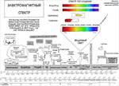
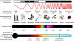

# Диапазоны частот
> 2019.05.12 [🚀](../index/index.md) [despace](index.md) → **[Радиосвязь](comms.md)**

[TOC]

---

> <small>**Диапазон частот** — русскоязычный термин. **Radio frequency (RF)** — англоязычный эквивалент.</small>

**Диапазон частот** — полоса излучаемых источником частот, которой зачастую присвоено условное наименование, важное понятие радиотехники, а также физико‑технических дисциплин в целом.

Это понятие имеет общий характер, то есть можно говорить или о диапазоне частот какого‑либо конкретного излучателя (природного или искусственного происхождения), или о диапазоне, выделенном какой‑то радиослужбе, или, например, об обобщённой разбивке всей полосы радиочастот. Диапазоны описываются [регламентом радиосвязи](rr.md).

## Типовые диапазоны
**Таблица.** Диапазоны частот для радиокомплексов, применяемых на КА.

|*Обозн.*|*Этимология*|*Частоты,  ㎓*|*<small>Длина  волны, ㎝</small>*|*Примечания*|
|:--|:--|:--|:--|:--|
|**УКВ / VHF**|en. *very high frequency*|0.05 ‑ 0.33|90 ‑ 600|Ультракороткие волны.  • УКВ по регламенту допустим для связи КА‑КА.  • 121.5, 243 ㎒ — сигнал бедствия, вещание запрещено.  • 406 - 406.1 — для радиопеленгации|
|**ДМВ / UHF**|en. *ultra high frequency*|0.3 ‑ 3|10 ‑ 100|Дециметровые волны.  • 1 420.40575 ㎒, 21.1 ㎝ — нейтральный водород.|
|**L**|en. *Long*|1 ‑ 2|15 ‑ 30||
|**S**|en. *Short*|2 ‑ 4|7.5 ‑ 15|2 ㎓ по регламенту допустимо для связи КА‑КА:  • 2 025 ‑ 2 100 ㎒ Земля‑космос, космос‑космос;  • 2 110 ‑ 2 120 ㎒ дальний космос;  • 2 200 ‑ 2 290 ㎒ Земля‑космос, космос‑космос;  • 2 290 ‑ 2 300 ㎒ дальний космос|
|**C**|en. *Compromise*|4 ‑ 8|3.75 ‑ 7.5||
|**X**||8 ‑ 12|2.5 ‑ 3.75|Управление оружием, ракетами, морские радары, погода, картографирование среднего разрешения; в США 10 525 ± 25 ㎒ используется в РЛС аэропортов.  • Для связи КА-Земля разрешена полоса в 10 ㎒;  • 8 400 ‑ 8 450 ㎒ для дальнего космоса;  • 8 450 ‑ 8 500 ㎒ для ближнего космоса.|
|**Ku**|en. *under K*|12 ‑ 18|1.67 ‑ 2.5||
|**K**|нем. *kurz* — «короткий»|18 ‑ 27|1.11 ‑ 1.67|Использование ограничено из‑за сильного поглощения водяным паром, поэтому используются Ku и Ka.|
|**Ka**|en. *above K*|27 ‑ 40|0.75 ‑ 1.11||
|<small>**Видимое  излучение**</small>||385k ‑ 790k|||

**Сверхвысокие частоты (СВЧ)** — этот термин может означать:

   - диапазон частот микроволнового излучения — 300 ㎒ ‑ 300 ㎓;
   - диапазон частот сантиметровых волн — 3 ‑ 30 ㎓.

**Ви́димое излуче́ние** — электромагнитные волны, воспринимаемые человеческим глазом. Чувствительность человеческого глаза к электромагнитному излучению зависит от длины волны (частоты) излучения, при этом максимум чувствительности приходится на 555 нм (540 ㎔), в зелёной части спектра. Поскольку при удалении от точки максимума чувствительность спадает до нуля постепенно, указать точные границы спектрального диапазона видимого излучения невозможно. Обычно в качестве коротковолновой границы принимают участок 380 ‑ 400 нм (790 ‑ 750 ㎔), а в качестве длинноволновой — 760 ‑ 780 нм (395 ‑ 385 ㎔). Электромагнитное излучение с такими длинами волн также называется видимым светом, или просто светом (в узком смысле этого слова).

Не всем цветам, которые различает человеческий глаз, соответствует какое‑либо монохроматическое излучение. Такие оттенки, как розовый, бежевый или пурпурный образуются только в результате смешения нескольких монохроматических излучений с различными длинами волн.

Видимое излучение также попадает в «оптическое окно», область спектра электромагнитного излучения, практически не поглощаемого земной атмосферой. Чистый воздух рассеивает синий свет сильнее, чем свет с бо́льшими длинами волн (в красную сторону спектра), поэтому полуденное небо выглядит голубым.

Многие виды животных способны видеть излучение, не видимое человеку, т.е. не входящее в видимый диапазон. Например, пчёлы и многие насекомые видят свет в ультрафиолетовом диапазоне, что помогает им находить нектар на цветах. Растения, опыляемые насекомыми, оказываются в более выгодном положении с точки зрения продолжения рода, если они ярки именно в ультрафиолетовом спектре. Птицы также способны видеть ультрафиолетовое излучение (300 ‑ 400 нм), а некоторые виды имеют даже метки на оперении для привлечения партнёра, видимые только в ультрафиолете.

Считается, что определённые цвета находятся в определённых пределах длин волн. Это иллюстрирует нижеприведённая таблица.

**Таблица.** Длины световых волн

|*Название цвета*|*Длина волны, нм*|
|:--|:--|
|Фиолетовый (сине‑фиолетовый)|390 ‑ 440|
|Синий|440 ‑ 480|
|Голубой (сине‑зелёный)|480 ‑ 510|
|Зелёный|510 ‑ 550|
|Жёлто‑зелёный|550 ‑ 575|
|Жёлтый|575 ‑ 585|
|Оранжевый|585 ‑ 620|
|Красный|620 ‑ 770|

## Скорость
Скорость передачи информации с КА на Землю определяется частотой и шириной выделенной полосы; мощность передатчика влияет только на чёткость приёма сигнала. См. также [Битрейт](bitrate.md).

|*Дальность*|*Диапазон*|*Скорость,  кбит/с (Мбит/с)*|*Антенна*|*Примечание*|
|:--|:--|:--|:--|:--|
|**Луна**|X|4 096 (4)|CНА|Полоса 10 ㎒.|
||X|10 240 (10)|ОНА|Полоса 10 ㎒.|
||X|19 350 (18.9)|ОНА|Полоса 10 ㎒.|
||Ka|102 400 (100)|ОНА||
||||||
|**Венера**|X|32 ‑ 256|ОНА|Полоса 10 ㎒.|
||X|64 ‑ 512|ОНА|Полоса 10 ㎒.|
||Ka|26 624 (26)|ОНА||
||ЛКС|56 320 (55)|||

## Инфографика

|||
|:--|:--|
|||

 

## Docs & links (TRANSLATEME ALREADY)
|Navigation|
|:--|
|**[FAQ](faq.md)**, **[Cable](cable.md)**·БКС, **[Camera](cam.md)**·Камера, **[Comms](comms.md)**·Радио, **[Contact](contact.md)**·Контакт, **[Control](control.md)**·Упр., **[Doc](doc.md)**·Док., **[Doppler](doppler.md)**·ИСР, **[DS](ds.md)**·ЗУ, **[EB](eb.md)**·ХИТ, **[ECO](ecology.md)**·Экол., **[EF](ef.md)**·ВВФ, **[ElC](elc.md)**·ЭКБ, **[EMC](emc.md)**·ЭМС, **[Error](error.md)**·Ошибки, **[Event](event.md)**·События, **[FS](fs.md)**·ТЭО, **[Fuel](fuel.md)**·Топливо, **[GNC](gnc.md)**·БКУ, **[GS](scs.md)**·НС, **[HF&E](hfe.md)**·Эрго., **[IU](iu.md)**·Гиро., **[KT](kt.md)**·КТЕХ, **[LAG](lag.md)**·ПУC, **[LES](les.md)**·САСП, **[LS](ls.md)**·СЖО, **[LV](lv.md)**·РН, **[MCC](mcc.md)**·ЦУП, **[Model](model.md)**·Модель, **[MSC](sc.md)**·ПКА, **[N&B](nnb.md)**·БНО, **[NR](nr.md)**·ЯР, **[OBC](obc.md)**·ЦВМ, **[OE](oe.md)**·БА, **[Pat.](патент.md)**·Патент, **[Proj.](project.md)**·Проект, **[PS](ps.md)**·ДУ, **[R&D](rnd.md)**·НИОКР, **[Robot](robotics.md)**·Робот, **[Rover](rover.md)**·Ровер, **[RTG](rtg.md)**·РИТЭГ, **[SARC](sarc.md)**·ПСК, **[Sensor](sensor.md)**·Датчик, **[SC](sc.md)**·КА, **[SCS](scs.md)**·КК, **[SGM](sgm.md)**·КММ, **[SI](si.md)**·СИ, **[Soft](soft.md)**·ПО, **[SP](sp.md)**·БС, **[Spaceport](spaceport.md)**·Космодр., **[SPS](sps.md)**·СЭС, **[SRRQ](srrq.md)**·БКНР, **[SSS](sss.md)**·ГЗУ, **[TCS](tcs.md)**·СОТР, **[Test](test.md)**·ЭО, **[Timeline](timeline.md)**·ЦГМ, **[TMS](tms.md)**·ТМС, **[TOR](tor.md)**·ТЗ, **[TRL](trl.md)**·УГТ|
|*Sections & pages*|
|**··• [External factors (EF)](ef.md) •··**  [Astro.object](aob.md) ┊ [Atmosphere](atmosphere.md) ┊ [Atmosphere of Earth](earth.md) ┊ [Cosmic rays](cr.md) ┊ [EMI](emi.md) ┊ [Grav.waves](gravwave.md) ┊ [Ion.radiation](ion_rad.md)┊ [Radio frequency](rf.md) ┊ [Solar phenomena](solar_ph.md) ┊ [Space debris](sdeb.md) ┊ [Standart conditions](sctp.md) ┊ [Time](time.md) ┊ [VA radiation belts](varb.md)|
|**`Радиосвязь:`**  [CCSDS](ccsds.md) ┊ [Антенна](antenna.md) ┊ [АФУ](afdev.md) ┊ [Битрейт](bitrate.md) ┊ [ВОЛП](ofts.md) ┊ [ДНА](дна.md) ┊ [Диапазоны частот](rf.md) ┊ [Зрение](view.md) ┊ [Интерферометр](interferometer.md) ┊ [Информация](info.md) ┊ [КНД](directivity.md) ┊ [Код Рида‑Соломона](rsco.md) ┊ [КПДА](antenna_ap.md) ┊ [КСВ](swr.md) ┊ [КУ](ку.md) ┊ [ЛКС, АОЛС, FSO](fso.md) ┊ [Несущий сигнал](carrwave.md) ┊ [ПНА, ПОНА, ПСНА](aiad.md) ┊ [Помехи](emi.md) (EMI, RFI) ┊ [Последняя миля](last_mile.md) ┊ [Регламент радиосвязи](rr.md) ┊ [СИТ](etedp.md) ┊ [Фидер](feeder.md)  • • •  **РФ:** [БА КИС](ба_кис.md) (21) ┊ [БРК](brk_lav.md) (12) ┊ [РУ ПНИ](ру_пни.md) () ┊ [HSXBDT](hsxbdt.md) (1.8) ┊ [CSXBT](csxbt.md) (0.38) ┊ [ПРИЗЫВ-3](prizyv_3.md) (0.17) *([ПРИЗЫВ-1](prizyv_1.md) (0.075))*|

   1. Docs: …
   1. Notable interwikies — …
   1. <https://ru.wikipedia.org/wiki/Видимое_излучение>
   1. <https://ru.wikipedia.org/wiki/Диапазон_частот>
   1. <https://ru.wikipedia.org/wiki/Радиолокационная_станция>
   1. <https://ru.wikipedia.org/wiki/X-диапазон>
   1. <https://ru.wikipedia.org/wiki/Тетрахроматия>
   1. <https://ru.wikipedia.org/wiki/Радиолиния_нейтрального_водорода>
   1. 2017.07.14 <https://geektimes.ru/post/291095/>

