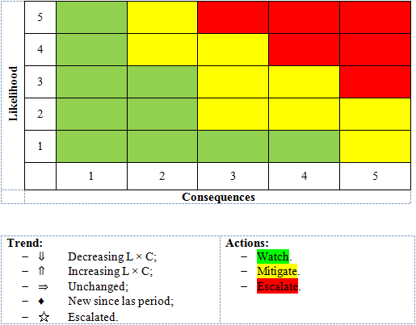
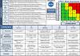

# Риск
> 2019.05.12 ┊ **🚀 [despace](index.md)** → [Качество](quality.md), [КТЕХ](kt.md), **[Риск](risk.md)**

[TOC]

---

> <small>*Термины:* **Риск** — русскоязычный термин. **Risk** — англоязычный эквивалент.</small>

**Риск** *(от лат. resecō — «отсекать», «сокращать» или др.-греч. ῥιζικόν — «опасность»)* — сочетание вероятности и последствий наступления неблагоприятных событий.

## Описание
   - **Анализ рисков** — процедуры выявления факторов рисков и оценки их значимости; по сути, анализ вероятности того, что произойдут определённые нежелательные события и отрицательно повлияют на достижение целей проекта. Анализ рисков включает оценку рисков и методы снижения рисков или уменьшения связанных с ним неблагоприятных последствий.
   - **Оценка рисков** — определение количественным/качественным способом величины (степени) рисков.
   - **Continuous Risk Management (CRM)** — это жизненный цикл выявления и управления рисками.

В общем и целом надо выявить (придумать, спросить и т.д.) какие существуют риски, определить как они влияют на проект, что с этим надо делать. После чего заполнить табличку и периодически её обновлять:

|**Таблица.** Риски КК |
|:--|
|   |

Рисунки.

| Общий вид  | Методика определения В×П  |
|:--|:--|
|   | [  [ ❐](f/risk/risk_lxc.png) |

## Возможные риски КК и КА

**Основные:**

   1. Installation timing and accessibility
   1. Vibration effects
   1. G‑loads
   1. Manufacturing for Flight
   1. Converter performance
   1. Efficiency Tradeoffs
   1. Design Requirements/Constraints
   1. Failure impacts to operations
   1. Power interruptions/failures
   1. Mass
   1. Communications
   1. Schedule/timeline
   1. Material composition
   1. Conversion
   1. Compatibility
   1. Heat transfer
   1. Integration
   1. Load tolerance
   1. Effects of waste heat
   1. Deviate from goals
   1. Mission objective tradeoff
   1. Environments

**Второстепенные:**

   1. Unrealistic schedule estimates or allocation
   1. Unrealistic cost estimates or budget allocation
   1. Inadequate staffing or skills
   1. Uncertain or inadequate contractor capability
   1. Uncertain or inadequate vendor capability
   1. Insufficient production capacity
   1. Operational hazards
   1. Unprecedented efforts without estimates
   1. Poorly defined requirements
   1. No bidirectional traceability of requirements
   1. Infeasible design
   1. Inadequate configuration management
   1. Inadequate test planning
   1. Inadequate quality assurance
   1. Inconsistent or incomplete requirements
   1. Inadequate design
   1. Workmanship issues
   1. Inadequate accounting of environmental effects
   1. Software errors
   1. Inadequate analyses

 

## Классификация проектных рисков
Зная конкретные характеристики риска, можно провести классификацию рисков.

Таблица. Основные виды рисков, определенных на основе функциональных признаков.

|*Классификационный признак*|*Вид рисков*|
|:--|:--|
| Характер учёта | Внешние;  Внутренние |
| Источник возникновения | Статические (чистые);  Динамические (спекулятивные) |
| Влияние на затраты на управление | Единичные;  Портфельные |
| Возможности диверсификации | Систематические (недиверсифицируемые);  Несистематические (диверсифицируемые) |
| Влияние на стоимость | Несущественные;  Существенные |
| Возможность страхования | Нестрахуемые;  Страхуемые |
| Управляемость | Полностью управляемые;  Частично управляемые;  Неуправляемые |

**Внешние риски** непосредственно не связаны с деятельностью компании. На их уровень влияет большое количество факторов, в т.ч.:

   - факторы прямого воздействия (поставщики, потребители, конкуренты, профсоюзы, государственные органы):
   - факторы косвенного воздействия (политические, экономические, демографические, социальные и др.).

**Внутренние риски** обусловлены деятельностью самой компании и её стейкхолдеров (заинтересованных лиц). На их уровень влияют:

   - качество управления;
   - уровень специализации;
   - уровень производительности труда;
   - уровень техники безопасности;
   - эффективность логистических схем;
   - недооценка конкурентов;
   - ошибочная ценовая политика и др.

**Статические (чистые) риски** характерны тем, что всегда обусловливают убытки реализации проекта. Эти риски обладают относительно постоянным характером проявления, имея при этом стабильную и устойчивую динамику основных ключевых экономических показателей. Их также называют чистыми рисками, потому что они отражают возможность получения отрицательного финансового результата. Основными факторами статических рисков являются:

   - негативное воздействие результатов стихийных бедствий (пожаров, землетрясений, наводнений и т.п.);
   - угроза собственности третьих лиц (например, вынужденное прекращение деятельности основного поставщика);
   - несчастные случаи (потеря вследствие смерти или недееспособности ключевых сотрудников компании).

Риски оцениваются вероятностью риска возникновения убытков (потерь) и размером этих убытков.

**Динамические (спекулятивные) риски** означают возможность получения как положительного, так и отрицательного результата реализации проекта, т.е. обеспечивают как дополнительную прибыль, так и чистые убытки (потери). Для этих рисков характерно наличие следующих возможных исходов: появление отрицательного результата, сохранение ситуации в прежнем состоянии и появление положительного результата. Наиболее ярко динамические риски проявляются в областях реализации проекта, которые зависят от рыночной конъюнктуры (изменение курса валют, изменение курсовой стоимости акций, изменение стоимости деривативов, изменение учётной ставки ЦБ РФ и др.).

**Единичные риски** возникают тогда, когда компания осуществляет анализ и оценку проектных рисков по отдельному виду деятельности (например, производственной), вне связи с другими видами деятельности (финансовой и инвестиционной), без учёта изменения доходности портфеля рисков в целом.

**Портфельные риски** учитываются в том случае, когда компания разрабатывает и управляет различными портфелями своих проектов. В этом случае риск портфеля связан с общим ухудшением его качества и показывает возможность убытков (потерь) при вложении в определённый проект по сравнению с другими проектами.

**Систематические (недиверсифицируемые) риски** возникают для всех участников бизнес‑деятельности. Они, как правило, определяются сменой стадий производственно‑экономического цикла, уровнем платёжеспособного спроса, изменениями налогового законодательства и другими факторами, на которые компания повлиять не может. Например, к систематическим рискам следует отнести риски изменения рыночных цен (обменные курсы иностранных валют, ставки процента и т.п.), которые влияют на изменение прибыли.

**Несистематические (диверсифицируемые) риски** характерны для каждого конкретного проекта. Они связаны с низкой эффективностью управления (компетенцией персонала), усилением конкуренции на данном сегменте рынка, нерациональной структурой капитала компании, а также другими факторами, негативных последствий которых можно в существенной степени избежать при повышении общего уровня корпоративного управления. Например, компания может осуществлять операции хеджирования с тем, чтобы регулировать волатильность показателей прибыли или убытка. В таблице ниже приведены некоторые примеры систематических и несистематических рисков.

Таблица. Некоторые виды систематических и несистематических рисков

|*Примеры систематического риска*|*Примеры несистематического риска*|
|:--|:--|
| Рост валового внутреннего продукта (ВВП) происходит более высокими темпами, чем ожидалось | Строительство нового завода обходится дороже, чем предполагалось |
| Процентные ставки растут | Забастовка рабочих на заводе |
| Растет курс обмена национальной валюты | Партию продукции приходится уничтожить из‑за несоответствия требованиям безопасности |
| Темпы инфляции снижаются | Компания‑конкурент сворачивает свою деятельность |
| Наблюдается рост мировых цен на нефть | Запас нефти в пробуренной скважине не соответствует ожидаемым параметрам |

**Несущественные риски** обусловливают убытки (потери) от бизнес‑деятельности в пределах значений риска (уровня приемлемости), при которых сохраняется высокий уровень эффективности бизнеса. Это допустимый риск потери части прибыли (дохода), при котором проект может быть конкурентоспособным.

**Существенные риски** обуславливают убытки (потери), которые значительно превышают прогнозируемую прибыль (доход) и могут привести к значительному уменьшению стоимости проекта и компании в целом.

**Нестрахуемые риски** — те риски, которые не берутся страховать страховые компании. Основными факторами (событиями) нестрахуемых рисков, например, являются передача сотрудниками компании коммерческой информации конкурентам. В случае наступления нестрахуемых рисков потери возмещаются за счёт собственного капитала и специально создаваемых резервных фондов компании, т.е. используется так называемое самострахование.

**Страхуемые риски** — те, по которым проводится страхование. Основными факторами (событиями) страхового риска являются пожары и другие стихийные бедствия; порча и уничтожение продукции при транспортировке; невыполнение обязательств субподрядчиков; приостановка деловой активности компании; смерть или заболевание руководителя или ведущих сотрудников и др.

**Полностью управляемые риски** — условия возникновения, причины и следствия, вероятность и тяжесть последствий которых известны, существуют известные и апробированные многократно в деятельности конкретного предприятия методы управления.

**Частично управляемые риски** — идентификация которых не является абсолютно точной, количественный анализ вызывает затруднения, методы управления известны, но не получили широкого применения на данном предприятии или у данной проектной команды.

**Неуправляемые риски** — условия возникновения которых неизвестны, апробированных мер противодействия не существует.

Такая классификация позволяет лицу, принимающему решения, определиться с приоритетами при управлении рисками. Очевидно, что частично управляемые риски нуждаются в дальнейшем изучении, идентификация же и анализ неуправляемых рисков с позиций приемлемого риска являются чересчур дорогостоящими и длительными действиями и потому нецелесообразны.

 

## Docs & links (TRANSLATEME ALREADY)
|…°·•¹²³±×÷≤≥≈≠ ‑ −— ⎆✉ ❐“”’«»✔→✘☐☑├┕┆ 1 lb = 0.453592 kg; 1 g = 9.80665 m/s²|
|:--|
|<small>**[FAQ](faq.md)**, **[Cable](cable.md)**·БКС, **[Camera](camera.md)**·Камера, **[Comms](comms.md)**·Радиосв., **[Contact](contact.md)**·Контакт, **[Control](control.md)**·Управ., **[Doc](doc.md)**·Док., **[Doppler](doppler.md)**·ИСР, **[DS](ds.md)**·ЗУ, **[EB](eb.md)**·ХИТ, **[ECO](ecology.md)**·Экол., **[EF](ef.md)**·ВВФ, **[ElC](elc.md)**·ЭКБ, **[EMC](emc.md)**·ЭМС, **[Errors](error.md)**·Ошибки, **[Events](event.md)**·События, **[FS](fs.md)**·ТЭО, **[Fuel](fuel.md)**·Топливо, **[GNC](gnc.md)**·БКУ, **[GS](scs.md)**·НС, **[HF&E](hfe.md)**·Эргоном., **[IMU](imu.md)**·Гироскоп, **[Incubator](incubator.md)**·Инкуб., **[KT](kt.md)**·КТЕХ, **[LAG](lag.md)**·ПУC, **[LES](les.md)**·САСП, **[LS](ls.md)**·СЖО, **[LV](lv.md)**·РН, **[MAG](mag.md)**·Магнитом., **[MCC](mcc.md)**·ЦУП, **[Model](model.md)**·Модель, **[MSC](sc.md)**·ПКА, **[N&B](nnb.md)**·БНО, **[NR](nr.md)**·ЯР, **[OBC](obc.md)**·ЦВМ, **[OE](oe.md)**·БА, **[Patent](патент.md)**·Патент, **[Project](project.md)**·Проект, **[PS](ps.md)**·ДУ, **[QA](quality.md)**·QA, **[R&D](rnd.md)**·НИОКР, **[RAMS](rams.md)**·НиБ, **[Risk](risk.md)**·Риск, **[Robot](robotics.md)**·Робот, **[Rover](rover.md)**·Планетоход, **[RTG](rtg.md)**·РИТЭГ, **[RW](rw.md)**·ДМ, **[SARC](sarc.md)**·ПСК, **[Sensor](sensor.md)**·Датчик, **[SC](sc.md)**·КА, **[SCS](scs.md)**·КК, **[SGM](sgm.md)**·КММ, **[SI](si.md)**·СИ, **[Soft](soft.md)**·ПО, **[SP](sp.md)**·БС, **[Spaceport](spaceport.md)**·Космодром, **[SPS](sps.md)**·СЭС, **[SSS](sss.md)**·ГЗУ, **[TCS](tcs.md)**·СОТР, **[Test](test.md)**·ЭО, **[Timeline](timeline.md)**·Циклограмма, **[TMS](tms.md)**·ТМС, **[TOR](tor.md)**·ТЗ, **[TRL](trl.md)**·УГТ</small>|
|*Sections & pages*|
|**`Риск:`**  [Критичные элементы](sens_elem.md) |

**Docs:**

   1. [Оценка рисков в проекте «Венера‑Д» ❐](f/risk/20180322_venera-d_risk_summary_briefing.djvu) (2018.03.22, презентация)
   1. Шаблоны: [таблица рисков ❐](f/risk/risks_summary.docx), [карточка риска ❐](f/risk/risk_card_template.docx)
   1. [NASA Risk management handbook ❐](f/risk/nasa_sp_2011_3422.pdf)
   1. [S3001: Guidelines for Risk Management ❐](f/risk/s3001_guidelines_for_risk_management.pdf)

**Links:**

   1. Notable interwikies — …
   1. <https://en.wikipedia.org/wiki/Risk_management>
   1. <https://ru.wikipedia.org/wiki/Управление_рисками>
   1. [ГОСТ ИСО 31010](gost_iso_31010.md) «Менеджмент риска. Методы оценки риска».
   1. 2018.11.10 [Хабр: Управление рисками — почему процедуры так редко работают?](https://habr.com/ru/post/429356/) — [archive ❐](f/archive/20181110_1.pdf) of 2019.04.22)
   1. 2009.03.22 [Хабр: Немного теории об управлении рисками ⎆](https://habr.com/ru/post/55105/) — [archive ❐](f/archive/20090322_1.pdf) of 2019.01.30)
   1. <https://studme.org/1970070521055/menedzhment/klassifikatsiya_proektnyh_riskov>
