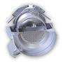

# RIT‑10
> 2019.05.12 [🚀](../index/index.md) [despace](index.md) → [PS](ps.md)

[TOC]

---

**RIT 10 EVO** — электроракетный [двигатель](ps.md) производства [OPC LAM](zz_opc_lam.md).

Характеристики указаны для вакуума и номинальных условий работы в непрерывном режиме.

|*Характеристика*|*[Значение](si.md) <small>(RIT‑10)</small>*|*[Значение](si.md) <small>(RIT‑10)</small>*|*[Значение](si.md) <small>(RIT‑10)</small>*|
|:--|:--|:--|:--|
|Габариты, длина × ⌀ среза сопла, ㎜|186 × 134|186 × 134|186 × 134|
|Давление: вход в двигатель, ㎫ (kgf/㎝²)| | | |
|Давление: камера сгорания, ㎫ (kgf/㎝²)| | | |
|Давление: срез сопла, ㎫ (kgf/㎝²)| | | |
|Длительность одного включения, с| | | |
|[Res.impulse](ing.md), N·s (kgf·s), ≤| | | |
|Макс. расход, ㎏/s, ≤| | | |
|Макс. частота включений, Гц| | | |
|Mass, ㎏, ≤|1.8|1.8|1.8|
|Массовое соотношение КРТ| | | |
|Мощность потребляемая, W|145|435|760|
|Обороты ТНА|—|—|—|
|Продукты горения| | | |
|Раствор пучка, °|15|15|15|
|Ресурс: количество включений, ≥|10 000|10 000|10 000|
|Ресурс: сумм. длит. включений, c, ≥|72 000 000  <small>(20 000 h / 2.3 г)</small>|72 000 000  <small>(20 000 h / 2.3 г)</small>|72 000 000  <small>(20 000 h / 2.3 г)</small>|
|Ресурс: сумм. импульс, Н·с (кгс·с), ≥| |
|Ресурс: сумм. тяга, Н (кгс), ≥|1 100 000  (112 130)|1 100 000  (112 130)|1 100 000  (112 130)|
|Ресурс: топливо, ㎏, ≥| | | |
|[САС](lifetime.md) в космосе, ч (лет)| | | |
|Температура: камера сгорания, 10³ К (℃)| | | |
|Температура: срез сопла, 10³ К (℃)| | | |
|[Топливо](fuel.md)|[Ксенон](ксенон.md) **⁽¹⁾**|[Ксенон](ксенон.md) **⁽¹⁾**|[Ксенон](ксенон.md) **⁽¹⁾**|
|Тяга: номинальная, N (kgf)|0.005 (0.0005)|0.015 (0.0015)|0.025 (0.0025)|
|Тяга: отклонение, N (kgf)| | | |
|[TRL](trl.md)|9 **⁽¹⁾**|9 **⁽¹⁾**|9 **⁽¹⁾**|
|[УИ тяги](isp.md), Н·с/кг (с), ≥|18 600 (1 900)|29 400 (3 000)|31 400 (3 200)|
|Число Маха / [Показатель адиабаты](heat_cr.md)| | | |
|Изображения||||

**Примечания:**

   1. …
   1. **Применяемость:** …

 

## Docs & links (TRANSLATEME ALREADY)
|Navigation|
|:--|
|**[FAQ](faq.md)**, **[Cable](cable.md)**·БКС, **[Camera](cam.md)**·Камера, **[Comms](comms.md)**·Радио, **[CON](contact.md)·[Pers](person.md)**·Контакт, **[Control](control.md)**·Упр., **[Doc](doc.md)**·Док., **[Doppler](doppler.md)**·ИСР, **[DS](ds.md)**·ЗУ, **[EB](eb.md)**·ХИТ, **[ECO](ecology.md)**·Экол., **[EF](ef.md)**·ВВФ, **[ElC](elc.md)**·ЭКБ, **[EMC](emc.md)**·ЭМС, **[Error](error.md)**·Ошибки, **[Event](event.md)**·События, **[FS](fs.md)**·ТЭО, **[Fuel](fuel.md)**·Топливо, **[GNC](gnc.md)**·БКУ, **[GS](scs.md)**·НС, **[HF&E](hfe.md)**·Эрго., **[IU](iu.md)**·Гиро., **[KT](kt.md)**·КТЕХ, **[LAG](lag.md)**·ПУC, **[LES](les.md)**·САСП, **[LS](ls.md)**·СЖО, **[LV](lv.md)**·РН, **[MCC](mcc.md)**·ЦУП, **[Model](model.md)**·Модель, **[MSC](sc.md)**·ПКА, **[N&B](nnb.md)**·БНО, **[NR](nr.md)**·ЯР, **[OBC](obc.md)**·ЦВМ, **[OE](oe.md)**·БА, **[Pat.](патент.md)**·Патент, **[Proj.](project.md)**·Проект, **[PS](ps.md)**·ДУ, **[QM](qm.md)**·БКНР, **[R&D](rnd.md)**·НИОКР, **[Robot](robotics.md)**·Робот, **[Rover](rover.md)**·Ровер, **[RTG](rtg.md)**·РИТЭГ, **[SARC](sarc.md)**·ПСК, **[SE](se.md)**·СЭ, **[Sens.](sensor.md)**·Датч., **[SC](sc.md)**·КА, **[SCS](scs.md)**·КК, **[SGM](sgm.md)**·КММ, **[SI](si.md)**·СИ, **[Soft](soft.md)**·ПО, **[SP](sp.md)**·БС, **[Spaceport](spaceport.md)**·Космодр., **[SPS](sps.md)**·СЭС, **[SSS](sss.md)**·ГЗУ, **[TCS](tcs.md)**·СОТР, **[Test](test.md)**·ЭО, **[Timeline](timeline.md)**·ЦГМ, **[TMS](tms.md)**·ТМС, **[TOR](tor.md)**·ТЗ, **[TRL](trl.md)**·УГТ|
|*Sections & pages*|
|**`Двигательная установка (ДУ):`**  [HTAE](htae.md)・ [TALOS](talos.md)・ [Баки топливные](fuel_tank.md)・ [Варп‑двигатель](warp_drive.md)・ [Газовый двигатель](cgt.md)・ [Гибридный двигатель](гбрд.md)・ [Двигатель Бассарда](bussard_ramjet.md)・ [ЖРД](lpr.md)・ [ИПТ](ing.md)・ [Ионный двигатель](иод.md)・ [Как считать топливо?](si.md)・ [КЗУ](cinu.md)・ [КХГ](cgs.md)・ [Номинал](nominal.md)・ [Мятый газ](exhsteam.md)・ [РДТТ](spr.md)・ [Сильфон](сильфон.md)・ [СОЗ](соз.md)・ [СОИС](соис.md)・ [Солнечный парус](солнечный_парус.md)・ [ТНА](turbopump.md)・ [Топливные мембраны](топливные_мембраны.md)・ [Топливные мешки](топливные_мешки.md)・ [Топливо](fuel.md)・ [Тяговооружённость](ttwr.md)・ [ТЯРД](тярд.md)・ [УИ](isp.md)・ [Фотонный двигатель](фотонный_двигатель.md)・ [ЭРД](epsp.md)・ [Эффект Оберта](oberth_eff.md)・ [ЯРД](ntr.md)|

   1. Docs: …
   1. Notable interwikies — …
   1. <http://www.space-propulsion.com/spacecraft-propulsion/propulsion-systems/electric-propulsion/index.html>
