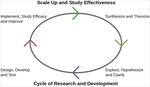

# Research & Development
> 2019.03.21 [🚀](../index/index.md) [despace](index.md) → [R&D](rnd.md)

[TOC]

---

|*Phase*|||*Design*|||||*Mass prod.:*||
|:--|:--|:--|:--|:--|:--|:--|:--|:--|:--|
|**[R&D phases](rnd.md)**|0 (pre‑A)|A|≈ B|≈ B|≈ C|≈ C/D|≈ E|…|F|
|**[НИОКР](rnd.md)**|[НИР](rnd_0.md)|[АП](rnd_ap.md)|[ЭП](rnd_ep.md)|[ТП](rnd_tp.md)|[РКД (РРД)](rnd_rkd.md)|[Макеты, НЭО](rnd_neo.md)|[ЛИ](rnd_e.md)|ПСП → СП → ПЭ|Вывод|

> <small>А я не поехал. Я купил мотыля и пошёл на реку. Я люблю рыбалку. Сядешь на берегу, закинешь удочку… клюёт!  *(S.P.O.R.T., 2000 г.)*</small>

> <small>**Научно‑исследовательские и опытно‑конструкторские работы (НИОКР)** — русскоязычный термин. **Research and Development (R&D)** — англоязычный эквивалент.</small>

**Научно‑исследовательские и опытно‑конструкторские работы (НИОКР)** — [совокупность работ](st_act.md), направленных на получение новых знаний и практическое применение при создании нового изделия или технологии.

|||
|:--|:--|
|||

НИОКР включают в себя:

   - **[Научно‑исследовательские работы](rnd_0.md) (НИР)** — работы поискового, теоретического и экспериментального характера с целью определения технической возможности создания новой техники в определённые сроки. НИР деляся на фундаментальные (получение новых знаний) и прикладные (применение новых знаний для решения конкретных задач).
   - **Опытно‑конструкторские работы (ОКР)** и *Технологические работы (ТР)* — разработка КД и ТД на опытный образец, изготовление и испытания опытного образца.
   - [Proposal](proposal.md)

Ниже приведены типовые этапы разработки ОКР (СЧ ОКР) в РФ и [ESA](zz_esa.md). По согласованию с Заказчиком этапы могут исключаться и вводиться новые. Цели нижеприведённого:

   1. стандартизация [работ](workflow.md) и документации для различных этапов ОКР;
   1. уменьшение количества [ошибок](error.md) и разночтений [НД](doc.md) для исполнителя и [кооперации](contact.md);
   1. уменьшение количества бумажной документации и переписки;
   1. систематизация опыта работы над [различными ОКР](project.md);
   1. получение [достаточных данных о СЧ](suitc.md), необходимых для работы с ними.

|*Прочие страницы*|*в данной категории*|
|:--|:--|
|<small>• [Test](test.md);  • [Конкурс на ОКР (СЧ ОКР)](pubprocom.md);  • [Контрольная сборка](contr_asm.md);  • [Рабочая группа](wg.md);  • [Руководство ОКР](mgmt.md);</small>|<small>• [САС](lifetime.md);  • [ТРИЗ](triz.md);  • [Унификация](commonality.md);  [ТХСЧ](suitc.md)</small>|

 

## Этапы
|*№*|*Этап*|*Описание*|
|:--|:--|:--|
||**`НИОКР`**|—|
|**1**|[НИР](rnd_0.md)|<small>Комплекс теоретических/экспериментальных исследований с целью получения обоснованных исходных данных, изыскания принципов/путей создания/модернизации продукции.|
||Phase 0 (pre‑A)|<small>Concept studies.</small>|
|**2**|[Техническое предложение (Аванпроект)](rnd_ap.md)  (АП)|<small>Анализ ТЗ. Подбор материалов. Присвоение документам литеры «П». Цель — выявление доп./уточнённых требований к [изделию](unit.md), которые не могли быть указаны в ТЗ или рассмотрены в НИР, и это целесообразно сделать на основе конструкторской проработки и анализа вариантов изделия. *(не распространяется на КД, разраб. по заказу Мин. обороны ([ГОСТ 2.103](гост_2_103.md) п.4.1))*</small>|
||Phase A|<small>Concept & technology development.</small>|
||**`ОКР`**|—|
|**3**|[Эскизный проект](rnd_ep.md)  (ЭП)|<small>Рассмотрение и утверждение АП, уточнение его результатов. Цель — установление принципиальных решений изделия, дающих общее представление о принципе работы и (или) устройстве изделия. Можно рассматривать варианты изделий. В итоге должен быть выбран 1 вариант исполнения изделий.</small>|
||Phase B|<small>Preliminary design & technology completion. At the end of p.B the system requirements together with a statement of work are sent out requesting proposals from industry.</small>|
|**4**|[Технический проект](rnd_tp.md)  (ТП)|<small>Необязательный этап. По НД имеет состав ЭП. Рассмотрение и утверждение ЭП. Присвоение документам литеры «Т». Изготовление и испытание материальных/электронных макетов (при необходимости). ТП разраб. с целью выявления окончательных технических решений, дающих полное представление о конструкции изделия, когда это целесообразно сделать до РРД.</small>|
||Phase B|<small>*См. предыдущий пункт.*</small>|
|**5**|[Разработка конструкторской документации](rnd_rkd.md)  (РКД, РРД)|<small>Рассмотрение и утверждение ТП (ЭП, если не было ТП). Разработка [КД](doc.md), предназначенной для изготовления и [испытания](test.md) опытного образца (опытной партии), без присвоения литеры.</small>|
||Phase C|<small>Final design & fabrication.</small>|
|**6**|[Наземная экспериментальная отработка, макетирование](rnd_neo.md) (НЭО)|<small>Создание макетов КА и его СЧ, проведение наземной экспериментальной отработки, корректировка КД (при необходимости), поставка штатных образцов.</small>|
||Phase C/D|<small>System assembly, integration & testing. Launch.</small>|
|**7**|[Лётные испытания](rnd_e.md)  (ЛИ)|<small>Старт и функционирование [изделия](unit.md).</small>|
||Phase E|<small>Operations & sustainment.</small>|
|**8**|[Подготовка документации для серийного производства](пдсп.md)|<small>Корректировка (разработка), проверка, согласование и утверждение комплектов КД (в т.ч. ЭД), присвоение ей литеры «О₁» или более высокой литеры на изделия серийного производства.</small>|
||…|…|
|**9**|[Серийное производство](сп.md)|<small>Постановка на серийное производство, изготовление и испытания изделий, корректировка документации на изделия серийного производства.</small>|
||…|…|
|**10**|[Приём в эксплуатацию](прэ.md)|<small>Ввод и приём в эксплуатацию ракетной и космической техники.</small>|
||…|…|
|**11**|Вывод из эксплуатации|<small>Вывод из эксплуатации ракетной и космической техники.</small>|
||Phase F|<small>Closeout.</small>|

*Примечания:*

   - Этапы АП и ЭП похожи по составу, отличаются только глубиной проработки — на АП поощряется создание нескольких вариантов КА и его СЧ.
   - Составными частями АП (ЭП) являются АП (ЭП) на его составные части. Сквозная нумерация отсутствует. Возможна сквозная нумерация в рамках каждого АП (ЭП).

**За рубежом.**

[Spacecraft systems](scs.md) are normally developed under the responsibility of space agencies as [NASA](zz_nasa.md), [ESA](zz_esa.md) etc. In the space area standardized terms and processes have been introduced to allow for unambiguous communication between all partners and efficient usage of all documents. For instance the life cycle of [SCS](scs.md) is divided in phases.  
На каждом этапе проводятся [design review](design_review.md).

 

## Docs & links (TRANSLATEME ALREADY)
|Navigation|
|:--|
|**[FAQ](faq.md)**, **[Cable](cable.md)**·БКС, **[Camera](cam.md)**·Камера, **[Comms](comms.md)**·Радио, **[Contact](contact.md)**·Контакт, **[Control](control.md)**·Упр., **[Doc](doc.md)**·Док., **[Doppler](doppler.md)**·ИСР, **[DS](ds.md)**·ЗУ, **[EB](eb.md)**·ХИТ, **[ECO](ecology.md)**·Экол., **[EF](ef.md)**·ВВФ, **[ElC](elc.md)**·ЭКБ, **[EMC](emc.md)**·ЭМС, **[Error](error.md)**·Ошибки, **[Event](event.md)**·События, **[FS](fs.md)**·ТЭО, **[Fuel](fuel.md)**·Топливо, **[GNC](gnc.md)**·БКУ, **[GS](scs.md)**·НС, **[HF&E](hfe.md)**·Эрго., **[IU](iu.md)**·Гиро., **[KT](kt.md)**·КТЕХ, **[LAG](lag.md)**·ПУC, **[LES](les.md)**·САСП, **[LS](ls.md)**·СЖО, **[LV](lv.md)**·РН, **[MCC](mcc.md)**·ЦУП, **[Model](model.md)**·Модель, **[MSC](sc.md)**·ПКА, **[N&B](nnb.md)**·БНО, **[NR](nr.md)**·ЯР, **[OBC](obc.md)**·ЦВМ, **[OE](oe.md)**·БА, **[Pat.](патент.md)**·Патент, **[Proj.](project.md)**·Проект, **[PS](ps.md)**·ДУ, **[R&D](rnd.md)**·НИОКР, **[Robot](robotics.md)**·Робот, **[Rover](rover.md)**·Ровер, **[RTG](rtg.md)**·РИТЭГ, **[SARC](sarc.md)**·ПСК, **[Sensor](sensor.md)**·Датчик, **[SC](sc.md)**·КА, **[SCS](scs.md)**·КК, **[SGM](sgm.md)**·КММ, **[SI](si.md)**·СИ, **[Soft](soft.md)**·ПО, **[SP](sp.md)**·БС, **[Spaceport](spaceport.md)**·Космодр., **[SPS](sps.md)**·СЭС, **[SRRQ](srrq.md)**·БКНР, **[SSS](sss.md)**·ГЗУ, **[TCS](tcs.md)**·СОТР, **[Test](test.md)**·ЭО, **[Timeline](timeline.md)**·ЦГМ, **[TMS](tms.md)**·ТМС, **[TOR](tor.md)**·ТЗ, **[TRL](trl.md)**·УГТ|
|*Sections & pages*|
|**··• [R&D](rnd.md) •··**  [Design review](design_review.md) ┊ [Management](mgmt.md) ┊ [Proposal](proposal.md)  [АП](rnd_ap.md) ┊ [ЛИ](rnd_e.md) ┊ [Макеты, НЭО](rnd_neo.md) ┊ [НИР](rnd_0.md) ┊ [РКД (РРД)](rnd_rkd.md) ┊ [ТП](rnd_tp.md) ┊ [ЭП](rnd_ep.md)|

   1. Docs: …
   1. Notable interwikies — …
   1. <https://ru.wikipedia.org/wiki/НИОКР>
   1. <https://en.wikipedia.org/wiki/Research_and_development>
   1. <https://en.wikipedia.org/wiki/Systems_development_life_cycle>
   1. <https://en.wikipedia.org/wiki/System_requirements_(spacecraft_system)>
