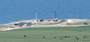
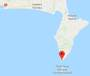
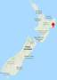

# Rocket Lab LC1
> 2019.04.30 [🚀](../index/index.md) [despace](index.md) → [Spaceport](spaceport.md)

[TOC]

---

> <small>**Rocket Lab LC1** — EN term. **Рокет Лаб эЛСи 1** — RU analogue.</small>

**Rocket Lab Launch Complex 1** is a commercial spaceport located in Mahia Peninsula on the North island of New Zealand. Officially, the cosmodrome opened on 09.26.2016.

Launch Complex 1 features a 50-tonne launch platform and tower, a hangar for the Electron rockets, and storage tanks for liquid oxygen and kerosene. During the test phase of launch operations, which began in May 2017, the exclusion zone would likely be an eight-kilometre (five-mile) radius from the pad, and would reduce in size once the site became commercially operational.

|*Characteristic*|*[Value](si.md)*|
|:--|:--|
|Activity|**Active** (2016 ‑ …)|
|[Launch vehicles](lv.md)|[Electron](electron.md)|
|Operator|[Rocket Lab](zz_rocket_lab.md)|
|Location|39.2609°S 177.8655°E  Mahia Peninsula, New Zealand|
|Distance|4 700 ㎞ — to the equator;  19 500 ㎞ — to [NPO Lavochkin](zz_lav.md);  11 200 ㎞ — to [JPL](zz_jpl.md)|
|Launch pad|1|
| |     |
| | <small>*World map of spaceports*</small>|

 

## Docs & links
|Navigation|
|:--|
|**[FAQ](faq.md)**【**[SCS](scs.md)**·КК, **[SC](sc.md)**·КА, **[OE](oe.md)**·БА, **[SGM](sgm.md)**·КММ】**[CON](contact.md)·[Pers](person.md)**·Контакт, **[Ctrl](control.md)**·Упр., **[Doc](doc.md)**·Док., **[EF](ef.md)**·ВВФ, **[Error](error.md)**·Ошибки, **[Event](event.md)**·События, **[FS](fs.md)**·ТЭО, **[HF&E](hfe.md)**·Эрго., **[KT](kt.md)**·КТ, **[Model](model.md)**·Модель, **[N&B](nnb.md)**·БНО, **[Patent](патент.md)**·Патент, **[Project](project.md)**·Проект, **[QM](qm.md)**·БКНР, **[R&D](rnd.md)**·НИОКР, **[SI](si.md)**·СИ, **[Test](test.md)**·ЭО, **[Timeline](timeline.md)**·ЦГМ, **[TRL](trl.md)**·УГТ|
|*Sections & pages*|
|**【[Spaceport](spaceport.md)】**  …  • • •  **Brazil:** ... ··· inactive: [Whalers Way](whalers_way.md) (3 900), [Woomera](woomera.md) (3 300) ┊ **Brazil:** [Alcantara](alcantara.md) (260) ┊ **Canada:** [Canso](canso.md) (5 000) ┊ **China:** [Jiuquan](jiuquan.md) (5 000), [Taiyuan](taiyuan.md) (4 500), [Wenchang](wenchang.md) (2 200), [Xichang](xichang.md) (3 200) ┊ **EU:** [Esrange](esrange.md) (7 550), [Guiana (Kourou)](kourou.md) (650) ··· inactive: [Hammaguir](hammaguir.md) (3 450), [San Marco](san_marco.md) (300), [Spaceport Cornwall](sp_cornwall.md) (5 600), [Shetland](shetland_sc.md) (6 800) ┊ **India:** [Sriharikota](sriharikota.md) (1 600) ┊ **Int.:** … ··· inactive: [Sea Launch](sea_launch.md) (0) ┊ **Iran:** [Semnan](semnan.md) (4 300)) ┊ **Iraq:** … ··· inactive: [Al Anbar](al_anbar.md) (3 700) ┊ **Israel:** [Palmachim](palmachim.md) (3 700) ┊ **Japan:** [Taiki](taiki.md) (4 700), [Tanegashima](tanegashima.md) (3 400), [Uchinoura](uchinoura.md) (3 700) ┊ **Korea N.:** [Sohae](sohae.md) (4 900), [Tonghae](tonghae.md) (4 700) ┊ **Korea S.:** [Naro](naro.md) (4 000) ┊ **RF,CIF:** [Baikonur](baikonur.md) (5 200), [Dombarovsky](dombarovsky.md) (5 500), [Kapustin Yar](kapustin_yar.md) (5 400), [Plesetsk](plesetsk.md) (7 400), [Vostochny](vostochny.md) (5 500) ··· inactive: [Svobodny](svobodny.md) (5 500) ┊ **USA:** [America](america.md) (3 900), [Canaveral](canaveral.md) (3 400), [Kennedy](kennedy.md) (3 400), [Kodiak](kodiak.md) (6 600), [Kwajalein](kwajalein.md) (1 000), [Rocket Lab LC1](rocket_lab_lc1.md) (4 700), [SpaceX STLS](spacex_stls.md) (2 800), [Vandenberg](vandenberg.md) (4 200), [Wallops](wallops.md) (4 500)|

   1. Docs: …
   1. Notable interwikies — …
   1. <https://en.wikipedia.org/wiki/Rocket_Lab_Launch_Complex_1>

