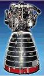

# RS-25
> 2019.05.12 [🚀](../index/index.md) [despace](index.md) → [PS](ps.md)

[TOC]

---

**RS-25** или **SSME** (англ. Space Shuttle Main Engine — главный двигатель космического челнока) — 2‑компонентный [двигатель](ps.md) производства [Aerojet Rocketdyne](aerojet_rocketdyne.md).

Характеристики указаны для вакуума и номинальных условий работы в непрерывном режиме.

|*Characteristics*|*[Value](si.md)  (RS-25)*|
|:--|:--|
|Composition| |
|Consumption, W| |
|Dimensions, ㎜|4 240 × 2 400|
|[Interfaces](interface.md)| |
|[Lifetime](lifetime.md)/Resource, h(y)|… / …|
|Mass, ㎏|3 390|
|[Overload](vibration.md), Grms| |
|[Rad.resist](ion_rad.md), ㏉ (㎭)| |
|[Reliability](qm.md) per [lifetime](lifetime.md)| |
|[Thermal range](tcs.md), ℃| |
|[TRL](trl.md)|9|
|[Voltage](voltage.md), V| |
|**【Specific】**|• • •|
|Pressure: engine entrance, ㎫ (kgf/㎝²)| |
|Pressure: comb. chamber, ㎫ (kgf/㎝²)|18.9 (192.7)|
|Pressure: nozzle cut, ㎫ (kgf/㎝²)| |
|Thrust: max. duration of one thrust, s| |
|Thrust: [res.impulse](ing.md), N·s (kgf·s), ≤| |
|Fuel: consumption, ㎏/s, ≤|493.5|
|Thrust: max. switching frequency, ㎐| |
|Fuel: mass ratio of components| |
|Turbopump speed, rpm| |
|Fuel: combustion products|H₂, H₂O|
|Thrust: torch angle, °| |
|Resource: number of thrusts, ≥| |
|Resource: total thrust (duration), s, ≥|520|
|Resource: total impulse, N·s (kgf·s), ≥| |
|Resource: total thrust, N (kgf), ≥| |
|Resourse: fuel, ㎏, ≥| |
|Temperature: combus. chamber, 10³ К (℃)|3.573 (3.3)|
|Temperature: nozzle cut, К (℃)| |
|[Fuel](fuel.md)|[Кислород + Водород](o_plus.md)|
|Thrust: nominal, N (kgf)|1 779 500 (181 400) уровень моря,  2 183 000 (222 600) вакуум|
|Thrust: deviation, N (kgf)| |
|Thrust: [Isp](isp.md), N·s/㎏ (s), ≥|363 (уровень моря),   453 (вакуум)|
|Mach number / [Adiabatic exponent](heat_cr.md)| |
| ||

**Notes:**

   1. Разработан в 1972 году.
   1. Имеет [ТНА](turbopump.md).
   1. Дросселирование тяги SSME может производиться в диапазоне от 67 до 109 % проектной мощности.
   1. **Applicability:** …

 

## Docs & links (TRANSLATEME ALREADY)
|Navigation|
|:--|
|**[FAQ](faq.md)**【**[SCS](scs.md)**·КК, **[SC](sc.md)**·КА, **[OE](oe.md)**·БА, **[SGM](sgm.md)**·КММ】**[CON](contact.md)·[Pers](person.md)**·Контакт, **[Ctrl](control.md)**·Упр., **[Doc](doc.md)**·Док., **[EF](ef.md)**·ВВФ, **[Error](error.md)**·Ошибки, **[Event](event.md)**·События, **[FS](fs.md)**·ТЭО, **[HF&E](hfe.md)**·Эрго., **[KT](kt.md)**·КТ, **[Model](model.md)**·Модель, **[N&B](nnb.md)**·БНО, **[Patent](патент.md)**·Патент, **[Project](project.md)**·Проект, **[QM](qm.md)**·БКНР, **[R&D](rnd.md)**·НИОКР, **[SI](si.md)**·СИ, **[Test](test.md)**·ЭО, **[Timeline](timeline.md)**·ЦГМ, **[TRL](trl.md)**·УГТ|
|*Sections & pages*|
|**`Двигательная установка (ДУ):`**  [HTAE](htae.md)・ [TALOS](talos.md)・ [Баки топливные](fuel_tank.md)・ [Варп‑двигатель](warp_drive.md)・ [Газовый двигатель](cgt.md)・ [Гибридный двигатель](гбрд.md)・ [Двигатель Бассарда](bussard_ramjet.md)・ [ЖРД](lpr.md)・ [ИПТ](ing.md)・ [Ионный двигатель](иод.md)・ [Как считать топливо?](si.md)・ [КЗУ](cinu.md)・ [КХГ](cgs.md)・ [Номинал](nominal.md)・ [Мятый газ](exhsteam.md)・ [РДТТ](spr.md)・ [Сильфон](сильфон.md)・ [СОЗ](соз.md)・ [СОИС](соис.md)・ [Солнечный парус](солнечный_парус.md)・ [ТНА](turbopump.md)・ [Топливные мембраны](топливные_мембраны.md)・ [Топливные мешки](топливные_мешки.md)・ [Топливо](fuel.md)・ [Тяговооружённость](ttwr.md)・ [ТЯРД](тярд.md)・ [УИ](isp.md)・ [Фотонный двигатель](фотонный_двигатель.md)・ [ЭРД](epsp.md)・ [Эффект Оберта](oberth_eff.md)・ [ЯРД](ntr.md)|

   1. Docs: …
   1. Notable interwikies — …
   1. <http://www.astronautix.com/s/ssme.html>
   1. <https://en.wikipedia.org/wiki/Space_Shuttle_main_engine>
   1. <https://ru.wikipedia.org/wiki/RS-25>
