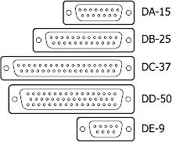
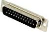
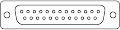
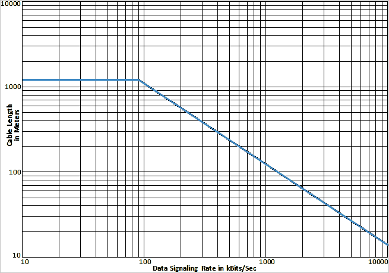

# Interfaces RS‑XXX
> 2021.01.14 [🚀](../index/index.md) [despace](index.md) → [Doc](doc.md), [Cable](cable.md), [GNC](gnc.md)

[TOC]

---

> <small>**Interfaces RS‑XXX** — EN term. **Интерфейсы RS‑XXX** — RU analogue.</small>

**Recommended Standard** is a group of electronic [standards](doc.md) maintained by Electronic Industries Alliance (EIA) Standards. With the changing names of the EIA, the naming convention of the standards was also adapted. For example, a standard defining serial communication between computers & modems e.g. was originally drafted as a Recommended Standard,[5] thus the “RS” RS‑232. Later it was taken over by the EIA as EIA‑232. Later this standard was managed by the TIA & the name was changed to the current TIA‑232. Because the EIA was accredited by ANSI to help develop standards in its areas, these standards are often described as (e.g. ANSI TIA‑232, or formerly as ANSI EIA/TIA‑232).

The **D‑subminiature** or **D‑sub** is a common type of electrical connector. They are named for their characteristic D‑shaped metal shield. When they were introduced, D‑subs were among the smallest connectors used on computer systems.

## RS‑232
In telecommunications, **RS‑232, Recommended Standard 232** is a standard originally introduced in 1960 for serial communication transmission of data. It formally defines signals connecting between a DTE (data terminal equipment) such as a computer terminal, & a DCE (data circuit‑terminating equipment or data communication equipment), such as a modem. The standard defines the electrical characteristics & timing of signals, the meaning of signals, & the physical size & pinout of connectors. The current version of the standard is TIA‑232‑F Interface Between Data Terminal Equipment & Data Circuit‑Terminating Equipment Employing Serial Binary Data Interchange, issued in 1997. The RS‑232 standard had been commonly used in computer serial ports & is still widely used in industrial communication devices.

|*Standard*|*TIA‑232‑F*|
|:--|:--|
|Connector types|Not specified. DB‑25 & DE‑9 commonly used|
|Creation date|1960|
|Max. Binary Rate|115 200 bit/s (15 m)|
|Max. Devices|1|
|Max. Distance|15 m (standart), 300 m (informal)|
|Network Topology|master‑slave|
|Physical Media| |
|Voltage Levels|−6 ‑ +6 V (maximum differential Voltage)|

   
*A DB‑25 connector as described in the RS‑232 standard*

A serial port complying with the RS‑232 standard was once a standard feature of many types of computers. Personal computers used them for connections not only to modems, but also to printers, computer mice, data storage, uninterruptible power supplies, & other peripheral devices.

RS‑232, when compared to later interfaces such as RS‑422, RS‑485 & Ethernet, has lower transmission speed, short maximum cable length, large voltage swing, large standard connectors, no multipoint capability & limited multidrop capability. In modern personal computers, USB has displaced RS‑232 from most of its peripheral interface roles. Few computers come equipped with RS‑232 ports today, so one must use either an external USB‑to‑RS‑232 converter or an internal expansion card with one or more serial ports to connect to RS‑232 peripherals. Nevertheless, thanks to their simplicity & past ubiquity, RS‑232 interfaces are still used — particularly in industrial machines, networking equipment, & scientific instruments where a short‑range, point‑to‑point, low‑speed wired data connection is fully adequate.

**RS‑232** — интерфейс передачи информации между двумя устройствами на расстояние до 15 м. Используется для подключения к вычислительным машинам самого разного оборудования, нетребовательного к скорости обмена. Для организации RS232 используются разъемы DB9M и DB25M. В офисной технике практически вытеснен интерфейсом USB. Зато активно используется в проме для подключения периферии и устройств, расположенных достаточно далеко от компьютера, и даже работающих в сложных условиях внешней среды. Также этот стандарт используется для взаимодействия микроконтроллеров различных архитектур, имеющих интерфейс UART, с другими цифровыми устройствами и периферией.

   - Протокол интерфейса предполагает синхронный и асинхронный режим передачи данных
   - Аппаратный и программный метода управления обменом данных

### Standard scope
The Electronic Industries Association (EIA) standard RS‑232‑C as of 1969 defines:

   - Electrical signal characteristics such as voltage levels, signaling rate, timing, & slew‑rate of signals, voltage withstand level, short‑circuit behavior, & maximum load capacitance.
   - Interface mechanical characteristics, pluggable connectors & pin identification.
   - Functions of each circuit in the interface connector.
   - Standard subsets of interface circuits for selected telecom applications.

The standard does not define such elements as the character encoding (i.e. ASCII, EBCDIC, or others), the framing of characters (start or stop bits, etc.), transmission order of bits, or error detection protocols. The character format & transmission bit rate are set by the serial port hardware, typically a UART, which may also contain circuits to convert the internal logic levels to RS‑232 compatible signal levels. The standard does not define bit rates for transmission, except that it says it is intended for bit rates lower than 20 000 bits/second.

**Limitations of the standard.**
Because RS‑232 is used beyond the original purpose of interconnecting a terminal with a modem, successor standards have been developed to address the limitations. Issues with the RS‑232 standard include:

   - The large voltage swings & requirement for positive & negative supplies increases power consumption of the interface & complicates power supply design. The voltage swing requirement also limits the upper speed of a compatible interface.
   - Single‑ended signaling referred to a common signal ground limits the noise immunity & transmission distance.
   - Multi‑drop connection among more than two devices is not defined. While multi‑drop “work‑arounds” have been devised, they have limitations in speed & compatibility.
   - The standard does not address the possibility of connecting a DTE directly to a DTE (Data terminal equipment), or a DCE to a DCE (Data circuit‑terminating equipment). Null modem cables can be used to achieve these connections, but these are not defined by the standard, & some such cables use different connections than others.
   - The definitions of the two ends of the link are asymmetric. This makes the assignment of the role of a newly developed device problematic; the designer must decide on either a DTE‑like or DCE‑like interface & which connector pin assignments to use.
   - The handshaking & control lines of the interface are intended for the setup & takedown of a dial‑up communication circuit; in particular, the use of handshake lines for flow control is not reliably implemented in many devices.
   - No method is specified for sending power to a device. While a small amount of current can be extracted from the DTR & RTS lines, this is only suitable for low‑power devices such as mice.
   - The 25‑pin D‑sub connector recommended in the standard is large compared to current practice.

### Physical interface
In RS‑232, user data is sent as a time‑series of bits. Both synchronous & asynchronous transmissions are supported by the standard. In addition to the data circuits, the standard defines a number of control circuits used to manage the connection between the DTE & DCE. Each data or control circuit only operates in one direction, that is, signaling from a DTE to the attached DCE or the reverse. Because transmit data & receive data are separate circuits, the interface can operate in a full duplex manner, supporting concurrent data flow in both directions. The standard does not define character framing within the data stream, or character encoding.

**Voltage levels**

The RS‑232 standard defines the voltage levels that correspond to logical one & logical zero levels for the data transmission & the control signal lines. Valid signals are either in the range of +3 to +15 volts or the range −3 to −15 volts with respect to the “Common Ground” (GND) pin; consequently, the range between −3 to +3 volts is not a valid RS‑232 level. For data transmission lines (TxD, RxD, & their secondary channel equivalents), logic one is represented as a negative voltage & the signal condition is called “mark”. Logic zero is signaled with a positive voltage & the signal condition is termed “space”. Control signals have the opposite polarity: the asserted or active state is positive voltage & the de‑asserted or inactive state is negative voltage. Examples of control lines include request to send (RTS), clear to send (CTS), data terminal ready (DTR), & data set ready (DSR).

**RS‑232 logic & voltage levels**

|*Data circuits*|*Control circuits*|*Voltage*|
|:--|:--|:--|
|0 (space)|Asserted|+3 to +15 V|
|1 (mark)|Deasserted|−15 to −3 V|

The standard specifies a maximum open‑circuit voltage of 25 volts: signal levels of ±5 V, ±10 V, ±12 V, & ±15 V are all commonly seen depending on the voltages available to the line driver circuit. Some RS‑232 driver chips have inbuilt circuitry to produce the required voltages from a 3 or 5 volt supply. RS‑232 drivers & receivers must be able to withstand indefinite short circuit to ground or to any voltage level up to ±25 М. The slew rate, or how fast the signal changes between levels, is also controlled.

Because the voltage levels are higher than logic levels typically used by integrated circuits, special intervening driver circuits are required to translate logic levels. These also protect the device's internal circuitry from short circuits or transients that may appear on the RS‑232 interface, & provide sufficient current to comply with the slew rate requirements for data transmission.

Because both ends of the RS‑232 circuit depend on the ground pin being zero volts, problems will occur when connecting machinery & computers where the voltage between the ground pin on one end, & the ground pin on the other is not zero. This may also cause a hazardous ground loop. Use of a common ground limits RS‑232 to applications with relatively short cables. If the two devices are far enough apart or on separate power systems, the local ground connections at either end of the cable will have differing voltages; this difference will reduce the noise margin of the signals. Balanced, differential serial connections such as RS‑422 or RS‑485 can tolerate larger ground voltage differences because of the differential signaling.

Unused interface signals terminated to ground will have an undefined logic state. Where it is necessary to permanently set a control signal to a defined state, it must be connected to a voltage source that asserts the logic 1 or logic 0 level, for example with a pullup resistor. Some devices provide test voltages on their interface connectors for this purpose.

**Connectors**

RS‑232 devices may be classified as Data Terminal Equipment (DTE) or Data Circuit‑terminating Equipment (DCE); this defines at each device which wires will be sending & receiving each signal. According to the standard, male connectors have DTE pin functions, & female connectors have DCE pin functions. Other devices may have any combination of connector gender & pin definitions. Many terminals were manufactured with female connectors but were sold with a cable with male connectors at each end; the terminal with its cable satisfied the recommendations in the standard.

The standard recommends the D‑subminiature 25‑pin connector up to revision C, & makes it mandatory as of revision D. Most devices only implement a few of the twenty signals specified in the standard, so connectors & cables with fewer pins are sufficient for most connections, more compact, & less expensive. Personal computer manufacturers replaced the DB‑25M connector with the smaller DE‑9M connector. This connector, with a different pinout (see Serial port pinouts), is prevalent for personal computers & associated devices.

Presence of a 25‑pin D‑sub connector does not necessarily indicate an RS‑232‑C compliant interface. For example, on the original IBM PC, a male D‑sub was an RS‑232‑C DTE port (with a non‑standard current loop interface on reserved pins), but the female D‑sub connector on the same PC model was used for the parallel “Centronics” printer port. Some personal computers put non‑standard voltages or signals on some pins of their serial ports.

**Cables**

The standard does not define a maximum cable length, but instead defines the maximum capacitance that a compliant drive circuit must tolerate. A widely used rule of thumb indicates that cables more than 15 m (50 ft) long will have too much capacitance, unless special cables are used. By using low‑capacitance cables, communication can be maintained over larger distances up to about 300 m (1 000 ft). For longer distances, other signal standards, such as RS‑422, are better suited for higher speeds.

Since the standard definitions are not always correctly applied, it is often necessary to consult documentation, test connections with a breakout box, or use trial & error to find a cable that works when interconnecting two devices. Connecting a fully standard‑compliant DCE device & DTE device would use a cable that connects identical pin numbers in each connector (a so‑called “straight cable”). “Gender changers” are available to solve gender mismatches between cables & connectors. Connecting devices with different types of connectors requires a cable that connects the corresponding pins according to the table below. Cables with 9 pins on one end & 25 on the other are common. Manufacturers of equipment with 8P8C connectors usually provide a cable with either a DB‑25 or DE‑9 connector (or sometimes interchangeable connectors so they can work with multiple devices). Poor‑quality cables can cause false signals by crosstalk between data & control lines (such as Ring Indicator).

If a given cable will not allow a data connection, especially if a gender changer is in use, a null modem cable may be necessary. Gender changers & null modem cables are not mentioned in the standard, so there is no officially sanctioned design for them.

**3‑wire & 5‑wire RS‑232**

A minimal “3‑wire” RS‑232 connection consisting only of transmit data, receive data, & ground, is commonly used when the full facilities of RS‑232 are not required. Even a two‑wire connection (data & ground) can be used if the data flow is one way (for example, a digital postal scale that periodically sends a weight reading, or a GPS receiver that periodically sends position, if no configuration via RS‑232 is necessary). When only hardware flow control is required in addition to two‑way data, the RTS & CTS lines are added in a 5‑wire version.

 

## RS‑422
**RS‑422**, also known as TIA/EIA‑422, is a technical standard originated by the Electronic Industries Alliance that specifies electrical characteristics of a digital signaling circuit. It was intended to replace the older RS‑232C standard with a standard that offered much higher speed, better immunity from noise, & longer cable lengths. RS‑422 systems can transmit data at rates as high as 10 Mbit/s, or may be sent on cables as long as 1 500 meters at lower rates. It is closely related to RS‑423, which used the same signaling systems but on a different wiring arrangement.

|*Standard*|*TIA/EIA‑422*|
|:--|:--|
|Connector types|Not specified. DB‑25 & DE‑9 commonly used|
|Creation date|1994 (rev.B), 1978 (rev.A), 1975 (original)|
|Max. Binary Rate|10 kbit/s (1 500 m) ‑ 10 Mbit/s (10 m)|
|Max. Devices|10 (1 driver & 10 receivers)|
|Max. Distance|1 500 metres (4 900 ft)|
|Network Topology|Point‑to‑point, Multi‑dropped|
|Physical Media|Twisted Pair|
|Voltage Levels|−6 ‑ +6 V (maximum differential Voltage)|

    
*A DB‑25 & DE‑9 connectors commonly used for RS‑422*

RS‑422 specifies differential signaling, with every data line paired with a dedicated return line. It is the voltage difference between these two lines that define the mark & space, rather than, as in RS‑232, the difference in voltage between a data line & a local ground. As the ground voltage can differ at either end of the cable, this required RS‑232 to use large +5 & ‑5 voltages. Moving to dedicated return lines & always defining ground in reference to the sender allowed RS‑422 to use 0.4 V, allowing it to run at much higher speeds. RS‑423 differed primarily in that it had a single return pin instead of one for each data pin.

RS‑422 & RS‑423 had originally planned to use the same DB25 connector as RS‑232, but over time the number of required pins grew & the standards split out the definition into the RS‑449 effort. This produced an unwieldy system & later returned to DB25 in the RS‑530 standard.

Интерфейс **RS‑422** обеспечивает дифференциальную однонаправленную передачу данных по линиям с возможностью соединения «точка‑точка» или «master — много slave». Интерфейс до сих пор достаточно часто применяется в промышленности. RS422 похож на RS‑232, но в отличие от последнего использует дифференциальный сигнал для одномоментной отправки и приемки сообщений по разным линиям.

   - Повышенная стойкость к помехам.
   - Большая дистанция передачи данных — до 1 500 метров.
   - Скорость передачи данных зависит от расстояния: если соединение между компонентами 10 м, то она может достигать 10 Мбит/с. А при максимальных 1 200 метрах — 10 кбит/с.
   - Поддержка топологии «точка‑точка».
   - Нужен согласующий резистор

### Standard scope
RS‑422 is the common short form title of American National Standards Institute (ANSI) standard ANSI/TIA/EIA‑422‑B Electrical Characteristics of Balanced Voltage Differential Interface Circuits & its international equivalent ITU‑T Recommendation T‑REC‑V.11, also known as X.27. These technical standards specify the electrical characteristics of the balanced voltage digital interface circuit. RS‑422 provides for data transmission, using balanced, or differential, signaling, with unidirectional/non‑reversible, terminated or non‑terminated transmission lines, point to point, or multi‑drop. In contrast to EIA‑485, RS‑422/V.11 does not allow multiple drivers but only multiple receivers.

The first version of RS‑422 was issued in 1975, with revision A issued in December 1978. Revision B, published in May 1994 was reaffirmed by the Telecommunications Industry Association in 2005.

**Characteristics**

Several key advantages offered by this standard include the differential receiver, a differential driver & data rates as high as 10 Mbit/s at 12 meters (40 ft). Since the signal quality degrades with cable length, the maximum data rate decreases as cable length increases.

  
*Data Rate / Line Length chart from RS‑422 Annex A*

The maximum cable length is not specified in the standard, but guidance is given in its annex. (This annex is not a formal part of the standard, but is included for information purposes only.) Limitations on line length & data rate varies with the parameters of the cable length, balance, & termination, as well as the individual installation. Figure above shows a maximum length of 1 200 m, but this is with a termination & the annex discusses the fact that many applications can tolerate greater timing & amplitude distortion, & that experience has shown that the cable length may be extended to several kilometers. Conservative maximum data rates with 24AWG UTP (POTS) cable are 10 Mbit/s at 12 m to 90 kbit/s at 1 200 m as shown in the figure above. This figure is a conservative guide based on empirical data, not a limit imposed by the standard.

RS‑422 specifies the electrical characteristics of a single balanced signal. The standard was written to be referenced by other standards that specify the complete DTE/DCE interface for applications which require a balanced voltage circuit to transmit data. These other standards would define protocols, connectors, pin assignments & functions. Standards such as EIA‑530 (DB‑25 connector) & EIA‑449 (DC‑37 connector) use RS‑422 electrical signals. Some RS‑422 devices have 4 screw terminals for pairs of wire, with one pair used for data in each direction.

RS‑422 cannot implement a true multi‑point communications network such as with EIA‑485 since there can be only one driver on each pair of wires. However one driver can fan‑out to up to ten receivers.

RS‑422 can interoperate with interfaces designed to MIL‑STD‑188‑114B, but they are not identical. RS‑422 uses a nominal 0 ‑ 5 V signal while MIL‑STD‑188‑114B uses a signal symmetric about 0 V. However the tolerance for common mode voltage in both specifications allows them to interoperate. Care must be taken with the termination network.

EIA‑423 is a similar specification for unbalanced signaling (RS‑423).

When used in relation to communications wiring, RS‑422 wiring refers to cable made of 2 sets of twisted pair, often with each pair being shielded, & a ground wire. While a double pair cable may be practical for many RS‑422 applications, the RS‑422 specification only defines one signal path & does not assign any function to it. Any complete cable assembly with connectors should be labeled with the specification that defined the signal function & mechanical layout of the connector, such as RS‑449.

 

## RS‑485
**RS‑485**, also known as **TIA‑485(‑A)** or **EIA‑485**, is a standard defining the electrical characteristics of drivers and receivers for use in serial communications systems. Electrical signaling is balanced, and multipoint systems are supported. The standard is jointly published by the Telecommunications Industry Association and Electronic Industries Alliance (TIA/EIA). Digital communications networks implementing the standard can be used effectively over long distances and in electrically noisy environments. Multiple receivers may be connected to such a network in a linear, multidrop bus. These characteristics make RS‑485 useful in industrial control systems and similar applications.

|*Standard*|*TIA/EIA‑485*|
|:--|:--|
|Connector types|not specified. DE‑9 commonly used|
|Creation date|2012 (reaffirmed), 1988 (approved)|
|Max. Binary Rate|10 Mbit/s (10 m), 2 Mbit/s (50 m)|
|Max. Devices|at least 32 unit loads|
|Max. Distance|1 200 m|
|Network Topology|point‑to‑point, multi‑dropped, multi‑point|
|Physical Media|balanced interconnecting cable|
|Voltage Levels|+3 ‑ +5.5 V (operational), −25 ‑ +25 V (common range), −60 ‑ +60 V (faults)|

  
*A DE‑9 connectors commonly used for RS‑485*

RS‑485 supports inexpensive local networks and multidrop communications links, using the same differential signaling over twisted pair as RS‑422. It is generally accepted that RS‑485 can be used with data rates up to 10 Mbit/s or, at lower speeds, distances up to 1 200 m (4 000 ft). As a rule of thumb, the speed in bit/s multiplied by the length in metres should not exceed 10⁸. Thus a 50‑meter cable should not signal faster than 2 Mbit/s.

In contrast to RS‑422, which has a driver circuit which cannot be switched off, RS‑485 drivers use three‑state logic allowing individual transmitters to be deactivated. This allows RS‑485 to implement linear bus topologies using only two wires. The equipment located along a set of RS‑485 wires are interchangeably called nodes, stations or devices. The recommended arrangement of the wires is as a connected series of point‑to‑point (multidropped) nodes, i.e. a line or bus, not a star, ring, or multiply connected network. Star and ring topologies are not recommended because of signal reflections or excessively low or high termination impedance. If a star configuration is unavoidable, special RS‑485 repeaters are available which bidirectionally listen for data on each span and then retransmit the data onto all other spans.

Ideally, the two ends of the cable will have a termination resistor connected across the two wires. Without termination resistors, signal reflections off the unterminated end of the cable can cause data corruption. Termination resistors also reduce electrical noise sensitivity due to the lower impedance. The value of each termination resistor should be equal to the cable characteristic impedance (typically, 120 ohms for twisted pairs). The termination also includes pull up and pull down resistors to establish fail‑safe bias for each data wire for the case when the lines are not being driven by any device. This way, the lines will be biased to known voltages and nodes will not interpret the noise from undriven lines as actual data; without biasing resistors, the data lines float in such a way that electrical noise sensitivity is greatest when all device stations are silent or unpowered.

**Protocols.**  
RS‑485 does not define a communication protocol; merely an electrical interface. Although many applications use RS‑485 signal levels, the speed, format, and protocol of the data transmission are not specified by RS‑485. Interoperability of even similar devices from different manufacturers is not assured by compliance with the signal levels alone.  
RS‑485 does not specify any connector or pinout. Circuits may be terminated on screw terminals, D‑subminiature connectors, or other types of connectors.  
The standard does not discuss cable shielding but makes some recommendations on preferred methods of interconnecting the signal reference common and equipment case grounds.

### (RU) Описание стандарта
**RS‑485** (англ. Recommended Standard 485), EIA‑485 (англ. Electronic Industries Alliance‑485) — стандарт физического уровня для асинхронного интерфейса. Название стандарта: ANSI TIA/EIA‑485‑A:1998 Electrical Characteristics of Generators and Receivers for Use in Balanced Digital Multipoint Systems. Регламентирует электрические параметры полудуплексной многоточечной дифференциальной линии связи типа «общая шина».

В стандарте RS‑485 для передачи и приёма данных используется одна витая пара проводов, иногда сопровождаемая экранирующей оплеткой или общим проводом. Передача данных осуществляется с помощью дифференциальных сигналов. Разница напряжений между проводниками одной полярности означает логическую единицу, разница другой полярности — ноль. Стандарт RS‑485 оговаривает только электрические и временные характеристики интерфейса. Стандарт RS‑485 не оговаривает:

   - параметры качества сигнала (допустимый уровень искажений, отражения в длинных линиях);
   - типы соединителей и кабелей;
   - гальваническую развязку линии связи;
   - протокол обмена.

Электрические и временные характеристики интерфейса RS‑485

   - Поддерживаются до 32 приёмопередатчиков в одном сегменте сети.
   - Максимальная длина одного сегмента сети: 1 200 метров.
   - В один момент активным может быть только один передатчик.
   - Максимальное количество узлов в сети — 256 с учётом магистральных усилителей.
   - Соотношения скорость обмена/длина линии связи:
      - 62.5 кбит/с 1 200 м (одна витая пара),
      - 375 кбит/с 500 м (одна витая пара),
      - 500 кбит/с,
      - 1 000 кбит/с,
      - 2 400 кбит/с 100 м (две витых пары),
      - 10 000 кбит/с 10 м.

Тип приёмопередатчиков — дифференциальный, потенциальный. Изменение входных и выходных напряжений на линиях A и B: Ua (Ub) от −7 В до −12 В (+7 В до +12 В). Требования, предъявляемые к выходному каскаду:

   - выходной каскад представляет собой источник напряжения с малым выходным сопротивлением, |вых|=1,5:5,0 В (не менее 1.5 В и не более 6.0 В);
   - состояние логической «1»: Ua < Ub (гистерезис 200 мВ) — MARK, OFF;
   - состояние логического «0»: Ua > Ub (гистерезис 200 мВ) — SPACE, ON (производители микросхем — драйверов, часто выбирают намного меньшие значения, гистерезис от 10 мВ);
   - выходной каскад должен выдерживать режим короткого замыкания, иметь максимальный выходной ток 250 мА, скорость нарастания выходного сигнала 1.2 В/мкс и схему ограничения выходной мощности.

Требования, предъявляемые к входному каскаду:

   - входной каскад представляет собой дифференциальный вход с высоким входным сопротивлением и пороговой характеристикой от −200 мВ до +200 мВ;
   - допустимый диапазон входных напряжений Uag (Ubg) относительно земли (GND) от −7 В до +12 В;
   - входной сигнал представлен дифференциальным напряжением (Ui +0,2 В и более);
   - уровни состояния приёмника входного каскада — см. состояния передатчика выходного каскада.

 

## Docs & links
|Navigation|
|:--|
|**[FAQ](faq.md)**, **[Cable](cable.md)**·БКС, **[Camera](cam.md)**·Камера, **[Comms](comms.md)**·Радио, **[CON](contact.md)·[Pers](person.md)**·Контакт, **[Control](control.md)**·Упр., **[Doc](doc.md)**·Док., **[Doppler](doppler.md)**·ИСР, **[DS](ds.md)**·ЗУ, **[EB](eb.md)**·ХИТ, **[ECO](ecology.md)**·Экол., **[EF](ef.md)**·ВВФ, **[ElC](elc.md)**·ЭКБ, **[EMC](emc.md)**·ЭМС, **[Error](error.md)**·Ошибки, **[Event](event.md)**·События, **[FS](fs.md)**·ТЭО, **[Fuel](fuel.md)**·Топливо, **[GNC](gnc.md)**·БКУ, **[GS](scs.md)**·НС, **[HF&E](hfe.md)**·Эрго., **[IU](iu.md)**·Гиро., **[KT](kt.md)**·КТЕХ, **[LAG](lag.md)**·ПУC, **[LES](les.md)**·САСП, **[LS](ls.md)**·СЖО, **[LV](lv.md)**·РН, **[MCC](mcc.md)**·ЦУП, **[Model](model.md)**·Модель, **[MSC](sc.md)**·ПКА, **[N&B](nnb.md)**·БНО, **[NR](nr.md)**·ЯР, **[OBC](obc.md)**·ЦВМ, **[OE](oe.md)**·БА, **[Pat.](патент.md)**·Патент, **[Proj.](project.md)**·Проект, **[PS](ps.md)**·ДУ, **[QM](qm.md)**·БКНР, **[R&D](rnd.md)**·НИОКР, **[Robot](robotics.md)**·Робот, **[Rover](rover.md)**·Ровер, **[RTG](rtg.md)**·РИТЭГ, **[SARC](sarc.md)**·ПСК, **[SE](se.md)**·СЭ, **[Sens.](sensor.md)**·Датч., **[SC](sc.md)**·КА, **[SCS](scs.md)**·КК, **[SGM](sgm.md)**·КММ, **[SI](si.md)**·СИ, **[Soft](soft.md)**·ПО, **[SP](sp.md)**·БС, **[Spaceport](spaceport.md)**·Космодр., **[SPS](sps.md)**·СЭС, **[SSS](sss.md)**·ГЗУ, **[TCS](tcs.md)**·СОТР, **[Test](test.md)**·ЭО, **[Timeline](timeline.md)**·ЦГМ, **[TMS](tms.md)**·ТМС, **[TOR](tor.md)**·ТЗ, **[TRL](trl.md)**·УГТ|
|*Sections & pages*|
|**··• [Cable](cable.md) •··**  [CAN](can.md)・ [LVDS](lvds.md)・ [MIL‑STD‑1553](mil_std_1553.md)・ [RS‑232, 422, 485](rs_xxx.md)・ [SpaceWire](spacewire.md)・ [ОТБКС](cable_ct.md)|
|**··• [Documents](doc.md) •··**  **Схема:** [КСС](ксс.md)・ [ПГС](пгс.md)・ [ПЛИС](плис.md)・ [СхД](draft_model.md)・ [СхО](draft_model.md)・ [СхПЗ](draft_model.md)・ [СхЧ](draft_model.md)・ [СхЭ](draft_model.md)  [Interface](interface.md)・ [Mission proposal](proposal.md)|
|**··• [Guidance, Navigation & Control (GNC)](gnc.md) •··**  [CAN](can.md)・ [LVDS](lvds.md)・ [MIL‑STD‑1553](mil_std_1553.md) (МКО)・ [RS‑232, 422, 485](rs_xxx.md)・ [SpaceWire](spacewire.md)・ [АСН, САН](ans.md)・ [БНО](nnb.md)[MIL‑STD‑1553](mil_std_1553.md) (МКО)[БАППТ](acup.md)・ [БКС](cable.md)・ [БУ](sp.md)・ [БШВ](time.md)・ [Гироскоп](iu.md)・ [Дальномер](doppler.md) (ИСР)・ [ДМ](iu.md)・ [ЗД](sensor.md)・ [Компьютер](obc.md) (ЦВМ, БЦВМ)・ [Магнитометр](sensor.md)・ [МИХ](mic.md)・ [МКО](mil_std_1553.md)・ [ПО](soft.md)・ [ПНА, ПОНА, ПСНА](aiad.md)・ [СД](sensor.md)・ [Система координат](coord_sys.md)・ [СОСБ](spos.md)|

   1. Docs: …
   1. Notable interwikies — …
   1. <https://en.wikipedia.org/wiki/Electronic_Industries_Alliance>
   1. <https://en.wikipedia.org/wiki/List_of_EIA_standards>
   1. <https://en.wikipedia.org/wiki/D-subminiature>
   1. <https://en.wikipedia.org/wiki/RS-232>
   1. <https://en.wikipedia.org/wiki/RS-422>
   1. <https://en.wikipedia.org/wiki/RS-485>
   1. <https://pue8.ru/>
   1. <http://masters.donntu.org/2004/fema/kovalenko/library/art7.html>
