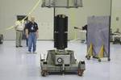
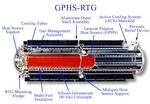
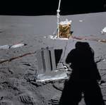

# РИТЭГ
> 2019.05.12 [🚀](../index/index.md) [despace](index.md) → **[РИТЭГ](rtg.md)**, [СОТР](tcs.md), [СЭС](sps.md)

[TOC]

---

> <small>*Термины:*  • **Радиоизотопный термоэлектрический генератор (РИТЭГ)** — русскоязычный термин. **Radioisotope thermoelectric generator (RTG)** — англоязычный эквивалент.  • **Радиоизотопный источник тепла (РИТ)** — русскоязычный термин. **Radioisotope heater unit (RHU)** — англоязычный эквивалент.</small>

**Радиоизотопный термоэлектрический генератор (РИТЭГ)** — радиоизотопный источник электроэнергии, использующий тепловую энергию, выделяющуюся при естественном распаде радиоактивных изотопов и преобразующий её в [электроэнергию](sps.md) с помощью термоэлектрогенератора.

**Радиоизотопный источник тепла (РИТ)** — радиоизотопный источник тепла, использующий тепловую энергию, выделяющуюся при естественном распаде радиоактивных изотопов. Обычно меньше и проще РИТЭГа.

## Описание
По сравнению с [ядерными реакторами](nr.md), использующими цепную реакцию, РИТЭГи значительно меньше и конструктивно проще. Выходная мощность РИТЭГа весьма невелика (до нескольких сотен ватт) при небольшом КПД (≤10 % от тепловой энергии). Зато в них нет движущихся частей и они не требуют обслуживания на протяжении всего [срока службы](lifetime.md), который может исчисляться десятилетиями.

**Область применения**

|*[Меркурий](mercury.md)*|*[Venus](venus.md)*|*[Земля](earth.md)*|*[Луна](moon.md)*|*[Марс](mars.md)*|*[и далее](index.md)*|
|:--|:--|:--|:--|:--|:--|
|—|<small>на орбите|+|+|+|+|

**Изображения**

|РИТЭГ КА «[New Horizons](new_horizons.md)»|Схема РИТЭГа, используемого на КА «[Cassini Huygens](cassini_huygens.md)»|РИТЭГ SNAP‑27, применявшийся в полёте «[Аполлона‑14](apollo_14.md)» (в центре)|
|:--|:--|:--|
||||

## Разновидности
|*°*|*[Фирма](contact.md)*|*Актуальные*|
|:--|:--|:--|
|**RU**|[РФЯЦ-ВНИИЭФ](zz_vniief.md)|**РИТЭГ:** [РИТЭГ-238-6,5/3](rtg_238_6_5_3.md)  **РИТ:** [ТБ-8,5](tb_8_5.md)|
|•|• • • • • • • • • • •|• • •|
|**US**|City Labs|P200|

## Применение
РИТЭГи применимы как источники энергии для автономных систем, удалённых от традиционных источников электроснабжения и нуждающихся в нескольких десятках‑сотнях ватт при очень длительном времени работы, слишком долгом для топливных элементов или аккумуляторов.

### В космосе
РИТЭГи являются основным источником электропитания на КА, выполняющих продолжительное задание и сильно удаляющихся от Солнца (например «[Voyager](voyager.md)»), где использование [солнечных батарей](sp.md) неэффективно или невозможно.

   - В КА «[New Horizons](new_horizons.md)» в качестве топлива для РИТЭГ использовался Плутоний‑238: 11 kg ²³⁸PuO₂ (диоксид Плутония‑238) производят в среднем 220 Вт электроэнергии на протяжении всего пути (240 Вт в начале и, по расчётам, 200 Вт к концу).
   - КА «[Galileo](galileo.md)» и «[Cassini Huygens](cassini_huygens.md)» также используют РИТЭГ с ²³⁸PuO₂.
   - Марсоход «[Curiosity](msl.md)» использует РИТЭГ с ²³⁸PuO₂. Марсоход использует последнее поколение РИТЭГов, называемое Multi‑Mission Radioisotope Thermoelectric Generator (производит 125 Вт электрической мощности, а по истечении 14 лет — 100 Вт).
   - Несколько килограммов ²³⁸PuO₂ использовались на некоторых полётах «Аполлонов» для электропитания приборов ALSEP. Генератор электроэнергии SNAP‑27 (англ. Systems for Nuclear Auxiliary Power), тепловая и электрическая мощность которого составляла 1480 Вт и 63.5 Вт соответственно, содержал 3.735 kg ²³⁸PuO₂.

### На Земле
РИТЭГи применялись в навигационных маяках, радиомаяках, метеостанциях и подобном оборудовании, установленном в местности, где нет возможности воспользоваться другими источниками электропитания. В частности, в СССР их использовали в качестве источников питания навигационного оборудования, установленного на побережье Северного Ледовитого океана вдоль трассы Северного морского пути. В настоящее время, в связи с риском утечки радиации и радиоактивных материалов, практику установки необслуживаемых РИТЭГов в малодоступных местах прекратили.

В США РИТЭГи использовались не только для наземных источников питания, но и для морских буев и подводных установок. Например, в 1988 году СССР обнаружил два американских РИТЭГа рядом с советскими кабелями связи в Охотском море. Точное количество установленных США РИТЭГов неизвестно, оценки независимых организаций указывали 100‑150 установок на 1992 год.

Плутоний‑236 и плутоний‑238 применялся для изготовления атомных электрических батареек, срок службы которых достигает 5 и более лет. Их применяют в генераторах тока, стимулирующих работу сердца (кардиостимулятор). По состоянию на 2003 г. в США было 50‑100 человек, имеющих плутониевый кардиостимулятор. До запрета на производство плутония‑238 в США, ожидалось, что его применение может распространиться на костюмы водолазов и космонавтов.

## Топливо
Радиоактивные материалы для РИТЭГ должны соответствовать следующим характеристикам:

   - Достаточно высокая объёмная активность для получения значительного энерговыделения в ограниченном объёме установки. Минимальный объём ограничен тепловой и радиационной стойкостью материалов, слабоактивные изотопы ухудшают энергомассовое совершенство установки. Обычно это значит что период полураспада изотопа должен быть достаточно мал для высокой интенсивности распадов и распад должен давать достаточно много легкоутилизируемой энергии.
   - Достаточно длительное время поддержания мощности для выполнения задачи. Обычно это значит, что период полураспада изотопа должен быть достаточно велик для заданной скорости падения энерговыделения. Типичные времена полураспада изотопов, используемых в РИТЭГах, составляют несколько десятилетий.
   - Удобный для утилизации энергии вид ионизирующего излучения. Гамма‑излучение легко вылетает из конструкции, унося энергию распада. Относительно легко могут улетать и нейтроны. Образующиеся при β‑распаде высокоэнергетичные электроны неплохо задерживаются, однако при этом образуется тормозное рентгеновское излучение, уносящее часть энергии. При α‑распаде образуются массивные α‑частицы, эффективно отдающие свою энергию практически в точке образования.
   - Безопасный для окружающей среды и аппаратуры вид ионизирующего излучения. Значительные гамма‑, рентгеновское и нейтронное излучения зачастую требуют специальных конструктивных мер по защите персонала и близкорасположенной аппаратуры.
   - Относительная дешевизна и простота получения изотопа при нынешних ядерных технологиях.

Плутоний‑238, кюрий‑244 и стронций‑90 являются чаще всего используемыми изотопами. Другие изотопы, такие как полоний‑210, прометий‑147, цезий‑137, церий‑144, рутений‑106, кобальт‑60, кюрий‑242 и изотопы тулия были также изучены. Например, полоний‑210 имеет период полураспада всего 138 дней при огромном начальном тепловыделении в 140 Вт на грамм. Америций‑241 с периодом полураспада 433 года и тепловыделением 0.1 Вт/грамм.

Плутоний‑238 чаще всего применяется в космических аппаратах. Альфа‑распад с энергией 5.5 МэВ (один грамм даёт ~0.54 Вт). Период полураспада 88 лет (потеря мощности 0.78 % в год) с образованием высокостабильного изотопа 234U. Плутоний‑238 является почти чистым альфа‑излучателем, что делает его одним из самых безопасных радиоактивных изотопов с минимальными требованиями к биологической защите. Однако получение относительно чистого 238‑го изотопа требует эксплуатации специальных реакторов, что делает его дорогим.

Стронций‑90 широко применялся в наземных РИТЭГах советского и американского производства. Цепочка из двух β‑распадов даёт суммарную энергию 2.8 МэВ (один грамм дает ~0.46 Вт). Период полураспада 29 лет с образованием стабильного ⁹⁰Zr. Стронций‑90 получают из отработавшего топлива ядерных реакторов в больших количествах. Дешевизна и обилие этого изотопа определяет его широкое использование в наземном оборудовании. В отличие от плутония‑238, стронций‑90 создаёт значительный уровень ионизирующего излучения высокой проницаемости, что предъявляет относительно высокие требования к биологической защите.

Существует концепция подкритических РИТЭГов. Подкритический генератор состоит из источника нейтронов и делящегося вещества. Нейтроны источника захватываются ядрами делящегося вещества и вызывают их деление. Основное преимущество такого генератора в том, что энергия, выделяемая при реакции деления, гораздо выше энергии альфа‑распада. Например, для плутония‑238 это примерно 200 МэВ против 5.6 МэВ, выделяемых этим нуклидом при альфа‑распаде. Соответственно, потребное количество вещества гораздо ниже. Количество распадов и радиационная активность в пересчёте на тепловыделение также ниже. Это снижает вес и размеры генератора.

 

## Docs & links (TRANSLATEME ALREADY)
|Navigation|
|:--|
|<small>**[FAQ](faq.md)**, **[Cable](cable.md)**·БКС, **[Camera](cam.md)**·Камера, **[Comms](comms.md)**·Радио, **[Contact](contact.md)**·Контакт, **[Control](control.md)**·Упр., **[Doc](doc.md)**·Док., **[Doppler](doppler.md)**·ИСР, **[DS](ds.md)**·ЗУ, **[EB](eb.md)**·ХИТ, **[ECO](ecology.md)**·Экол., **[EF](ef.md)**·ВВФ, **[ElC](elc.md)**·ЭКБ, **[EMC](emc.md)**·ЭМС, **[Error](error.md)**·Ошибки, **[Event](event.md)**·События, **[FS](fs.md)**·ТЭО, **[Fuel](fuel.md)**·Топливо, **[GNC](gnc.md)**·БКУ, **[GS](scs.md)**·НС, **[HF&E](hfe.md)**·Эрго., **[IU](iu.md)**·Гиро., **[KT](kt.md)**·КТЕХ, **[LAG](lag.md)**·ПУC, **[LES](les.md)**·САСП, **[LS](ls.md)**·СЖО, **[LV](lv.md)**·РН, **[MCC](mcc.md)**·ЦУП, **[Model](model.md)**·Модель, **[MSC](sc.md)**·ПКА, **[N&B](nnb.md)**·БНО, **[NR](nr.md)**·ЯР, **[OBC](obc.md)**·ЦВМ, **[OE](oe.md)**·БА, **[Pat.](патент.md)**·Патент, **[Project](project.md)**·Проект, **[PS](ps.md)**·ДУ, **[R&D](rnd.md)**·НИОКР, **[SRRQ](srrq.md)**·БКНР, **[Robot](robotics.md)**·Робот, **[Rover](rover.md)**·Планетоход, **[RTG](rtg.md)**·РИТЭГ, **[SARC](sarc.md)**·ПСК, **[Sensor](sensor.md)**·Датчик, **[SC](sc.md)**·КА, **[SCS](scs.md)**·КК, **[SGM](sgm.md)**·КММ, **[SI](si.md)**·СИ, **[Soft](soft.md)**·ПО, **[SP](sp.md)**·БС, **[Spaceport](spaceport.md)**·Космодром, **[SPS](sps.md)**·СЭС, **[SSS](sss.md)**·ГЗУ, **[TCS](tcs.md)**·СОТР, **[Test](test.md)**·ЭО, **[Timeline](timeline.md)**·ЦГМ, **[TMS](tms.md)**·ТМС, **[TOR](tor.md)**·ТЗ, **[TRL](trl.md)**·УГТ</small>|
|*Sections & pages*|
|**`Радиоизотопный термоэлектрический генератор (РИТЭГ):`**  …  • • •  **РФ:** [РИТЭГ-238-6,5/3](rtg_238_6_5_3.md) ┊ [ТБ-8,5](tb_8_5.md)|
|**`Средства обеспечения теплового режима (СОТР):`**  [Thermal characteristics](thermal_chars.md) ┊ [Гермоконтейнер](гермоконтейнер.md) ┊ [Насосы для СОТР](сотр_насос.md) ┊ [Покрытия для СОТР](сотр_покрытия.md) ┊ [Радиатор](радиатор.md) ┊ [РИТ (РИТЭГ)](rtg.md) ┊ [Стандартные условия](sctp.md) ┊ [Тепловая труба](hp.md) ┊ [ТЗП](hs.md) ┊ [Тепловой аккумулятор](heat_bank.md) ┊ [ТСП](tsp.md) ┊ [Шторка](thermal_curtain.md) ┊ [ЭВТИ](mli.md)|
|**··• [Spacecraft power system (SPS)](sps.md) •··**  [ACUER](acuer.md) ┊ [Charge eff.](charge_eff.md) ┊ [EB](eb.md) ┊ [EMI, RFI](emi.md) ┊ [NR](nr.md) ┊ [Rotor](rotor.md) ┊ [RTG](rtg.md) ┊ [Solar cell](sp.md) ┊ [SP](sp.md) ┊ [SPB/USPB](suspb.md) ┊ [Voltage](voltage.md) ┊ [WT](wt.md) • • •  **RF/CIF:** [BAK-01](bak_01.md) ┊ [KAS‑LOA](kas_loa.md)|

   1. Docs: …
   1. Notable interwikies — …
   1. <https://ru.wikipedia.org/wiki/Радиоизотопный_термоэлектрический_генератор>
   1. <https://en.wikipedia.org/wiki/Radioisotope_thermoelectric_generator>
   1. 2014.07.27 [Хабр: РИТЭГ: прозаичные тепло и электричество для космических аппаратов ⎆](https://habr.com/ru/post/231197/) — [archive ❐](f/archive/20140727_1.pdf) of 2019.02.08)
