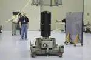
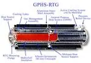

# RTG
> 2019.05.12 [🚀](../index/index.md) [despace](index.md) → [RTG](rtg.md), [SPS](sps.md), [TCS](tcs.md)

[TOC]

---

> <small>**Radioisotope thermoelectric generator (RTG), Radioisotope heater unit (RHU)** — EN term. **Радиоизотопный термоэлектрический генератор (РИТЭГ), Радиоизотопный источник тепла (РИТ)** — RU analogue.</small>

**Radioisotope thermoelectric generator (RTG)** — a radioisotope source of electricity that uses thermal energy released during the natural decay of radioactive isotopes & converts it into [electricity](sps.md) using a thermoelectric generator.

**Radioisotope heater unit (RHU), Radioisotope heat source (RHS)** — a radioisotope heat source that uses thermal energy released during the natural decay of radioactive isotopes. Usually smaller & simpler than an RTG.

Compared to [nuclear reactors](nr.md), which use a chain reaction, RTGs are much smaller & structurally simpler. The output power of the RTG is very low (up to several hundred watts) with a low efficiency (≤10 % of the thermal energy). On the other hand, they have no moving parts & do not require maintenance throughout their entire [service life](lifetime.md), which can be calculated in decades.

**Application area**

|*[Mercury](mercury.md)*|*[Venus](venus.md)*|*[Earth](earth.md)*|*[Moon](moon.md)*|*[Mars]( mars.md)*|*[And further](index.md)*|
|:--|:--|:--|:--|:--|:--|
|+|In orbit|+|+|+|+|

**Images**

|RTG SC “[New Horizons](new_horizons.md)”| Scheme of the RTG used on the SC “[Cassini Huygens](cassini_huygens.md)”|RTG SNAP‑27, used in flight “[Apollo 14](apollo_14.md)” (in the center)|
|:--|:--|:--|
||||

**Varieties**

| |*[Company](contact.md)*|*Actual*|
|:--|:--|:--|
|**RU**|[RFNC‑VNIIEF](contact/vniief.md)|**RHU:** [TB‑8,5](rtg_lst.md)  **RTG:** [RITEG‑238‑6,5/3](rtg_lst.md)|
|•|• • • • • • • • • • •|• • •|
|**US**|City Labs|P200|

## Application
RTGs are applicable as energy sources for autonomous systems remote from traditional power supply sources & requiring several tens or hundreds of watts with a very long operating time, too long for fuel cells or accumulators.

**In space**  
RTGs are the main power supply source for spacecraft performing a long mission & moving far from the Sun (for example, [Voyager](voyager.md)), where the use of [solar batteries](sp.md) is ineffective or impossible.

   - In the spacecraft [New Horizons](new_horizons.md) Plutonium‑238 was used as fuel for the RTG: 11 ㎏ ²³⁸PuO₂ (Plutonium‑238 dioxide) produces an average of 220 W of electricity throughout the entire journey (240 W at the beginning and, according to calculations, 200 W at the end).
   - SC [Galileo](galileo.md) & [Cassini Huygens](cassini_huygens.md) also use RTGs with ²³⁸PuO₂.
   - The rover [Curiosity](msl.md) uses an RTG with ²³⁸PuO₂. The rover uses the latest generation of RTGs called the Multi‑Mission Radioisotope Thermoelectric Generator (produces 125 W of electrical power, & after 14 years, 100 W).
   - Several kilograms of ²³⁸PuO₂ were used on some Apollo flights to power ALSEP instruments. The SNAP‑27 (Systems for Nuclear Auxiliary Power) power generator, with a thermal & electrical power of 1 480 W & 63.5 W, respectively, contained 3.735 ㎏ ²³⁸PuO₂.

**On Earth**  
RTGs were used in navigation beacons, radio beacons, weather stations & similar equipment installed in areas where it is impossible to use other power sources. In particular, in the USSR they were used as power supplies for navigation equipment installed on the coast of the Arctic Ocean along the Northern Sea Route. Currently, due to the risk of leakage of radiation & radioactive materials, the practice of installing unattended RTGs in inaccessible places has been discontinued.  
In the USA, RTGs were used not only for land‑based power supplies, but also for sea buoys & subsea installations. For example, in 1988, the USSR discovered two American RTGs next to Soviet communication cables in the Sea of ​​Okhotsk. The exact number of RTGs installed by the USA is unknown, estimates of independent organizations indicated 100 ‑ 150 installations in 1992.  
Plutonium‑236 & plutonium‑238 were used for the manufacture of atomic electric batteries, the service life of which reaches 5 years or more. They are used in current generators that stimulate the heart (pacemaker). As of 2003, there were 50 ‑ 100 people in the United States with a plutonium pacemaker. Before the ban on plutonium‑238 production in the United States, it was expected that its use could extend to suits of divers & astronauts.

## Fuel
Radioactive materials for RTGs must meet the following characteristics:

   - Sufficiently high volumetric activity to obtain significant energy release in a limited volume of the installation. The minimum volume is limited by the thermal & radiation resistance of the materials; weakly active isotopes worsen the energy‑mass perfection of the installation. This usually means that the half‑life of the isotope should be short enough for high decay rates, & decay should give a lot of easily utilized energy.
   - Sufficient hold‑up time to complete the task. This usually means that the half‑life of the isotope must be large enough for a given rate of energy release. Typical half‑lives of isotopes used in RTGs are several decades.
   - Convenient type of ionizing radiation for energy recovery. Gamma radiation easily flies out of the structure, carrying away the decay energy. Neutrons can also escape relatively easily. High‑energy electrons formed during β‑decay are well delayed, however, bremsstrahlung X‑ray radiation is formed, which carries away part of the energy. During α‑decay, massive α‑particles are formed, effectively giving up their energy practically at the point of formation.
   - A type of ionizing radiation that is safe for the environment & equipment. Significant gamma, X‑ray & neutron radiation often require special design measures to protect personnel & nearby equipment.
   - Relative cheapness & simplicity of isotope production with current nuclear technologies.

Plutonium‑238, curium‑244 & strontium‑90 are the most commonly used isotopes. Other isotopes such as polonium‑210, promethium‑147, cesium‑137, cerium‑144, ruthenium‑106, cobalt‑60, curium‑242 & thulium isotopes have also been studied. For example, polonium‑210 has a half‑life of only 138 days with an enormous initial heat dissipation of 140 W/gram. Americium‑241 with a half‑life of 433 years & a heat release of 0.1 W/gram.

Plutonium‑238 is most commonly used in spacecraft. Alpha decay with an energy of 5.5 MeV (one gram gives ~0.54 W). The half‑life is 88 years (the power loss is 0.78 %/year) with the formation of the highly stable isotope ²³⁴U. Plutonium‑238 is an almost pure alpha emitter, making it one of the safest radioactive isotopes with minimal biological shielding requirements. However, obtaining a relatively pure isotope 238 requires the operation of special reactors, which makes it expensive.

Strontium‑90 was widely used in Soviet & American ground‑based RTGs. A chain of two β‑decays gives a total energy of 2.8 MeV (one gram gives ~0.46 W). The half‑life is 29 years with the formation of a stable ⁹⁰Zr. Strontium‑90 is obtained from spent nuclear fuel in large quantities. The cheapness & abundance of this isotope determines its widespread use in ground equipment. Unlike plutonium‑238, strontium‑90 generates a significant level of high‑permeability ionizing radiation, which places relatively high demands on biological protection.

There is a concept of subcritical RTGs. The subcritical generator consists of a neutron source & fissile material. Source neutrons are captured by fissile nuclei & cause their fission. The main advantage of such a generator is that the energy released during the fission reaction is much higher than the alpha decay energy. For example, for plutonium‑238 it is about 200 MeV versus 5.6 MeV released by this nuclide during alpha decay. Accordingly, the required amount of the substance is much lower. The number of decays & radiation activity in terms of heat release is also lower. This reduces the weight & dimensions of the generator.

 

## Docs & links
|Navigation|
|:--|
|**[FAQ](faq.md)**【**[SCS](scs.md)**·КК, **[SC (OE+SGM)](sc.md)**·КА】**[CON](contact.md)·[Pers](person.md)**·Контакт, **[Ctrl](control.md)**·Упр., **[Doc](doc.md)**·Док., **[Drawing](drawing.md)**·Чертёж, **[EF](ef.md)**·ВВФ, **[Error](error.md)**·Ошибки, **[Event](event.md)**·События, **[FS](fs.md)**·ТЭО, **[HF&E](hfe.md)**·Эрго., **[KT](kt.md)**·КТ, **[N&B](nnb.md)**·БНО, **[Project](project.md)**·Проект, **[QM](qm.md)**·БКНР, **[R&D](rnd.md)**·НИОКР, **[SI](si.md)**·СИ, **[Test](test.md)**·ЭО, **[TRL](trl.md)**·УГТ, **[Way](way.md)**·Пути|
|*Sections & pages*|
|**【[Radioisotope thermoelectric generator (RTG)](rtg.md)】**  …  • • •  **RU:** [RITEG-238-6,5/3](rtg_lst.md)・ [TB-8,5](rtg_lst.md)|
|**【Thermal control system (TCS)】**  [Thermal characteristics](thermal_chars.md)・ [Гермоконтейнер](гермоконтейнер.md)・ [Насосы для СОТР](сотр_насос.md)・ [Покрытия для СОТР](сотр_покрытия.md)・ [Радиатор](радиатор.md)・ [РИТ (РИТЭГ)](rtg.md)・ [Стандартные условия](sctp.md)・ [Тепловая труба](hp.md)・ [ТЗП](hs.md)・ [Тепловой аккумулятор](heat_bank.md)・ [ТСП](tsp.md)・ [Шторка](thermal_curtain.md)・ [ЭВТИ](mli.md)|
|**【[Spacecraft power system (SPS)](sps.md)】**  [Charge eff.](charge_eff.md)・ [EAS](eas.md)・ [EB](eb.md)・ [EMI, RFI](emi.md)・ [NR](nr.md)・ [Rotor](iu.md)・ [RTG](rtg.md)・ [Solar cell](sp.md)・ [SP](sp.md)・ [SPB/USPB](suspb.md)・ [Voltage](sps.md)・ [WT](wt.md) • • •  **RF/CIF:** [BAK‑01](eas_lst.md)・ [KAS‑LOA](eas_lst.md)|

   1. Docs: …
   1. <https://ru.wikipedia.org/wiki/Радиоизотопный_термоэлектрический_генератор>
   1. <https://en.wikipedia.org/wiki/Radioisotope_thermoelectric_generator>
   1. 2014.07.27 [Хабр: РИТЭГ: прозаичные тепло и электричество для космических аппаратов ⎆](https://habr.com/ru/post/231197/) — [archived ❐](f/archive/20140727_1.pdf) 2019.02.08
