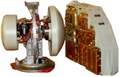
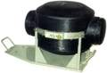
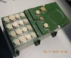
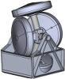
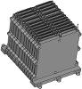
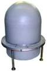

# RW (a list)
> 2019.07.31 [🚀](../index/index.md) [despace](index.md) → [Sensor](sensor.md)

[TOC]

---

A list of [Reaction wheels](sensor.md).

## Current

 

### Agat‑5 (RU)
> <small>**Агат‑5** — русскоязычный термин, не имеющий аналога в английском языке. **Agat-5** — дословный перевод с русского на английский.</small>

**Агат‑5** — инерциальное устройство ([двигатель‑маховик](iu.md)), предназначенное для использования в качестве исполнительного органа системы ориентации и стабилизации [космического аппарата](sc.md).  
*Разработчик:* [НПЦ Полюс](contact/polus_tomsk.md). Разработано в 1995 году активное применение

|*Characteristics*|*[Value](si.md)  (Агат‑5)*|
|:--|:--|
|Composition|Single unit (1 БЭ, 1 УДМ)|
|Consumption, W|80 постоянно, 175 макс.|
|Dimensions, ㎜| |
|[Interfaces](interface.md)| |
|[Lifetime](lifetime.md)/Resource, h(y)|… / 100 000 (11.4)|
|Mass, ㎏|87|
|[Overload](vibration.md), Grms| |
|[Rad.resist](ion_rad.md), ㏉ (㎭)| |
|[Reliability](qm.md) per [lifetime](lifetime.md)| |
|[Thermal range](tcs.md), ℃| |
|[TRL](trl.md)|9|
|[Voltage](sps.md), V| |
|**【Specific】**|• • •|
|Kinetic moment, N·m·s|100|
|Max ctrl moment, N·m|0.125|
|Ready mode| |
||

**Notes:**

   1. <http://www.polus.tomsknet.ru/?:id=211>
   1. **Applicability:** …

 

### Agat‑10 (RU)
> <small>**Агат‑10** — русскоязычный термин, не имеющий аналога в английском языке. **Agat-10** — дословный перевод с русского на английский.</small>

**Агат‑10** — инерциальное устройство ([двигатель‑маховик](iu.md)), предназначенное для использования в качестве исполнительного органа системы ориентации и стабилизации [космического аппарата](sc.md).  
*Разработчик:* [НПЦ Полюс](contact/polus_tomsk.md). Разработано в 1995 году активное применение

|*Characteristics*|*[Value](si.md)  (Агат‑10)*|
|:--|:--|
|Composition|Single unit (1 БЭ, 1 УДМ)|
|Consumption, W|45 постоянно, 95 макс.|
|Dimensions, ㎜| |
|[Interfaces](interface.md)| |
|[Lifetime](lifetime.md)/Resource, h(y)|… / 70 000 (8)|
|Mass, ㎏|39|
|[Overload](vibration.md), Grms| |
|[Rad.resist](ion_rad.md), ㏉ (㎭)| |
|[Reliability](qm.md) per [lifetime](lifetime.md)| |
|[Thermal range](tcs.md), ℃| |
|[TRL](trl.md)|9|
|[Voltage](sps.md), V| |
|**【Specific】**|• • •|
|Kinetic moment, N·m·s|250|
|Max ctrl moment, N·m|0.1|
|Ready mode| |
| ||

**Notes:**

   1. <http://www.polus.tomsknet.ru/?:id=211>
   1. **Applicability:** …

 

### Agat‑15 (RU)
> <small>**Агат‑15** — русскоязычный термин, не имеющий аналога в английском языке. **Agat-15** — дословный перевод с русского на английский.</small>

**Агат‑15** — инерциальное устройство ([двигатель‑маховик](iu.md)), предназначенное для использования в качестве исполнительного органа системы ориентации и стабилизации [космического аппарата](sc.md).  
Разработчик [НПЦ Полюс](contact/polus_tomsk.md). Разработано в 2005 году Активное использование. Покупное изделие. <small>(по состоянию на 21.06.2017)</small>

|*Characteristics*|*[Value](si.md)  (Агат‑15)*|
|:--|:--|
|Composition|4 УДМ [УДМ‑15‑0,15](rw_lst.md); 1 БА.  БА содержит 4 канала управления моментом. Каждый из каналов управления моментом управляет соответствующим УДМ. Агат‑15 обеспечивает формирование динамических моментов по осям вращения каждого УДМ.|
|Consumption, W|–75 ‑ +145 (для 2 работающих УДМ)|
|Dimensions, ㎜| |
|[Interfaces](interface.md)| |
|[Lifetime](lifetime.md)/Resource, h(y)|… (); 1 000 при выходе кинетического момента за допустимые нормы / 100 000 (11.4); 2 500 циклов вкл/выкл|
|Mass, ㎏|21 (3.7 УДМ; 6.2 БА)|
|[Overload](vibration.md), Grms| |
|[Rad.resist](ion_rad.md), ㏉ (㎭)| |
|[Reliability](qm.md) per [lifetime](lifetime.md)|0.98 за 11.4 года; 0.99799 за 3 года|
|[Thermal range](tcs.md), ℃| |
|[TRL](trl.md)| |
|[Voltage](sps.md), V|27 (24  ‑ 28)|
|**【Specific】**|• • •|
|Kinetic moment, N·m·s|± 15 для каждого УДМ|
|Max ctrl moment, N·m| |
|Ready mode|1 s с момента подачи напряжения|
| | |

**Notes:**

   1. [3D-модель ❐](f/iu/a/agat_15_ba_3d_2017.7z)・ [Чертёж блока автоматики ❐](f/iu/a/agat_15_ba_sketch_2015.djvu)
   1. <http://polus.tomsknet.ru/?:id=211> *([Архивировано ❐](f/iu/a/agat_15_polus_tomsknet_ru.djvu) 2018.03.07)*
   1. **Applicability:** [Венера‑Д](венера‑д.md)・ [Luna‑26](луна_26.md)

 

### Agat‑40 (RU)
> <small>**Агат‑40** — русскоязычный термин, не имеющий аналога в английском языке. **Agat-40** — дословный перевод с русского на английский.</small>

**Агат‑40** — инерциальное устройство ([двигатель‑маховик](iu.md)), предназначенное для использования в качестве исполнительного органа системы ориентации и стабилизации [космического аппарата](sc.md).  
Разработчик [НПЦ Полюс](contact/polus_tomsk.md). Разработано. Активное использование. Покупное изделие (на 2018.03.07).

|*Characteristics*|*[Value](si.md)  (Агат‑40)*|
|:--|:--|
|Composition|1 БЭ, 4 УДМ|
|Consumption, W|–200 ‑ +200|
|Dimensions, ㎜|⌀ 368 × 110 — УДМ;  200 × 200 × 340|
|[Interfaces](interface.md)| |
|[Lifetime](lifetime.md)/Resource, h(y)|133 650 (15.25);  1 000 при выходе кинетического момента за допустимые нормы / 148 920 (17);  5 000 команд|
|Mass, ㎏|39.5 (8.25 УДМ, 6.5 БЭ)|
|[Overload](vibration.md), Grms| |
|[Rad.resist](ion_rad.md), ㏉ (㎭)| |
|[Reliability](qm.md) per [lifetime](lifetime.md)|0.99|
|[Thermal range](tcs.md), ℃| |
|[TRL](trl.md)| |
|[Voltage](sps.md), V|25 ‑ 28|
|**【Specific】**|• • •|
|Kinetic moment, N·m·s|±40|
|Max ctrl moment, N·m| |
|Ready mode| |
| |||

**Notes:**

   1. [3D‑модель ❐](f/iu/a/agat_40_3d.7z)・ [Чертежи ❐](f/iu/a/agat_40_sketches.pdf) (БА и УДМ)
   1. **Applicability:** Экспресс‑АМ5・ Экспресс‑АМ6・ Ямал‑401・ Благосвет・ [Электро‑Л](электро_л.md) №3

 

### DM1-20 (RU)
> <small>**ДМ1-20** — русскоязычный термин, не имеющий аналога в английском языке. **DM1-20** — дословный перевод с русского на английский.</small>

**ДМ1-20** — инерциальное устройство ([двигатель‑маховик](iu.md)), предназначенное для использования в качестве исполнительного органа системы ориентации и стабилизации [космического аппарата](sc.md).  
*Разработчик:* [ВНИИЭМ](contact/vniiem.md). Разработано ранее 2015 года активное применение

|*Characteristics*|*[Value](si.md)  (dm1-20)*|
|:--|:--|
|Composition|Single unit (1 БЭ, 2 УДМ)|
|Consumption, W|3 постоянно, 15 макс.|
|Dimensions, ㎜| |
|[Interfaces](interface.md)| |
|[Lifetime](lifetime.md)/Resource, h(y)|… / 45 000 (5.1)|
|Mass, ㎏|1.4|
|[Overload](vibration.md), Grms| |
|[Rad.resist](ion_rad.md), ㏉ (㎭)| |
|[Reliability](qm.md) per [lifetime](lifetime.md)| |
|[Thermal range](tcs.md), ℃| |
|[TRL](trl.md)|9|
|[Voltage](sps.md), V|24 ‑ 34|
|**【Specific】**|• • •|
|Kinetic moment, N·m·s|1|
|Max ctrl moment, N·m|20|
|Ready mode| |
| ||

**Notes:**

   1. <http://www.vniiem.ru/ru/index.php?:view=article&id=288:2010-02-17-21-42-21>
   1. **Applicability:** Метеор‑М・ Татьяна‑2

 

### DM5-50 (RU)
> <small>**ДМ5-50** — русскоязычный термин, не имеющий аналога в английском языке. **DM5-50** — дословный перевод с русского на английский.</small>

**ДМ5-50** — инерциальное устройство ([двигатель‑маховик](iu.md)), предназначенное для использования в качестве исполнительного органа системы ориентации и стабилизации [космического аппарата](sc.md).  
*Разработчик:* [ВНИИЭМ](contact/vniiem.md). Разработано ранее 2015 года активное применение

|*Characteristics*|*[Value](si.md)  (dm5-50)*|
|:--|:--|
|Composition|Single unit (2 УДМ, 1 БЭ)|
|Consumption, W|4 постоянно, 31 макс.|
|Dimensions, ㎜| |
|[Interfaces](interface.md)| |
|[Lifetime](lifetime.md)/Resource, h(y)|… / 50 000 (5.7)|
|Mass, ㎏|3.8|
|[Overload](vibration.md), Grms| |
|[Rad.resist](ion_rad.md), ㏉ (㎭)| |
|[Reliability](qm.md) per [lifetime](lifetime.md)| |
|[Thermal range](tcs.md), ℃| |
|[TRL](trl.md)|9|
|[Voltage](sps.md), V|24 ‑ 34|
|**【Specific】**|• • •|
|Kinetic moment, N·m·s|5|
|Max ctrl moment, N·m|50|
|Ready mode| |
| ||

**Notes:**

   1. <http://www.vniiem.ru/ru/index.php?:view=article&id=288:2010-02-17-21-42-21>
   1. **Applicability:** …

 

### DM-10-25 (RU)
> <small>**ДМ-10-25** — русскоязычный термин, не имеющий аналога в английском языке. **DM-10-25** — дословный перевод с русского на английский.</small>

**ДМ-10-25** — инерциальное устройство ([двигатель‑маховик](iu.md)), предназначенное для использования в качестве исполнительного органа системы ориентации и стабилизации [космического аппарата](sc.md).  
*Разработчик:* [ВНИИЭМ](contact/vniiem.md). Разработано ранее 2015 года активное применение

|*Characteristics*|*[Value](si.md)  (ДМ-10-25)*|
|:--|:--|
|Composition|Single unit (1 БЭ, 2 УДМ)|
|Consumption, W|5 постоянно, 31 макс.|
|Dimensions, ㎜| |
|[Interfaces](interface.md)| |
|[Lifetime](lifetime.md)/Resource, h(y)|… / 50 000 (5.7)|
|Mass, ㎏|4|
|[Overload](vibration.md), Grms| |
|[Rad.resist](ion_rad.md), ㏉ (㎭)| |
|[Reliability](qm.md) per [lifetime](lifetime.md)| |
|[Thermal range](tcs.md), ℃| |
|[TRL](trl.md)|9|
|[Voltage](sps.md), V|24 ‑ 34|
|**【Specific】**|• • •|
|Kinetic moment, N·m·s|10|
|Max ctrl moment, N·m|25|
|Ready mode| |
| ||

**Notes:**

   1. <http://www.vniiem.ru/ru/index.php?:view=article&id=288:2010-02-17-21-42-21>
   1. **Applicability:** …

 

### DM14-120 (RU)
> <small>**ДМ14-120** — русскоязычный термин, не имеющий аналога в английском языке. **DM14-120** — дословный перевод с русского на английский.</small>

**ДМ14-120** — инерциальное устройство ([двигатель‑маховик](iu.md)), предназначенное для использования в качестве исполнительного органа системы ориентации и стабилизации [космического аппарата](sc.md).  
*Разработчик:* [ВНИИЭМ](contact/vniiem.md). Разработано в … году разработка

|*Characteristics*|*[Value](si.md)  (dm14-120)*|
|:--|:--|
|Composition|1 БЭ, 2 УДМ|
|Consumption, W|5.5 постоянно, 65 макс.|
|Dimensions, ㎜| |
|[Interfaces](interface.md)| |
|[Lifetime](lifetime.md)/Resource, h(y)|… / 50 000 (5.7)|
|Mass, ㎏|6.3|
|[Overload](vibration.md), Grms| |
|[Rad.resist](ion_rad.md), ㏉ (㎭)| |
|[Reliability](qm.md) per [lifetime](lifetime.md)| |
|[Thermal range](tcs.md), ℃| |
|[TRL](trl.md)|4|
|[Voltage](sps.md), V|24 ‑ 34|
|**【Specific】**|• • •|
|Kinetic moment, N·m·s|14|
|Max ctrl moment, N·m|120|
|Ready mode| |
| ||

**Notes:**

   1. <http://www.vniiem.ru/ru/index.php?:view=article&id=288:2010-02-17-21-42-21>
   1. **Applicability:** …

 

### DM20-250 (RU)
> <small>**ДМ20-250** — русскоязычный термин, не имеющий аналога в английском языке. **DM20-250** — дословный перевод с русского на английский.</small>

**ДМ20-250** — инерциальное устройство ([двигатель‑маховик](iu.md)), предназначенное для использования в качестве исполнительного органа системы ориентации и стабилизации [космического аппарата](sc.md).  
*Разработчик:* [ВНИИЭМ](contact/vniiem.md). Разработано ранее 2015 года активное применение

|*Characteristics*|*[Value](si.md)  (dm20-250)*|
|:--|:--|
|Composition|Single unit (1 БЭ, 2 УДМ)|
|Consumption, W|6 постоянно, 70 макс.|
|Dimensions, ㎜| |
|[Interfaces](interface.md)| |
|[Lifetime](lifetime.md)/Resource, h(y)|… / 45 000 (5.1)|
|Mass, ㎏|11.5|
|[Overload](vibration.md), Grms| |
|[Rad.resist](ion_rad.md), ㏉ (㎭)| |
|[Reliability](qm.md) per [lifetime](lifetime.md)| |
|[Thermal range](tcs.md), ℃| |
|[TRL](trl.md)|9|
|[Voltage](sps.md), V|24 ‑ 34|
|**【Specific】**|• • •|
|Kinetic moment, N·m·s|20|
|Max ctrl moment, N·m|250|
|Ready mode| |
| ||

**Notes:**

   1. <http://www.vniiem.ru/ru/index.php?:view=article&id=288:2010-02-17-21-42-21>
   1. **Applicability:** …

 

### DMB (RU)
> <small>**ДМБ** — русскоязычный термин, не имеющий аналога в английском языке. **DMB** — дословный перевод с русского на английский.</small>

**ДМБ** — инерциальное устройство ([двигатель‑маховик](iu.md)), предназначенное для использования в качестве исполнительного органа системы ориентации и стабилизации [космического аппарата](sc.md).  
*Разработчик:* [ВНИИЭМ](contact/vniiem.md). Разработано ранее 2015 года активное применение

|*Characteristics*|*[Value](si.md)  (ДМБ)*|
|:--|:--|
|Composition|1 БЭ, 1 УДМ|
|Consumption, W|7 постоянно, 100 макс.|
|Dimensions, ㎜| |
|[Interfaces](interface.md)| |
|[Lifetime](lifetime.md)/Resource, h(y)|… / 29 930 (3.4)|
|Mass, ㎏|17.5 (13.8 УДМ, 3.7 БЭ)|
|[Overload](vibration.md), Grms| |
|[Rad.resist](ion_rad.md), ㏉ (㎭)| |
|[Reliability](qm.md) per [lifetime](lifetime.md)| |
|[Thermal range](tcs.md), ℃| |
|[TRL](trl.md)|9|
|[Voltage](sps.md), V|24 ‑ 34|
|**【Specific】**|• • •|
|Kinetic moment, N·m·s|29.4|
|Max ctrl moment, N·m|350|
|Ready mode| |
| ||

**Notes:**

   1. <http://www.vniiem.ru/ru/index.php?:view=article&id=288:2010-02-17-21-42-21>
   1. **Applicability:** …

 

### GD-02-150 (RU)
> <small>**ГД-02-150** — русскоязычный термин, не имеющий аналога в английском языке. **GD-02-150** — дословный перевод с русского на английский.</small>

**ГД-02-150** — инерциальное устройство ([двигатель‑маховик](iu.md)), предназначенное для использования в качестве исполнительного органа системы ориентации и стабилизации [космического аппарата](sc.md).  
*Разработчик:* [НПЦ Полюс](contact/polus_tomsk.md). Разработано в 2007 году активное применение

|*Characteristics*|*[Value](si.md)  (ГД-02-150)*|
|:--|:--|
|Composition|Single unit|
|Consumption, W|75 постоянно, 145 макс.|
|Dimensions, ㎜| |
|[Interfaces](interface.md)| |
|[Lifetime](lifetime.md)/Resource, h(y)|… / 100 000 (11.4)|
|Mass, ㎏| |
|[Overload](vibration.md), Grms| |
|[Rad.resist](ion_rad.md), ㏉ (㎭)| |
|[Reliability](qm.md) per [lifetime](lifetime.md)| |
|[Thermal range](tcs.md), ℃| |
|[TRL](trl.md)|9|
|[Voltage](sps.md), V| |
|**【Specific】**|• • •|
|Kinetic moment, N·m·s|150|
|Max ctrl moment, N·m|2|
|Ready mode| |
| ||

**Notes:**

   1. <http://www.polus.tomsknet.ru/?:id=211>
   1. **Applicability:** …

 

### GD-200-125 (RU)
> <small>**ГД-200-125** — русскоязычный термин, не имеющий аналога в английском языке. **GD-200-125** — дословный перевод с русского на английский.</small>

**ГД-200-125** — инерциальное устройство ([двигатель‑маховик](iu.md)), предназначенное для использования в качестве исполнительного органа системы ориентации и стабилизации [космического аппарата](sc.md).  
*Разработчик:* [НПЦ Полюс](contact/polus_tomsk.md). Разработано в 2007 году активное применение

|*Characteristics*|*[Value](si.md)  (ГД-200-125)*|
|:--|:--|
|Composition|Single unit|
|Consumption, W|75 постоянно, 160 макс.|
|Dimensions, ㎜| |
|[Interfaces](interface.md)| |
|[Lifetime](lifetime.md)/Resource, h(y)|… / 150 000 (17)|
|Mass, ㎏| |
|[Overload](vibration.md), Grms| |
|[Rad.resist](ion_rad.md), ㏉ (㎭)| |
|[Reliability](qm.md) per [lifetime](lifetime.md)| |
|[Thermal range](tcs.md), ℃| |
|[TRL](trl.md)|9|
|[Voltage](sps.md), V| |
|**【Specific】**|• • •|
|Kinetic moment, N·m·s|200|
|Max ctrl moment, N·m|125|
|Ready mode| |
| ||

**Notes:**

   1. <http://www.polus.tomsknet.ru/?:id=211>
   1. **Applicability:** …

 

### MDM-0,5 (RU)
> <small>**МДМ-0,5** — русскоязычный термин, не имеющий аналога в английском языке. **MDM-0,5** — дословный перевод с русского на английский.</small>

**МДМ-0,5** — инерциальное устройство ([двигатель‑маховик](iu.md)), предназначенное для использования в качестве исполнительного органа системы ориентации и стабилизации [космического аппарата](sc.md).  
*Разработчик:* [НПЦ Полюс](contact/polus_tomsk.md). Разработано в 2007 году активное применение

|*Characteristics*|*[Value](si.md)  (МДМ-0,5)*|
|:--|:--|
|Composition|1 БЭ, 2 УДМ|
|Consumption, W|2 постоянно, 15 макс.|
|Dimensions, ㎜| |
|[Interfaces](interface.md)| |
|[Lifetime](lifetime.md)/Resource, h(y)|… / 150 000 (17)|
|Mass, ㎏|2.8 (1.2 УДМ, 0.4 БЭ)|
|[Overload](vibration.md), Grms| |
|[Rad.resist](ion_rad.md), ㏉ (㎭)| |
|[Reliability](qm.md) per [lifetime](lifetime.md)| |
|[Thermal range](tcs.md), ℃| |
|[TRL](trl.md)|9|
|[Voltage](sps.md), V| |
|**【Specific】**|• • •|
|Kinetic moment, N·m·s|0.5|
|Max ctrl moment, N·m|0.015|
|Ready mode| |
| ||

**Notes:**

   1. <http://www.polus.tomsknet.ru/?:id=211>
   1. **Applicability:** …

 

### MDM-1,0 (RU)
> <small>**МДМ-1,0** — русскоязычный термин, не имеющий аналога в английском языке. **MDM-1,0** — дословный перевод с русского на английский.</small>

**МДМ-1,0** — инерциальное устройство ([двигатель‑маховик](iu.md)), предназначенное для использования в качестве исполнительного органа системы ориентации и стабилизации [космического аппарата](sc.md).  
*Разработчик:* [НПЦ Полюс](contact/polus_tomsk.md). Разработано в 2007 году активное применение

|*Characteristics*|*[Value](si.md)  (МДМ-1,0)*|
|:--|:--|
|Composition|1 БЭ, 2 УДМ|
|Consumption, W|2 постоянно, 20 макс.|
|Dimensions, ㎜| |
|[Interfaces](interface.md)| |
|[Lifetime](lifetime.md)/Resource, h(y)|… / 150 000 (17)|
|Mass, ㎏|3.4 (1.5 УДМ, 0.4 БЭ)|
|[Overload](vibration.md), Grms| |
|[Rad.resist](ion_rad.md), ㏉ (㎭)| |
|[Reliability](qm.md) per [lifetime](lifetime.md)| |
|[Thermal range](tcs.md), ℃| |
|[TRL](trl.md)|9|
|[Voltage](sps.md), V| |
|**【Specific】**|• • •|
|Kinetic moment, N·m·s|1|
|Max ctrl moment, N·m|0.02|
|Ready mode| |
| ||

**Notes:**

   1. <http://www.polus.tomsknet.ru/?:id=211>
   1. **Applicability:** …

 

### MDM-2-50 (RU)
> <small>**МДМ-2-50** — русскоязычный термин, не имеющий аналога в английском языке. **MDM-2-50** — дословный перевод с русского на английский.</small>

**МДМ-2-50** — инерциальное устройство ([двигатель‑маховик](iu.md)), предназначенное для использования в качестве исполнительного органа системы ориентации и стабилизации [космического аппарата](sc.md).  
*Разработчик:* [НПЦ Полюс](contact/polus_tomsk.md). Разработано в 2007 году активное применение

|*Characteristics*|*[Value](si.md)  (МДМ-2-50)*|
|:--|:--|
|Composition|Single unit (1 БЭ, 2 УДМ)|
|Consumption, W|3 постоянно, 39 макс.|
|Dimensions, ㎜| |
|[Interfaces](interface.md)| |
|[Lifetime](lifetime.md)/Resource, h(y)|… / 175 000 (20)|
|Mass, ㎏|4.5 (2 УДМ, 0.5 БЭ)|
|[Overload](vibration.md), Grms| |
|[Rad.resist](ion_rad.md), ㏉ (㎭)| |
|[Reliability](qm.md) per [lifetime](lifetime.md)| |
|[Thermal range](tcs.md), ℃| |
|[TRL](trl.md)|9|
|[Voltage](sps.md), V| |
|**【Specific】**|• • •|
|Kinetic moment, N·m·s|2|
|Max ctrl moment, N·m|0.05|
|Ready mode| |
| ||

**Notes:**

   1. <http://www.polus.tomsknet.ru/?:id=211>
   1. **Applicability:** …

 

### SGK-20-20 (RU)
> <small>**СГК-20-20** — русскоязычный термин, не имеющий аналога в английском языке. **SGK-20-20** — дословный перевод с русского на английский.</small>

**СГК-20-20** — инерциальное устройство ([двигатель‑маховик](iu.md)), предназначенное для использования в качестве исполнительного органа системы ориентации и стабилизации [космического аппарата](sc.md).  
*Разработчик:* [НПЦ Полюс](contact/polus_tomsk.md). Разработано в 2007 году активное применение

|*Characteristics*|*[Value](si.md)  (СГК-20-20)*|
|:--|:--|
|Composition|1 БЭ, 2 УДМ|
|Consumption, W|30 постоянно, 60 макс.|
|Dimensions, ㎜| |
|[Interfaces](interface.md)| |
|[Lifetime](lifetime.md)/Resource, h(y)|… / 150 000 (17)|
|Mass, ㎏|37 (8 БЭ, 14.5 УДМ)|
|[Overload](vibration.md), Grms| |
|[Rad.resist](ion_rad.md), ㏉ (㎭)| |
|[Reliability](qm.md) per [lifetime](lifetime.md)| |
|[Thermal range](tcs.md), ℃| |
|[TRL](trl.md)|9|
|[Voltage](sps.md), V| |
|**【Specific】**|• • •|
|Kinetic moment, N·m·s|20|
|Max ctrl moment, N·m|20|
|Ready mode| |
| ||

**Notes:**

   1. <http://www.polus.tomsknet.ru/?:id=211>
   1. **Applicability:** …

 

### UDM-15
> <small>**УДМ‑15** — русскоязычный термин, не имеющий аналога в английском языке. **UDM‑15** — дословный перевод с русского на английский.</small>

**Управляющий двигатель‑маховик «УДМ‑15»** — инерциальное устройство, предназначенное для использования в качестве исполнительного органа системы ориентации и стабилизации [космического аппарата](sc.md).  
Разработчик и изготовитель [НПЦ Полюс](contact/polus_tomsk.md); разработан в 2005 году Активное использование. Покупное изделие. (по состоянию на 21.06.2017)

|*Characteristics*|*[Value](si.md)  (UDM‑15)*|
|:--|:--|
|Composition|Single unit|
|Consumption, W|–37.5 ‑ +72.5 (для 2 работающих УДМ)|
|Dimensions, ㎜|80 × 315|
|[Interfaces](interface.md)| |
|[Lifetime](lifetime.md)/Resource, h(y)|… / 1 000 при выходе кинетического момента за допустимые нормы; 2 500 циклов вкл/выкл|
|Mass, ㎏|3.7|
|[Overload](vibration.md), Grms| |
|[Rad.resist](ion_rad.md), ㏉ (㎭)| |
|[Reliability](qm.md) per [lifetime](lifetime.md)|0.98|
|[Thermal range](tcs.md), ℃| |
|[TRL](trl.md)| |
|[Voltage](sps.md), V|27 — штатное;  от 24 до 28 — допустимое|
|**【Specific】**|• • •|
|Исполнение|Single unit|
|Kinetic moment, N·m·s|± 15|
|Ready mode|1 s с момента подачи напряжения|
| ||
| | Система координат УДМ‑15|

**Notes:**

   1. [3D-модель ❐](f/iu/a/agat_25_udm-15-0.15_3d_2017.7z)・ [Чертёж ❐](f/iu/a/agat_25_udm-15-0.15_sketch_2016.djvu)
   1. **Applicability:** [Венера‑Д](венера‑д.md)・ [Luna‑26](луна_26.md) (в составе [Агат‑15](rw_lst.md))

 

## Archive

 

### Koler-E (RU)
> <small>**Колер‑Э** — русскоязычный термин, не имеющий аналога в английском языке. **Koler-E** — дословный перевод с русского на английский.</small>

**Колер‑Э** — инерциальное устройство ([двигатель‑маховик](iu.md)), предназначенное для использования в качестве исполнительного органа системы ориентации и стабилизации [космического аппарата](sc.md).  
*Разработчик:* [НИИКП](contact/niicom.md). Разработано в … году архивное изделие

|*Characteristics*|*[Value](si.md)  (Колер‑Э)*|
|:--|:--|
|Composition|1 БЭ, 2 УДМ|
|Consumption, W|66 (65 БЭ, 0.5 УДМ)|
|Dimensions, ㎜|УДМ: ⌀315 × 72.5, БЭ: 338 × 280 × 230|
|[Interfaces](interface.md)| |
|[Lifetime](lifetime.md)/Resource, h(y)|87 600 (10) / …|
|Mass, ㎏|22.8 (4.6 УДМ, 13.6 БЭ)|
|[Overload](vibration.md), Grms| |
|[Rad.resist](ion_rad.md), ㏉ (㎭)| |
|[Reliability](qm.md) per [lifetime](lifetime.md)|0.967|
|[Thermal range](tcs.md), ℃| |
|[TRL](trl.md)|9|
|[Voltage](sps.md), V| |
|**【Specific】**|• • •|
|Kinetic moment, N·m·s| |
|Max ctrl moment, N·m| |
|Ready mode| |
| ||

**Notes:**

   1. …
   1. **Applicability:** …

 

## Docs & links (TRANSLATEME ALREADY)
|Navigation|
|:--|
|**[FAQ](faq.md)**【**[SCS](scs.md)**·КК, **[SC (OE+SGM)](sc.md)**·КА】**[CON](contact.md)·[Pers](person.md)**·Контакт, **[Ctrl](control.md)**·Упр., **[Doc](doc.md)**·Док., **[EF](ef.md)**·ВВФ, **[Error](error.md)**·Ошибки, **[Event](event.md)**·События, **[FS](fs.md)**·ТЭО, **[HF&E](hfe.md)**·Эрго., **[KT](kt.md)**·КТ, **[Model](model.md)**·Модель, **[N&B](nnb.md)**·БНО, **[Project](project.md)**·Проект, **[QM](qm.md)**·БКНР, **[R&D](rnd.md)**·НИОКР, **[SI](si.md)**·СИ, **[Test](test.md)**·ЭО, **[TRL](trl.md)**·УГТ, **[Way](way.md)**·Пути|
|*Sections & pages*|
|**`Двигатель‑маховик (ДМ):`**  … • • •  **РФ:** [ДМБ](rw_lst.md) (29.4/350)・ [Агат‑10](rw_lst.md) (250/0.1)・ [ДМ20-250](rw_lst.md) (20/250)・ [ГД-200-125](rw_lst.md) (200/125)・ [ГД-02-150](rw_lst.md) (150/2)・ [ДМ14-120](rw_lst.md) (14/120)・ [Агат‑5](rw_lst.md) (100/0.125)・ [ДМ5-50](rw_lst.md) (5/50)・ [Агат‑40](rw_lst.md) (40/…)・ [ДМ10-25](rw_lst.md) (10/25)・ [ДМ1-20](rw_lst.md) (1/20)・ [СГК-20-20](rw_lst.md) (20/20)・ [Агат‑15](rw_lst.md) (15/0.15)・ [МДМ-2-50](rw_lst.md) (2/0.05)・ [МДМ-1,0](rw_lst.md) (1/0.02)・ [МДМ-0,5](rw_lst.md) (0.5/0.015)・ [SX-WH](sx_wh.md) (0.5 ‑ 0.03/…)・ [SX-GY](sx_gy.md) (0.04/…)|

   1. Docs: …
   1. Notable interwikies — …
   1. …

