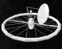

# Космические города‑бублики
> 2019.05.12 [🚀](../index/index.md) [despace](index.md) → [косм.города‑бублики.md](rwss.md), **[Project](project.md)**

[TOC]

---

> <small>**Космические города‑бублики** — русскоязычный термин. **Rotating wheel space station** — англоязычный эквивалент.</small>

**Космические поселения тороидальной формы** *(в просторечии «города‑бублики»)* — один из наиболее ранних проектов орбитальных космических поселений, гипотетически осуществимый при условии дальнейшей реализации предполагаемых вариантов освоения космоса. Основная цель разработки — создать промежуточное звено для космических полётов, которое бы дало возможность осуществлять запуск космических кораблей непосредственно с орбиты и, таким образом, снизило затраты и значительно упростило дальнейшее освоение космоса.

**Представители:**

   - [Nautilus-X](nautilus_x.md)
   - [Стэнфордский тор](stanford_torus.md)
   - [Цилиндр О’Нилла](oneill_cyl.md)

| |
|:--|
||

## Аргументы в пользу создания таких колоний
Освоение человеком массивных космических тел, таких как планет и спутников Солнечной системы наталкивается на ряд трудностей неразрешимого пока характера, связанных с гравитацией, температурным режимом и отсутствием защитной магнитосферы, поэтому поселение в космосе, при создании необходимых условий, — наиболее подходящий вариант.

Человек по своей природе на сегодняшнем этапе своего эволюционного развития в своей естественной среде обитания адаптирован к жизни на Земле, при этом обладает достаточно большой степенью приспосабливаемости и преобразования своей среды обитания под свои нужды. При этом к глобальным преобразованиям условий среды обитания целой планеты он ещё не готов, пока только на уровне тестирования технологий, при создании небольших космических поселений. Именно эта «обкатка технологий» сейчас и происходит на существующих космических станциях.

Почему же таким колониям предполагается именно форма тора?: Величина центробежной силы зависит от скорости вращения и радиуса. Исходя из этого можно подумать, что идеальной формой для космического объекта было бы тело, имеющее форму тора — «бублика». Если космическая станция такой формы вращается вокруг собственной оси тора, то все её помещения находятся в зоне, где искусственная сила тяжести имеет наибольшую величину.

Почему идея создания колоний в космосе получает преимущество над колонизацией планет?:
   - На Меркурии очень жарко, нет атмосферы, привычного суточного ритма. Но это не препятствие для перспективных космических технологий, однако пониженная сила тяжести (в сравнении с земной) является основным сдерживающим фактором для колонизации Меркурия.
   - Сила тяжести на Венере близка к силе тяжести на Земле и также довольно комфортна для людей. Однако, слишком высокая средняя температура на Венере (на 100 К выше чем на Меркурии) и сверхвысокое атмосферное давление на поверхности планеты, а также отсутствие привычного суточного ритма и магнитного поля, достаточного для защиты от радиации (что компенсируется крайне плотной венерианской атмосферой) делают освоение Венеры пока крайне затруднительным.
   - На Луне сравнительно жарко на дневной стороне и слишком холодно на ночной, нет атмосферы, привычного суточного ритма, сила тяжести относительно малая, нет магнитного поля, достаточного для защиты от радиации. И хотя эти условия также преодолимы для перспективных технологий, но пониженная сила тяжести ставит барьер на пути заселения Луны.
   - На Марсе достаточно холодно, атмосфера довольно разреженная и состоит в основном из углекислого газа, сила тяжести составляет всего 0.38 земной, слабое магнитного поле, недостаточно защищающее от космической радиации. Зато на Марсе в достатке вода. Современные и перспективные технологии позволяют заселить Марс, но как и в случае с Луной и Меркурием на Марсе остается нерешаемая в настоящее время проблема пониженной гравитации. (Точнее марсианская гравитация может оказаться вполне комфортной лишь для части людей.)
   - Посадка на планету и последующий ракетный старт с неё требуют больших энергетических, а значит и экономических затрат (правда материальные затраты на взлеты и посадки кораблей на планеты будут убывать по мере совершенствования двигательных установок кораблей, способных садиться на планеты).

Можно повысить или понизить температуру на планете, изменить её атмосферу, но пока технологически невозможно решить проблему, создаваемые пониженной гравитацией на Марсе, Луне или Меркурии, или проблемы из‑за слишком медленного вращения Венеры вокруг своей оси. К тому же у этих планет отсутствует достаточно мощная магнитосфера.

В связи с этим многим представляется более целесообразным строить космические колонии в открытом космосе (в том числе на орбитах около названых), используя материал астероидов, спутников, планет. В частности такие станции‑города около безжизненных планет могут стать «уютными жилыми пригородам», а сами эти планеты промышленным «центром города», куда жители станций будут летать на работу.

В таких замкнутых колониях в принципе можно добиться самообеспечения, на них или на планеты, спутниками которых они станут, можно переместить опасные и вредные производства и установить зеркала для накопления солнечной энергии.

На случай глобальных катастроф Земли планетарного масштаба у человечества появляется шанс сделать свою «резервную копию жизни» (человека и некоторых животных) в виде таких поселений в космосе.

## Критика
Несмотря на очевидные выгоды от строительства космических станций‑городов в форме бублика, существует и ряд существенных минусов. Возвращаясь обратно в 1960‑е, следует упомянуть что более детальное исследование, проведённое той же группой учёных для Американского общества астронавтики ещё в 1960‑х, показало, что «бублик» был далеко не идеальной формой для этой цели, ведь возможности космонавтики, как тогда так и сейчас, все ещё не позволяют развернуть в космосе строительство объектов таких размеров как [Стэнфордский тор](stanford_torus.md), а для станций малого размера существовало гораздо больше конструктивных и технических сложностей. Прежде всего, при относительно малых размерах космической станции нагрузки на различные части тела человека были бы различны в разных местах станции. Кроме того, пространство, в котором создаётся искусственая сила тяжести, создаёт проблемы другого характера, а именно визуального восприятия обстановки. В качестве примера можно привести спиральную лестницу, которая ведет к центру такого космического «бублика». Вестибулярный аппарат человека не сможет распознать спиральность формы лестницы, потому что уровень каждой её ступени будет перпендикулярен силе тяжести и, несмотря на то, что вестибулярные ощущения будут такими же, как и во время восхождения по обыкновенной «земной» лестнице, за исключением очень небольшого снижения силы тяжести, которое будет ощущаться, когда человек движется вверх, а затем снова ступает вниз по лестнице. Тем не менее, ощущения от движения по такой лестнице будут довольно необычными для человека привыкшего к однородному гравитационному полю, какое и есть на поверхности Земли, — достаточно представить себе двух людей, которые идут навстречу друг другу по такой спиралевидной лестнице, которые будут видеть друг друга идущими вниз головой и вверх ногами (к оси лестницы). Причем к этой проблеме уже в 1960‑е годы нашли подход. Профессор В.Р. Лавлейс так описывает способ её решения: при том, что компоновка помещений должна вестись в непривычной проекции — в развертке криволинейных поверхностей в плоскость, перпендикулярную вектору искусственной силы тяжести, и с точки зрения изготовления и монтажа отдельных элементов «бублик» удобнее делать не кругом, а многогранником. При этом возникнет казус: А ведь в таком «бублике» человек будет ходить словно бы по кривому полу, и, по‑видимому, психологически это обстоятельство будет не очень приятным, так же, как и обратное, когда кривой пол будет казаться плоско‑горизонтальным. Перед архитектором встанет очень сложная и деликатная задача: смягчить эти неприятности, зрительно успокоить человека. Это можно сделать, если выбрать форму помещений так, чтобы не подчеркивались неправильные углы и отражения. При этом можно будет использовать для этой цели физические свойства материалов, различные приёмы освещения.

Хотя разведение на них пищевых продуктов вполне реально, едва ли миллионы людей согласятся годами есть однообразную пищу, — возможности города‑бублика по производству разнообразной пищи прямо пропорциональны его размерам и следовательно внутренней площади. Предполагается, что материалом для городов‑бубликов станет сырьё, добытое на естественных телах Солнечной системы, а это значит, что всё равно придётся создавать хотя бы вахтовые поселения на планетах и их спутниках и астероидах. В целом же, проблема строительства космических станций‑колоний упирается в технологические проблемы современной и перспективной космической деятельности:

   - пока отсутствует надёжный и относительно дешёвый способ вывода грузов на орбиту (одним из вариантов решения мог бы стать космический лифт или одноступенчатые шаттлы с [ЯРД](ntr.md), — одноступенчатый корабль с химическими ракетными двигателями невозможен);
   - не созданы системы защиты станций и людей от космической радиации, хотя работы над этими проблемами ведутся, А.Г. Ребеко в своей публикации «Защита людей и космических аппаратов в космосе» делает выводы, что создание надежной защиты от космической радиации в принципе возможно. Для современной космонавтики технически приемлемым могут быть электростатические экраны, которые обещают быть не только легкими, но и способными защищать космический корабль от небольших метеоритов. Разработка таких устройств, их испытание в космосе является предметом фундаментальных исследований;
   - в связи с нерешённостью проекта термоядерного синтеза пока нет необходимости, в частности, в освоении Луны с её залежами [гелия‑3](helium3.md). Другими словами, существует проблема окупаемости данных (слишком дорогостоящих) проектов;
   - не создана искусственная гравитация.

 

## Docs & links (TRANSLATEME ALREADY)
|Navigation|
|:--|
|**[FAQ](faq.md)**, **[Cable](cable.md)**·БКС, **[Camera](cam.md)**·Камера, **[Comms](comms.md)**·Радио, **[CON](contact.md)·[Pers](person.md)**·Контакт, **[Control](control.md)**·Упр., **[Doc](doc.md)**·Док., **[Doppler](doppler.md)**·ИСР, **[DS](ds.md)**·ЗУ, **[EB](eb.md)**·ХИТ, **[ECO](ecology.md)**·Экол., **[EF](ef.md)**·ВВФ, **[ElC](elc.md)**·ЭКБ, **[EMC](emc.md)**·ЭМС, **[Error](error.md)**·Ошибки, **[Event](event.md)**·События, **[FS](fs.md)**·ТЭО, **[Fuel](fuel.md)**·Топливо, **[GNC](gnc.md)**·БКУ, **[GS](scs.md)**·НС, **[HF&E](hfe.md)**·Эрго., **[IU](iu.md)**·Гиро., **[KT](kt.md)**·КТЕХ, **[LAG](lag.md)**·ПУC, **[LES](les.md)**·САСП, **[LS](ls.md)**·СЖО, **[LV](lv.md)**·РН, **[MCC](mcc.md)**·ЦУП, **[Model](model.md)**·Модель, **[MSC](sc.md)**·ПКА, **[N&B](nnb.md)**·БНО, **[NR](nr.md)**·ЯР, **[OBC](obc.md)**·ЦВМ, **[OE](oe.md)**·БА, **[Pat.](патент.md)**·Патент, **[Proj.](project.md)**·Проект, **[PS](ps.md)**·ДУ, **[QM](qm.md)**·БКНР, **[R&D](rnd.md)**·НИОКР, **[Robot](robotics.md)**·Робот, **[Rover](rover.md)**·Ровер, **[RTG](rtg.md)**·РИТЭГ, **[SARC](sarc.md)**·ПСК, **[SE](se.md)**·СЭ, **[Sens.](sensor.md)**·Датч., **[SC](sc.md)**·КА, **[SCS](scs.md)**·КК, **[SGM](sgm.md)**·КММ, **[SI](si.md)**·СИ, **[Soft](soft.md)**·ПО, **[SP](sp.md)**·БС, **[Spaceport](spaceport.md)**·Космодр., **[SPS](sps.md)**·СЭС, **[SSS](sss.md)**·ГЗУ, **[TCS](tcs.md)**·СОТР, **[Test](test.md)**·ЭО, **[Timeline](timeline.md)**·ЦГМ, **[TMS](tms.md)**·ТМС, **[TOR](tor.md)**·ТЗ, **[TRL](trl.md)**·УГТ|
|*Sections & pages*|
|**【】**  <mark>NOCAT</mark>|

   1. Docs: …
   1. Notable interwikies — …
   1. <https://en.wikipedia.org/wiki/Rotating_wheel_space_station>
   1. <https://ru.wikipedia.org/wiki/Космические_города‑бублики>
