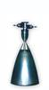
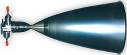

# S400
> 2019.05.12 [🚀](../index/index.md) [despace](index.md) → [PS](ps.md)

[TOC]

---

**S400** — 2‑component [engine](ps.md) by [OPC LAM](zz_opc_lam.md).

|*Characteristics*|*[Value](si.md)  (S400‑12)*|*[Value](si.md)  (S400‑15)*|
|:--|:--|:--|
|Composition| | |
|Consumption, W|35|35|
|Dimensions, ㎜|503 × 248|669 × 316|
|[Interfaces](interface.md)| | |
|[Lifetime](lifetime.md)/Resource, h(y)|… / …|… / …|
|Mass, ㎏|3.6|4.3|
|[Overload](vibration.md), Grms| | |
|[Rad.resist](ion_rad.md), ㏉ (㎭)| | |
|[Reliability](qm.md) per [lifetime](lifetime.md)| | |
|[Thermal range](tcs.md), ℃| | |
|[TRL](trl.md)|9|9|
|[Voltage](voltage.md), V| | |
|**【Specific】**|• • •|• • •|
|[Fuel](fuel.md)|[АТ (MON‑1, MON‑3) + MMH](at_plus.md)|[АТ (MON‑1, MON‑3) + MMH](at_plus.md)|
|Fuel — combustion products| | |
|Fuel — consumption, ㎏/s, ≤|0.135 (0.11 ‑ 0.142)|0.135 (0.11 ‑ 0.142)|
|Fuel — mass ratio of components|1.65 (1.5 ‑ 1.8)|1.65 (1.5 ‑ 1.8)|
|Mach number / [Adiabatic exponent](heat_cr.md)| | |
|Press. — comb. chamber, ㎫ (kgf/㎝²)|1.02 (10)|1.02 (10)|
|Press. — engine entrance, ㎫ (kgf/㎝²)|1.27 ‑ 1.88 (12.5 ‑ 18.5)|1.27 ‑ 1.88 (12.5 ‑ 18.5)|
|Press. — nozzle cut, ㎫ (kgf/㎝²)| | |
|Res. — fuel, ㎏, ≥|4 000|4 100|
|Res. — number of thrusts, ≥|100|135|
|Res. — total impulse, N·s (kgf·s), ≥| |
|Res. — total thrust, N (kgf), ≥|12 550 000 (1 280 000)|13 000 000 (1 325 000)|
|Res. — total thrust duration, s, ≥|29 900|30 600|
|Temp. — comb. chamber, К (℃)| | |
|Temp. — nozzle cut, К (℃)| | |
|Thrust, N (kgf)|420 (42.8)|425 (43.3)|
|Thrust — deviation, N (kgf)|340 ‑ 440 (34.65 ‑ 44.85)|340 ‑ 440 (34.65 ‑ 44.85)|
|Thrust — [Isp](isp.md), N·s/㎏ (s), ≥|3 120 (318)|3150 (321)|
|Thrust — max duration of 1 thrust, s|4 000|6 700|
|Thrust — max switching frequency, ㎐| | |
|Thrust — [res.impulse](ing.md), N·s (kgf·s), ≤| | |
|Thrust — torch angle, °| | |
|[Turbopump](turbopump.md) speed, rpm|—|—|
| |||

**Notes:**

   1. Specs’re for vacuum & nominal continuous thrust starting from the 2nd second after energizing the solenoid valves.
   1. **[1]** — см. <mark>TBD</mark>
   1. **Applicability:** Symphonie 1 (1974), Symphonie 2 (1975), TV-Sat 1 (1987), TDF-1 (1988), Galileo (1989), Tele X (1989), DFS Kopernikus 1 (1989), TV-Sat 2 (1989), DFS Kopernikus 2 (1989), TDF-2 (1990), Eutelsat 2-F1 (1990), Eutelsat 2-F2 (1991), Eutelsat 2-F3 (1991), Arabsat 1C (1992), Eutelsat 2-F4 (1992), DFS Kopernikus 3 (1992), Eutelsat 2-F5 (1994), Turksat 1A (1994), Turksat 1AR (1994), Turksat 1B (1994), HotBird 1 (1995), Amos 1 (1995), Arabsat 2A (1996), Turksat 1C (1996), Arabsat 2B (1996), Nahuel 1A (1997), Thaicom 3 (1997), Sirius 2 FM1 (1997), Sinosat (1998), Eutelsat W2 (1998), GE 5 (1998), Arabsat 3A (1999), Eutelsat W3 (1999), Hispasat 1C (2000), Eutelsat W4 (2000), Cluster FM 6, FM 7 (2000), Cluster FM 5, FM 8 (2000), Amsat P3D (2000), Eurasiasat (2001), Sicral (2001), Eurobird (2001), Artemis (2001), Atlantic Bird 2 (2001), Atlantic Bird 3 (2002), Atlantic Bird 1 (2002), HotBird 6 (2002), Meteosat SG 1 (2002), Hispasat 1D (2002), Eutelsat W5 (2002), Astra 1K (2002), Mars Express (2003), AMC 9 (2003), Amos 2 (2003), Apstar 6 (2005), AMC 12 (2005), AMC 13 (2005), MSG FM2 (2005), Syracruse 3A (2005), Venus Express (2005), HB7A, APA2 (2006), Koreasat 5 (2006), Syracuse 3B FM2 (2006), THAICOM 5 (2006), Chinasat 6B (2007), Galaxy 17 (2007), Rascom RC1 (2007), Star One C1 (2007), Chinasat 9 (2008), CIEL 2 (2008), Star One C2 (2008), Turksat 3A (2008), Eutelsat W3A (2009), Eutelsat W7 (2009), Comsat-Bw 1 (2009), Palapa D (2009), SICRAL2 (1B) (2009), Thor-6 (2009), Eutelsat W3B (2010), Comsat-Bw 2 (2010), Nilesat 201 (2010), RASCOM QAF 1R (2010), Eutelsat W3C (2011), MSG FM3 (2011), Apstar 7A (2012), Apstar 7B (2012), Eutelsat W6A (2012), Alphasat (2013), MSG FM4 (2013), AMOS 4 (2013), ARSAT (2014), Athena Fidus (2014), MSG FM4 (2015), ARSAT 2 (2015), E8WB (2015), Türkmensat (2015), Sicral 2 (2015), Exomars Orbiter (2016), Amos 6 (LV failure), EDRS (2016), SGDC (2017), Koreasat 7 (2017), Koreasat 5A (2017), Telkom 3S (2017), Inmarsat HS3 (2018), KARI GK2A (2018), KARI GK2B ( ), BS1 (2018), Quantum (2019), MTG I1 (2020), Egyptsat (2019), Yamal 601 (2019), MTG-S1 ()

 

## Docs & links
|Navigation|
|:--|
|**[FAQ](faq.md)**【**[SCS](scs.md)**·КК, **[SC (OE+SGM)](sc.md)**·КА】**[CON](contact.md)·[Pers](person.md)**·Контакт, **[Ctrl](control.md)**·Упр., **[Doc](doc.md)**·Док., **[EF](ef.md)**·ВВФ, **[Error](error.md)**·Ошибки, **[Event](event.md)**·События, **[FS](fs.md)**·ТЭО, **[HF&E](hfe.md)**·Эрго., **[KT](kt.md)**·КТ, **[Model](model.md)**·Модель, **[N&B](nnb.md)**·БНО, **[Patent](патент.md)**·Пат., **[Project](project.md)**·Проект, **[QM](qm.md)**·БКНР, **[R&D](rnd.md)**·НИОКР, **[SI](si.md)**·СИ, **[Test](test.md)**·ЭО, **[TRL](trl.md)**·УГТ, **[Way](way.md)**·Пути|
|*Sections & pages*|
|**`Двигательная установка (ДУ):`**  [HTAE](htae.md)・ [TALOS](talos.md)・ [Баки топливные](fuel_tank.md)・ [Варп‑двигатель](warp_drive.md)・ [Газовый двигатель](cgt.md)・ [Гибридный двигатель](гбрд.md)・ [Двигатель Бассарда](bussard_ramjet.md)・ [ЖРД](lpr.md)・ [ИПТ](ing.md)・ [Ионный двигатель](иод.md)・ [Как считать топливо?](si.md)・ [КЗУ](cinu.md)・ [КХГ](cgs.md)・ [Номинал](nominal.md)・ [Мятый газ](exhsteam.md)・ [РДТТ](spr.md)・ [Сильфон](сильфон.md)・ [СОЗ](соз.md)・ [СОИС](соис.md)・ [Солнечный парус](солнечный_парус.md)・ [ТНА](turbopump.md)・ [Топливные мембраны](топливные_мембраны.md)・ [Топливные мешки](топливные_мешки.md)・ [Топливо](fuel.md)・ [Тяговооружённость](ttwr.md)・ [ТЯРД](тярд.md)・ [УИ](isp.md)・ [Фотонный двигатель](фотонный_двигатель.md)・ [ЭРД](epsp.md)・ [Эффект Оберта](oberth_eff.md)・ [ЯРД](ntr.md)|

   1. Docs:
      - [Products brochures ❐](f/con/o/opc_lam_brochures.7z)
   1. Notable interwikies — …
   1. <https://en.wikipedia.org/wiki/S400_(rocket_engine)>
   1. <http://www.space-propulsion.com/spacecraft-propulsion/apogee-motors/index.html>
