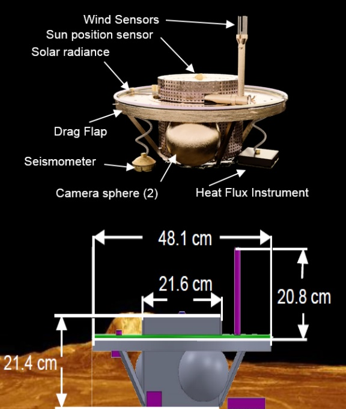

# SAEVe
> 2020.04.22 [🚀](../index/index.md) [despace](index.md) → [Project](project.md)

[TOC]

---

> <small>**Seismic and Atmospheric Exploration of Venus (SAEVe)** — EN term. **Сейсмическое и Атмосферное Исследование Венеры (САИВе)** — literal RU translation.</small>

Science return from a Venera-D mission would be enhanced with the addition (augmentations) of optional mission elements. Incorporating one or more long-lived small stations capable of measuring seismicity and heat flux — Seismic and Atmospheric Exploration of Venus (SAEVe), would provide views of Venus’ interior for the first time, and the JSDT considers this to be a high science priority. 

 

|*Parameter*|*[Value](si.md)*|
|:--|:--|
|Duration|120 days|
|Program|[Venera-D](venera_d_open_ru.md)|
|Goal|Determine how seismically active Venus is, determining the speed and style of seismic activity. Meteorology: climate and its evolution|
|Developer|`NASA?:`|
|Mass|25 ㎏ (~40 ㎏ together with aeroshell)|
|Orbit / Place|Surface|
|Payload|METEO, MEMS chemical sensor, Seismometer, Heat flux sensor|

***Targets and investigations:***

   - **T** — technical; **C** — contact research; **D** — distant research; **F** — fly‑by; **H** — manned; **S** — soil sample return; **X** — technology demonstration
   - **Sections of measurement and observation:**
      - Atmospheric/climate — **Ac** composition, **Ai** imaging, **Am** mapping, **Ap** pressure, **As** samples, **At** temperature, **Aw** wind speed/direction.
      - General — **Gi** planet’s interactions with outer space.
      - Soil/surface — **Sc** composition, **Si** imaging, **Sm** mapping, **Ss** samples.

<small>

|*EVN‑XXX*|*T*|*EN*|*Section of m&o*|*D*|*C*|*F*|*H*|*S*|
|:--|:--|:--|:--|:--|:--|:--|:--|:--|
|EVN‑003|T|Exploration: from inside of atmosphere.| |D|C| | | |
|EVN‑006|T|Exploration: from surface.| | |C| | | |
|EVN‑007| |Atmosphere: connection between the topography & the atmo circulation.| |D| | | | |
|EVN‑010| |Atmosphere: vertical model.| |D| | | | |
|EVN‑011| |Atmosphere: common circulation model.| |D| | | | |
|EVN‑014| |Atmosphere: composition.| |D| | |F| |
|EVN‑017| |Atmosphere: structure.| |D| | | | |
|EVN‑019| |Atmosphere: energetic balance.| |D| | | | |
|EVN‑020| |Inner structure of the planet.| |D| | | | |
|EVN‑023| |Surface: mineralogical composition.| | |C| | | |
|EVN‑024| |Surface: composition.| | |C| | | |
|EVN‑025| |Surface: structure.| | |C| | | |
|EVN‑026| |Surface: elemental composition.| | |C| | | |
|EVN‑029| |Is Venus geologically active?:| |D|C|F| | |
|EVN‑031| |Atmosphere: long‑term variations of the surface meteo characteristics.| |D| | | | |
|EVN‑041| |Common connection between the atmosphere & the surface.| |D| | | | |
|EVN‑044| |Surface: nature & causes of forming of the current rocks & soils.| | |C| | | |
|EVN‑047| |Surface: structure‑composition connection of different regions & planet’s evolution.| | |C| | | |
|EVN‑058|T|Exploration: directed seismoexperiment.| |D| |F| | |
|EVN‑069|T|Prolonged surface‑spacecraft functioning.| | |C| | | |
|EVN‑074| |Meteorological model.| |D| |F| | |
|EVN‑077| |Atmosphere: chemical elements distribution.| |D| |F| | |
|EVN‑094|T|High temperature electronics.| |D|C|F| | |

</small>

 

## Mission

The SAEVe stations inside their aeroshells will be delivered to Venus by the orbiter. The orbiter will need to release the stations into the correct entry trajectory and, when the orbiter is in orbit, listen for transmitted data and relay it back to Earth. The release is accomplished through a standard spin table interface. As with [LLISSE](llisse.md), there are no power, data, or thermal controls required for SAEVe during cruise. Several weeks before Venus orbit insertion, the orbiter will orient itself in the correct angle and send the signal to release one of the stations. Shortly thereafter, the orbiter will make the needed pointing adjustments and release the second SAEVe station, and so on. Surface distance between stations should be between 300 and 800 ㎞. The stations will stay dormant during cruise and initial entry, but the entry shell will power on and send critical event data during entry. Details on SAEVe landing sites relative to the main lander will be worked during landing site and mission operations planning.

After release of the SAEVe stations, the orbiter continues with its planned insertion and main lander delivery processes. No additional actions are required from the orbiter during cruise; however, communication with the stations is required during entry and descent. The 24-hr, highly elliptical orbit planned for Venera-D is well-suited for returning data from the SAEVe stations. That orbit period, distance, and frequency of communication contact is the right balance between the transmit power required and view time to allow the mission to maximize station life and science data returned.

As with LLISSE, SAEVe will rely on the orbiter to capture transmitted data and relay it to Earth. Science and engineering data from the lander will be transmitted periodically at data rates of 200 bps or better between 100 and 150 ㎒, so the orbiter would need to carry the appropriate receiving antenna and hardware, some of which may also be used for the main lander.

SAEVe includes the required entry capsule and all support elements needed to allow safe entry and landing on the Venus surface. SAEVe enters the atmosphere and gradually slows down during descent due to the thickening atmosphere. At approximately 6 ㎞ above the Venus surface, SAEVe separates from the shell, begins taking images, and transmits them as it completes its descent and touches down at under 5 ㎧. Temperature, pressure, and chemistry measurements are also collected during this portion of the descent ([EVN‑003](venus.md)).

After touchdown, an image (supporting morphology and seismometer coupling) is taken. The seismometer and heat flux instruments are dropped to the surface and the remaining images are taken and transmitted. Once all images are returned, the other instruments begin operating and SAEVe continues to transmit data for up to 1 hr continually as long as it does not interfere with main lander science return. After this initial period, SAEVe goes into its nominal operating mode where it turns on and collects and transmits all instrument data for 2 min every 8 hr. The precise frequency and duration of transmissions will be negotiated in later mission planning stages. At all times, SAEVe will be monitoring the vertical axis of the seismometer. This serves as a fast trigger so if an event of specified magnitude is detected, it turns on within 100 ms and begins transmitting data from all three axis of the seismometer as well as wind and pressure data continually for 10 min ([EVN‑058](venus.md)).

The particulars of the orbit and landing site influence the amount of contact time, and therefore, how many events are expected to be captured, but in ideal conditions, the orbiter could be in view around 90 % of the time. Undoubtedly, contact time will not be that high so some transmissions and seismic events may be missed, but a significant fraction will be returned successfully over the 120 Earth days of operations ([EVN‑006](venus.md), [EVN‑069](venus.md)), providing unprecedented insight into Venus surface activity and, if two or more stations are used, its interior structure and composition ([EVN‑020](venus.md)).

The data received by SAEVe will be transmitted directly to the Orbiter, which, in turn, will relay the data to Earth. No long-lived stations have memory modules, so it is important to spend as much time as possible in the field of view of the Orbiter or sub-satellites (if any).

 

## Description
SAEVe is a potential mission contribution to deliver small landers (one to three) to the surface of Venus and have them return high‑value science for about 4 months. The science implemented by SAEVe is primarily focused on seismometry and temporal meteorology measurements that are enabled only by long-duration operations, which remain long-standing gaps in our data on Venus ([EVN‑031](venus.md)).

The remarkable operating life of SAEVe is enabled by the same three key elements that enable LLISSE, namely:

   - high‑temperature electronics and systems that operate without cooling at Venus surface conditions ([EVN‑094](venus.md));
   - use of simple instrumentation and supporting avionics with emphasis on low data volume instruments and sensors;
   - minimizing energy utilization through a novel operations approach. 
   
Indeed, SAEVe is an enhanced version of LLISSE with longer and increased payload that is made possible with larger mass and volume allocation and with the option of an independent entry and landing on Venus.

Each SAEVe lander will have a mass of approximately 25 ㎏ (~40 ㎏ together with aeroshell and will carry a suite of synergistic instruments and sensors. The instruments are a seismometer, meteorology suite, chemical sensors, heat flux instrument, and an imaging package, consisting of two cubesat cameras, which will operate for a short time at the beginning of the mission. A potential Sun position sensor may be included as a technology demonstration for a possible simple but coarse orientation technique.

***SAEVe lander concept with subset of instruments and basic dimensions:***

SAEVe has the highest priority in expanding the Venus-D mission after the first LLISSE.

SAEVe is an enhanced long-lived station that builds on LLISSE offering longer life and additional instruments, most importantly seismometers. Because SAEVe uses the same core subsystems as LLISSE, it is in similar state of readiness for most of the platform with the exception of the seismometer, which needs significant development. Therefore, SAEVe has an overall High relative risk assessment.

 

## Objectives and Payload

***Science Objectives Tackled and Measurements:***

<small>

|*SAEVe Science Objectives*|*Measurements*|
|:--|:--|
|1. Determine if Venus is seismically active and characterize the rate and style of activity ([EVN‑029](venus.md))|Measure seismic waveform of seismic waves; Concurrent wind data at time of seismic measurement|
|2. Determine crust and lithosphere thickness and composition ([EVN‑024](venus.md))|Measure seismic waveform of seismic waves; Concurrent wind data at time of seismic measurement|
|3. Acquire temporal meteorological data to guide global circulation models ([EVN‑011](venus.md))|Measurement of P, T, wind speed (u), wind direction (Ⅴ), and light|
|4. Estimate the momentum exchange between the planet and its atmosphere ([EVN‑041](venus.md))|Measurement of P, T, wind speed (u), wind direction (Ⅴ), and light|
|5. Measure atmospheric chemistry variability ([EVN‑077](venus.md))|Measure the abundance of gases H₂O, SO₂, CO, HF, HCl, HCN, OCS, NO, and O₂|
|6. Determine current rate of heat loss from the Venus interior ([EVN‑019](venus.md))|Measure heat flux at Venus surface|
|7. Examine rock and soil distribution and morphology ([EVN‑023](venus.md), [EVN‑044](venus.md))|Quantify dimensions, structures, and textures of surface materials on plains unit.|

</small>

Lander + LLISSE and Orbiter goals that SAEVe can study more fully (L − Lander + LLISSE goals, O − Orbiter goals):

   - L1. Atmosphere composition during descent ([EVN‑014](venus.md), [EVN‑077](venus.md));
   - L2. Atmosphere composition at the surface and near‑surface atmospheric composition ([EVN‑014](venus.md), [EVN‑077](venus.md));
   - L3. Atmospheric structure and dynamics and near‑surface meteorological (METEO) parameters (pressure, temperature, wind speed, and direction) ([EVN‑017](venus.md), [EVN‑031](venus.md));
   - L5. Surface structure and morphology ([EVN‑025](venus.md), [EVN‑044](venus.md));
   - L6. Surface elemental composition ([EVN‑026](venus.md));
   - L7. Mineral phases ([EVN‑023](venus.md));
   - L8. Global and regional seismic activity and Venus’ internal structure, heat flow, and seismic activity ([EVN‑019](venus.md), [EVN‑020](venus.md), [EVN‑029](venus.md), [EVN‑047](venus.md), [EVN‑058](venus.md));
   - L9. Electromagnetic fields;
   - O1: Vertical structure of mesosphere, temperature, clouds, and dynamics of cloud-born gases and vertical structure of troposphere, temperature, clouds, composition, and dynamics ([EVN‑010](venus.md), [EVN‑017](venus.md), [EVN‑074](venus.md)).

A top science priority for SAEVe is to understand how seismically active Venus is and the rate and style of seismic activity ([EVN‑029](venus.md)). This is accomplished with a short-period MEMS seismometer sensor (based on Insight heritage) coupled with high‑temperature electronics ([EVN‑058](venus.md), [EVN‑094](venus.md)). Meteorology is the second science priority to help address climate and its evolution by taking the first long-duration surface data ([EVN‑031](venus.md), [EVN‑069](venus.md), [EVN‑095](venus.md)). Energy-related questions are also tackled through the measurement of incident and reflected solar radiation at the surface and the heat flux sensor ([EVN‑019](venus.md)). Finally, the short-duration camera package not only provides engineering data related to the seismometer placement and coupling but also provides contact images of the landing site and morphology data to understand weathering processes ([EVN‑007](venus.md), [EVN‑041](venus.md)).

***Composition of SAEVe scientific instruments:***
<small>

|*Data Sheet(s) Completed*|*Instrument or Specific Subsystem*|*Description*|*Size*|*Mass, kg*|*Power, W*|*Data, ㎆/h*|*Science Priority*|*TRL*|*Time Required to be Ready for Mission, Years*|*Rationale / Other Comments*|
|:--|:--|:--|:--|:--|:--|:--|:--|:--|:--|:--|
|☑|METEO|Temperature, pressures, radiance, and wind speed and direction sensors|Fits on 20 ㎜ station|<0.2|—|—|High|4 to 5|5|TRL driven by radiance sensing|
|☑|Microelectromechanical systems chemical sensor|Detect and measure concentration of preselected element set|Fits on 20 ㎜ station|<0.2|—|—|High|5|3| |
| |Seismometer|Detect and measure seismic events for one Venus solar day. Three axis, 0.1 to 100 s period. Sensitivity better than 1 ng/rtHz|Fits inside SAEVe aeroshell and the lander envelope|0.3|—|—|High|2|6| |
| |Heat flux sensor|Detect and measure heat from the interior over a Venus solar day. Range is 10 mW/m² to 1 W/m²|Fits inside SAEVe aeroshell and the lander envelope|0.3|—|—|High|3|6| |

</small>

> Notes:
> 
   - ☑ — This mark signifies that a datasheet is complete and available.
   - instrument characteristics (physical properties) are shown for the worst expected case.

 

## Docs & links
|Navigation|
|:--|
|**[FAQ](faq.md)**, **[Cable](cable.md)**·БКС, **[Camera](cam.md)**·Камера, **[Comms](comms.md)**·Радио, **[CON](contact.md)·[Pers](person.md)**·Контакт, **[Control](control.md)**·Упр., **[Doc](doc.md)**·Док., **[Doppler](doppler.md)**·ИСР, **[DS](ds.md)**·ЗУ, **[EB](eb.md)**·ХИТ, **[ECO](ecology.md)**·Экол., **[EF](ef.md)**·ВВФ, **[ElC](elc.md)**·ЭКБ, **[EMC](emc.md)**·ЭМС, **[Error](error.md)**·Ошибки, **[Event](event.md)**·События, **[FS](fs.md)**·ТЭО, **[Fuel](fuel.md)**·Топливо, **[GNC](gnc.md)**·БКУ, **[GS](scs.md)**·НС, **[HF&E](hfe.md)**·Эрго., **[IU](iu.md)**·Гиро., **[KT](kt.md)**·КТЕХ, **[LAG](lag.md)**·ПУC, **[LES](les.md)**·САСП, **[LS](ls.md)**·СЖО, **[LV](lv.md)**·РН, **[MCC](mcc.md)**·ЦУП, **[Model](model.md)**·Модель, **[MSC](sc.md)**·ПКА, **[N&B](nnb.md)**·БНО, **[NR](nr.md)**·ЯР, **[OBC](obc.md)**·ЦВМ, **[OE](oe.md)**·БА, **[Pat.](патент.md)**·Патент, **[Proj.](project.md)**·Проект, **[PS](ps.md)**·ДУ, **[QM](qm.md)**·БКНР, **[R&D](rnd.md)**·НИОКР, **[Robot](robotics.md)**·Робот, **[Rover](rover.md)**·Ровер, **[RTG](rtg.md)**·РИТЭГ, **[SARC](sarc.md)**·ПСК, **[SE](se.md)**·СЭ, **[Sens.](sensor.md)**·Датч., **[SC](sc.md)**·КА, **[SCS](scs.md)**·КК, **[SGM](sgm.md)**·КММ, **[SI](si.md)**·СИ, **[Soft](soft.md)**·ПО, **[SP](sp.md)**·БС, **[Spaceport](spaceport.md)**·Космодр., **[SPS](sps.md)**·СЭС, **[SSS](sss.md)**·ГЗУ, **[TCS](tcs.md)**·СОТР, **[Test](test.md)**·ЭО, **[Timeline](timeline.md)**·ЦГМ, **[TMS](tms.md)**·ТМС, **[TOR](tor.md)**·ТЗ, **[TRL](trl.md)**·УГТ|
|*Sections & pages*|
|**【】**  <mark>NOCAT</mark>|

   1. Docs: …
   1. <https://www.lpi.usra.edu/vexag/meetings/archive/vexag_15/presentations/22-Kremic-SAEVe.pdf>
