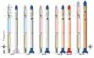
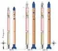
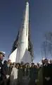

# Safir
> 2019.07.02 [🚀](../index/index.md) [despace](index.md) → [LV](lv.md)

[TOC]

---

> <small>**Safir** — англоязычный термин, не имеющий аналога в русском языке. **Сафир** — дословный перевод с английского на русский.</small>

**Сафир** (перс. سفير‎, «Посланник») — семейство иранских одноразовых твердотопливных ракет‑носителей лёгкого класса. Создана на базе боевой баллистической ракеты средней дальности Шахаб‑3/4.

|*Version*|*Description*|*Activity*|
|:--|:--|:--|
|Safir-1|Базовый вариант.|**Активен** (2008 ‑ …)|

  

---

 

## Safir-1
**Safir-1** — иранская одноразовая твердотопливаня ракета‑носитель лёгкого класса. Создана на базе боевой баллистической ракеты средней дальности Шахаб‑3/4.

|*Characteristic*|*[Value](si.md)*|
|:--|:--|
|Активность|**Активен** (2008.08.17 ‑ …)|
|[Аналоги](analogue.md)|на 2019 год отсутствуют|
|Длина/диаметр|22 м / 1.25 м|
|[Космодромы](spaceport.md)|[Semnan](spaceport.md)|
|Масса старт./сух.|26 000 ㎏ / 1 600 ㎏|
|Разраб./изготов.|[ISA](contact/isa.md) (Иран) / [ISA](contact/isa.md) (Иран)|
|Ступени|3|
|[Fuel](ps.md)|[АТ + НДМГ](nto_plus.md)|
| ||

**Выводимые массы.**

|*Космодром*|*РН*|<small>*Масса,  [НОО](nnb.md), т*</small>|<small>*Масса,  [ГСО](nnb.md), т*</small>|<small>*Масса к  [Луне](moon.md), т*</small>|<small>*Масса к  [Венере](venus.md), т*</small>|<small>*Масса к  [Марсу](mars.md), т*</small>|*Примечания*|
|:--|:--|:--|:--|:--|:--|:--|:--|
|[Semnan](spaceport.md)|Safir-1|0.065|—|—|—|—|Пуск — $ … млн (… г);  ПН 0.25 % от ст.массы|

<small>Примечания:  **1)** Указана масса для наихудших условий старта.  **2)** В скобках указана масса для наилучших условий старта.</small>

 

## Архивные

…

 

## Docs & links (TRANSLATEME ALREADY)
|Navigation|
|:--|
|**[FAQ](faq.md)**【**[SCS](scs.md)**·КК, **[SC (OE+SGM)](sc.md)**·КА】**[CON](contact.md)·[Pers](person.md)**·Контакт, **[Ctrl](control.md)**·Упр., **[Doc](doc.md)**·Док., **[Drawing](drawing.md)**·Чертёж, **[EF](ef.md)**·ВВФ, **[Error](error.md)**·Ошибки, **[Event](event.md)**·События, **[FS](fs.md)**·ТЭО, **[HF&E](hfe.md)**·Эрго., **[KT](kt.md)**·КТ, **[N&B](nnb.md)**·БНО, **[Project](project.md)**·Проект, **[QM](qm.md)**·БКНР, **[R&D](rnd.md)**·НИОКР, **[SI](si.md)**·СИ, **[Test](test.md)**·ЭО, **[TRL](trl.md)**·УГТ, **[Way](way.md)**·Пути|
|*Sections & pages*|
|**【[Launch vehicle (LV)](lv.md)】**  [ICBM](icbm.md)・ [Integrated payload unit](lv.md)・ [Non‑rocket spacelaunch](nrs.md)・ [Throw weight](throw_weight.md) • • •  **China:** [Long March](long_march.md) ┊ **EU:** [Arian](arian.md), [Vega](vega.md) ┊ **India:** [GSLV](gslv.md), [PSLV](pslv.md) ┊ **Israel:** [Shavit](shavit.md) ┊ **Japan:** [Epsilon](epsilon.md), [H2](h2.md), [H3](h3.md) ┊ **Korea N.:** [Unha](unha.md) ┊ **Korea S.:** *([Naro‑1](naro_1.md))* ┊ **RF,CIF:** [Angara](angara.md), [Proton](proton.md), [Soyuz](soyuz.md), [Yenisei](yenisei.md), [Zenit](zenit.md) *([Energia](energia.md), [Korona](korona.md), [N‑1](n_1.md), [R‑1](r_7.md))* ┊ **USA:** [Antares](antares.md), [Atlas](atlas.md), [BFR](bfr.md), [Delta](delta.md), [Electron](electron.md), [Falcon](falcon.md), [Firefly Alpha](firefly_alpha.md), [LauncherOne](launcherone.md), [New Armstrong](new_armstrong.md), [New Glenn](new_glenn.md), [Minotaur](minotaur.md), [Pegasus](pegasus.md), [Shuttle](shuttle.md), [SLS](sls.md), [Vulcan](vulcan.md) *([Saturn](saturn_lv.md), [Sea Dragon](sea_dragon.md))*|

   1. Docs: …
   1. <https://en.wikipedia.org/wiki/Safir_(rocket)>
   1. <https://ru.wikipedia.org/wiki/Сафир_(ракета‑носитель)>
   1. <https://forum.nasaspaceflight.com/index.php?:topic=36497.0>
   1. <https://www.spacelaunchreport.com/safir.html>
   1. <http://www.astronautix.com/s/safir.html>
