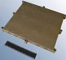

# OBMU
> 2019.08.06 **[🚀](../index/index.md) [despace](index.md)** → **[ЗУ](ds.md)**

[TOC]

---

> <small>*Термины:* **SAIT On-board Memory Unit (OBMU)** — англоязычный термин, не имеющий аналога в русском языке. **Бортовой модуль памяти НПП Саит (OBMU)** — дословный перевод с английского на русский.</small>

**SAIT On-board Memory Unit (OBMU)** — постоянное запоминающее устройство (ПЗУ) на основе твердотельного накопителя для хранения цифровой информации.  
*Разработчик:* [НПП Саит](zz_sait_ltd.md). Разработано ранее 2013 года активное применение

<small>

|*•    Характеристика    •*|*[Значение](si.md) <small>(OBMU)</small>*|
|:--|:--|
|[УГТ](trl.md)| 9  |
|Алгоритмы сжатия|   |
|Алгоритмы шифр.|   |
|Входов| 4  |
|Ёмкость, Мбит (Мбайт)| 1 048 576 (131 072)  |
|Исполнение| Моноблок  |
|Скор., Мбит(Мбайт)/с| 1 228 (153.6) запись, 800 (100) чтение  |
|Циклов перезаписи|   |
|**Etc:**|• • •|
|[ВБР](rams.md) за САС| 0.995  |
|Габариты, Д×Ш×В, мм| 292 × 264 × 27  |
|Интерфейсы| LVDS. Four ports with 4 pairs each (primary data/clock, redundant data/clock, spare). [MIL-STD-1553](mil_std_1553b.md)/CAN-2B (dual redundant buses). 2 RS-422 for external devices control  |
|Mass, kg| 1.8  |
|[Voltage](voltage.md), V| 27 (22 ‑ 35)  |
|Overload, g|   |
|[Rad.resist](ion_rad.md), Gy (rad)| 60 (6 000) при Al 1.5 г/cm², ≥40 МэВ·cm²/мг  |
|Resource, h (y)|   |
|[Lifetime](lifetime.md), h (y)| 61 320 (7)  |
|[Тепловой режим](tcs.md), °C| –20 ‑ +50  |
|Consumption, W| 12 чтение/запись, 0 в простое  |
||   |

</small>

 

## Примечания
   1. …

## Применяемость
   1. Ресурс‑П

 

## Docs & links (TRANSLATEME ALREADY)
|…°·•¹²³±×÷≤≥≈≠ ‑ −— ⎆✉ ❐“”’«»✔→✘☐☑├┕┆ 1 lb = 0.453592 kg; 1 g = 9.80665 m/s²|
|:--|
|<small>**[FAQ](faq.md)**, **[Cable](cable.md)**·БКС, **[Camera](camera.md)**·Камера, **[Comms](comms.md)**·Радиосв., **[Contact](contact.md)**·Контакт, **[Control](control.md)**·Управ., **[Doc](doc.md)**·Док., **[Doppler](doppler.md)**·ИСР, **[DS](ds.md)**·ЗУ, **[EB](eb.md)**·ХИТ, **[ECO](ecology.md)**·Экол., **[EF](ef.md)**·ВВФ, **[ElC](elc.md)**·ЭКБ, **[EMC](emc.md)**·ЭМС, **[Errors](error.md)**·Ошибки, **[Events](event.md)**·События, **[FS](fs.md)**·ТЭО, **[Fuel](fuel.md)**·Топливо, **[GNC](gnc.md)**·БКУ, **[GS](scs.md)**·НС, **[HF&E](hfe.md)**·Эргоном., **[IMU](imu.md)**·Гироскоп, **[Incubator](incubator.md)**·Инкуб., **[KT](kt.md)**·КТЕХ, **[LAG](lag.md)**·ПУC, **[LES](les.md)**·САСП, **[LS](ls.md)**·СЖО, **[LV](lv.md)**·РН, **[MAG](mag.md)**·Магнитом., **[MCC](mcc.md)**·ЦУП, **[Model](model.md)**·Модель, **[MSC](sc.md)**·ПКА, **[N&B](nnb.md)**·БНО, **[NR](nr.md)**·ЯР, **[OBC](obc.md)**·ЦВМ, **[OE](oe.md)**·БА, **[Patent](патент.md)**·Патент, **[Project](project.md)**·Проект, **[PS](ps.md)**·ДУ, **[QA](quality.md)**·QA, **[R&D](rnd.md)**·НИОКР, **[RAMS](rams.md)**·НиБ, **[Risk](risk.md)**·Риск, **[Robot](robotics.md)**·Робот, **[Rover](rover.md)**·Планетоход, **[RTG](rtg.md)**·РИТЭГ, **[RW](rw.md)**·ДМ, **[SARC](sarc.md)**·ПСК, **[Sensor](sensor.md)**·Датчик, **[SC](sc.md)**·КА, **[SCS](scs.md)**·КК, **[SGM](sgm.md)**·КММ, **[SI](si.md)**·СИ, **[Soft](soft.md)**·ПО, **[SP](sp.md)**·БС, **[Spaceport](spaceport.md)**·Космодром, **[SPS](sps.md)**·СЭС, **[SSS](sss.md)**·ГЗУ, **[TCS](tcs.md)**·СОТР, **[Test](test.md)**·ЭО, **[Timeline](timeline.md)**·Циклограмма, **[TMS](tms.md)**·ТМС, **[TOR](tor.md)**·ТЗ, **[TRL](trl.md)**·УГТ</small>|
|*Sections & pages*|
|**`Запоминающее устройство (ЗУ):`**  [5D optical data storage](5dods.md)  • • •  **Европа:** [SSR](ssr.md) (8) ┊ [Sirius TCM](sirius_tcm.md) (0.14)  ▮  **РФ:** [СЗИ-М](szi_m.md) (11.8) ┊ [OBMU](sait_obmu.md) (1.8) |

   1. Docs:
      - [OBMU Datasheet ❐](f/comms/s/sait_obmu_datasheet.pdf)
   1. Notable interwikies — …
   1. <…>
