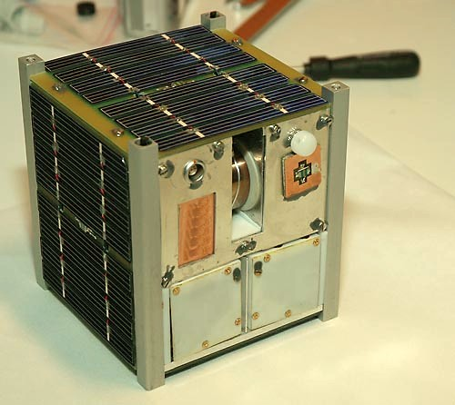

# Космический аппарат
> 2019.05.12 [🚀](../index/index.md) [despace](index.md) → [SC](sc.md)

[TOC]

---

> <small>**Космический аппарат (КА)** — русскоязычный термин. **Spacecraft (SC)** — англоязычный эквивалент.</small>

**Космический аппарат (КА)**, нар. **Махарайка, пепелац** — техническое устройство, предназначенное для функционирования в космическом пространстве с целью решения задач в соответствии с назначением [КК (КС)](scs.md).

**Разновидности:**

   - **Авиационно‑космическая система (АКС)** — *Aerospace system* — РН с КА стартует с летящего самолёта.
   - **Автоматический космический аппарат (АКА)**.
   - **Композитный космический аппарат (ККА)** — КА, включающий в себя другие КА.
   - **Кубсат**.
   - **Многоразовая космическая транспортная система (МКТС, МТКС)** — *Reusable space transport system* — разновидность МКА.
   - **Многоразовый космический аппарат (МКА)**, иногда *«космический аппарат многоразового использования»* — *Re‑entry space vehicle* — КА, конструкция которого предусматривает повторное использование КА или его СЧ после возвращения из космического полёта.
   - **Модуль** — в некоторой степени автономная составная часть КА.
   - **Пилотируемый космический аппарат (ПКА)** — manned spacecraft (MSC) — КА для путешествия живых существ в космос.
   - **Спутник**.

**Classification:**

   1. **Atmospheric** spacecraft (атмосферный КА)
      1. Balloon — ➀ high‑height, ➁ low‑height, ➂ powered, ➃ simple, ➄ variable altitude
      1. Communications atmospheric spacecraft (КА для связи)
      1. Plane — ➀ glider, ➁ powered, ➂ maneuverable
   1. **Base** (база)
      1. Ground
      1. Orbital
   1. **Lander** spacecraft (посадочный КА)
      1. Communications lander (КА для связи)
      1. Penetrator (КА‑пенетратор)
      1. Plane — ➀ glider, ➁ powered, ➂ maneuverable
      1. Rover (планетоход)
   1. **Orbiter** spacecraft, or **Satellite** (орбитальный КА)
      1. Communications orbiter (КА для связи) — ➀ high‑height, ➁ L1/L2, ➂ low‑height
      1. Fly‑by spacecraft (пролётный КА)
      1. Observatory (КА‑обсерватория) — ➀ high‑height, ➁ L1/L2, ➂ low‑height
   1. **Robot**
      1. Arm
      1. Antropomorphic
      1. Digger
   1. **Other** that is applicable to almost any of the above mentioned
      1. Manned — ➀ manned, ➁ unmanned
      1. Size — ➀ large, ➁ medium, ➂ micro, ➃ nano, ➄ small
      1. Swarm — ➀ net, ➁ single

**Описание.**

Любой КА прост как смартфон среднего уровня 2015 года выпуска. Осталось только решить вопросы температур, перегрузок, радиации и вперёд.

**Таблица.** [Что общего](wbs.md) ~~у ворона и письменного стола~~ у КА и смартфона 2015 года выпуска.

|*СЧ*|*КА*|*Смартфон*|
|:--|:--|:--|
|[Аккумулятор](eb.md)|+|+|
|[Акселерометр](.md)|(гироскоп)|+|
|[Антенны](antenna.md)|+|+|
|[Батарея солнечная](sp.md)|+|опция|
|[Блок автоматики и стабилизации](acuer.md)|+|+|
|[Дальномер](doppler.md)|+|+|
|[Двигатель](ps.md)|+|–|
|[Двигатель‑маховик](iu.md)|+|–|
|[Звёздный датчик](sensor.md)|+|–|
|[Конструкция, механизмы, материалы](sgm.md)|+|+|
|[Пилот](manned_sf.md)|+|+|
|[Привод антенны](aiad.md)|+|опция|
|[Привод батареи солнечной](spos.md)|+|опция|
|[Провода](cable.md)|+|+|
|[Процессор](obc.md)|+|+|
|[Радиаторы, нагреватели](tcs.md)|+|+|
|[Радиомодуль](comms.md)|+|+|
|[Солнечный датчик](sensor.md)|+|+|
|[Телеметрия](tms.md)|+|+|

**Производители.**

   - **Australia:** …
   - **Canada:** …
   - **China:** …
   - **Europe:** …
   - **India:** …
   - **Israel:** …
   - **Japan:**
      1. [ALE Co., Ltd](zz_ale.md) — small Earth satellites
      1. [Axelspace](zz_axelspace.md) — microsats
      1. [CE Space](zz_ce_space.md) — microsats
      1. [ispace](zz_ispace.md)
      1. [JAMSS](zz_jamss.md) — Earth sats
      1. JAXA [ISAS](zz_isas.md)
      1. JAXA [Tsukuba Space Center](zz_tsukuba_sc.md)
      1. [Kawasaki HVI](zz_kawasaki_hvi.md)
      1. [Meisei](zz_meisei.md) — microsats
      1. [Mitsubishi Electric](zz_mitsubishi.md)
      1. [NEC](zz_nec.md)
      1. [PDAS](zz_pd_aerospace.md) — suborbital spaceplane for tourism
      1. [SKY Perfect JSAT](zz_sky_perfect_jsat.md)
      1. [Space Walker](zz_space_walker.md) — suborbital spaceplane for tourism
      1. [Synspective](zz_synspective.md) — small Earth sats
      1. [Warpspace](zz_warpspace.md)
   - **Korea South:**
      1. [KAI](zz_kai.md)
      1. [KARI](zz_kari.md)
      1. [Satrec Initiative](zz_satreci.md)
   - **Russia:**
      1. НПОЛ
      1. [AvantSpace](zz_avantspace.md)
   - **Saudi Arabia:** …
   - **Singapore:** …
   - **USA:**
      1. [Ball A&T](zz_ball_at.md)
      1. [Xplore](zz_xplore.md)
   - **UAE:** …
   - **Vietnam:** …

## Кубсат
> <small>**Кубсат** — русскоязычный термин. **Cubesat** — англоязычный эквивалент.</small>

**Кубсат, CubeSat**, также **вошь**, **горох** — формат малых (сверхмалых) искусственных спутников, имеющих объём 1 литр и массу не более 1.33 ㎏ или несколько (кратно) более. Имеется ещё более малый формат покетсат (буквально карманный) в несколько сотен или десятков грамм и несколько сантиметров.

**Кубсат** — спутник размером 10×10×10 ㎝ (1U) и массой не более 1.33 ㎏. Допускается объединение 2 или 3 стандартных кубов в составе одного спутника (обозначаются 2U и 3U и имеют размер 10×10×20 или 10×10×30 ㎝).

Кубсаты обычно используют шасси‑каркас спецификации CubeSat и покупные стандартные комплектующие — COTS‑электронику и прочие узлы. Спецификации CubeSat были разработаны в 1999 году Калифорнийским политехническим и Стэнфордским университетами, чтобы упростить создание сверхмалых спутников. Формат кубсат сделал широким распространение университетских спутников; для унификации и координации существует всемирная межуниверситетская программа запуска кубсатов.

Кубсаты имеют стоимость выведения до нескольких десятков тысяч долларов, а покетсаты — до нескольких тысяч долларов.

Кубсаты выводятся, как правило, сразу по несколько единиц либо посредством [ракет‑носителей](lv.md), либо с борта космических кораблей и орбитальных станций. Несколько компаний предоставляет услуги по выводу кубсатов на орбиту, в частности ISC Kosmotras и Eurokot. Для размещения на РН или КА, запуска и разведения кубсатов разработаны многоместные контейнеры‑платформы, в т.ч. с револьверным выводом на орбиту. Также для вывода кубсатов разрабатываются сверхмалые РН — наноносители.

Термином «CubeSat» обозначаются наноспутники (Nano‑satellite), удовлетворяющие спецификациям стандарта, созданному под руководством профессора Bob Twiggs <small>(факультет аэронавтики и астронавтики, Стэнфорд)</small>, Спутники имеют размер 10×10×10 ㎝ и запускаются при помощи Poly‑PicoSatellite Orbital Deployer (P‑POD). Стандарт допускает объединение 2 или 3 стандартных кубов в составе одного спутника (обозначаются 2U и 3U и имеют размер 10×10×20 или 10×10×30 ㎝). Один P‑POD имеет размеры, достаточные для запуска трёх спутников 10×10×10 ㎝ или меньшего количества, общим размером не более 3U.

На 2004 год, спутники в формате CubeSats могли быть изготовлены и запущены на околоземную орбиту за $ 65 ‑ 80 тысяч. На 2012 год типичная стоимость запуска CubeSat оценивалась в $ 40 тысяч (иногда доходя также до 80, хотя NASA заявило и о возможности запуска за 20 тысяч). Несколько покетсатов могут компоноваться и запускаться в контейнерном месте и по цене одного кубсата, т.е. за несколько тысяч долларов каждый. Столь низкая стоимость и унификация платформ и комплектующих позволяет разрабатывать и запускать кубсаты университетам и даже школам, небольшим частным компаниям и любительским объединениям, а покетсаты — частным лицам.

Большинство CubeSat имеют один или два научных прибора, некоторые имеют небольшие выдвижные антенны и поверхностные или распахивающиеся солнечные батареи.

**Производители**

|*Страна*|*Фирма*|
|:--|:--|
|**Канада**|[SFL](zz_utias_sfl.md)|
|**РФ**|[AvantSpace](zz_avantspace.md), [Спутникс](zz_sputnix.md)|

## ПКА
> <small>**Пилотируемый космический аппарат (ПКА)** — русскоязычный термин. **Manned spacecraft** — англоязычный эквивалент.</small>

**Пилотируемый космический аппарат (ПКА)** — космический аппарат, снабжённый [системами жизнеобеспечения](ls.md) и управления полётом, и предназначенный для жизни, работы или иной деятельности одного или нескольких человек в космическом пространстве. Встречаются также наименования *пилотируемый космический корабль (ПКК)* и *пилотируемая орбитальная станция (ПОС)*.

Управление ПКА может осуществляться экипажем, операторами наземных [ЦУП](mcc.md), системами автоматики или комбинацией этих методов.

В состав ПКА, в дополнение к [обычным системам](wbs.md) [КА](sc.md), входят:

   1. [Система аварийного спасения](les.md) (САС)
   1. [Система жизнеобеспечения](ls.md) (СЖО)
   1. **Спускаемый аппарат** или **космоплан** для возврата экипажа на Землю

**Производители**

|*Страна*|*Фирма*|
|:--|:--|
|**Европа**|[ESA](zz_esa.md)|
|**Китай**|[CNSA](zz_cnsa.md)|
|**РФ**|[РКК Энергия](ркк_энергия.md)|
|**США**|[Blue Origin](blue_origin.md)  [Boeing](zz_boeing.md)  [Lockheed Martin](lockheed_martin.md)  [SpaceX](zz_spacex.md) — [Dragon](dragon.md)|
|**Япония**|[JAXA](zz_jaxa.md)|

## Спутник
> <small>**Спутник** — русскоязычный термин. **Satellite** — англоязычный эквивалент.</small>

**Satellite mass classification**  
Классификация спутников по массе

   - ≥ 1 000 ㎏ — Large satellites — Тяжёлые спутники
   - 500 ‑ 1 000 ㎏ — Medium satellites — Средние спутники
   - ≤ 500 ㎏ — Small satellites — Малые спутники
      - 100 ‑ 500 ㎏ — Minisatellites — Миниспутники
      - 10 ‑ 100 ㎏ — Microsatellites — Микроспутники
      - 1 ‑ 10 ㎏ — Nanosatellites — Наноспутники (covers all Cube‑, Pocket‑, Tube‑, Sun‑, Thin‑Sats & non‑standard picosatellites)
      - 0.1 ‑ 1 ㎏ — Picosatellites — Пикоспутники
      - 0.01 ‑ 0.1 ㎏ — Femtosatellites — Фемтоспутники
      - 0.001 ‑ 0.01 ㎏ — Attosatellites — Аттоспутники
      - 0.0001 ‑ 0.001 ㎏ — Zeptosatellites — Зептоспутники
   - CubeSat parametres — Параметры кубсатов:
      - 0.25 ‑ 27U
      - 0.2 ‑ 40 ㎏

 

## Docs & links (TRANSLATEME ALREADY)
|Navigation|
|:--|
|**[FAQ](faq.md)**, **[Cable](cable.md)**·БКС, **[Camera](cam.md)**·Камера, **[Comms](comms.md)**·Радио, **[Contact](contact.md)**·Контакт, **[Control](control.md)**·Упр., **[Doc](doc.md)**·Док., **[Doppler](doppler.md)**·ИСР, **[DS](ds.md)**·ЗУ, **[EB](eb.md)**·ХИТ, **[ECO](ecology.md)**·Экол., **[EF](ef.md)**·ВВФ, **[ElC](elc.md)**·ЭКБ, **[EMC](emc.md)**·ЭМС, **[Error](error.md)**·Ошибки, **[Event](event.md)**·События, **[FS](fs.md)**·ТЭО, **[Fuel](fuel.md)**·Топливо, **[GNC](gnc.md)**·БКУ, **[GS](scs.md)**·НС, **[HF&E](hfe.md)**·Эрго., **[IU](iu.md)**·Гиро., **[KT](kt.md)**·КТЕХ, **[LAG](lag.md)**·ПУC, **[LES](les.md)**·САСП, **[LS](ls.md)**·СЖО, **[LV](lv.md)**·РН, **[MCC](mcc.md)**·ЦУП, **[Model](model.md)**·Модель, **[MSC](sc.md)**·ПКА, **[N&B](nnb.md)**·БНО, **[NR](nr.md)**·ЯР, **[OBC](obc.md)**·ЦВМ, **[OE](oe.md)**·БА, **[Pat.](патент.md)**·Патент, **[Proj.](project.md)**·Проект, **[PS](ps.md)**·ДУ, **[R&D](rnd.md)**·НИОКР, **[Robot](robotics.md)**·Робот, **[Rover](rover.md)**·Ровер, **[RTG](rtg.md)**·РИТЭГ, **[SARC](sarc.md)**·ПСК, **[SE](se.md)**·СЭ, **[Sens.](sensor.md)**·Датч., **[SC](sc.md)**·КА, **[SCS](scs.md)**·КК, **[SGM](sgm.md)**·КММ, **[SI](si.md)**·СИ, **[Soft](soft.md)**·ПО, **[SP](sp.md)**·БС, **[Spaceport](spaceport.md)**·Космодр., **[SPS](sps.md)**·СЭС, **[SRRQ](srrq.md)**·БКНР, **[SSS](sss.md)**·ГЗУ, **[TCS](tcs.md)**·СОТР, **[Test](test.md)**·ЭО, **[Timeline](timeline.md)**·ЦГМ, **[TMS](tms.md)**·ТМС, **[TOR](tor.md)**·ТЗ, **[TRL](trl.md)**·УГТ|
|*Sections & pages*|
|**··• [Spacecraft (SC)](sc.md) •··**  [Cleanliness level](clean_lvl.md) ┊ [Cubesat](sc.md) ┊ [Interface](interface.md) ┊ [Manned SC](sc.md) ┊ [Satellite](sc.md) ┊ [Sub-item](sui.md) ┊ [Typical forms](sc_ts.md)|

   1. Docs:
      - [ГОСТ 53802](гост_53802.md), п. 102‑103
   1. Notable interwikies — …
   1. <https://en.wikipedia.org/wiki/Reusable_launch_system>
   1. <https://en.wikipedia.org/wiki/Spacecraft>
   1. <https://ru.wikipedia.org/wiki/Космический_аппарат>
   1. <https://ru.wikipedia.org/wiki/Многоразовый_космический_корабль>
   1. <https://www.nanosats.eu/cubesat>
   1. <http://www.cubesat.org/>
   1. <https://en.wikipedia.org/wiki/CubeSat>
   1. <https://ru.wikipedia.org/wiki/Кубсат>
   1. <http://directory.eoportal.org/web/eoportal/satellite-missions/c-missions/cubesat-concept> — [archive ❐](f/scs/cubesat_concept_seor.pdf) of 2016.05.06)
   1. <http://www.cubesatshop.com> — магазин оборудования для кубсатов.
   1. <https://en.wikipedia.org/wiki/List_of_crewed_spacecraft>
   1. <https://ru.wikipedia.org/wiki/Пилотируемый_космический_аппарат>
   1. <https://ru.wikipedia.org/wiki/Пилотируемый_космический_корабль>
   1. <https://www.nasa.gov/audience/forstudents/postsecondary/features/F_Spacecraft_Classification.html>
