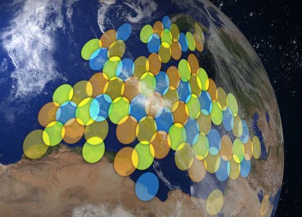

# Communication spacecraft
> 2021.06.23 [🚀](../index/index.md) [despace](index.md) → [SC](sc.md)

[TOC]

---

> <small>**Communication spacecraft** — EN term. **Космический аппарат связи** — RU analogue.</small>

<mark>TBD</mark>

## Satellites

### FSS
> <small>**Fixed-satellite service (FSS)** — EN term. **Фиксированная спутниковая служба (ФСС)** — RU analogue.</small>

### HTS
> <small>**High-throughput satellite (HTS)** — EN term. **Высокопроизводительный спутник (ВПС)** — literal RU translation.</small>

**High-throughput satellite (HTS)** is a communications satellite that provides more throughput than a classic FSS satellite (at least twice, though usually by a factor of 20 or more) for the same amount of allocated orbital spectrum, thus significantly reducing cost-per-bit. ViaSat-1 and EchoStar XVII (also known as Jupiter-1) do provide more than 100 Gbit/s of capacity, which is more than 100 times the capacity offered by a conventional FSS satellite. When it was launched in October 2011 ViaSat-1 had more capacity (140 Gbit/s) than all other commercial communications satellites over North America combined.

The significant increase in capacity is achieved by a high level frequency re-use and spot beam technology which enables frequency re-use across multiple narrowly focused spot beams (usually in the order of hundreds of kilometers), as in cellular networks, which both are defining technical features of high-throughput satellites. By contrast traditional satellite technology utilizes a broad single beam (usually in the order of thousands of kilometers) to cover wide regions or even entire continents. In addition to a large amount of bandwidth capacity HTS are defined by the fact that they often, but not solely, target the consumer market. In the last 10 years, the majority of high-throughput satellites operated in the Ka band, however this is not a defining criterion, and at the beginning of 2017 there was at least 10 Ku band HTS satellites projects, of which 3 were already launched and 7 were in construction.

Initially, HTS systems used satellites in the same geosynchronous orbit (at an altitude of 35 786 km) as satellite TV craft (with satellites such as KA-SAT, Yahsat 1A and Astra 2E sharing TV and HTS functionality) but the propagation delay for a round-trip internet protocol transmission via a geosynchronous satellite can exceed 550 ms which is detrimental to many digital connectivity applications, such as automated stock trades, hardcore gaming and Skype video chats. and the focus for HTS is increasingly shifting to the lower Medium Earth orbit (MEO) and Low Earth orbit (LEO), with altitudes as low as 600 km and delays as short as 40 ms. Also, the lower path losses of MEO and LEO orbits reduces ground station and satellite power requirements and costs, and so vastly increased throughput and global coverage is achieved by using constellations of many smaller, cheaper high-throughput satellites. SES's O3b constellation was the first MEO high-throughput satellite system, launched in 2013, and by 2018 more than 18 000 new LEO satellites had been proposed to launch by 2025.

Despite the higher costs associated with spot beam technology, the overall cost per circuit is considerably lower as compared to shaped beam technology. While Ku band FSS bandwidth can cost well over $ 100 million per gigabit per second in space, HTS like ViaSat-1 can supply a gigabit of throughput in space for less than $ 3 million. While a reduced cost per bit is often cited as a substantial advantage of high-throughput satellites, the lowest cost per bit is not always the main driver behind the design of an HTS system, depending on the industry it will be serving.

HTS are primarily deployed to provide broadband Internet access service (point-to-point) to regions unserved or underserved by terrestrial technologies where they can deliver services comparable to terrestrial services in terms of pricing and bandwidth. While many current HTS platforms were designed to serve the consumer broadband market, some are also offering services to government and enterprise markets, as well as to terrestrial cellular network operators who face growing demand for broadband backhaul to rural cell sites. For cellular backhaul, the reduced cost per bit of many HTS platforms creates a significantly more favorable economic model for wireless operators to use satellite for cellular voice and data backhaul. Some HTS platforms are designed primarily for the enterprise, telecom or maritime sectors. HTS can furthermore support point-to-multipoint applications and even broadcast services such as DTH distribution to relatively small geographic areas served by a single spot beam.

A fundamental difference between HTS satellites is the fact that certain HTS are linked to ground infrastructure through a feeder link using a regional spot beam dictating the location of possible teleports while other HTS satellites allow the use of any spot beam for the location of the teleports. In the latter case, the teleports can be set up in a wider area as their spotbeams' footprints cover entire continents and regions like it is the case for traditional satellites .

Industry analysts at Northern Sky Research believe that high-throughput satellites will supply at least 1.34 TB/s of capacity by 2020 and thus will be a driving power for the global satellite backhaul market which is expected to triple in value – jumping from the 2012 annual revenue of about US $ 800 million to $ 2.3 billion by 2021.

  
*KA-SAT coverage over Europe showing frequency reuse by different colors*

### (RU) HTS
> <small>**High-throughput satellite (HTS)** — EN term. **Высокопроизводительный спутник (ВПС)** — literal RU translation.</small>

**HTS (англ. high-throughput satellite)** — класс спутников связи с высокой пропускной способностью, которые обеспечивают увеличение общей пропускной способности по сравнению с традиционными спутниками от двух до 20 и более раз при том же самом орбитальном спектре частот.

Большая пропускная способность позволяет уменьшать стоимость использования спутникового канала. Наиболее известные спутники этой категории — ViaSat-1 и EchoStar XVII (известный также как Jupiter-1), они обеспечивают общую скорость передачи данных более 100 Гбит/с, что более чем в 100 раз превышает ёмкость традиционных спутниковых каналов. Спутник ViaSat-1 был запущен в октябре 2011 года и имел  общую скорость передачи информации 140 Гбит/с, что больше, чем у всех остальных коммерческих спутников связи в Северной Америке.

Принципиальная разница между HTS и традиционными спутниками состоит в наличии у первых множества лучей, что позволяет повторно использовать их частотный ресурс.

Основным элементом таких спутников является антенная система. Её параметры определяют потенциальные возможности всей системы. Выбор необходимых параметров антенной системы, рабочей зоны, ориентации лучей и др. влияет на окупаемость спутниковой системы. В настоящее время используются многолучевые зеркальные антенны, выполненные по типу «один рупор — один луч». Возможна также реализация бортовых многолучевых антенн с кластерными облучателями, так как это решение, несмотря на то, что проигрывает по антенным техническим параметрам, однако позволяет существенно сократить массу антенной системы HTS за счёт сокращения числа облучателей антенн в её составе.

**Запуски.** Запуск спутников класса HTS производится с 2004 года, среди них:

   - Anik F2 (июль 2004)
   - Thaicom 4 (IPSTAR) (август 2005)
   - Spaceway-3 (август 2007)
   - WINDS (февраль 2008)
   - KA-SAT (декабрь 2010)
   - Yahsat 1A (апрель 2011)
   - ViaSat-1 (октябрь 2011)
   - Yahsat 1B (апрель 2012)
   - EchoStar XVII (июль 2012)
   - HYLAS 2 (июль 2012)
   - Astra 2E (сентябрь 2013)
   - Inmarsat Global Xpress constellation (2013-2015)
   - Sky Muster (NBN Co-1A) (октябрь 2015)
   - Badr-7 for TRIO Connect (ноябрь 2015)
   - Intelsat 29e (2016)
   - Intelsat 33e (2016)
   - Intelsat 32e (2017)
   - Intelsat 37e (2017)
   - SES-14 (Q4, 2017)
   - Eutelsat 172B (2017)
   - Fibersat-1 (Q4, 2018)
   - На 2019 год намечен запуск спутника ViaSat-3, ориентированного на американский рынок. Антенная система этого спутника будет формировать 5 000 узких лучей. Заявленная пропускная способность составит около 1 Тбит/с. В России проводится работа над HTS «Энергия-100». Его антенная система будет формировать 1 500 лучей.

 

## Docs & links
|Navigation|
|:--|
|**[FAQ](faq.md)**【**[SCS](scs.md)**·КК, **[SC (OE+SGM)](sc.md)**·КА】**[CON](contact.md)·[Pers](person.md)**·Контакт, **[Ctrl](control.md)**·Упр., **[Doc](doc.md)**·Док., **[EF](ef.md)**·ВВФ, **[Error](error.md)**·Ошибки, **[Event](event.md)**·События, **[FS](fs.md)**·ТЭО, **[HF&E](hfe.md)**·Эрго., **[KT](kt.md)**·КТ, **[Model](model.md)**·Модель, **[N&B](nnb.md)**·БНО, **[Project](project.md)**·Проект, **[QM](qm.md)**·БКНР, **[R&D](rnd.md)**·НИОКР, **[SI](si.md)**·СИ, **[Test](test.md)**·ЭО, **[TRL](trl.md)**·УГТ, **[Way](way.md)**·Пути|
|*Sections & pages*|
|**【[Spacecraft (SC)](sc.md)】**  [Cleanliness level](clean_lvl.md)・ [Communication SC](sc_comm.md)・ [Cubesat](sc.md)・ [FSS](sc_comm.md)・ [HTS](sc_comm.md)・ [Interface](interface.md)・ [Manned SC](sc.md)・ [Satellite](sc.md)・ [Sub-item](sui.md)・ [Typical forms](sc.md)|

   1. Docs: …
   1. <https://en.wikipedia.org/wiki/High-throughput_satellite>
   1. <https://en.wikipedia.org/wiki/Fixed-satellite_service>
