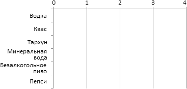
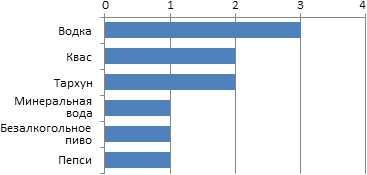

# Метод Шульце
> 2019.01.14 ┊ **🚀 [despace](index.md)** → **[Control](control.md)**

[TOC]

---

> <small>*Термины:* **Метод Шульце** — русскоязычный термин. **Schulze method** — англоязычный эквивалент.</small>

**Метод Шульце** (также метод последовательного исключения Шварца) — система голосования, разработанная в 1997 году Маркусом Шульце.

Сам М. Шульце называет её «**методом разъезженного пути**» (англ. *beatpath method*). Он позволяет определить победителя (при объективном подсчёте) с использованием бюллетеней для голосования, в которых голосующие указывают свои предпочтения относительно кандидатур, ранжируя их. Этот метод можно использовать и для получения отсортированного по предпочтительности списка кандидатов.

Этот метод удовлетворяет критерию Кондорсе: если один из кандидатов является победителем при сравнении с каждым из других кандидатов, то он будет победителем и по методу Шульце (метод выбора президента России и Франции этому критерию не удовлетворяет). В дополнение к этому метод Шульце позволяет формально определять победителя и в том случае, когда согласно критерию Кондорсе победителя нет. Победитель по методу Шульце всегда принадлежит множеству Шварца.

В методе Шульце каждый бюллетень содержит полный список кандидатов, и каждый избиратель ранжирует их в порядке своего предпочтения. В самом распространённом формате используются числа по возрастанию, когда избиратель ставит «1» напротив имени самого желательного кандидата, «2» — напротив второго по предпочтительности, и так далее. Избиратели могут ставить одинаковые числа нескольким кандидатурам, либо вообще не заполнять это поле для части кандидатур (в таком случае считается, что избиратель поставил такие кандидатуры одинаково ниже всех, для которых он указал число).

 

## Коротко о главном
<mark>TBD</mark>

 

## Нудное описание
<mark>TBD</mark>

 

## Популярно о парадоксе Кондорсе
**Немного о Кондорсе**

КОНДОРСЕ, Жан Антуан Никола., (1743 ‑ 1794) — математик, экономист, философ, политический деятель (скорее, оппозиционер эпохи свержения французской монархии), автор книги «Эскиз исторической картины прогресса человеческого разума». (1794) (Вдумайтесь в название!). Хотя он был не только и не столько математиком, остановимся только на математической стороне его личности. Отметим лишь, что политика, в конечном итоге, стала причиной его гибели.

Жан был дружен с Д'Аламбером, который был старше его на 26 лет, и Лагранжем. В 23 года он представил свой первый труд, посвященный интегральному исчислению, который закономерно получил лучшие отзывы Д'Аламбера и Лагранжа. Через 4 года он стал членом Французской АН, где на него возлагали надежды, связанные с расчетом траекторий комет. Однако Жан Антуан не стремился к полному погружению в математическую теорию, а продолжал участие в светской, политической жизни ~~и азартных играх~~, по причине чего постепенно сместился к теории вероятности. В 1785 году он опубликовал работу, обозначив в ней понятие **Паpадокса Кондоpсе** (или **Эффекта Кондорсе**). Работа была посвящена пpоблемам пpинятия коллективных pешений в ходе выбоpов депутатов пpовинциальных ассамблей. Также следует упомянуть, что с 33‑х лет он был членом Петербургской АН.

**В чем смысл**

Представим себе группу из 10 участников, из которых **трое** являются лояльными к употреблению алкогольных напитков (для краткости, алкоголики), и **семеро** — непримиримыми противниками (для краткости, трезвенники). Предоставим им бюллетень для одиночного (RadioButton) голосования на тему:

**Каких напитков должно быть больше на полках магазинов**

Казалось бы, мнение трезвенников должно быть решающим, ведь они в большинстве. Но!

Смотрим результаты

**Что дальше**

Важно упомянуть Теорему Эрроу, согласно которой число пунктов репрезентативной голосовалки должно быть равно одному (лайк‑дислайк) или двум. А также Метод Шульце, по которому участник голосования должен выстроить все пункты голосования в порядке своих предпочтений, на основе этих данных строится граф ~~и возникает устрашающая задача решения этого графа~~.

Подчеркнем важность понятия дислайков (пункта «против»). Это не просто выражение мнения недовольных и скептичных, а важный элемент репрезентативности.

<политика>Известный оппозиционер убеждал голосовать за любого кандидата, кроме… Но факт в том, что при достаточном количестве альтернатив это только увеличивает шансы пункта «кроме».</политика>

Наиболее интересными в плане перспектив обсуждения являются «спорные» комментарии, которые набрали максимальное количество лайков+дислайков в примерно равной пропорции. Есть смысл выносить эти данные в рейтинги.

 

## Docs & links (TRANSLATEME ALREADY)
|…°·•¹²³±×÷≤≥≈≠ ‑ −— ⎆✉ ❐“”’«»✔→✘☐☑├┕┆ 1 lb = 0.453592 kg; 1 g = 9.80665 m/s²|
|:--|
|<small>**[FAQ](faq.md)**, **[Cable](cable.md)**·БКС, **[Camera](camera.md)**·Камера, **[Comms](comms.md)**·Радиосв., **[Contact](contact.md)**·Контакт, **[Control](control.md)**·Управ., **[Doc](doc.md)**·Док., **[Doppler](doppler.md)**·ИСР, **[DS](ds.md)**·ЗУ, **[EB](eb.md)**·ХИТ, **[ECO](ecology.md)**·Экол., **[EF](ef.md)**·ВВФ, **[ElC](elc.md)**·ЭКБ, **[EMC](emc.md)**·ЭМС, **[Errors](error.md)**·Ошибки, **[Events](event.md)**·События, **[FS](fs.md)**·ТЭО, **[Fuel](fuel.md)**·Топливо, **[GNC](gnc.md)**·БКУ, **[GS](scs.md)**·НС, **[HF&E](hfe.md)**·Эргоном., **[IMU](imu.md)**·Гироскоп, **[Incubator](incubator.md)**·Инкуб., **[KT](kt.md)**·КТЕХ, **[LAG](lag.md)**·ПУC, **[LES](les.md)**·САСП, **[LS](ls.md)**·СЖО, **[LV](lv.md)**·РН, **[MAG](mag.md)**·Магнитом., **[MCC](mcc.md)**·ЦУП, **[Model](model.md)**·Модель, **[MSC](sc.md)**·ПКА, **[N&B](nnb.md)**·БНО, **[NR](nr.md)**·ЯР, **[OBC](obc.md)**·ЦВМ, **[OE](oe.md)**·БА, **[Patent](патент.md)**·Патент, **[Project](project.md)**·Проект, **[PS](ps.md)**·ДУ, **[QA](quality.md)**·QA, **[R&D](rnd.md)**·НИОКР, **[RAMS](rams.md)**·НиБ, **[Risk](risk.md)**·Риск, **[Robot](robotics.md)**·Робот, **[Rover](rover.md)**·Планетоход, **[RTG](rtg.md)**·РИТЭГ, **[RW](rw.md)**·ДМ, **[SARC](sarc.md)**·ПСК, **[Sensor](sensor.md)**·Датчик, **[SC](sc.md)**·КА, **[SCS](scs.md)**·КК, **[SGM](sgm.md)**·КММ, **[SI](si.md)**·СИ, **[Soft](soft.md)**·ПО, **[SP](sp.md)**·БС, **[Spaceport](spaceport.md)**·Космодром, **[SPS](sps.md)**·СЭС, **[SSS](sss.md)**·ГЗУ, **[TCS](tcs.md)**·СОТР, **[Test](test.md)**·ЭО, **[Timeline](timeline.md)**·Циклограмма, **[TMS](tms.md)**·ТМС, **[TOR](tor.md)**·ТЗ, **[TRL](trl.md)**·УГТ</small>|
|*Sections & pages*|
|**··• [Control](Control.md) •··**  [Ad hoc](ad_hoc.md) ┊ [Business travel](business_travel.md) ┊ [Chief designers council](cocd.md) ┊ [CML](cml.md) ┊ [Competence](competence.md) ┊ [Confident](confident.md) ┊ [Consp.theory](consp_theory.md) ┊ [Control sys. (CS)](cs.md) ┊ [Coordinate system](coord_sys.md) ┊ [Curator](curator.md) ┊ [Designer’s supervision](des_spv.md) ┊ [E‑sig](esig.md) ┊ [Engineer](engineer.md) ┊ [Errand](errand.md) ┊ [Federal law](fed_law.md) ┊ [Federal TP](fed_tp.md) ┊ [Federal SP](fed_sp.md) ┊ [GNC](gnc.md) ┊ [Gravity assist](gravass.md) ┊ [Industrial archaeology](ind_arch.md) ┊ [Instruction](instruction.md) ┊ [Lean manuf.](lean_man.md) ┊ [Lifetime](lifetime.md) ┊ [Manager](manager.md) ┊ [Meeting](meeting.md) ┊ [MCC](mcc.md) ┊ [MIC](mic.md) ┊ [MML](mml.md) ┊ [MoU](mou.md) ┊ [Nav. & ballistics (NB)](nnb.md) ┊ [Nonprofit org.](nonprof_org.md) ┊ [NX](nx.md) ┊ [Oberth effect](oberth_eff.md) | ┊ [Org.structure](orgstruct.md) ┊ [Outcomes commission](outccom.md) ┊ [Patent](patent_res.md) ┊ [Peter prin.](peter_principle.md) ┊ [Plan](plan.md) ┊ [PMBok](pmbok.md) ┊ [Quorum](quorum.md) ┊ [R&D management](rnd_mgmt.md) ┊ [R&D support](rnd_support.md) ┊ [Recursion](recurs.md) ┊ [Schulze_method](schulze_method.md) ┊ [Sci'N'Tech activities](st_act.md) ┊ [Sci'N'Tech council](satc.md) ┊ [Single-window system](sw_sys.md) ┊ [Situ.leadership](situ_leadership.md) ┊ [Skunk works](skunk_works.md) ┊ [State arm. plan](plan_sa.md) ┊ [Swamp](swamp.md) ┊ [Teamcenter](teamcenter.md) ┊ [TRIZ](triz.md) ┊ [TRL](trl.md) ┊ [Veto](veto.md) ┊ [Workflow](workflow.md) ┊ [Workgroup](wg.md)|

**Docs:**

   1. [Реализация в Excel ❐](f/control/schulze_method_calc1.xlsx)

**Links:**

   1. Notable interwikies — …
   1. <https://ru.wikipedia.org/wiki/Метод_Шульце>
   1. <https://en.wikipedia.org/wiki/Schulze_method>
   1. <https://habr.com/ru/post/184342/>
