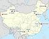
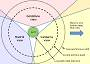
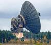
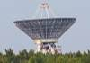
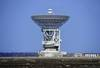

# Spacecraft system
> 2019.05.05 **[🚀](../index/index.md) [despace](index.md)** → **[SCS](scs.md)**

[TOC]

---

> <small>*Terms:*  **• Spacecraft system (SCS)** — English term. **Космический комплекс (КК)** — equivalent in Russian.  **• Многоразовая космическая система (МКС)** — русскоязычный термин. **Reusable space system** — англоязычный эквивалент.</small>

**Spacecraft system (SCS)** — combination of space & ground segments.

**Космический комплекс (КК)** — совокупность функционально взаимосвязанных орбитальных и наземных технических средств, обеспечивающих как самостоятельное решение целевых задач на основе использования космического пространства, так и в состав космической системы.

   - **Космическая система (КС)** — по [ГОСТ 53802](гост_53802.md) п. 1‑7 — совокупность одного или нескольких космических и специальных комплексов, предназначенных для решения целевых задач.
   - **Космическая система (КС)** — по [Положению РК‑11‑КТ](const_rk11.md) стр. 17 — совокупность согласованно действующих и взаимосвязанных [КА](sc.md) и других технических средств космического комплекса и наземного специального комплекса, предназначенных для решения целевых задач. В состав космической системы могут входить несколько космических комплексов.
   - **Многоразовая космическая система (МКС)** — космическая система с орбитальными средствами многократного использования.

 

## Description
Common dividing SCS into parts:

· **Spacecraft system** (SCS)  
· ┊  
· ├ **Ground segment** (GS)  
· ┊ ├ Ground networks  
· ┊ ├ [Ground (or Earth) stations](scs.md)  
· ┊ ├ Integration & test facilities  
· ┊ ├ Launch facilities  
· ┊ ├ [Mission (or flight) control (or operations) centers](mcc.md)  
· ┊ ┕ Remote terminals  
· ┊  
· ├ **User segment** (US)  
· ┊ ┕ Customer terminals  
· ┊  
· ┕ **Space segment** (SS)  
·   ┕ [Spacecraft](sc.md) (SC)  
·     ├ [Attitude control system](acs.md)  
·     ├ [C&DH](c_n_dh.md)  
·     ├ [Communications](comms.md)  
·     ├ [GNC](gnc.md) (guidance, navigation, & control)  
·     ├ [Life support](ls.md)  
·     ├ Payload *(см. [OE](oe.md))*  
·     ├ Power *(см. [СЭС](sps.md))*  
·     ├ Thermal control *(TCS, см. [СОТР](tcs.md))*  
·     ├ Spacecraft propulsion *(см. [ДУ](ps.md))*  
·     ┕ Structures *(см. [SGM](sgm.md))*

### Ground segment
A **ground segment (GS)** consists of all the ground-based control elements of a spacecraft system, as opposed to the space segment & user segment. The GS serves to enable control of a spacecraft, & distribution of payload data & telemetry among interested parties on the ground.

The ground segment, though not technically part of the spacecraft, is vital to the operation of the spacecraft. Typical components of a GS in use during normal operations include a mission operations facility where the flight operations team conducts the operations of the spacecraft, a data processing & storage facility, ground stations to radiate signals to & receive signals from the spacecraft, & a voice & data communications network to connect all mission elements.

The **[launch vehicle](lv.md)** propels the spacecraft from Earth’s surface, through the atmosphere, & into an orbit, the exact orbit being dependent on the mission configuration. The launch vehicle may be expendable or reusable.

### Space segment
   - **Attitude control.** A Spacecraft needs an attitude control subsystem to be correctly oriented in space & respond to external torques & forces properly. The attitude control subsystem consists of sensors & actuators, together with controlling algorithms. The attitude‑control subsystem permits proper pointing for the science objective, sun pointing for power to the solar arrays & earth pointing for communications.
   - **Command & data handling.** The CDH subsystem receives commands from the communications subsystem, performs validation & decoding of the commands, & distributes the commands to the appropriate spacecraft subsystems & components. The CDH also receives housekeeping data & science data from the other spacecraft subsystems & components, & packages the data for storage on a data recorder or transmission to the ground via the communications subsystem. Other functions of the CDH include maintaining the spacecraft clock & state‑of‑health monitoring.
   - **Communications.** SC, both robotic & crewed, utilize various communications systems for communication with terrestrial stations as well as for communication between spacecraft in space. Technologies utilized include RF & optical communication. In addition, some spacecraft payloads are explicitly for the purpose of ground–ground communication using receiver/retransmitter electronic technologies.
   - **GNC.** Guidance refers to the calculation of the commands (usually done by the CDH subsystem) needed to steer the spacecraft where it is desired to be. Navigation means determining a spacecraft’s orbital elements or position. Control means adjusting the path of the spacecraft to meet mission requirements.
   - **Life support.** SC intended for human spaceflight must also include a life support system for the crew.
   - **Payload.** The payload depends on the mission of the SC, & is typically regarded as the part of the spacecraft “that pays the bills”. Typical payloads could include scientific instruments (cameras, telescopes, or particle detectors, for example), cargo, or a human crew.
   - **Power.** SC need an electrical power generation & distribution subsystem for powering the various SC subsystems. For spacecraft near the Sun, solar panels are frequently used to generate electrical power. SC designed to operate in more distant locations, for example Jupiter, might employ a radioisotope thermoelectric generator (RTG) to generate electrical power. Electrical power is sent through power conditioning equipment before it passes through a power distribution unit over an electrical bus to other spacecraft components. Batteries are typically connected to the bus via a battery charge regulator, & the batteries are used to provide electrical power during periods when primary power is not available, for example when a low Earth orbit spacecraft is eclipsed by Earth.
   - **Thermal control.** SC must be engineered to withstand transit through Earth’s atmosphere & the space environment. They must operate in a vacuum with temperatures potentially ranging across hundreds of ℃ as well as (if subject to reentry) in the presence of plasmas. Material requirements are such that either high melting temperature, low density materials such as beryllium & reinforced carbon–carbon or (possibly due to the lower thickness requirements despite its high density) tungsten or ablative carbon–carbon composites are used. Depending on mission profile, spacecraft may also need to operate on the surface of another planetary body. The thermal control subsystem (TCS) can be passive, dependent on the selection of materials with specific radiative properties. Active TCS makes use of electrical heaters & certain actuators such as louvers to control temperature of equipments within specific ranges.
   - **Spacecraft propulsion.** SC may or may not have a propulsion subsystem, depending on whether or not the mission profile calls for propulsion. The Swift spacecraft is an example of a spacecraft that does not have a propulsion subsystem. Typically though, LEO spacecraft include a propulsion subsystem for altitude adjustments (drag make‑up maneuvers) & inclination adjustment maneuvers. A propulsion system is also needed for spacecraft that perform momentum management maneuvers. Components of a conventional propulsion subsystem include fuel, tankage, valves, pipes, & thrusters. The thermal control system interfaces with the propulsion subsystem by monitoring the temperature of those components, & by preheating tanks & thrusters in preparation for a spacecraft maneuver.
   - **Structures.** SC must be engineered to withstand launch loads imparted by the launch vehicle, & must have a point of attachment for all the other subsystems. Depending on mission profile, the structural subsystem might need to withstand loads imparted by entry into the atmosphere of another planetary body, & landing on the surface of another planetary body.

### User segment
…

 

## Описание КК и СЧ КК
   1. [Головные обтекатели и Переходные отсеки](lv.md);
   1. [Класс чистоты](clean_lvl.md);
   1. [Контейнеры для транспортировки](ship_contain.md);
   1. [О выводимых массах](throw_weight.md);

### Баллистический центр
> <small>*Термины:* **Баллистический центр (БЦ)** — русскоязычный термин. **Ballistic analysis center (BAC)** — англоязычный эквивалент.</small>

**Баллистический центр (БЦ)** — комплекс программно‑аппаратных средств для определения орбит КА и расчётов траектории его движения, необходимых манёвров и для прочего баллистико‑навигационного обеспечения. Часто входит в состав [ЦУП](mcc.md).

Известные БЦ РФ:

   1. БЦ [ИПМ Келдыша](zz_keldysh_ipm.md);
   1. БЦ [ЦНИИмаш](zz_tsniimash.md).

### Наземный комплекс
> <small>*Термины:* **Наземный комплекс (НК)** — русскоязычный термин, не имеющий аналога в английском языке. **Ground-based complex** — дословный перевод с русского на английский.</small>

**Наземный комплекс** ─ общее негостированное название всех наземных элементов, предназначенных для управления и обмена информацией с космическим аппаратом.

Может включать в свой состав:

   1. **Наземный комплекс управления (НКУ)**:
      - баллистические центры;
      - наземные станции слежения;
      - наземные станции управления
      - телекоммуникации и средства связи;
      - сектор главного конструктора;
      - средства обработки и хранения информации;
      - прочие средства управления и обеспечения управления.
   2. **Наземный научный комплекс (ННК)**:
      - аппаратно‑программные средства приёма, передачи, обработки и хранения информации.

### Наземный комплекс управления
> <small>*Термины:* **Наземный комплекс управления (НКУ)** — русскоязычный термин. **Ground segment (GS)** — примерный англоязычный эквивалент.</small>

**Наземный комплекс управления (НКУ)** — совокупность взаимосвязанных технических средств с информационным и математическим обеспечением, сооружений, [центра управления полётом](mcc.md) и отдельных командно‑измерительных комплексов, предназначенных для автоматизированного управления КА на всех этапах полёта КА после его отделения от [разгонного блока](lv.md).

**НКУ** обычно включает в свой [состав](wbs.md):

   - [Баллистический центр](scs.md) (БЦ)
   - Наземная станция (НС)
   - [Сектор главного конструктора](cd_segm.md) (СГК)
   - [Средства связи и передачи данных](mcntd.md) (ССПД)
   - [Центр управления полётом](mcc.md) (ЦУП)

На этапе выведения на орбиту перелёта НКУ не привлекается. На этом этапе полёта контроль за выполнением [полётных заданий](fp.md) [LV](lv.md) и [РБ](lv.md) осуществляется наземными средствами [КСИСО](scs.md) и [НИК](lm_sys.md) РБ. Также может включать в свой состав [КИС](scs.md) и [НИП](scs.md).

### Наземный научный комплекс
> <small>*Термины:* **Наземный научный комплекс (ННК)** — русскоязычный термин. **[User segment (US)](us.md)** или **[Payload data ground segment (PDGS)](pdgs.md)** — примерный англоязычный эквивалент.</small>

**Наземный научный комплекс (ННК)** — совокупность [аппаратно‑программных средства (АПС)](hns.md) предназначенных для осуществления полного цикла сбора, обработки, анализа и долговременного хранения всех типов данных (калибровочной, научной, вспомогательной и служебной информации), принимаемых с борта [КА](sc.md), подготовки программ проведения наблюдений, а также распространения научной информации среди участников проекта.

По факту ННК представляет собой группу серверов со специализированным ПО и каналы связи.

   - **Australia:** …
   - **Canada:** …
   - **China:** …
   - **Europe:** …
   - **India:** …
   - **Israel:** …
   - **Japan:** [NEC](zz_nec.md)
   - **Korea South:** …
   - **Russia:** …
   - **Saudi Arabia:** …
   - **Singapore:** …
   - **USA:** …
   - **UAE:** …
   - **Vietnam:** …

### НИП
> <small>*Термины:* **Наземный измерительный пункт (НИП)** — русскоязычный термин. **Ground telemetry station** — англоязычный эквивалент.</small>

**Наземный измерительный пункт (НИП)**, также **Научно‑измерительный пункт** (Отдельный командно‑измерительный комплекс) — пункт контроля и управления [космическими аппаратами](sc.md).

Разделяют на:

   - наземные измерительные пункты (НИП);
   - плавучие измерительные пункты;
   - самолётные измерительные пункты (СИП);
   - отдельные измерительные пункты (ОИП).

Обычно функционально входит в состав [НКУ](scs.md).

### НАКУ
> <small>*Термины:* **Наземный автоматизированный комплекс управления (НАКУ)** — русскоязычный термин. **Ground automated control complex** — англоязычный эквивалент.</small>

**Наземный автоматизированный комплекс управления (НАКУ)** — по [ГОСТ 53802](гост_53802.md), п. 30‑32 — совокупность необходимой инфраструктуры, технических систем, средств из состава командно‑измерительных и измерительных пунктов, центров и пунктов управления орбитальными средствами, центров обработки измерительной информации, предназначенных для формирования наземных комплексов, обеспечивающих реализацию автоматизированных процессов контроля параметров полёта [изделий](unit.md) ракетно‑космической техники, состояния бортовой аппаратуры и управления их функционированием.

Согласно типовой [схеме деления](wbs.md) НАКУ является самостоятельной структурой и не входит в состав [КК (КС)](scs.md).

### НКПОР
> <small>*Термины:* **Наземный комплекс приёма, обработки и распределения информации (НКПОР)** — русскоязычный термин, не имеющий аналога в английском языке. **Ground-based complex for data receiving, processing & distribution (GCDRPD)** — дословный перевод с русского на английский.</small>

**Наземный комплекс приёма, обработки и распределения информации (НКПОР)** — совокупность взаимосвязанных технических средств с программным обеспечением, расположенных на [Земле](earth.md) и предназначенных для обеспечения заказчика и его потребителей целевой информацией, полученной на основе космических данных.

Согласно типовой [схеме деления](wbs.md) НКПОР не входит никуда.

### КСИСО
> <small>*Термины:* **Комплекс средств измерения, сбора и обработки информации (КСИСО)** — русскоязычный термин, не имеющий аналога в английском языке. **System of measuring instruments, data acquisition and processing (SMIDAP)** — дословный перевод с русского на английский.</small>

**Комплекс средств измерения, сбора и обработки информации (КСИСО)** — совокупность сооружений, взаимосвязанных между собой технических средств и программного обеспечения [НКУ](scs.md) и [НАКУ](scs.md) [космическими аппаратами](sc.md) и измерений, предназначенных для автоматизированного контроля за функционированием [РКН](lv.md) в процессе предстартовой подготовки и на участке выведения, обеспечивающих обработку, документирование и распределение результатов измерений между потребителями.

Привлекается на этапе выведения [КА](sc.md) на орбиту перелёта и осуществляет контроль за выполнением [полётных заданий](fp.md) [LV](lv.md) и [РБ](lv.md) совместно с [НИК РБ](lm_sys.md). После выведения КА на орбиту перелёта функции контроля передаются в [НКУ](scs.md).

### КИК
> <small>*Термины:* **Русский** — русскоязычный термин, не имеющий аналога в английском языке. **Сommand and measurement complex (CAMC)** — дословный перевод с русского на английский.</small>

**Командно‑измерительный комплекс (КИК)** — совокупность Земных средств и служб, с помощью которых осуществляется управление полётом [космических аппаратов](sc.md), [ракет‑носителей](lv.md) и космических объектов.

В состав КИК входят командно‑измерительные пункты, расположенные на суше, плавучие (корабельные) и самолётные измерительные пункты. Количество и местоположение стационарных командно‑измерительных пунктов определяются задачами обеспечения непрерывности управления различными КА и требованиями дублирования и резервирования. Состав и размещение стационарных и подвижных средств КИК, используемых для управления конкретными типами КА, определяются их орбитой, типом установленной на борту аппаратуры и программой полёта.

Основными средствами управления в КИК являются: аппаратура траекторных измерений (для определения параметров орбиты); телеметрическая аппаратура (для контроля и диагностики состояния КА); командно‑программная аппаратура (для выдачи на борт управляющих команд, программ и контроля их исполнения). В состав КИК входят также: вычислительные комплексы (ЭВМ), аппаратура автоматического ввода данных траекторных измерений в ЭВМ, системы автоматической обработки результатов телеизмерений, аппаратура приёма и передачи телевизионной информации, телефонной, телеграфной связи с космонавтами, служба единого точного времени, каналы и средства космической и наземной связи, средства контроля и отображения хода полёта, системы моделирования процессов управления и др.

Информация, поступающая с КА, обрабатывается координационно‑вычислительными центрами, которые выдают необходимые данные в Центр управления полётом).

### КИС
> <small>*Термины:* **Командно‑измерительная система (КИС)** — русскоязычный термин, не имеющий аналога в английском языке. **Command measurement system (COMES)** — дословный перевод с русского на английский.</small>

**Командно‑измерительная система (КИС)** — радиотехническое средство [НКУ](scs.md) и [НАКУ](scs.md) в совокупности с бортовой аппаратурой [КА](sc.md) или [РБ](lv.md), предназначенное для измерения параметров движения КА и РБ, приёма и передачи различных видов информации, формирования и передачи на КА и РБ команд и программ управления, стандартных частот и сигналов [времени](time.md) для синхронизации работы [GNC](gnc.md).

Известные КИС:

   1. <mark>TBD</mark>

Согласно типовой [схеме деления](wbs.md) КИС не входит в состав КК (КС), однако функционально входит в состав [НКУ](scs.md).

### Наземная станция
> <small>*Термины:* **Наземная станция (НС)** — русскоязычный термин. **Ground station (GS) / Earth station (ES) / Earth terminal (ET)** — англоязычные эквиваленты.</small>

**Наземная станция (НС)** — земная [радиостанция](comms.md), предназначенная для связи с [космическим аппаратом](sc.md), находящимся вне Земли, или для приёма‑передачи радиоволн от (к) астрономическим источникам радиоизлучения. НС входит в состав НКУ.

**Разновидности:**

   - **Наземная станция приёма информации (НСПИ)** — наземная станция, предназначенная для приёма информации от космического аппарата.  **Ground station for information reception** — дословный перевод с русского на английский.
   - **Наземная станция приёма научной информации (НСПНИ)** — наземная станция, предназначенная для приёма научной информации от космического аппарата. **Ground station for scientific information reception** — дословный перевод с русского на английский.
   - **Наземная станция управления (НСУ)** — наземная станция, предназначенная для управления КА. **Ground control station** — англоязычный эквивалент.

**Производители, операторы:**

   - **Australia:** …
   - **Canada:** …
   - **China:** …
   - **Europe:** …
   - **India:** …
   - **Israel:** …
   - **Japan:**
      1. [Infostellar](zz_infostellar.md) — space communication infrastructure, 10+ UHF/S/X antennas
      1. [Kratos IS](zz_kratos.md) — R&D ground antennas, optimizing/managing satelllites, signals
      1. [Mitsubishi Elecric](zz_mitsubishi.md) — ground control stations for satellite tracking, & optical/radio telescopes for astronomical observation, antennas, transmitters & receivers
      1. [RESTEC](zz_restec.md)
   - **Korea South:** …
   - **Russia:** [ОКБ МЭИ](zz_okbmei.md)
   - **Saudi Arabia:** …
   - **Singapore:** …
   - **USA:** …
   - **UAE:** …
   - **Vietnam:** …

|*Изображение*|*Описание*|
|:--|:--|
|   |**[Chinese Deep Space Network](cdsn.md)**  (Китай)  |
|   |**[ESTRACK](estrack.md)**  (Европа)  |
|   |**[Indian Deep Space Network](idsn.md)**  (Индия)  |
|   |**[NASA Deep Space Network](dsn.md)**  (США)  |
|   |**[SSC’s Global Ground Station Network](ssc_ggsn.md)**  (Европа, Швеция)  |
|   |**[Usuda Deep Space Center](udsc.md)**  (Япония)  |
|   |**Мировые НС**  |
|   |**НС в рамках НКУ-ДКА**  (примерное расположение)  |

**Известные НС**

<small>

|*Россия*|*Описание*|*Изобр.*|
|:--|:--|:--|
| Калязинская  радио&shy;астрономическая  обсерватория  | Владелец — [ОКБ МЭИ](zz_okbmei.md).  • Радиотелескоп ТНА‑1500 или РТ-64: D = 64 м, F/0.37, полноповоротный параболический рефлектор, мин. раб. длина волны = 1 см, M общая = 3 800 т, M зеркала = 800 т, вторичное зеркало D = 6 м.  • Наблюдаемая часть небесной сферы: A = ± 300° H = 0 ‑ 90°. Класс наблюдений: B; Выделенные [полосы частот](rf.md) для наблюдений, ГГц.: 0.608 ‑ 0.614, 1.66 ‑ 1.67, 4.8 ‑ 4.99, 4.99 ‑ 5.0, 22.21 ‑ 22.50. Шумовая температура радиотелескопа, К: 80, 22, 22, 22, 65.  |   |
| Центр  космической связи  «Медвежьи озёра»  | Владелец — [ОКБ МЭИ](zz_okbmei.md).  • Радиотелескоп ТНА‑1500 или РТ-64: D = 64 м, F/0.37, полноповоротный параболический рефлектор, мин. раб. длина волны = 1 см, M общая = 3 800 т, M зеркала = 800 т, вторичное зеркало D = 6 м. Собирающая площадь 1 500 m².  • Работает с 1979 г. До 2010 г была только принимающей антенной, теперь она и передающая. Система облучения Грегори.  |   |
| Восточный центр  дальней космической  связи (Уссурийск)  | 44°00′57″ с.ш. 131°45′25″ в.д. [H](https://tools.wmflabs.org/geohack/geohack.php?language=ru&pagename=%D0 %A0 %D0 %A2-70&params=44_0_57.90_N_131_45_25.13_E) [G](https://maps.google.com/maps?ll=44.0160833,131.7569806&q=44.0160833,131.7569806&spn=0.03,0.03&t=h&hl=ru) [Я](https://yandex.ru/maps/?ll=131.7569806,44.0160833&pt=131.7569806,44.0160833&spn=0.03,0.03&l=sat,skl) [O](https://www.openstreetmap.org/?mlat=44.0160833&mlon=131.7569806&zoom=14)  • Радиотелескоп П‑2500 или РТ-70.   |   |

</small>

**Мировые**

|*Ведомство*|*НК*|
|:--|:--|
|Европа| Raisting Satellite Earth Station (Германия), [Maspalomas Station](maspalomas_station.md) |
|Индия|  |
|Китай|  |
|РФ|  |
|США|  |
|Япония|  |

 

# Docs & links
|…°·•¹²³±×÷≤≥≈≠ ‑ −— ⎆✉ ❐“”’«»✔→✘☐☑├┕┆ 1 lb = 0.453592 kg; 1 g = 9.80665 m/s²|
|:--|
|<small>**[FAQ](faq.md)**, **[Cable](cable.md)**·БКС, **[Camera](cam.md)**·Камера, **[Comms](comms.md)**·Радио, **[Contact](contact.md)**·Контакт, **[Control](control.md)**·Упр., **[Doc](doc.md)**·Док., **[Doppler](doppler.md)**·ИСР, **[DS](ds.md)**·ЗУ, **[EB](eb.md)**·ХИТ, **[ECO](ecology.md)**·Экол., **[EF](ef.md)**·ВВФ, **[ElC](elc.md)**·ЭКБ, **[EMC](emc.md)**·ЭМС, **[Error](error.md)**·Ошибки, **[Event](event.md)**·События, **[FS](fs.md)**·ТЭО, **[Fuel](fuel.md)**·Топливо, **[GNC](gnc.md)**·БКУ, **[GS](scs.md)**·НС, **[HF&E](hfe.md)**·Эрго., **[IU](iu.md)**·Гиро., **[KT](kt.md)**·КТЕХ, **[LAG](lag.md)**·ПУC, **[LES](les.md)**·САСП, **[LS](ls.md)**·СЖО, **[LV](lv.md)**·РН, **[MCC](mcc.md)**·ЦУП, **[Model](model.md)**·Модель, **[MSC](sc.md)**·ПКА, **[N&B](nnb.md)**·БНО, **[NR](nr.md)**·ЯР, **[OBC](obc.md)**·ЦВМ, **[OE](oe.md)**·БА, **[Pat.](патент.md)**·Патент, **[Project](project.md)**·Проект, **[PS](ps.md)**·ДУ, **[R&D](rnd.md)**·НИОКР, **[SRRQ](srrq.md)**·БКНР, **[Robot](robotics.md)**·Робот, **[Rover](rover.md)**·Планетоход, **[RTG](rtg.md)**·РИТЭГ, **[SARC](sarc.md)**·ПСК, **[Sensor](sensor.md)**·Датчик, **[SC](sc.md)**·КА, **[SCS](scs.md)**·КК, **[SGM](sgm.md)**·КММ, **[SI](si.md)**·СИ, **[Soft](soft.md)**·ПО, **[SP](sp.md)**·БС, **[Spaceport](spaceport.md)**·Космодром, **[SPS](sps.md)**·СЭС, **[SSS](sss.md)**·ГЗУ, **[TCS](tcs.md)**·СОТР, **[Test](test.md)**·ЭО, **[Timeline](timeline.md)**·ЦГМ, **[TMS](tms.md)**·ТМС, **[TOR](tor.md)**·ТЗ, **[TRL](trl.md)**·УГТ</small>|
|*Sections & pages*|
|**`Космический комплекс (КК):`**  [Выводимая масса](throw_weight.md) ┊ [ГО и ПхО](lv.md) ┊ [Класс чистоты](clean_lvl.md) ┊ [Контейнеры для транспортировки](ship_contain.md) ┊ [СЧ](sui.md) |
|**`Наземный комплекс управления (НКУ):`**  [БЦ](scs.md) ┊ [КИС](scs.md) ┊ [КСИСО](scs.md) ┊ [НИК](lm_sys.md) ┊ [НИП](scs.md) ┊ [НС](scs.md) ┊ [ПОЗ](fp.md) ┊ [СГК](cd_segm.md) ┊ [ССПД](mcntd.md) ┊ [ЦУП](mcc.md) |
|**`Наземная станция (НС):`**  …    [CDSN](cdsn.md) ┊ [DSN](dsn.md) ┊ [ESTRACK](estrack.md) ┊ [IDSN](idsn.md) ┊ [SSC_GGSN](ssc_ggsn.md) ┊ [UDSC](udsc.md) |
|**`Наземный научный комплекс (ННК):`**  [АПС](hns.md) |

   1. Docs:
      - SCS:
         1. [ГОСТ 53802](гост_53802.md), п. 1‑7
         1. [РК‑11](const_rk11.md), стр. 17
      - НКУ: [ГОСТ 53802](гост_53802.md), п.30-32
      - БЦ: [ГОСТ 53802](гост_53802.md), п.43
      - НКПОР: [ГОСТ 53802](гост_53802.md), п.50
      - НАКУ: [ГОСТ 53802](гост_53802.md), п. 30‑32
      - КСИСО: [ГОСТ 53802](гост_53802.md), п. 51
      - КИК: <https://ru.wikipedia.org/wiki/Категория:Командно‑измерительный_комплекс>
   1. Notable interwikies — …
   1. SCS:
      1. <https://en.wikipedia.org/wiki/Attitude_control>
      1. <https://en.wikipedia.org/wiki/Ground_segment>
      1. <https://en.wikipedia.org/wiki/Guidance,_navigation,_and_control>
      1. <https://en.wikipedia.org/wiki/Space_segment>
      1. <https://en.wikipedia.org/wiki/Fixed-satellite_service>
      1. <https://ru.wikipedia.org/wiki/Научно‑измерительный_пункт>
   1. НС:
      1. <https://en.wikipedia.org/wiki/Ground_station>
      1. <https://ru.wikipedia.org/wiki/Восточный_центр_дальней_космической_связи>
      1. <https://ru.wikipedia.org/wiki/Калязинская_радиоастрономическая_обсерватория>
      1. <https://ru.wikipedia.org/wiki/РТ-70>
      1. <https://ru.wikipedia.org/wiki/Центр_космической_связи_«Медвежьи_озёра»>
   1. БЦ:
      1. <http://www.ngpedia.ru/id584007p1.html>
      1. <http://www.keldysh.ru/httpd/kiam-info_fr.html>
      1. <http://www.kiam1.rssi.ru/>
