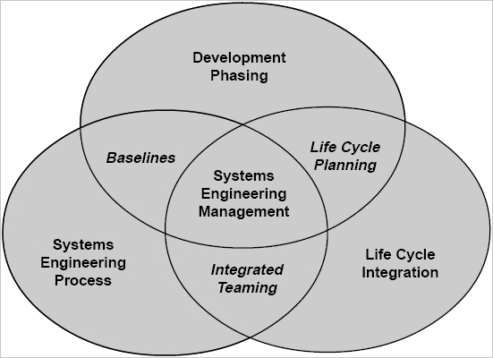
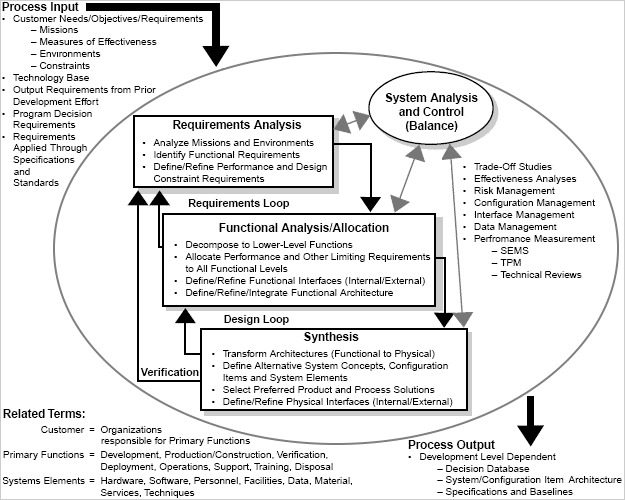

# Systems engineering
> 20211.02.05 [🚀](../index/index.md) [despace](index.md) → [Control](control.md), [SE](se.md)

[TOC]

---

> <small>**Engineer (Eng.)** — EN term. **Инженер** — RU analogue.</small>

**Systems engineering** is an interdisciplinary field of engineering & engineering management that focuses on how to design, integrate, & manage complex systems over their life cycles. At its core, systems engineering utilizes systems thinking principles to organize this body of knowledge. The individual outcome of such efforts, an engineered system, can be defined as a combination of components that work in synergy to collectively perform a useful function.

Issues such as requirements engineering, reliability, logistics, coordination of different teams, testing & evaluation, maintainability & many other disciplines necessary for successful system design, development, implementation, & ultimate decommission become more difficult when dealing with large or complex projects. Systems engineering deals with work‑processes, optimization methods, & risk management tools in such projects. It overlaps technical & human‑centered disciplines such as industrial engineering, process systems engineering, mechanical engineering, manufacturing engineering, production engineering, control engineering, software engineering, electrical engineering, cybernetics, aerospace engineering, organizational studies, civil engineering & project management. Systems engineering ensures that all likely aspects of a project or system are considered & integrated into a whole.

The systems engineering process is a discovery process that is quite unlike a manufacturing process. A manufacturing process is focused on repetitive activities that achieve high quality outputs with minimum cost & time. The systems engineering process must begin by discovering the real problems that need to be resolved, & identifying the most probable or highest impact failures that can occur — systems engineering involves finding solutions to these problems.

   - **Books** — [NASA Systems Engineering Handbook](book_nasa_seh.md), INCOSE Systems Engineering Handbook.
   - **Subfields** — Aerospace engineering, Biological systems engineering, Configuration management, Earth systems engineering & management, Electrical engineering, Enterprise systems engineering, Performance engineering, Reliability engineering, Safety engineering.
   - **Processes** — Requirements engineering, Functional specification, System integration, [V&V](vnv.md), [Design review](design_review.md).
   - **Concepts** — Business process, System, System lifecycle, [V‑Model](v_model.md), Systems development life cycle.
   - **Tools** — Decision‑making, Function modelling, IDEF, Optimization, Quality function deployment, System dynamics, [Systems Modeling Language](sysml.md), Systems analysis, Systems modeling, Work breakdown structure.
   - **Related fields** — Control engineering, Computer engineering, Industrial engineering, Operations research, Project management, Quality management, [Risk management](qm.md), Software engineering.

## Concept
Systems engineering tools are strategies, procedures, & techniques that aid in performing systems engineering on a project or product. The purpose of these tools vary from database management, graphical browsing, simulation, & reasoning, to document production, neutral import/export & more.

Systems engineering signifies only an approach and, more recently, a discipline in engineering. The aim of education in systems engineering is to formalize various approaches simply & in doing so, identify new methods & research opportunities similar to that which occurs in other fields of engineering. As an approach, systems engineering is holistic & interdisciplinary in flavour.

**Origins & traditional scope.**  
The traditional scope of engineering embraces the conception, design, development, production & operation of physical systems. Systems engineering, as originally conceived, falls within this scope. “Systems engineering”, in this sense of the term, refers to the building of engineering concepts.

**Evolution to broader scope.**  
The use of the term “systems engineer” has evolved over time to embrace a wider, more holistic concept of “systems” & of engineering processes. This evolution of the definition has been a subject of ongoing controversy, & the term continues to apply to both the narrower & broader scope.  
Traditional systems engineering was seen as a branch of engineering in the classical sense, that is, as applied only to physical systems, such as spacecraft & aircraft. More recently, systems engineering has evolved to a take on a broader meaning especially when humans were seen as an essential component of a system. Checkland, for example, captures the broader meaning of systems engineering by stating that 'engineering' “can be read in its general sense; you can engineer a meeting or a political agreement”.  
Consistent with the broader scope of systems engineering, the Systems Engineering Body of Knowledge (SEBoK) has defined three types of systems engineering: ➀ Product Systems Engineering (PSE) is the traditional systems engineering focused on the design of physical systems consisting of hardware & software. ➁ Enterprise Systems Engineering (ESE) pertains to the view of enterprises, that is, organizations or combinations of organizations, as systems. ➂ Service Systems Engineering (SSE) has to do with the engineering of service systems. Checkland defines a service system as a system which is conceived as serving another system. Most civil infrastructure systems are service systems.

**Holistic view.**  
Systems engineering focuses on analyzing & eliciting customer needs & required functionality early in the development cycle, documenting requirements, then proceeding with design synthesis & system validation while considering the complete problem, the system lifecycle. This includes fully understanding all of the stakeholders involved. Oliver et al. claim that the systems engineering process can be decomposed into

   - a Systems Engineering Technical Process, and
   - a Systems Engineering Management Process.

Within Oliver's model, the goal of the Management Process is to organize the technical effort in the lifecycle, while the Technical Process includes assessing available information, defining effectiveness measures, to create a behavior model, create a structure model, perform trade‑off analysis, & create sequential build & test plan.  
Depending on their application, although there are several models that are used in the industry, all of them aim to identify the relation between the various stages mentioned above & incorporate feedback. Examples of such models include the Waterfall model & the VEE model (also called the V model).

**Interdisciplinary field.**  
System development often requires contribution from diverse technical disciplines. By providing a systems (holistic) view of the development effort, systems engineering helps mold all the technical contributors into a unified team effort, forming a structured development process that proceeds from concept to production to operation and, in some cases, to termination & disposal. In an acquisition, the holistic integrative discipline combines contributions & balances tradeoffs among cost, schedule, & performance while maintaining an acceptable level of risk covering the entire life cycle of the item.  
This perspective is often replicated in educational programs, in that systems engineering courses are taught by faculty from other engineering departments, which helps create an interdisciplinary environment.

**Managing complexity.**  
The need for systems engineering arose with the increase in complexity of systems & projects, in turn exponentially increasing the possibility of component friction, & therefore the unreliability of the design. When speaking in this context, complexity incorporates not only engineering systems, but also the logical human organization of data. At the same time, a system can become more complex due to an increase in size as well as with an increase in the amount of data, variables, or the number of fields that are involved in the design. The International Space Station is an example of such a system.  
The development of smarter control algorithms, microprocessor design, & analysis of environmental systems also come within the purview of systems engineering. Systems engineering encourages the use of tools & methods to better comprehend & manage complexity in systems. Some examples of these tools can be seen here:

   - System architecture,
   - System model, Modeling, & Simulation,
   - Optimization,
   - System dynamics,
   - Systems analysis,
   - Statistical analysis,
   - Reliability analysis, and
   - Decision making

Taking an interdisciplinary approach to engineering systems is inherently complex since the behavior of & interaction among system components is not always immediately well defined or understood. Defining & characterizing such systems & subsystems & the interactions among them is one of the goals of systems engineering. In doing so, the gap that exists between informal requirements from users, operators, marketing organizations, & technical specifications is successfully bridged.

**Scope.**  
One way to understand the motivation behind systems engineering is to see it as a method, or practice, to identify & improve common rules that exist within a wide variety of systems. Keeping this in mind, the principles of systems engineering — holism, emergent behavior, boundary, et al. — can be applied to any system, complex or otherwise, provided systems thinking is employed at all levels. Besides defense & aerospace, many information & technology based companies, software development firms, & industries in the field of electronics & communications require systems engineers as part of their team.  
An analysis by the INCOSE Systems Engineering center of excellence (SECOE) indicates that optimal effort spent on systems engineering is about 15 ‑ 20 % of the total project effort. At the same time, studies have shown that systems engineering essentially leads to reduction in costs among other benefits. However, no quantitative survey at a larger scale encompassing a wide variety of industries has been conducted until recently. Such studies are underway to determine the effectiveness & quantify the benefits of systems engineering.  
Systems engineering encourages the use of modeling & simulation to validate assumptions or theories on systems & the interactions within them.  
Use of methods that allow early detection of possible failures, in safety engineering, are integrated into the design process. At the same time, decisions made at the beginning of a project whose consequences are not clearly understood can have enormous implications later in the life of a system, & it is the task of the modern systems engineer to explore these issues & make critical decisions. No method guarantees today's decisions will still be valid when a system goes into service years or decades after first conceived. However, there are techniques that support the process of systems engineering. Examples include soft systems methodology, Jay Wright Forrester's System dynamics method, & the Unified Modeling Language (UML) — all currently being explored, evaluated, & developed to support the engineering decision process.

### System
There are many definitions of what a system is in the field of systems engineering. Below are a few authoritative definitions:

   - ANSI/EIA-632-1999: “An aggregation of end products & enabling products to achieve a given purpose“.
   - DAU Systems Engineering Fundamentals: “an integrated composite of people, products, & processes that provide a capability to satisfy a stated need or objective“.
   - IEEE Std 1220-1998: “A set or arrangement of elements & processes that are related & whose behavior satisfies customer/operational needs & provides for life cycle sustainment of the products”.
   - INCOSE Systems Engineering Handbook: “homogeneous entity that exhibits predefined behavior in the real world & is composed of heterogeneous parts that do not individually exhibit that behavior & an integrated configuration of components and/or subsystems”.
   - INCOSE: “A system is a construct or collection of different elements that together produce results not obtainable by the elements alone. The elements, or parts, can include people, hardware, software, facilities, policies, & documents; that is, all things required to produce systems‑level results. The results include system level qualities, properties, characteristics, functions, behavior & performance. The value added by the system as a whole, beyond that contributed independently by the parts, is primarily created by the relationship among the parts; that is, how they are interconnected”.
   - ISO/IEC 15288:2008: “A combination of interacting elements organized to achieve one or more stated purposes”.
   - [NASA Systems Engineering Handbook](book_nasa_seh.md): “➀ The combination of elements that function together to produce the capability to meet a need. The elements include all hardware, software, equipment, facilities, personnel, processes, & procedures needed for this purpose. ➁ The end product (which performs operational functions) & enabling products (which provide life‑cycle support services to the operational end products) that make up a system.”

### Systems engineering processes

Systems engineering processes encompass all creative, manual & technical activities necessary to define the product & which need to be carried out to convert a system definition to a sufficiently detailed system design specification for product manufacture & deployment. Design & development of a system can be divided into 4 stages, each with different definitions:

   - task definition (informative definition),
   - conceptual stage (cardinal definition),
   - design stage (formative definition), and
   - implementation stage (manufacturing definition).

Depending on their application, tools are used for various stages of the systems engineering process:

### Models

Models play important & diverse roles in systems engineering. A model can be defined in several ways, including:

   - An abstraction of reality designed to answer specific questions about the real world
   - An imitation, analogue, or representation of a real world process or structure; or
   - A conceptual, mathematical, or physical tool to assist a decision maker.

Together, these definitions are broad enough to encompass physical engineering models used in the verification of a system design, as well as schematic models like a functional flow block diagram & mathematical (i.e., quantitative) models used in the trade study process. This section focuses on the last.  
The main reason for using mathematical models & diagrams in trade studies is to provide estimates of system effectiveness, performance or technical attributes, & cost from a set of known or estimable quantities. Typically, a collection of separate models is needed to provide all of these outcome variables. The heart of any mathematical model is a set of meaningful quantitative relationships among its inputs & outputs. These relationships can be as simple as adding up constituent quantities to obtain a total, or as complex as a set of differential equations describing the trajectory of a spacecraft in a gravitational field. Ideally, the relationships express causality, not just correlation. Furthermore, key to successful systems engineering activities are also the methods with which these models are efficiently & effectively managed & used to simulate the systems. However, diverse domains often present recurring problems of modeling & simulation for systems engineering, & new advancements are aiming to crossfertilize methods among distinct scientific & engineering communities, under the title of “Modeling & Simulation‑based Systems Engineering”.

**Modeling formalisms & graphical representations.**  
Initially, when the primary purpose of a systems engineer is to comprehend a complex problem, graphic representations of a system are used to communicate a system's functional & data requirements. Common graphical representations include:

   - Functional flow block diagram (FFBD)
   - Model‑based design
   - Data flow diagram (DFD)
   - N² chart
   - IDEF0 diagram
   - Use case diagram
   - Sequence diagram
   - Block diagram
   - Signal‑flow graph
   - USL function maps & type maps
   - Enterprise architecture frameworks
   - [Model‑based systems engineering (MBSE)](se.md)

A graphical representation relates the various subsystems or parts of a system through functions, data, or interfaces. Any or each of the above methods are used in an industry based on its requirements. For instance, the N2 chart may be used where interfaces between systems is important. Part of the design phase is to create structural & behavioral models of the system.  
Once the requirements are understood, it is now the responsibility of a systems engineer to refine them, & to determine, along with other engineers, the best technology for a job. At this point starting with a trade study, systems engineering encourages the use of weighted choices to determine the best option. A decision matrix, or Pugh method, is one way (QFD is another) to make this choice while considering all criteria that are important. The trade study in turn informs the design, which again affects graphic representations of the system (without changing the requirements). In an SE process, this stage represents the iterative step that is carried out until a feasible solution is found. A decision matrix is often populated using techniques such as statistical analysis, reliability analysis, system dynamics (feedback control), & optimization methods.

**Other tools**

   - [Systems Modeling Language (SysML)](sysml.md), a modeling language used for systems engineering applications, supports the specification, analysis, design, verification & validation of a broad range of complex systems.
   - Lifecycle Modeling Language (LML), is an open‑standard modeling language designed for systems engineering that supports the full lifecycle: conceptual, utilization, support & retirement stages.

### Systems engineer
Systems engineers play an integral role in the success of businesses in many industries. They lay the foundation or blueprint for systems to begin conception, production, & realization of valuable operations. The International Council on Systems Engineering (INCOSE) dates the origin of systems engineering back to World War II (1940s) at Bell Telephone Laboratories. Today, systems engineering is a process that includes identifying a problem based on consumer needs & developing a solution that is constantly re‑evaluated throughout its execution. In short, systems engineers monitor the performance of systems & continually assess all stages of operations to ensure that a problem is solved.

The American Society of Mechanical Engineers reported that systems engineers’ possess an in‑demand ability to apply an interdisciplinary approach to ensure technical needs are translated into step‑by‑step processes — in effect, producing efficient & effective results. A systems engineer will often collaborate with a project manager & the engineering team, & take the lead to translate between the two to facilitate the achievement of a successful system. The systems engineer will also work throughout each stage of the given system or process, from design & development to validation & operation, onto quantitative risk assessment, often focusing on performance, testing, scheduling, & costs. Due to the broad nature of the work, a systems engineer may work in virtually any industry, from software development & robotics, to nanotechnology or civil engineering.

Because of the type of work involved, not surprisingly, those who hope to pursue a career as a systems engineer should be highly proficient in math & science‑related topics. Additionally, many systems engineers will be in near constant communication with engineering teams, project managers, & other stakeholders in the project. Ultimately, aspiring systems engineers should have highly developed interpersonal skills.

Systems engineering can be a truly rewarding field. Read on to discover what it means to be in systems engineering, including the common everyday tasks, typical employers, specializations, & the work environment.

Generally, systems engineers are responsible for the development & maintenance of efficient systems & processes. The ultimate goal of a systems engineer is to eliminate inefficiencies in a specific process for the benefit of everyone involved, from those participating in the system to the eventual stakeholders who will reap the benefits. The following lists the scope of responsibilities in systems engineering:

   - Cost analysis
   - Manufacturing
   - Proper disposal of inefficiencies
   - Scheduling
   - Systems operations
   - Systems performance
   - Testing, analysis, & retesting
   - Training & supporting

While systems engineers may find work in almost any industry, in spite of the differences, the process outlined above represents the practice of systems engineering that these professionals utilize day‑to‑day.

**Levels:**

   - Junior — levels 1 ‑ 2
   - Middle — levels 3 ‑ 4
   - Senior — level 5+

**Main standarts:**

   - ISO/IEC 15288:2015 Systems & software engineering — System life cycle processes
   - ISO/IEC TR 19760:2003 Systems engineering — A guide for the application of ISO/IEC 15288 (System life cycle processes)
   - ISO/IEC 26702 (IEEE Std 1220:2005) Systems engineering — Application & management of the systems engineering process
   - ISO/IEC TR 24748‑1:2010 Systems & software engineering — Life cycle management — Guide for life cycle management
   - ISO/IEC 25010:2011 Systems & Software Engineering — Systems & Software Engineering Quality Requirements & Evaluation
   - ISO/IEC/IEEE 24765:2010 Systems & software engineering — Vocabulary
   - ISO/IEC/IEEE 29148 Systems & software engineering — Life cycle processes — Requirements engineering
   - ISO/IEC/IEEE 42010:2011 Systems & software engineering — Architecture description
   - ISO 15926 Industrial automation systems & integration—Integration of life‑cycle data for process plants including oil & gas production facilities
   - ISO/IEC 29110:2011 Systems Engineering Standards for Very Small Entities

### MBSE
> <small>**Model‑based systems engineering (MBSE)** — EN term. **Системное Проектирование На Основе Моделей (МБСЕ)** — RU analogue.</small>

**Model‑based systems engineering (MBSE)** is a systems engineering methodology focused on creating & exploiting domain models as the primary means of information exchange between engineers, rather than on document‑based information exchange. **[INCOSE](contact/incose.md)** defines MBSE as “the formalized application of modeling to support system requirements, design, analysis, verification & validation activities beginning in the conceptual design phase & continuing throughout development & later life cycle phases”.

**MBSE** is the practice of developing a set of related system models that help define, design, & document a system under development; these models provide an efficient way to explore, update, & communicate system aspects to stakeholders, while significantly reducing or eliminating dependence on traditional documents. Goals includes increased productivity, by minimizing unnecessary manual transcription of concepts when coordinating the work of large teams.

**NASA MBSE.** SysML models are system relationship models & are useful for showing relationships among system functions, requirements, developers, & users. These models support 3 aspects of systems engineering: ➀ System Functional Flows (i.e., System Architecture), ➁ System Requirements Traceability, ➂ System & Organizational Process Flows

Core technologies:

   - [SysML](sysml.md) is an enabling technology for MBSE.

### Related fields & sub‑fields

Many related fields may be considered tightly coupled to systems engineering. The following areas have contributed to the development of systems engineering as a distinct entity:

   - **Cognitive systems engineering (CSE)** is a specific approach to the description & analysis of human‑machine systems or sociotechnical systems. The three main themes of CSE are how humans cope with complexity, how work is accomplished by the use of artifacts, & how human‑machine systems & socio‑technical systems can be described as joint cognitive systems. CSE has since its beginning become a recognized scientific discipline, sometimes also referred to as cognitive engineering. The concept of a Joint Cognitive System (JCS) has in particular become widely used as a way of understanding how complex socio‑technical systems can be described with varying degrees of resolution. The more than 20 years of experience with CSE has been described extensively.
   - **Configuration management.** Like systems engineering, configuration management as practiced in the defense & aerospace industry is a broad systems‑level practice. The field parallels the taskings of systems engineering; where systems engineering deals with requirements development, allocation to development items & verification, configuration management deals with requirements capture, traceability to the development item, & audit of development item to ensure that it has achieved the desired functionality that systems engineering and/or Test & Verification Engineering have proven out through objective testing.
   - **Control engineering** & its design & implementation of control systems, used extensively in nearly every industry, is a large sub‑field of systems engineering. The cruise control on an automobile & the guidance system for a ballistic missile are two examples. Control systems theory is an active field of applied mathematics involving the investigation of solution spaces & the development of new methods for the analysis of the control process.
   - **Industrial engineering** is a branch of engineering that concerns the development, improvement, implementation & evaluation of integrated systems of people, money, knowledge, information, equipment, energy, material & process. Industrial engineering draws upon the principles & methods of engineering analysis & synthesis, as well as mathematical, physical & social sciences together with the principles & methods of engineering analysis & design to specify, predict, & evaluate results obtained from such systems.
   - **Interface design** & its specification are concerned with assuring that the pieces of a system connect & inter‑operate with other parts of the system & with external systems as necessary. Interface design also includes assuring that system interfaces be able to accept new features, including mechanical, electrical & logical interfaces, including reserved wires, plug‑space, command codes & bits in communication protocols. This is known as extensibility. Human‑Computer Interaction (HCI) or Human‑Machine Interface (HMI) is another aspect of interface design, & is a critical aspect of modern systems engineering. Systems engineering principles are applied in the design of network protocols for local‑area networks & wide‑area networks.
   - **Mechatronic engineering**, like systems engineering, is a multidisciplinary field of engineering that uses dynamical systems modeling to express tangible constructs. In that regard it is almost indistinguishable from Systems Engineering, but what sets it apart is the focus on smaller details rather than larger generalizations & relationships. As such, both fields are distinguished by the scope of their projects rather than the methodology of their practice.
   - **Operations research** supports systems engineering. The tools of operations research are used in systems analysis, decision making, & trade studies. Several schools teach SE courses within the operations research or industrial engineering department, highlighting the role systems engineering plays in complex projects. Operations research, briefly, is concerned with the optimization of a process under multiple constraints.
   - **Performance engineering** is the discipline of ensuring a system meets customer expectations for performance throughout its life. Performance is usually defined as the speed with which a certain operation is executed, or the capability of executing a number of such operations in a unit of time. Performance may be degraded when operations queued to execute is throttled by limited system capacity. For example, the performance of a packet‑switched network is characterized by the end‑to‑end packet transit delay, or the number of packets switched in an hour. The design of high‑performance systems uses analytical or simulation modeling, whereas the delivery of high‑performance implementation involves thorough performance testing. Performance engineering relies heavily on statistics, queueing theory & probability theory for its tools & processes.
   - **Program management (or programme management) & project management** has many similarities with systems engineering, but has broader‑based origins than the engineering ones of systems engineering. Project management is also closely related to both program management & systems engineering.
   - **Proposal engineering** is the application of scientific & mathematical principles to design, construct, & operate a cost‑effective proposal development system. Basically, proposal engineering uses the “systems engineering process” to create a cost‑effective proposal & increase the odds of a successful proposal.
   - **Reliability engineering** is the discipline of ensuring a system meets customer expectations for reliability throughout its life; i.e., it does not fail more frequently than expected. Next to prediction of failure, it is just as much about prevention of failure. Reliability engineering applies to all aspects of the system. It is closely associated with maintainability, availability (dependability or RAMS preferred by some), & logistics engineering. Reliability engineering is always a critical component of safety engineering, as in failure modes & effects analysis (FMEA) & hazard fault tree analysis, & of security engineering.
   - **Risk Management**, the practice of assessing & dealing with risk is one of the interdisciplinary parts of Systems Engineering. In development, acquisition, or operational activities, the inclusion of risk in tradeoff with cost, schedule, & performance features, involves the iterative complex configuration management of traceability & evaluation to the scheduling & requirements management across domains & for the system lifecycle that requires the interdisciplinary technical approach of systems engineering. Systems Engineering has Risk Management define, tailor, implement, & monitor a structured process for risk management which is integrated to the overall effort.
   - **Safety engineering.** The techniques of safety engineering may be applied by non‑specialist engineers in designing complex systems to minimize the probability of safety‑critical failures. The “System Safety Engineering” function helps to identify “safety hazards” in emerging designs, & may assist with techniques to “mitigate” the effects of (potentially) hazardous conditions that cannot be designed out of systems.
   - **Scheduling.** Scheduling is one of the systems engineering support tools as a practice & item in assessing interdisciplinary concerns under configuration management. In particular the direct relationship of resources, performance features, & risk to duration of a task or the dependency links among tasks & impacts across the system lifecycle are systems engineering concerns.
   - **Security engineering** can be viewed as an interdisciplinary field that integrates the community of practice for control systems design, reliability, safety & systems engineering. It may involve such sub‑specialties as authentication of system users, system targets & others: people, objects & processes.
   - **Software engineering** helps shape modern systems engineering practice. The techniques used in the handling of the complexities of large software‑intensive systems have had a major effect on the shaping & reshaping of the tools, methods & processes of Systems Engineering.

 

## (RU) Системная инженерия
**Инжене́р** (фр. ingénieur, от лат. ingenium — способности, изобретательность) — специалист, осуществляющий инженерную деятельность.

Инженеры вовлечены, как правило, во все процессы жизненного цикла технических устройств, являющихся предметом инженерного дела, включая прикладные исследования, планирование, проектирование, конструирование, разработку технологии изготовления (сооружения), подготовку технической документации, производство, наладку, испытание, эксплуатацию, техническое обслуживание, ремонт и утилизацию устройства и управление качеством.

Основным содержанием деятельности инженера является разработка новых и/или оптимизация существующих инженерных решений. Например, оптимизация проектного решения (в т.ч. вариантное проектирование), оптимизация технологии, менеджмент и планирование, управление разработками и непосредственное контролирование производства. Новые инженерные решения зачастую выливаются в изобретения. В своей деятельности инженер опирается на фундаментальные и прикладные науки.

### Обязанности и знания
**Примерный список обязанностей инженера:**

   - Соединять несоединимое, находить баланс между противоречивым.
   - С использованием средств вычислительной техники, коммуникаций и связи, выполняет работы в области [научно‑технической деятельности](st_act.md) по проектированию, строительству, информационному обслуживанию, организации производства, труда и управления, метрологическому обеспечению, техническому контролю и т.п.
   - Разрабатывает методические и нормативные документы, техническую документацию, а также предложения и мероприятия по осуществлению разработанных проектов и программ.
   - Проводит технико‑экономический анализ, комплексно обосновывает принимаемые и реализуемые решения, изыскивает возможности сокращения цикла выполнения работ (услуг), содействует подготовке процесса их выполнения, обеспечению подразделений предприятия необходимыми техническими данными, документами, материалами, оборудованием и т.п.
   - Участвует в работах по исследованию, разработке проектов и программ предприятия (подразделений предприятия), в проведении мероприятий, связанных с испытаниями оборудования и внедрением его в эксплуатацию, а также выполнении работ по стандартизации технических средств, систем, процессов, оборудования и материалов, в рассмотрении технической документации и подготовке необходимых обзоров, отзывов, заключений по вопросам выполняемой работы.
   - Изучает и анализирует информацию, технические данные, показатели и результаты работы, обобщает и систематизирует их, проводит необходимые расчеты, используя современную электронно‑вычислительную технику.
   - Составляет графики работ, заказы, заявки, инструкции, пояснительные записки, карты, схемы, другую техническую документацию, а также установленную отчетность по утверждённым формам и в определенные сроки.
   - Оказывает методическую и практическую помощь при реализации проектов и программ, планов и договоров.
   - Осуществляет экспертизу технической документации, надзор и контроль за состоянием и эксплуатацией оборудования.
   - Способствует развитию творческой инициативы, рационализации, изобретательства, внедрению достижений отечественной и зарубежной науки, техники, использованию передового опыта, обеспечивающих эффективную работу предприятия.

**Необходимые знания:**

   - Действующие стандарты, технические условия, положения и инструкции по составлению и оформлению технической документации.
   - Директивные и распорядительные документы, методические и нормативные материалы по вопросам выполняемой работы; перспективы технического развития и особенности деятельности предприятия (подразделений предприятия).
   - Достижения науки и техники, передовой отечественный и зарубежный опыт в соответствующей области деятельности.
   - Методы исследования, правила и условия выполнения работ.
   - Методы проведения технических расчетов и определения экономической эффективности исследований и разработок.
   - Основные требования, предъявляемые к технической документации, материалам, изделиям.
   - Основы трудового законодательства.
   - Основы экономики, организации труда и управления.
   - Правила и нормы охраны труда.
   - Принципы работы, технические характеристики, конструктивные особенности разрабатываемых и используемых технических средств, материалов и их свойства.
   - Современные средства вычислительной техники, коммуникаций и связи.

**Настоящий инженер должен:**

   - Всегда сомневаться во всём, включая собственные действия.
   - Никогда не сомневаться ни в чём.
   - Связывать несвязуемое (а связуемое — и подавно).
   - Автоматизировать, систематизировать, улучшать всё подряд.

### Инженерное дело
**Инженерное дело, инженерия** (от фр. ingénierie ← от лат. ingenium — «искусность» и лат. ingeniare — «изловчиться, разработать» — «изобретательность», «выдумка», «знания», «искусный») также инженерная деятельность, инженерно‑техническая деятельность, инженерное искусство — область технической деятельности, включающая в себя целый ряд специализированных областей и дисциплин, направленная на практическое приложение и применение научных, экономических, социальных и практических знаний с целью обращения природных ресурсов на пользу человека.

Целями инженерной деятельности являются изобретение, разработка, создание, внедрение, ремонт, обслуживание и/или улучшение техники, материалов или процессов.

Инженерное дело тесно переплетается с наукой, опираясь на постулаты фундаментальной науки и результаты прикладных исследований. В этом смысле оно является отраслью научно‑технической деятельности.

### Системная инженерия
**Системная инженерия** — междисциплинарный подход и средства для создания успешных систем; междисциплинарный подход, охватывающий все технические усилия по развитию и верификации интегрированного и сбалансированного в жизненном цикле множества системных решений, касающихся людей, продукта и процесса, которые удовлетворяют потребности заказчика.

**Systems engineering** is an interdisciplinary field of engineering & engineering management that focuses on how to design, integrate, & manage complex systems over their life cycles. At its core, systems engineering utilizes systems thinking principles to organize this body of knowledge. The individual outcome of such efforts, an engineered system, can be defined as a combination of components that work in synergy to collectively perform a useful function.

Issues such as requirements engineering, reliability, logistics, coordination of different teams, testing & evaluation, maintainability & many other disciplines necessary for successful system design, development, implementation, & ultimate decommission become more difficult when dealing with large or complex projects. Systems engineering deals with work‑processes, optimization methods, & risk management tools in such projects. It overlaps technical & human‑centered disciplines such as industrial engineering, process systems engineering, mechanical engineering, manufacturing engineering, production engineering, control engineering, software engineering, electrical engineering, cybernetics, aerospace engineering, organizational studies, civil engineering & project management. Systems engineering ensures that all likely aspects of a project or system are considered & integrated into a whole.

The systems engineering process is a discovery process that is quite unlike a manufacturing process. A manufacturing process is focused on repetitive activities that achieve high quality outputs with minimum cost & time. The systems engineering process must begin by discovering the real problems that need to be resolved, & identifying the most probable or highest impact failures that can occur — systems engineering involves finding solutions to these problems.

### Скунсовая фабрика
> <small>**Скунсовая фабрика** — русскоязычный термин. **Skunk works** — англоязычный эквивалент.</small>

**Скунсовая фабрика** — общее название небольшой [организации](contact.md), занимающейся быстрой разработкой продукта и быстрой пробой нового.

   1. Docs: Скунсовые фабрики: мемуары моей работы в Локхид. Бэн Рич. [FB2 ❐](f/control/skunk_works.fb2), [PDF ❐](f/control/skunk_works.pdf)
   1. <https://github.com/Infl1ght/skunk_works>
   1. 2019.02.11 <https://mi3ch.livejournal.com/4407325.html> — [archived ❐](f/control/20190211_01.pdf) 2019.11.15

Название происходит от созданной в 1943 году секретной лаборатории [Lockheed Martin](lockheed_martin.md), «Отдел перспективных разработок фирмы Lockheed»,  по тематике реактивной авиации, которая получила своё название в честь находящейся неподалёку фабрики пластмасс, запах от которой был не из приятных.

Скунсовые фабрики характеризуется высокими темпами разработки, создания и испытания уникальной продукции, высокой интеграцией и требованиями к участникам, низким уровнем бюрократии, жёстким ограничением участвующих лиц, частым и близким общением с подрядчиками и заказчиком. Также разработчикам даны широкие полномочия и свобода выбора.

Скунсовая фабрика Lockheed Martin позволила США в короткие сроки вступить в эпоху реактивных самолётов, а также выпустила множество передовых по тем временам самолётов (P‑80 Shooting Star, F‑104 Starfighter, U‑2 и SR‑71, F‑117A).

**Некоторые представители:**

   1. ESA’s CDF
   1. Google’s GoogleX
   1. Lockheed Martin Skunk Works (<https://www.lockheedmartin.com/en-us/who-we-are/business-areas/aeronautics/skunkworks.html>)
   1. NASA [GFSC](contact/gfsc.md)’s Architecture Design Lab
   1. NASA [JPL’s Innovation Foundry](jpl_if.md) (A Team, Team X)
   1. NASA [Scientific and technical information program](nasa_sti.md) (STI)

**Правила:**

   1. Руководитель Skunk Works должен иметь полный контроль над своим проектом. О ходе проекта он отчитывается как минимум вице‑президенту компании.
   1. Небольшие, но сильные проектные группы создаются как заказчиком, так и подрядчиком.
   1. Количество людей, так или иначе связанных с проектом, ограничивается самым решительным образом. Используйте небольшие группы квалифицированных специалистов.
   1. Требования к оформлению чертежей должны быть максимально упрощены, чтобы упростить внесение изменений в проект.
   1. Количество отчётов следует свести к минимуму, однако все важные работы должны тщательно фиксироваться.
   1. Следует ввести ежемесячную отчётность как об использованных средствах и достигнутых целях, так и о планируемых затратах на завершение программы. Не подавайте отчёты с трёхмесячным опозданием и не ошарашивайте заказчика внезапными перерасходами.
   1. Подрядчик должен иметь бо́льшую свободу и нести бо́льшую ответственность за привлечение сторонних организаций и субподрядчиков. Предложения коммерческих организаций зачастую гораздо более выгодны, нежели государственных.
   1. Система контроля, использующаяся в Skunk Works, была одобрена Армией и Флотом США, соответствует всем требованиям и должна использоваться при разработке новых проектов. Делегируйте бо́льшую часть первичного контроля субподрядчикам и производителям. Не дублируйте контроль без необходимости.
   1. Подрядчику должна быть предоставлена возможность провести лётные испытания продукта. В противном случае он быстро теряет [компетенцию](competence.md) в разработке подобных проектов.
   1. Спецификации на оборудование согласуется заранее. Таким образом, обычная практика Skunk Works, при которой в спецификации чётко указывается, какие именно пункты технического задания не будут соблюдены и почему, является предпочтительной.
   1. Финансирование программы должно быть своевременным. Подрядчик не финансирует государственные проекты за свой счёт.
   1. Отношения между заказчиком и подрядчиком строятся на взаимном доверии, тесном сотрудничестве и ежедневном обмене информацией. Это уменьшает объёмы корреспонденции и риск недоразумений до минимума.
   1. Доступ посторонних к проекту и его участникам строго регламентируется соответствующими мерами безопасности.
   1. Так как непосредственно в проектировании занята очень небольшая часть участников проекта и значительно большая часть занимается другими работами, должна быть предусмотрена система оплаты труда и премирования, при которой сумма оплаты труда конкретного сотрудника не будет зависеть от количества его подчинённых.

Восемь принципов инноваций Google:

   1. Фокусируйся на пользователе.
   1. Делись всем.
   1. Ищи идеи везде.
   1. Думай о большом, но начинай с малого.
   1. Отсутствие ошибок — это ошибка.
   1. Воображение — это зажигание. Данные — это топливо.
   1. Будь платформой.
   1. Имей миссию со смыслом.

### MBSE
> <small>**Model‑based systems engineering (MBSE)** — EN term. **Системное Проектирование на Основе Моделей (МБСЕ)** — RU analogue.</small>

**Системная инженерия (проектирование) на основе моделей** (**MBSE, model based systems engineering**) — является формализованным применением моделирования для обеспечения действий по удовлетворению требований, проектированию, анализу, верификации и валидации в течении всех фаз жизненного цикла проектируемой системы.

**MBSE** — методология, рассматривающая развитие различных взаимосвязанных моделей, которые используются для определения и разработки конечной системы. Модели предлагают эффективный способ изучения, обновления аспектов системы и предоставления информации о них заинтересованным сторонам, при этом значительно сокращая или устраняя зависимость от необходимости использования традиционной документации.

Ключевая характеристика MBSE — это поддержка одновременного использования множества методов описания (viewpoints), т.е. одновременного применения множества методов моделирования для получения множества групп описаний (views), которые адресуют различные интересы соответствующих заинтересованных лиц. MBSE заканчивается в тот момент, когда вам удалось объединить все имеющиеся модели и софт солверов: вы можете определить вашу систему и по результатам моделирования понять, как она себя поведёт в тех или иных условиях.

   - **Цели MBSE:**
      1. улучшить коммуникацию стейкхолдеров
      1. улучшить точность спецификации требований и дизайна
      1. обеспечить интеграцию компонентов системы
      1. предоставить возможность повторного использования артефактов дизайна системы
      1. результатом MBSE является модель системы
   - **Процесс MBSE:**
      - Выявление и анализ интересов стейкхолдеров для формулировки проблем и целей системы, а также критериев (метрики) оценки эффективности и качества;
      - Определение границ системы (system boundary), разграничение внутренних и внешних связей системы;
      - Спецификация функциональности системы. Определение интерфейсов, физических и качественных характеристик, обеспечивающих достижение целей;
      - Синтез альтернативных решений путем деления системы на компоненты, соответствующие требованиям к системе (декомпозиция);
      - Анализ трудоемкости для оценки и выбора предпочтительных решений, удовлетворяющих требованиям и обеспечивающих оптимальный баланс для значений метрик эффективности и качества;
      - Обеспечение контроля за выполнением требований к компонентам и достижением целей системы для удовлетворения всех стейкхолдеров.
   - **Методологии MBSE:**
      - An Ontology for State Analysis Formalizing the Mapping to SysML
      - IBM Rational Unified Process‑Systems Engineering (RUP‑SE) for Model‑Driven System Design (MDSD)
      - IBM Telelogic Harmony‑SE
      - Jet Propulsion Laboratory's State Analysis (JPL SA)
      - MBSE Framework for Concept Development
      - Object Process Methodology (OPM)
      - SysML JumpStart Training with Enterprise Architect
      - Vitech MBSE (STRATA)
      - Weiliens Systems Modeling Process (SYSMOD)
      - и многие другие

【**Table.** Стандарты MBSE】

|*Раздел*|*Стандарт*|
|:-|:-|
|Процессные  стандарты|・EIA 632: Processes for Engineering a System;  ・ISO 15288: Systems & software engineering — System life cycle processes;  ・IEEE 1220: Standard for Application & Management of the Systems Engineering Process;  ・CMMI (Capability Maturity Model Integration)|
|Архитектурные  методологии  (frameworks)|・FEAF (Federal Enterprise Architecture Framework);  ・DoDAF (The Department of Defense Architecture Framework );  ・MODAF (The British Ministry of Defence Architecture Framework);  ・PPOA (Fernandez Process Pipelines in Object oriented Architectures);  ・ZF (Zachman Framework)|
|Методы  моделирования|・HP;  ・OOSE (Object‑oriented software engineering) — прародитель UML;  ・OOSEM (Object‑Oriented Systems Engineering Method);  ・SADT;  ・прочие|
|Стандарты  моделирования  и симуляции|・*Системное моделирование* — IDEF0・ [SysML](sysml.md)・ UPDM;  ・*Симуляция и анализ* — Modelica・ HLA・ MathML|
|Стандарты  обмена и  мета- моделирования|・MOF;  ・QVT;  ・XMI;  ・[STEP/AP 233](cad_f.md)|

 

### Профессии в РФ и зарубежом

|*В РФ*|*В Европе, США*|
|:-|:-|
|Инженер‑конструктор (проектант, системный инженер)|Systems Engineer|

**Инженер‑конструктор**

   - **Основные стандарты:**
      - ГОСТ Р 57193‑2016 Системная и программная инженерия. Процессы жизненного цикла систем (на основе ISO/IEC/IEEE 15288:2015 Systems & software engineering — System life cycle processes)
      - ГОСТ Р ИСО/МЭК 12207‑2010 Информационная технология. Системная и программная инженерия. Процессы жизненного цикла программных средств (см. ISO/IEC 12207:2008)
      - ГОСТ Р 57193‑2016 Системная и программная инженерия. Процессы жизненного цикла систем (утв. и введен в действие Приказом Росстандарта от 31.10.2016 N 1538‑ст)
      - ГОСТ Р ИСО/МЭК ТО 16326‑2002 Программная инженерия. Руководство по применению ГОСТ Р ИСО/МЭК 12207 при управлении проектом (см. ISO/IEC 16326)
      - ГОСТ Р ИСО 15926‑1‑2008 Промышленные автоматизированные системы и интеграция. Интеграция данных жизненного цикла для перерабатывающих предприятий, включая нефтяные и газовые производственные предприятия (см. ISO 15926‑1:2004)
   - **Основные знания:** <mark>TBD</mark>
      - [Менеджмент рисков](qm.md)
      - Программирование: [C](plang.md), [Python](plang.md) и пр.

 

## Docs & links
|Navigation|
|:-|
|**[FAQ](faq.md)**【**[SCS](scs.md)**·КК, **[SC (OE+SGM)](sc.md)**·КА】**[CON](contact.md)·[Pers](person.md)**·Контакт, **[Ctrl](control.md)**·Упр., **[Doc](doc.md)**·Док., **[Drawing](drawing.md)**·Чертёж, **[EF](ef.md)**·ВВФ, **[Error](error.md)**·Ошибки, **[Event](event.md)**·События, **[FS](fs.md)**·ТЭО, **[HF&E](hfe.md)**·Эрго., **[KT](kt.md)**·КТ, **[N&B](nnb.md)**·БНО, **[Project](project.md)**·Проект, **[QM](qm.md)**·БКНР, **[R&D](rnd.md)**·НИОКР, **[SI](si.md)**·СИ, **[Test](test.md)**·ЭО, **[TRL](trl.md)**·УГТ, **[Way](way.md)**·Пути|
|*Sections & pages*|
|**【[Control](Control.md)】**  [Ad hoc](ad_hoc.md)・ [Business travel](business_travel.md)・ [Chief designers council](cocd.md)・ [CML](cml.md)・ [Competence](competence.md)・ [Confident](confident.md)・ [Consp.theory](consp_theory.md)・ [Control sys. (CS)](cs.md)・ [Coordinate system](coord_sys.md)・ [Curator](curator.md)・ [Designer’s supervision](des_spv.md)・ [E‑sig](esig.md)・ [Engineer](se.md)・ [Errand](errand.md)・ [Federal law](fed_law.md)・ [Federal TP](fed_tp.md)・ [Federal SP](fed_sp.md)・ [GNC](gnc.md)・ [Gravity assist](gravass.md)・ [Industrial archaeology](ind_arch.md)・ [Instruction](instruction.md)・ [Lean manuf.](lean_man.md)・ [Lifetime](lifetime.md)・ [Manager](manager.md)・ [MBSE](se.md)・ [Meeting](meeting.md)・ [MCC](scs.md)・ [MIC](mic.md)・ [MML](mml.md)・ [MoU](contract.md)・ [Nav. & ballistics (NB)](nnb.md)・ [Nonprofit org.](nonprof_org.md)・ [NX](nx.md)・ [Oberth effect](oberth_eff.md)・ [Org.structure](orgstruct.md)・ [Outcomes commission](outccom.md)・ [Patent](patent.md)・ [Peter prin.](peter_principle.md)・ [Plan](plan.md)・ [PMBok](pmbok.md)・ [Quorum](quorum.md)・ [R&D management](mgmt.md)・ [R&D support](rnd_support.md)・ [Recursion](recurs.md)・ [Schulze_method](schulze_method.md)・ [Sci'N'Tech activities](st_act.md)・ [Sci'N'Tech council](satc.md)・ [Single-window system](sw_sys.md)・ [Situ.leadership](situ_leadership.md)・ [Skunk works](se.md)・ [State arm. plan](plan_sa.md)・ [Swamp](swamp.md)・ [Teamcenter](teamcenter.md)・ [Tennis racket theorem](tr_theorem.md)・ [TRIZ](triz.md)・ [TRL](trl.md)・ [V‑model](v_model.md)・ [Veto](veto.md)・ [Workflow](workflow.md)・ [Workgroup](wg.md)|
|**【[Systems engineering](se.md)】**  [Competence](competence.md)・ [Coordinate system](coord_sys.md)・ [Designer’s supervision](des_spv.md)・ [Industrial archaeology](ind_arch.md)・ [Instruction](instruction.md)・ [Lean manuf.](lean_man.md)・ [Lifetime](lifetime.md)・ [MBSE](se.md)・ [MML](mml.md)・ [Nav. & ballistics (NB)](nnb.md)・ [NASA SEH](book_nasa_seh.md)・ [Oberth effect](oberth_eff.md)・ [PMBok](pmbok.md)・ [Quorum](quorum.md)・ [R&D management](mgmt.md)・ [R&D support](rnd_support.md)・ [Recursion](recurs.md)・ [Schulze_method](schulze_method.md)・ [Sci'N'Tech activities](st_act.md)・ [Sci'N'Tech council](satc.md)・ [Skunk works](se.md)・ [SysML](sysml.md)・ [Tennis racket theorem](tr_theorem.md)・ [TRIZ](triz.md)・ [TRL](trl.md)・ [V‑model](v_model.md)・ [Workflow](workflow.md)・ [Workgroup](wg.md)|

   1. Docs: [NASA Systems Engineering Handbook](book_nasa_seh.md)
   1. <https://www.onlineengineeringprograms.com/faq/what-does-a-systems-engineer-do>
   1. <https://en.wikipedia.org/wiki/Systems_engineering>
   1. <https://en.wikipedia.org/wiki/Model-based_systems_engineering>
   1. <https://www.nasa.gov/consortium/ModelBasedSystems>
   1. <https://ru.wikipedia.org/wiki/Инженер>
   1. <https://ru.wikipedia.org/wiki/Инженерное_дело>
   1. <https://www.incose.org/>
   1. <https://www.sebokwiki.org/>
   1. MBSE: <https://en.wikipedia.org/wiki/Model-based_systems_engineering>
      - <http://sewiki.ru/MBSE>
      - <http://www.omgwiki.org/MBSE/> — OMG MBSE Wiki
      - <https://www.incose.org/incose-member-resources/working-groups/transformational/mbse-initiative>
      - <https://www.nasa.gov/consortium/ModelBasedSystems>
      - <https://www.scaledagileframework.com/model-based-systems-engineering/>
