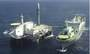
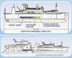
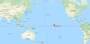
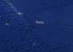

# Sea launch
> 2019.04.30 [🚀](../index/index.md) [despace](index.md) → [Spaceport](spaceport.md)

[TOC]

---

> <small>**Sea Launch** — EN term. **Морской старт** — translation to Russian.</small>

**Sea Launch** is a multinational spacecraft launch service that used a mobile maritime launch platform for equatorial launches of commercial payloads on specialized [Zenit-3SL](zenit.md) rockets through 2014.

It consists of an Assembly and command vessel (length 203 m, width 32 m, height 50 m, tonnage 27 000 tons, maximum speed 21 knots) and the Odyssey launch platform (length 133 m, width 67 m, height 60 m, tonnage 46 000 tons).

The idea of the sea launch site is to deliver the launch vehicle by sea to the equator, where there are the best conditions for launching. This method was used in 1964-1988 at the marine cosmodrome «[San‑Marko](San_Marco)», which was a stationary anchored platform near the equator in Kenyan territorial waters.

|*Characteristic*|*[Value](si.md)*|
|:--|:--|
|Activity|**Suspended from 2014, frozen from 2020** (1995 ‑ …)|
|[Launch vehicles](lv.md)|[Zenit-3SL](zenit.md)・ [Soyuz-5](soyuz.md)|
|Operator|International consortium Sea Launch Company (SLC)|
|Location|0°N 154°W  international waters of the Pacific ocean, near Christmas Island|
|Distance|0 ㎞ — to the equator;  19 300 ㎞ — to [NPO Lavochkin](zz_lav.md);  5 600 ㎞ — to [JPL](zz_jpl.md)|
|Launch pad|1|
| |      |
| | <small>*World map of spaceports*</small>|

 

## Docs & links
|Navigation|
|:--|
|**[FAQ](faq.md)**, **[Cable](cable.md)**·БКС, **[Camera](cam.md)**·Камера, **[Comms](comms.md)**·Радио, **[CON](contact.md)·[Pers](person.md)**·Контакт, **[Control](control.md)**·Упр., **[Doc](doc.md)**·Док., **[Doppler](doppler.md)**·ИСР, **[DS](ds.md)**·ЗУ, **[EB](eb.md)**·ХИТ, **[ECO](ecology.md)**·Экол., **[EF](ef.md)**·ВВФ, **[ElC](elc.md)**·ЭКБ, **[EMC](emc.md)**·ЭМС, **[Error](error.md)**·Ошибки, **[Event](event.md)**·События, **[FS](fs.md)**·ТЭО, **[Fuel](fuel.md)**·Топливо, **[GNC](gnc.md)**·БКУ, **[GS](scs.md)**·НС, **[HF&E](hfe.md)**·Эрго., **[IU](iu.md)**·Гиро., **[KT](kt.md)**·КТЕХ, **[LAG](lag.md)**·ПУC, **[LES](les.md)**·САСП, **[LS](ls.md)**·СЖО, **[LV](lv.md)**·РН, **[MCC](mcc.md)**·ЦУП, **[Model](model.md)**·Модель, **[MSC](sc.md)**·ПКА, **[N&B](nnb.md)**·БНО, **[NR](nr.md)**·ЯР, **[OBC](obc.md)**·ЦВМ, **[OE](oe.md)**·БА, **[Pat.](патент.md)**·Патент, **[Proj.](project.md)**·Проект, **[PS](ps.md)**·ДУ, **[QM](qm.md)**·БКНР, **[R&D](rnd.md)**·НИОКР, **[Robot](robotics.md)**·Робот, **[Rover](rover.md)**·Ровер, **[RTG](rtg.md)**·РИТЭГ, **[SARC](sarc.md)**·ПСК, **[SE](se.md)**·СЭ, **[Sens.](sensor.md)**·Датч., **[SC](sc.md)**·КА, **[SCS](scs.md)**·КК, **[SGM](sgm.md)**·КММ, **[SI](si.md)**·СИ, **[Soft](soft.md)**·ПО, **[SP](sp.md)**·БС, **[Spaceport](spaceport.md)**·Космодр., **[SPS](sps.md)**·СЭС, **[SSS](sss.md)**·ГЗУ, **[TCS](tcs.md)**·СОТР, **[Test](test.md)**·ЭО, **[Timeline](timeline.md)**·ЦГМ, **[TMS](tms.md)**·ТМС, **[TOR](tor.md)**·ТЗ, **[TRL](trl.md)**·УГТ|
|*Sections & pages*|
|**【[Spaceport](spaceport.md)】**  …  • • •  **Brazil:** ... ··· inactive: [Whalers Way](whalers_way.md) (3 900), [Woomera](woomera.md) (3 300) ┊ **Brazil:** [Alcantara](alcantara.md) (260) ┊ **Canada:** [Canso](canso.md) (5 000) ┊ **China:** [Jiuquan](jiuquan.md) (5 000), [Taiyuan](taiyuan.md) (4 500), [Wenchang](wenchang.md) (2 200), [Xichang](xichang.md) (3 200) ┊ **EU:** [Esrange](esrange.md) (7 550), [Guiana (Kourou)](kourou.md) (650) ··· inactive: [Hammaguir](hammaguir.md) (3 450), [San Marco](san_marco.md) (300), [Spaceport Cornwall](sp_cornwall.md) (5 600), [Shetland](shetland_sc.md) (6 800) ┊ **India:** [Sriharikota](sriharikota.md) (1 600) ┊ **Int.:** … ··· inactive: [Sea Launch](sea_launch.md) (0) ┊ **Iran:** [Semnan](semnan.md) (4 300)) ┊ **Iraq:** … ··· inactive: [Al Anbar](al_anbar.md) (3 700) ┊ **Israel:** [Palmachim](palmachim.md) (3 700) ┊ **Japan:** [Taiki](taiki.md) (4 700), [Tanegashima](tanegashima.md) (3 400), [Uchinoura](uchinoura.md) (3 700) ┊ **Korea N.:** [Sohae](sohae.md) (4 900), [Tonghae](tonghae.md) (4 700) ┊ **Korea S.:** [Naro](naro.md) (4 000) ┊ **RF,CIF:** [Baikonur](baikonur.md) (5 200), [Dombarovsky](dombarovsky.md) (5 500), [Kapustin Yar](kapustin_yar.md) (5 400), [Plesetsk](plesetsk.md) (7 400), [Vostochny](vostochny.md) (5 500) ··· inactive: [Svobodny](svobodny.md) (5 500) ┊ **USA:** [America](america.md) (3 900), [Canaveral](canaveral.md) (3 400), [Kennedy](kennedy.md) (3 400), [Kodiak](kodiak.md) (6 600), [Kwajalein](kwajalein.md) (1 000), [Rocket Lab LC1](rocket_lab_lc1.md) (4 700), [SpaceX STLS](spacex_stls.md) (2 800), [Vandenberg](vandenberg.md) (4 200), [Wallops](wallops.md) (4 500)|

   1. Docs: …
   1. Notable interwikies — …
   1. [Sea Dragon](sea_dragon.md) — project of a super-heavy launch vehicle with a sea launch.
   1. <https://en.wikipedia.org/wiki/Sea_Launch>
   1. <https://ru.wikipedia.org/wiki/Морской_старт>

