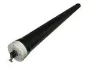
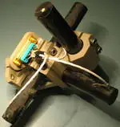

# Датчик
> 2019.05.12 [🚀](../index/index.md) [despace](index.md) → **[Датчик](sensor.md)**

[TOC]

---

> <small>**Датчик** — русскоязычный термин. **Sensor** — англоязычный эквивалент.</small>

**Датчик** — средство измерений, предназначенное для выработки сигнала измерительной информации в форме, удобной для передачи, дальнейшего преобразования, обработки и (или) хранения, но не поддающейся непосредственному восприятию наблюдателем. Датчики, выполненные на основе электронной техники, называются электронными датчиками. Отдельно взятый датчик может быть предназначен для измерения (контроля) и преобразования одной физической величины или одновременно нескольких физических величин.

В состав датчика входят чувствительные и преобразовательные элементы. Основными характеристиками электронных датчиков являются чувствительность и погрешность.

Датчики широко используются в научных исследованиях, испытаниях, контроле качества, телеметрии, системах автоматизированного управления и в других областях деятельности и системах, где требуется получение измерительной информации.

|*Датчики*|*Аналоговый*|*Цифровой*|
|:-|:-|:-|
|Давления|[2МД-Т (ТО и ТУ) ❐](f/sensor/2md-t_docs.7z)| |
|Температуры|[ТМ 293 (ТО и ТУ) ❐](f/sensor/tm_293_docs.7z)| |

**Общая информация.**

|*Тип датчика*|*Масса, г*|<small>*Электро‑  потребление, А*</small>|<small>*Напря&shy;жение,  В*</small>|<small>*Диапазон  измерений*</small>|<small>*Погреш&shy;ность  измерений*</small>|
|:-|:-|:-|:-|:-|:-|
|**Давления,  аналоговый**|180 ‑ 250 (Lкабеля 400 ㎜)|0.01 ‑ 0.046|6.5|0 ‑ 140 ㎏f/㎝²|2.5 %|
|**Давления,  цифровой**| | | | | |
|**Температурный,  аналоговый**|9 (Lкабеля 400 ㎜);  12 (Lкабеля 1 000 ㎜);  22 (Lкабеля 2 000 ㎜)|0.0035 за 10 ㎳|12|–199 ‑ +200 ℃|1 %|
|**Температурный,  цифровой**|9.3 (Lкабеля 300 ㎜);  13.2 (Lкабеля 800 ㎜);  24 (Lкабеля 1 500 ㎜)|0.0015 за  750 ㎳|12|–120 ‑ +150 ℃|0.1 %|

【**Table.** Manufacturers】

| | |
|:-|:-|
|**AE**|…|
|**AU**|…|
|**CA**|・[GHGSat](contact/ghgsat.md) — gas sensors for Cubesats|
|**CN**|…|
|**EU**|…|
|**IL**|…|
|**IN**|…|
|**JP**|・[Meisei](contact/meisei.md) — spectrometers|
|**KR**|…|
|**RU**|…|
|**SA**|…|
|**SG**|…|
|**US**|…|
|**VN**|…|

 

## Датчик Земли
> <small>**Датчик Земли** — русскоязычный термин. **Earth sensor (ES)** — англоязычный эквивалент.</small>

| | |
|:-|:-|
|**AE**|…|
|**AU**|…|
|**CA**|…|
|**CN**|…|
|**EU**|…|
|**IL**|…|
|**IN**|…|
|**JP**|・[Mitsubishi](contact/mitsubishi.md) — temperature sensors  ・[NEC](contact/nec.md)  ・[Sumitomo PP](contact/sumitomo_pp.md)|
|**KR**|…|
|**RU**|…|
|**SA**|…|
|**SG**|…|
|**US**|…|
|**VN**|…|

 

## Звёздный датчик
> <small>**Звёздный датчик (ЗД)** — русскоязычный термин. **Star tracker (ST)** — англоязычный эквивалент.</small>

**Звёздный датчик (ЗД)**, также **блок определения координат звёзд (БОКЗ)** — прибор в составе [космического аппарата](sc.md), предназначенный для определения ориентации КА относительно звёздного неба. Является чувствительным элементом системы ориентации КА. В конце 1980‑х начали применяться широкопольные датчики на основе ПЗС‑матриц, которые сравнивают полученное изображение звёздного неба с имеющимся в памяти звёздным каталогом. Датчик может быть как автономным прибором, содержащим блок обработки данных, так и использовать для этой цели вычислительные мощности [бортовой ЭВМ](obc.md).

| |*[Фирма](contact.md)*|*Модели ЗД (масса, ㎏)*|
|:-|:-|:-|
|**EU**|[Leonardo](leonardo.md)|[A-STR](st_lst.md) (3.55)・ [AA-STR](st_lst.md) (2.6)|
| |[Jena‑Optronik](contact/jenaoptronik.md)|[ASTRO 15](st_lst.md) (6.15)・ [ASTRO 10](st_lst.md) (3.8)・ [ASTRO APS](st_lst.md) (2)|
| |[Sodern](contact/sodern.md)|[Hydra](st_lst.md) (4.6)・ [Horus](st_lst.md) (1.6)・ [Auriga](st_lst.md) (0.56)  **`Исторические:`** *[SED26](st_lst.md) (3.3)*|
| |[Terma A/S](contact/terma.md)|[HE-5AS](st_lst.md) (2.2)・ [T2](st_lst.md) (0.8)・ [T1](st_lst.md) (0.6 ‑ 1)|
|•|• • • • • • • • • • • • •|• • •|
|**RU**|[Геофизика‑Космос](contact/geofizika_s.md)|[348К](st_lst.md) (3.45)・ [360К](st_lst.md) ()|
| |[ИКИ РАН](contact/iki_ras.md)|[БОКЗ-МФ](st_lst.md) (2.8)・ [мБОКЗ-2](st_lst.md) (1.5)・ [МикроБОКЗ](st_lst.md) (0.4)|
| |[МОКБ Марс](contact/mars_mokb.md)|[АД-1](st_lst.md) (3.8)|
| |[Спутникс](contact/sputnix.md)|[SX-SR-MicroBOKZ](st_lst.md) (0.5)|
|•|• • • • • • • • • • • • •|• • •|
|**US**|[Ball A&T](contact/ball_at.md)|[HAST](st_lst.md) (7.7)・ [CT-2020](st_lst.md) (3)|
| |[Space Micro](space_micro.md)|[µSTAR](st_lst.md) (2.1)・ [MIST](st_lst.md) (0.55)|

【**Table.** Manufacturers】

| | |
|:-|:-|
|**AE**|…|
|**AU**|…|
|**CA**|・[Macfab](contact/macfab.md)|
|**CN**|…|
|**EU**|…|
|**IL**|…|
|**IN**|…|
|**JP**|・[Hamamatsu Photonics](contact/hamamatsu_phot.md)|
|**KR**|・[Satrec Initiative](contact/satreci.md)|
|**RU**|…|
|**SA**|…|
|**SG**|…|
|**US**|…|
|**VN**|…|

**Кубсаты:**

   - <https://www.bluecanyontech.com/components>
   - <https://www.adcolemai.com/attitude-systems/>
   - <https://www.berlin-space-tech.com/>

 

## Магнитометр
> <small>**Магнитометр** — русскоязычный термин. **Magnetometer** — англоязычный эквивалент.</small>

**Магнито́метр** — *(от гр. μαγνητό — магнит + гр. μετρεω измеряю)*, прибор для измерения характеристик магнитного поля и магнитных свойств материалов. В зависимости от измеряемой величины различают приборы для измерения напряжённости поля (эрстедметры), направления поля (инклинаторы и деклинаторы), градиента поля (градиентометры), магнитной индукции (тесламетры), магнитного потока (веберметры или флюксметры), коэрцитивной силы (коэрцитиметры), магнитной проницаемости (мю‑метры), магнитной восприимчивости (каппа‑метры), магнитного момента.

Магнитометры применяются в геологии, археологии, магнитной геохронологии, навигации на море, в космосе и авиации, разведке и сейсмологии, биологии и медицине.

Магнитометры используются для навигации КА по магнитному полю Земли, а также для определения высоты. Впервые магнитометр был использован на КА «Спутник‑3» (1958 г).

Современные магнитометры для навигации сделаны в виде трёх перпендикулярных друг другу трубок, с помощью которых может быть построена 3‑осная ориентация и определено направление магнитного поля. В случае применения одной или двух трубок вместо трёх измерения могут проводиться путём поворота КА или помещения магнитометра на привод.

|В космосе применяются  индукционные магнитометры.|Магнитометр КА [THEMIS](themis.md).|
|:-|:-|
|||

**Разновидности**

| |*Произв.*|*Актуальные (масса, г)*|*Исторические (масса, г)*|
|:-|:-|:-|:-|
|**RU**|[Спутникс](contact/sputnix.md)|[SX-MAGWR](mtm_lst.md) (100)| |

【**Table.** Manufacturers】

| | |
|:-|:-|
|**AE**|…|
|**AU**|…|
|**CA**|…|
|**CN**|…|
|**EU**|…|
|**IL**|…|
|**IN**|…|
|**JP**|・[Meisei](contact/meisei.md) — spectrometers|
|**KR**|…|
|**RU**|・[Спутникс](contact/sputnix.md)|
|**SA**|…|
|**SG**|…|
|**US**|…|
|**VN**|…|

## Солнечный датчик
> <small>**Солнечный датчик (СД)**,  **Солнечный датчик положения (СДП)** — русскоязычные термины. **Sun sensor (SS)** — англоязычный эквивалент.</small>

**Солнечный датчик (СД)**, также **солнечный датчик положения (СДП)** предназначен для:

   1. первоначального построения **постоянной солнечной ориентации (ПСО)** после отделения от [РБ](lv.md);
   1. построения и поддержания ПСО на [КА](sc.md), где условия работы [научной аппаратуры](sc.md) предполагают использование ПСО в качестве рабочей ориентации;
   1. построения и поддержания ПСО в нештатных ситуациях, в случаях, когда парирование нештатной ситуации в режиме инерциальной ориентации невозможно.

There are various types of sun sensors, which differ in their technology and performance characteristics. Sun presence sensors provide a binary output, indicating when the Sun is within the sensor’s field of view. Analog and digital sun sensors, in contrast, indicate the angle of the Sun by continuous and discrete signal outputs, respectively.

In typical sun sensors, a thin slit at the top of a rectangular chamber allows a line of light to fall on an array of photodetector cells at the bottom of the chamber. A voltage is induced in these cells, which is registered electronically. By orienting 2 sensors perpendicular to each other, the direction of the Sun can be fully determined. Often, multiple sensors will share processing electronics.

| |*[Фирма](contact.md)*|*Модели СД (масса, ㎏)*|
|:-|:-|:-|
|**EU**|[Bradford](contact/bradford_eng.md)|[FSS](ss_lst.md) (0.05 ‑ 0.375)・ [CSS](ss_lst.md) (0.275)・ [CoSS](ss_lst.md) (0.015 ‑ 0.024)|
| |[Jena‑Optronik](contact/jenaoptronik.md)|[FSS](ss_lst.md) (0.65)|
| |[Solar MEMS](contact/solarmems.md)|[NanoSSOC-A60](nssoc_a60.md) ()・ [NanoSSOC-D60](nssoc_d60.md) ()・ [SSOC-A60](ssoc_a60.md) ()・ [SSOC-D60](ssoc_d60.md) ()|
|•|• • • • • • • • • • • • •|• • •|
|**RU**|[ВНИИЭМ](contact/vniiem.md)| |
| |[Геофизика‑Космос](contact/geofizika_s.md)|[347К](ss_lst.md) (0.7)|
| |[ИКИ РАН](contact/iki_ras.md)|[ОСД](ss_lst.md) (0.65)|
| |[МОКБ Марс](contact/mars_mokb.md)|[ТДС](ss_lst.md) (2.3)・ [СДП-1](ss_lst.md) (0.4)|
| |[Спутникс](contact/sputnix.md)|[SX-SUNR-01](ss_lst.md) (0.04)| |

【**Table.** Manufacturers】

| | |
|:-|:-|
|**AE**|…|
|**AU**|…|
|**CA**|・[Macfab](contact/macfab.md)  ・[Sinclair Interplanetary](contact/sinclair_ip.md)|
|**CN**|…|
|**EU**|…|
|**IL**|…|
|**IN**|…|
|**JP**|・[Hamamatsu Photonics](contact/hamamatsu_phot.md)|
|**KR**|・[Satrec Initiative](contact/satreci.md)|
|**RU**|…|
|**SA**|…|
|**SG**|…|
|**US**|…|
|**VN**|…|

Etc:

   - Solar MEMS <http://www.solar-mems.com/space-equipment/>
   - <https://www.adcole.com/aerospace/analog-sun-sensors/>
   - <https://www.adcolemai.com/sun-sensors/>
   - <https://spacetech-i.com/products/satellite-equipment/cess>
   - <https://lens-rnd.com/sun-sensors/>
   - <https://www.cgsatellite.com/>
   - <http://lasp.colorado.edu/home/wp-content/uploads/2018/07/700.Fine-Sun-Sensor.pdf>
   - <http://www.vniiem.ru/ru/index.php?:option=com_content&view=article&id=705:2015-08-04-07-29-07&catid=98:2015-08-04-07-15-09&Itemid=62>

**Кубсаты:**

| |*[Фирма](contact.md)*|*Модели СД для кубсатов (масса, ㎏)*|
|:-|:-|:-|
|**US**|[Space Micro](space_micro.md)|[MSS](ss_lst.md) (0.036)・ [CSS](ss_lst.md) (0.02)|

   - <http://www.newspaceglobal.com/>
   - <https://sunsensor.eu/>

 

## Docs & links (TRANSLATEME ALREADY)
|Navigation|
|:-|
|**[FAQ](faq.md)**【**[SCS](scs.md)**·КК, **[SC (OE+SGM)](sc.md)**·КА】**[CON](contact.md)·[Pers](person.md)**·Контакт, **[Ctrl](control.md)**·Упр., **[Doc](doc.md)**·Док., **[Drawing](drawing.md)**·Чертёж, **[EF](ef.md)**·ВВФ, **[Error](error.md)**·Ошибки, **[Event](event.md)**·События, **[FS](fs.md)**·ТЭО, **[HF&E](hfe.md)**·Эрго., **[KT](kt.md)**·КТ, **[N&B](nnb.md)**·БНО, **[Project](project.md)**·Проект, **[QM](qm.md)**·БКНР, **[R&D](rnd.md)**·НИОКР, **[SI](si.md)**·СИ, **[Test](test.md)**·ЭО, **[TRL](trl.md)**·УГТ, **[Way](way.md)**·Пути|
|*Sections & pages*|
|**`Датчик:`**  …|
|**`Звёздный датчик (ЗД):`**  [Видимая звёздная величина](app_mag.md)・ [ПЗр](fov.md) • • •  **Европа:** [ASTRO 15](st_lst.md) (6.15)・ [Hydra](st_lst.md) (4.6)・ [ASTRO 10](st_lst.md) (3.8)・ [A-STR](st_lst.md) (3.55)・ [AA-STR](st_lst.md) (2.6)・ [HE-5AS](st_lst.md) (2.2)・ [ASTRO APS](st_lst.md) (2)・ [Horus](st_lst.md) (1.6)・ [T2](st_lst.md) (0.8)・ [T1](st_lst.md) (0.6 ‑ 1)・ [Auriga](st_lst.md) (0.21)  ▮  **РФ:** [348К](st_lst.md) (3.45)・ [360К](st_lst.md) ()・ [АД-1](st_lst.md) (3.8)・ [БОКЗ-МФ](st_lst.md) (2.8)・ [мБОКЗ-2](мбокз_2.md) (1.5)・ [SX-SR-MicroBOKZ](st_lst.md) (0.5)  ▮  **США:** [HAST](st_lst.md) (7.7)・ [CT-2020](st_lst.md) (3)・ [µSTAR](st_lst.md) (2.1)・ [MIST](st_lst.md) (0.55) |
|**【[Structures, gears, materials (SGM)](sc.md)】**  [Гермоконтейнер](гермоконтейнер.md)・ [Датчик](sensor.md)・ [Задел](margin.md)・ [Изделие](unit.md)・ [Испарение материалов](matc.md)・ [Кавитация](cavitation.md)・ [КЗУ](cinu.md) (ВБУ КТ)・ [КХГ](cgs.md)・ [Контейнеры для транспортировки](ship_contain.md)・ [Крейцкопф](crosshead.md)・ [Номинал](nominal.md)・ [ПУС](lag.md)・ [ПНА, ПОНА, ПСНА](devd.md)・ [Резерв](reserve.md)・ [Слайс](слайс.md)・ [ТСП](tsp.md)・ [Типичные формы КА](sc.md)・ [Толкатель](толкатель.md)・ [Унификация](commonality.md)|
|**`Магнитометр:`**  …  • • •  **РФ:** [SX-MAGWR](mtm_lst.md) (100)|
|**`Солнечный датчик (СД):`**  [ПЗр](fov.md)  • • •  (КА) **Европа:** [FSS](ss_lst.md) (650)・ [FSS](ss_lst.md) (50 ‑ 375)・ [CSS](ss_lst.md) (275)・ [CoSS](ss_lst.md) (15 ‑ 24)  ▮  **РФ:** [ТДС](ss_lst.md) (2 300)・ [347К](ss_lst.md) (700)・ [ОСД](ss_lst.md) (650)・ [СДП-1](ss_lst.md) (400)・ [SX-SUNR-01](ss_lst.md) (40)  *(Кубсаты) **США:** [MSS](ss_lst.md) (0.036)・ [CSS](ss_lst.md) (0.02)*|

   1. Docs:
      - [ЗД, template](templates.md) / [СД, template](templates.md)
   1. Sensor:
      1. <https://en.wikipedia.org/wiki/Sensor>
   1. ЗД:
      1. <https://en.wikipedia.org/wiki/Star_tracker>
      1. <https://ru.wikipedia.org/wiki/Звёздный_датчик>
      1. <https://www.ball.com/aerospace/markets-capabilities/capabilities/technologies-components/star-trackers>
      1. <https://www.terma.com/space/space-segment/star-trackers/>
   1. СД:
      1. <https://en.wikipedia.org/wiki/Sun_sensor>
      1. <https://www.jvejournals.com/article/17518>
   1. <https://en.wikipedia.org/wiki/Magnetometer>
   1. <https://en.wikipedia.org/wiki/Spacecraft_magnetometer>
   1. <https://ru.wikipedia.org/wiki/Магнитометр>
