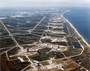
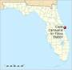
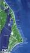

# Shetland Space Center
> 2020.06.30 [🚀](../index/index.md) [despace](index.md) → [Spaceport](spaceport.md)

[TOC]

---

> <small>**Shetland Space Center** — EN term. **Космический центр Шетланд** — literal RU translation.</small>

**Shetland Space Center (SSC)** plans to build and operate a satellite launch site and a ground station in Unst, Shetland, the UK’s most northerly island. It follows the identification in a major report for the UK Space Agency of Saxa Vord in Unst as the best location in the country for such a facility. SSC is already at work on a joint project with ArianeGroup to develop launch site proposals. Interest in our launch and ground station plans from the space industry, commercial and military, across the world is huge. We are working closely with the local community and planning authorities on next steps.

   - **The Rationale.** Saxa Vord in Unst, home to new RAF radar technology monitoring Northern Europe, is recognised as the ideal location for launching small rockets transporting satellites into [polar and sun-synchronous orbits](nnb.md). The northerly latitude also makes it a perfect spot for a ground station to datalink to existing satellites passing overhead.
   - **The Sites.** SSC has identified potential launch and ground station sites in north-east Unst as well as locations for ancillary support systems, and, with specialist support, is working towards securing operating licences and planning permissions for the necessary construction works.
   - **The Future.** Our aim is to have a fully functioning satellite launch facility in place by late 2021, with logistical support allowing commercial and military clients to operate from Unst. Prior to that we plan to have a ground station up and running, allowing us to harvest satellite data and provide a range of services to companies within the space industry and beyond.

|*Characteristic*|*[Value](si.md)*|
|:--|:--|
|Activity|Future (2017 ‑ …)|
|[Launch vehicles](lv.md)|…|
|Operator|Shetland Space Center|
|Location|60°47'55.2"N 0°49'10.2"W  Saxa Vord Resort Haroldswick, Unst, Shetland, Scotland, ZE2 9TJ|
|Distance|6 800 ㎞ — to the equator;  2 250 ㎞ — to [NPO Lavochkin](zz_lav.md);  15 800 ㎞ — to [JPL](zz_jpl.md)|
|Launch pad|1 (1 active)|
| |     |
| | <small>*World map of spaceports*</small>|

 

## Docs & links
|Navigation|
|:--|
|**[FAQ](faq.md)**【**[SCS](scs.md)**·КК, **[SC (OE+SGM)](sc.md)**·КА】**[CON](contact.md)·[Pers](person.md)**·Контакт, **[Ctrl](control.md)**·Упр., **[Doc](doc.md)**·Док., **[EF](ef.md)**·ВВФ, **[Error](error.md)**·Ошибки, **[Event](event.md)**·События, **[FS](fs.md)**·ТЭО, **[HF&E](hfe.md)**·Эрго., **[KT](kt.md)**·КТ, **[Model](model.md)**·Модель, **[N&B](nnb.md)**·БНО, **[Patent](патент.md)**·Пат., **[Project](project.md)**·Проект, **[QM](qm.md)**·БКНР, **[R&D](rnd.md)**·НИОКР, **[SI](si.md)**·СИ, **[Test](test.md)**·ЭО, **[TRL](trl.md)**·УГТ, **[Way](way.md)**·Пути|
|*Sections & pages*|
|**【[Spaceport](spaceport.md)】**  …  • • •  **Brazil:** ... ··· inactive: [Whalers Way](whalers_way.md) (3 900), [Woomera](woomera.md) (3 300) ┊ **Brazil:** [Alcantara](alcantara.md) (260) ┊ **Canada:** [Canso](canso.md) (5 000) ┊ **China:** [Jiuquan](jiuquan.md) (5 000), [Taiyuan](taiyuan.md) (4 500), [Wenchang](wenchang.md) (2 200), [Xichang](xichang.md) (3 200) ┊ **EU:** [Esrange](esrange.md) (7 550), [Guiana (Kourou)](kourou.md) (650) ··· inactive: [Hammaguir](hammaguir.md) (3 450), [San Marco](san_marco.md) (300), [Spaceport Cornwall](sp_cornwall.md) (5 600), [Shetland](shetland_sc.md) (6 800) ┊ **India:** [Sriharikota](sriharikota.md) (1 600) ┊ **Int.:** … ··· inactive: [Sea Launch](sea_launch.md) (0) ┊ **Iran:** [Semnan](semnan.md) (4 300)) ┊ **Iraq:** … ··· inactive: [Al Anbar](al_anbar.md) (3 700) ┊ **Israel:** [Palmachim](palmachim.md) (3 700) ┊ **Japan:** [Taiki](taiki.md) (4 700), [Tanegashima](tanegashima.md) (3 400), [Uchinoura](uchinoura.md) (3 700) ┊ **Korea N.:** [Sohae](sohae.md) (4 900), [Tonghae](tonghae.md) (4 700) ┊ **Korea S.:** [Naro](naro.md) (4 000) ┊ **RF,CIF:** [Baikonur](baikonur.md) (5 200), [Dombarovsky](dombarovsky.md) (5 500), [Kapustin Yar](kapustin_yar.md) (5 400), [Plesetsk](plesetsk.md) (7 400), [Vostochny](vostochny.md) (5 500) ··· inactive: [Svobodny](svobodny.md) (5 500) ┊ **USA:** [America](america.md) (3 900), [Canaveral](canaveral.md) (3 400), [Kennedy](kennedy.md) (3 400), [Kodiak](kodiak.md) (6 600), [Kwajalein](kwajalein.md) (1 000), [Rocket Lab LC1](rocket_lab_lc1.md) (4 700), [SpaceX STLS](spacex_stls.md) (2 800), [Vandenberg](vandenberg.md) (4 200), [Wallops](wallops.md) (4 500)|

   1. Docs: …
   1. Notable interwikies — …
   1. <https://shetlandspacecentre.com/>
   1. <https://www.facebook.com/shetlandspacecentre/>
   1. <https://twitter.com/shetland_space>
   1. <https://www.linkedin.com/company/shetland-space-centre>
