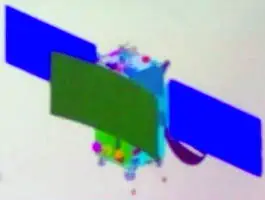

# Shukrayaan-1
> 2019.11.07 [🚀](../index/index.md) [despace](index.md) → [Venus](venus.md), **[Project](project.md)**

[TOC]

---

> <small>**Shukrayaan-1** — EN term. **Шакраян-1** — rough RU analogue.</small>

**Shukrayaan-1** (शुक्रयान-१ or Venus craft) is a proposed orbiter to Venus by the Indian Space Research Organisation to study the surface and atmosphere of Venus.

 

|*Type*|*[Param.](si.md)*|
|:-|:-|
|**【Mission】**|• • •|
|Cost|… or … ㎏ of [gold](sc_price.md)|
|Development|…|
|Duration|…|
|Launch|2023; Rocket GSLV Mk III|
|Operator|[ISRO](contact/isro.md)|
|Programme|…|
|Similar to|・Proposed: …   ・Current: …   ・Past: [Venera 15/16](venera_15_16.md), [VeGa 1/2](vega_1_2.md), [Magellan](magellan.md)|
|Target|Mapping; studying the surface and atmosphere of Venus|
|[Type](sc.md)|Orbiter spacecraft; atmospheric spacecraft|
|**【Spacecraft】**|• • •|
|Composition|Orbiter; atmospheric probe|
|Contractor|ISRO|
|Manufacturer|ISAC|
| |**`…`**|
|Comms|<mark>S‑band</mark>|
|[ID](spaceid.md)|NSSDC ID (COSPAR ID): <mark>TBD</mark>, SCN: <mark>TBD</mark>|
|Mass|Launch mass 2 500 ㎏ ([Large satellite](спутник.md), [EVN‑073](evn_073.md))|
|Orbit / Site|500 x 60 000 ㎞|
|Payload|Instruments for studying the surface and atmosphere of Venus|
|Power|500 W|

 

**Projected** targets & objectives:

   - **T** — technical; **C** — contact research; **D** — distant research; **F** — fly‑by; **H** — manned; **S** — soil sample return; **X** — technology demonstration
   - **Sections of measurement and observation:**
      - Atmospheric/climate — **Ac** composition, **Ai** imaging, **Am** mapping, **Ap** pressure, **As** samples, **At** temperature, **Aw** wind speed/direction.
      - General — **Gi** planet’s interactions with outer space.
      - Soil/surface — **Sc** composition, **Si** imaging, **Sm** mapping, **Ss** samples.

<small>

|*EVN‑XXX*|*T*|*EN*|*Section of m&o*|*D*|*C*|*F*|*H*|*S*|
|:-|:-|:-|:-|:-|:-|:-|:-|:-|
|EVN‑005|T|Exploration: from Venusian orbit.| |D| |F| | |
|EVN‑011| |Atmosphere: common circulation model.| |D| | | | |
|EVN‑014| |Atmosphere: composition.| |D| | |F| |
|EVN‑017| |Atmosphere: structure.| |D| | | | |
|EVN‑022| |Surface: map, precise.| |D| | | | |
|EVN‑025| |Surface: structure.| | |C| | | |
|EVN‑046| |Surface: causes of the changes during the last billion years.| |D|C|F| | |
|EVN‑073|T|Exploration with [satellites](sc.md): large satellites.| |D| |F| | |
|EVN‑076| |Surface: volcanoes, their presence.| |D| |F| | |
|EVN‑077| |Atmosphere: chemical elements distribution.| |D| |F| | |
|EVN‑088|T|Surface: subsurface investigations.| | |C| | | |
|EVN‑096| |Atmosphere: ionosphere.| |D| |F| | |
|EVN‑097| |Atmosphere: effect of solar Rad & interplanetary space on the atmo.| |D| |F| | |

</small>

 

## Mission
The three broad research areas of interest for this mission include surface ([EVN‑046](venus.md)) / subsurface ([EVN‑088](venus.md)) features and re-surfacing processes; second: study the atmospheric chemistry ([EVN‑077](venus.md)), dynamics ([EVN‑011](venus.md)) and compositional variations ([EVN‑014](venus.md)), and third: study the atmospheric interaction with solar radiation and solar wind ([EVN‑097](venus.md)).

<mark>Indian Proposals: 54. Recommended: 16  
International Proposals: 21. Recommended: 7 (USA-3, Russia-1, Russia/France-1)  
Collaborative payloads: India/Germany: 1, India/Sweden: 1</mark>

 

## Science goals & payload
   - Mapping the Venusian surface at high spatial resolution of 30 to 40 meters ([EVN‑022](venus.md));
   - Determining the structure ([EVN‑025](venus.md)) and stratigraphy of surface / subsurface features — volcanic hotspots [EVN‑076](venus.md));
   - Determining the structure ([EVN‑017](venus.md)) and composition ([EVN‑014](venus.md)) of the atmosphere;
   - Understanding Cloud Dynamics ([EVN‑011](venus.md));
   - Investigating Venusian Ionosphere ([EVN‑096](venus.md)).

|*Indian Payloads selected*|*Surface/ Subsurface*|*Atmospheric*|*Ionospheric*|*Sun-Venus  Environment*|
|:-|:-|:-|:-|:-|
|Venus L&S Band Synthetic Aperture Radar ([SAR](cam.md))|×| | | |
|Advanced Radar for Topside Ionosphere and subsurface sounding (VARTISS) (HF radar)|×| |×|×|
|VSEAM (Surface Emissivity)|×|×| | |
|VTC (Thermal Camera)| |×| | |
|VCMC (Cloud Monitoring)| |×| | |
|LIVE (Lightning Sensor)| |×| | |
|VASP (Spectro Polarimeter)| |×| | |
|SPAV (Solar Occultation Photometry)| |×| | |
|NAVA (Airglow imager)| |×|×|×|
|RAVI (Radio Occultation Experiment)| |×|×|×|
|ETA (Electron Temperature Analyser)| | |×| |
|RPA (Retarding Potential Analyser)| | |×| |
|Mass Spectrometer| |×|×| |
|VISWAS (Plasma Analyser)| | |×|×|
|VREM (Radiation Environment)| | |×|×|
|SSXS (Solar Soft X‑ray Spectrometer)| | | |×|
|VIPER (Plasma Wave Detector)| | | |×|

**RAVI**  
Frequency/wavelength/Mode of operation:  
Stable S band and X band;  
Ultra stable oscillator (10 ㎒);  
Output Level: 7 dBm into 50 Ω;  
Allan Variance (1 30 sec): ≤1.2 × 10⁻¹³

 

## Spacecraft

<mark>TBD</mark>

 

## Community, library, links

**PEOPLE:**

<mark>TBD</mark>

**COMMUNITY:**

<mark>TBD</mark>

 

## Docs & links
|Navigation|
|:-|
|**[FAQ](faq.md)**【**[SCS](scs.md)**·КК, **[SC (OE+SGM)](sc.md)**·КА】**[CON](contact.md)·[Pers](person.md)**·Контакт, **[Ctrl](control.md)**·Упр., **[Doc](doc.md)**·Док., **[Drawing](drawing.md)**·Чертёж, **[EF](ef.md)**·ВВФ, **[Error](error.md)**·Ошибки, **[Event](event.md)**·События, **[FS](fs.md)**·ТЭО, **[HF&E](hfe.md)**·Эрго., **[KT](kt.md)**·КТ, **[N&B](nnb.md)**·БНО, **[Project](project.md)**·Проект, **[QM](qm.md)**·БКНР, **[R&D](rnd.md)**·НИОКР, **[SI](si.md)**·СИ, **[Test](test.md)**·ЭО, **[TRL](trl.md)**·УГТ, **[Way](way.md)**·Пути|
|*Sections & pages*|
|**【】**  <mark>NOCAT</mark>|

   1. Docs: …
   1. <https://en.wikipedia.org/wiki/Shukrayaan-1>
   1. <https://www.reddit.com/r/ISRO/comments/dslc83/couple_of_slides_from_isro_presentation_at_venus/>
