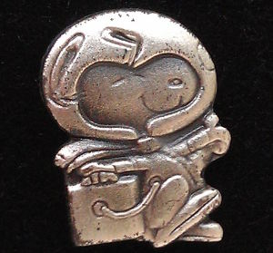
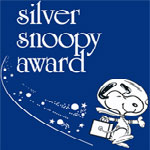

# Silver Snoopy award
> 2019.05.12 [🚀](../index/index.md) [despace](index.md) → [Безопасность](qm.md), **[Space](index.md)**, [ПКА](sc.md), [Проекты](project.md)

[TOC]

---

The **Silver Snoopy award** is a special honor awarded to [NASA](contact/nasa.md) employees and contractors for outstanding achievements related to human flight safety or mission success. The award certificate states that it is «In Appreciation» «For professionalism, dedication and outstanding support that greatly enhanced space flight safety and mission success.» The award depicts Snoopy, a character from the Peanuts comic strip created by Charles M. Schulz.

Уже полвека в NASA существует одна из самых престижных наград «Серебряный Снупи» (Silver Snoopy award). Ей отмечаются сотрудники и подрядчики организации за выдающиеся достижения, связанные с обеспечением безопасности пилотируемых полетов и успешным завершением миссий. Награду вручают сами астронавты. Её получает не более 1 % сотрудников. Как и Гонкуровской премией, эти значком человек может быть награждён только один раз в жизни. Носить такой значок – большая честь. Все знают, что этот человек много сделал для безопасности астронавтов.

| | |
|:--|:--|
|||

## Review

The award is given personally by NASA astronauts as it represents the astronauts' own recognition of excellence. It is presented at the workplace of the recipient with the recipient’s coworkers present. The Silver Snoopy award is one of several awards overseen by the Space Flight Awareness (SFA) program at NASA.

The award consists of a sterling silver «Silver Snoopy» lapel pin flown during a NASA mission, a commendation letter (stating the mission the Silver Snoopy pin was flown on) and a signed, framed Silver Snoopy certificate. Snoopy decals and posters are also given to the recipient.

## Requirements
Employees of NASA or one of its contractors can be considered for a Silver Snoopy award if they have satisfied one or more of the following criteria:

   - Significantly contributed beyond their normal work requirements to the development and implementation of human spaceflight programs while ensuring quality and safety.
   - Accomplished single specific achievements that have had significant impact on attainment of a particular human spaceflight program goal while ensuring quality and safety.
   - Contributed to a major cost saving or a series of lesser cost savings pertaining directly to human spaceflight programs.
   - Has been instrumental in developing modifications to human spaceflight mission hardware, software, or materials that increase reliability, efficiency, or performance.
   - Assisted in operational improvements that increase efficiency or performance.
   - Has been a key player in developing a beneficial process improvement of significant magnitude.
   - Contributed significantly beyond fundamental task accountabilities in support of the NASA programs.
   - Sustained quality performance over an extended period of time in support of human spaceflight programs.

 

## Docs & links (TRANSLATEME ALREADY)
|Navigation|
|:--|
|**[FAQ](faq.md)**【**[SCS](scs.md)**·КК, **[SC (OE+SGM)](sc.md)**·КА】**[CON](contact.md)·[Pers](person.md)**·Контакт, **[Ctrl](control.md)**·Упр., **[Doc](doc.md)**·Док., **[Drawing](drawing.md)**·Чертёж, **[EF](ef.md)**·ВВФ, **[Error](error.md)**·Ошибки, **[Event](event.md)**·События, **[FS](fs.md)**·ТЭО, **[HF&E](hfe.md)**·Эрго., **[KT](kt.md)**·КТ, **[N&B](nnb.md)**·БНО, **[Project](project.md)**·Проект, **[QM](qm.md)**·БКНР, **[R&D](rnd.md)**·НИОКР, **[SI](si.md)**·СИ, **[Test](test.md)**·ЭО, **[TRL](trl.md)**·УГТ, **[Way](way.md)**·Пути|
|*Sections & pages*|
|**【[Space](index.md)】**  [Apparent magnitude](app_mag.md)・ [Astro.object](aob.md)・ [Blue Marble](earth.md)・ [Cosmic rays](cr.md)・ [Ecliptic](ecliptic.md)・ [Escape velocity](esc_vel.md)・ [Health](health.md)・ [Hill sphere](hill_sphere.md)・ [Information](info.md)・ [Lagrangian points](l_points.md)・ [Near space](near_space.md)・ [Pale Blue Dot](earth.md)・ [Parallax](parallax.md)・ [Point Nemo](earth.md)・ [Silver Snoopy award](silver_snoopy_award.md)・ [Solar constant](solar_const.md)・ [Terminator](terminator.md)・ [Time](time.md)・ [Wormhole](wormhole.md) ┊ ··•·· **Solar system:** [Ariel](ariel.md)・ [Callisto](callisto.md)・ [Ceres](ceres.md)・ [Deimos](deimos.md)・ [Earth](earth.md)・ [Enceladus](enceladus.md)・ [Eris](eris.md)・ [Europa](europa.md)・ [Ganymede](ganymede.md)・ [Haumea](haumea.md)・ [Iapetus](iapetus.md)・ [Io](io.md)・ [Jupiter](jupiter.md)・ [Makemake](makemake.md)・ [Mars](mars.md)・ [Mercury](mercury.md)・ [Moon](moon.md)・ [Neptune](neptune.md)・ [Nereid](nereid.md)・ [Nibiru](nibiru.md)・ [Oberon](oberon.md)・ [Phobos](phobos.md)・ [Pluto](pluto.md)・ [Proteus](proteus.md)・ [Rhea](rhea.md)・ [Saturn](saturn.md)・ [Sedna](sedna.md)・ [Solar day](solar_day.md)・ [Sun](sun.md)・ [Titan](titan.md)・ [Titania](titania.md)・ [Triton](triton.md)・ [Umbriel](umbriel.md)・ [Uranus](uranus.md)・ [Venus](venus.md)|

   1. Docs: …
   1. <https://en.wikipedia.org/wiki/Silver_Snoopy_award>
   1. 2018.11.11 <https://mi3ch.livejournal.com/4315704.html>

