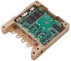

# Sirius TCM
> 2019.08.06 [🚀](../index/index.md) [despace](index.md) → **[ЗУ](ds.md)**

[TOC]

---

> <small>**Sirius TCM** — англоязычный термин, не имеющий аналога в русском языке. **Сириус ТСМ** — дословный перевод с английского на русский.</small>

**Sirius TCM** — постоянное запоминающее устройство (ПЗУ) на основе твердотельного накопителя для хранения цифровой информации.  
*Разработчик:* [AAC CS](zz_aac_cs.md). Разработано ранее 2019 года активное применение

<small>

|*•    Характеристика    •*|*[Значение](si.md) <small>(Sirius TCM)</small>*|
|:--|:--|
|[TRL](trl.md)|9|
|Алгоритмы сжатия| |
|Алгоритмы шифр.| |
|Входов| |
|Ёмкость, Мбит (Мбайт)|262 144 (32 768)|
|Исполнение| |
|Скор., Мбит(Мбайт)/с| |
|Циклов перезаписи| |
|**Etc:**|• • •|
|[ВБР](srrq.md) за САС| |
|Габариты, Д×Ш×В, ㎜|96 × 91 × 18|
|Интерфейсы|2 SpaceWire 50 Mbps, 3 RS422 / RS485 UARTs, 2 RS485-only UARTs, 1 PSS Interface RS485 PPS input|
|Mass, kg|0.134|
|[Voltage](voltage.md), V|4.5 ‑ 16|
|Overload, g| |
|[Rad.resist](ion_rad.md), Gy (rad)|300 (30 000)|
|Resource, h (y)| |
|[Lifetime](lifetime.md), h (y)|НОО: 43 800 (5)|
|[Temp. range](tcs.md), ℃|−30 ‑ +60|
|Consumption, W|1.3|
| ||

</small>

 

## Примечания
   1. …

## Применяемость
   1. …

 

## Docs & links (TRANSLATEME ALREADY)
|Navigation|
|:--|
|**[FAQ](faq.md)**, **[Cable](cable.md)**·БКС, **[Camera](cam.md)**·Камера, **[Comms](comms.md)**·Радио, **[Contact](contact.md)**·Контакт, **[Control](control.md)**·Упр., **[Doc](doc.md)**·Док., **[Doppler](doppler.md)**·ИСР, **[DS](ds.md)**·ЗУ, **[EB](eb.md)**·ХИТ, **[ECO](ecology.md)**·Экол., **[EF](ef.md)**·ВВФ, **[ElC](elc.md)**·ЭКБ, **[EMC](emc.md)**·ЭМС, **[Error](error.md)**·Ошибки, **[Event](event.md)**·События, **[FS](fs.md)**·ТЭО, **[Fuel](fuel.md)**·Топливо, **[GNC](gnc.md)**·БКУ, **[GS](scs.md)**·НС, **[HF&E](hfe.md)**·Эрго., **[IU](iu.md)**·Гиро., **[KT](kt.md)**·КТЕХ, **[LAG](lag.md)**·ПУC, **[LES](les.md)**·САСП, **[LS](ls.md)**·СЖО, **[LV](lv.md)**·РН, **[MCC](mcc.md)**·ЦУП, **[Model](model.md)**·Модель, **[MSC](sc.md)**·ПКА, **[N&B](nnb.md)**·БНО, **[NR](nr.md)**·ЯР, **[OBC](obc.md)**·ЦВМ, **[OE](oe.md)**·БА, **[Pat.](патент.md)**·Патент, **[Proj.](project.md)**·Проект, **[PS](ps.md)**·ДУ, **[R&D](rnd.md)**·НИОКР, **[Robot](robotics.md)**·Робот, **[Rover](rover.md)**·Ровер, **[RTG](rtg.md)**·РИТЭГ, **[SARC](sarc.md)**·ПСК, **[SE](se.md)**·СЭ, **[Sens.](sensor.md)**·Датч., **[SC](sc.md)**·КА, **[SCS](scs.md)**·КК, **[SGM](sgm.md)**·КММ, **[SI](si.md)**·СИ, **[Soft](soft.md)**·ПО, **[SP](sp.md)**·БС, **[Spaceport](spaceport.md)**·Космодр., **[SPS](sps.md)**·СЭС, **[SRRQ](srrq.md)**·БКНР, **[SSS](sss.md)**·ГЗУ, **[TCS](tcs.md)**·СОТР, **[Test](test.md)**·ЭО, **[Timeline](timeline.md)**·ЦГМ, **[TMS](tms.md)**·ТМС, **[TOR](tor.md)**·ТЗ, **[TRL](trl.md)**·УГТ|
|*Sections & pages*|
|**`Запоминающее устройство (ЗУ):`**  [5D optical data storage](5dods.md)  • • •  **Европа:** [SSR](ssr.md) (8) ┊ [Sirius TCM](sirius_tcm.md) (0.14)  ▮  **РФ:** [СЗИ-М](szi_m.md) (11.8) ┊ [OBMU](sait_obmu.md) (1.8)|

   1. Docs:
      - [Sirius TCM Datasheet ❐](f/comms/s/sirius_tcm_datasheet.pdf)
   1. Notable interwikies — …
   1. <…>
