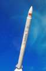

# Smart Dragon
> 2019.07.04 **[🚀](../index/index.md) [despace](index.md)** → **[LV](lv.md)**

[TOC]

---

> <small>*Термины:* **Jielong / Smart Dragon** — англоязычный термин, не имеющий аналога в русском языке. **Умный Дракон** — дословный перевод с английского на русский.</small>

**Jielong (Smart Dragon)** — китайская одноразовая твердотопливная ракета‑носитель лёгкого класса.

|*Version*|*Description*|*Activity*|
|:--|:--|:--|
|Smart Dragon 1  |Базовый вариант. |**Активен** (2019 ‑  …)  |

---

 

## Smart Dragon-1
**Jielong-1 (Smart Dragon-1)** — китайская одноразовая твердотопливная ракета‑носитель лёгкого класса.

|*Characteristic*|*[Value](si.md)*|
|:--|:--|
|Активность  |**Активен** (2019.07.15 ‑ …)  |
|[Аналоги](analogue.md)  | [Electron](electron.md) (США) ┊ [Shavit](shavit.md) (Израиль) ┊ [Unha](unha.md) (Корея сев.)  |
|Длина/диаметр  | 19.5 м / 1.2 м  |
|[Космодромы](spaceport.md)  | [Jiuquan](jiuquan.md)  |
|Масса старт./сух.  | 23 100 кг / … кг  |
|Разраб./изготов.  | CASC group (Китай) / CASC group (Китай)  |
|Ступени  | 4  |
|[Топливо](fuel.md)  | [HTPB](htpb.md)  |
||    |

**Выводимые массы.**

|*Космодром*|*РН*|<small>*Масса,  [НОО](nnb.md), т*</small>|<small>*Масса,  [ГСО](nnb.md), т*</small>|<small>*Масса к  [Луне](moon.md), т*</small>|<small>*Масса к  [Венере](venus.md), т*</small>|<small>*Масса к  [Марсу](mars.md), т*</small>|*Примечания*|
|:--|:--|:--|:--|:--|:--|:--|:--|
| [Jiuquan](jiuquan.md) | Smart Dragon-1 | 0.25 | … | … | … | … | Пуск — $ … млн (… г);  ПН 1.08 % от ст.массы;  На [ССО](nnb.md) — 150 кг |

<small>Примечания:  **1)** Указана масса для наихудших условий старта.  **2)** В скобках указана масса для наилучших условий старта.</small>

 

## Архивные

…

 

## Docs & links (TRANSLATEME ALREADY)
|…°·•¹²³±×÷≤≥≈≠ ‑ −— ⎆✉ ❐“”’«»✔→✘☐☑├┕┆ 1 lb = 0.453592 kg; 1 g = 9.80665 m/s²|
|:--|
|<small>**[FAQ](faq.md)**, **[Cable](cable.md)**·БКС, **[Camera](camera.md)**·Камера, **[Comms](comms.md)**·Радиосв., **[Contact](contact.md)**·Контакт, **[Control](control.md)**·Управ., **[Doc](doc.md)**·Док., **[Doppler](doppler.md)**·ИСР, **[DS](ds.md)**·ЗУ, **[EB](eb.md)**·ХИТ, **[ECO](ecology.md)**·Экол., **[EF](ef.md)**·ВВФ, **[ElC](elc.md)**·ЭКБ, **[EMC](emc.md)**·ЭМС, **[Errors](error.md)**·Ошибки, **[Events](event.md)**·События, **[FS](fs.md)**·ТЭО, **[Fuel](fuel.md)**·Топливо, **[GNC](gnc.md)**·БКУ, **[GS](scs.md)**·НС, **[HF&E](hfe.md)**·Эргоном., **[IMU](imu.md)**·Гироскоп, **[Incubator](incubator.md)**·Инкуб., **[KT](kt.md)**·КТЕХ, **[LAG](lag.md)**·ПУC, **[LES](les.md)**·САСП, **[LS](ls.md)**·СЖО, **[LV](lv.md)**·РН, **[MAG](mag.md)**·Магнитом., **[MCC](mcc.md)**·ЦУП, **[Model](model.md)**·Модель, **[MSC](sc.md)**·ПКА, **[N&B](nnb.md)**·БНО, **[NR](nr.md)**·ЯР, **[OBC](obc.md)**·ЦВМ, **[OE](oe.md)**·БА, **[Patent](патент.md)**·Патент, **[Project](project.md)**·Проект, **[PS](ps.md)**·ДУ, **[QA](quality.md)**·QA, **[R&D](rnd.md)**·НИОКР, **[RAMS](rams.md)**·НиБ, **[Risk](risk.md)**·Риск, **[Robot](robotics.md)**·Робот, **[Rover](rover.md)**·Планетоход, **[RTG](rtg.md)**·РИТЭГ, **[RW](rw.md)**·ДМ, **[SARC](sarc.md)**·ПСК, **[Sensor](sensor.md)**·Датчик, **[SC](sc.md)**·КА, **[SCS](scs.md)**·КК, **[SGM](sgm.md)**·КММ, **[SI](si.md)**·СИ, **[Soft](soft.md)**·ПО, **[SP](sp.md)**·БС, **[Spaceport](spaceport.md)**·Космодром, **[SPS](sps.md)**·СЭС, **[SSS](sss.md)**·ГЗУ, **[TCS](tcs.md)**·СОТР, **[Test](test.md)**·ЭО, **[Timeline](timeline.md)**·Циклограмма, **[TMS](tms.md)**·ТМС, **[TOR](tor.md)**·ТЗ, **[TRL](trl.md)**·УГТ</small>|
|*Sections & pages*|
|**··•  •··**  <mark>NOCAT</mark> |

   1. Docs: …
   1. Notable interwikies — …
   1. <https://space.skyrocket.de/doc_lau/jielong-1.htm>
