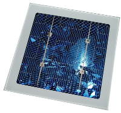

# Solar battery
> 2019.05.12 [🚀](../index/index.md) [despace](index.md) → [SPS](sps.md)

[TOC]

---

> <small>**Solar battery (SB), Solar panel (SP)** — EN term. **Батарея солнечная (БС)** — RU analogue.</small>

**Solar battery (SB)**, sometimes **Solar panels (SP)** — a combination of [photoelectric converters (photovoltaic cells)](sp.md) — semiconductor devices that directly convert solar energy into direct electric current, in contrast to solar collectors, producing heating of the heat carrier material.

**Application area**

|*[Mercury](mercury.md)*|*[Venus](venus.md)*|*[Earth](earth.md)*|*[Moon](moon.md)*|*[Mars]( mars.md)*|*[And further](index.md)*|
|:--|:--|:--|:--|:--|:--|
|+|in orbit|+|+|+|—|

**BS composition:**  
░╟ Construction  
░╙ Solar cells

**Manufacturers.** Solar cells are manufactured in volume in Japan, Germany, China, Taiwan, Malaysia & the United States, whereas Europe, China, the U.S., & Japan have dominated (94 % or more as of 2013) in installed systems. Other nations are acquiring significant solar cell production capacity.

| | |
|:--|:--|
|**Australia**|…|
|**Canada**|…|
|**China**|…|
|**Europe**|…|
|**India**|…|
|**Israel**|…|
|**Japan**|・[Mitsubishi](zz_mitsubishi.md)  ・[NEC](zz_nec.md)|
|**Korea S.**|…|
|**Russia**|・[PAO Saturn](zz_pao_saturn.md)|
|**Saudi Ar.**|…|
|**Singapore**|…|
|**USA**|…|
|**UAE**|…|
|**Vietnam**|…|

 

## Solar cell
> <small>**Solar cell (SC), Photoelectric converter (PEC)** — EN term. **Фотоэлектрический преобразователь (ФЭП)** — RU analogue.</small>

**Photocell**, also **photoelectric converters (PEC)** — an electronic device that converts the energy of photons into electrical energy. **Solar cell (SС)** is a direct converter of photon energy into electrical energy.

  
*Photocell based on multicrystalline silicon*

Subdivided into vacuum & semiconductor photocells. The operation of the device is based on photoelectron emission or internal photoelectric effect.

The most effective, from the power engineering point of view, devices for converting solar energy into electrical energy are semiconductor PECs, since this is a direct one-step energy transfer. The efficiency of conventional PEC for terrestrial conditions is on average 16 %, for the best samples — up to 25 %; in laboratory conditions, an efficiency of more than 44 % has been achieved. The efficiency of PEC is influenced by:

   1. Degradation of materials:
      - often taken at 3 ‑ 5 %/year for the first 5 years (for 2021)
   1. Losses in wires
   1. Photocell contamination
   1. Sun angle:
      - when deviating from ⊥ by 0 ‑ 30 °, the generated current changes according to the cosine of the angle
      - with a deviation from ⊥ by 30 ‑ 90 °, the generated current decreases exponentially
   1. Temperature — the higher the ambient temperature, the less electricity is generated; at T ≥ +60 ℃, the PEC may not generate electricity at all

**Varieties:**

   - Gallium arsenide (GaAs) is a compound of gallium & arsenic. An important semiconductor, the third most widely used after Si & Ge. More efficient & lighter than Si, but more expensive. Efficiency 28.5 % for the SC [Luna-26](luna_26.md).
   - Silicon (Si).

**Table.** Power of the solar cell, W/m² (at the beginning / after 3 years / after 5 years)  
<small> The average fill factor is taken equal to 0.82 (For 2020). PEC degradation is taken at 3 ‑ 5 %/year for the first 5 years. </small>

|*Planet*|*PEC type*|*In orbit*|*On the surface*|
|:--|:--|:--|:--|
|[Venus](venus.md)|GaAs, efficiency 28.5 %|500 / 468 / 458|… / … / …|
| |Si, efficiency 21.3 %|374 / 350 / 342|… / … / …|
|[Earth](earth.md)|GaAs, efficiency 28.5 %|255 / 239 / 234|… / … / …|
| |Si, efficiency 21.3 %|190 / 178 / 175|… / … / …|
|[Moon](moon.md)|GaAs, efficiency 28.5 %|255 / 239 / 234|234 / 220 / 215|
| |Si, efficiency 21.3 %|190 / 178 / 175|175 / 164 / 160|
|[Mars](mars.md)|GaAs, efficiency 28.5 %|109 / 103 / 101|… / … / …|
| |Si, efficiency 21.3 %|81 / 76 / 75|… / … / …|
|[Mercury](mercury.md)|GaAs, efficiency 28.5 %|1 500 / 1 405 / 1 375|… / … / …|
| |Si, efficiency 21.3 %|1 121 / 1 050 / 1 027|… / … / …|

### MJ, ZTJ
> <small>**Multi‑junction (MJ) solar cells** — EN term. **Многокаскадный солнечный элемент** — RU analogue.</small>  
> <small>**3rd Generation Triple-Junction (ZTJ)** — EN term. **3-е поколение трёхкаскадных солнечных элементов** — RU analogue.</small>

**Multi‑junction (MJ) solar cells** are solar cells with multiple p–n junctions made of different semiconductor materials. Each material's p‑n junction will produce electric current in response to different wavelengths of light. The use of multiple semiconducting materials allows the absorbance of a broader range of wavelengths, improving the cell's sunlight to electrical energy conversion efficiency.

Traditional single‑junction cells have a maximum theoretical efficiency of 33.16 %. Theoretically, an infinite number of junctions would have a limiting efficiency of 86.8 % under highly concentrated sunlight. Currently, the best lab examples of traditional crystalline silicon (c‑Si) solar cells have efficiencies of 20 ‑ 25 %, while lab examples of multi‑junction cells have demonstrated performance over 46 % under concentrated sunlight. Commercial examples of tandem cells are widely available at 30 % under one‑sun illumination, & improve to around 40 % under concentrated sunlight. However, this efficiency is gained at the cost of increased complexity & manufacturing price. To date, their higher price & higher price‑to‑performance ratio have limited their use to special roles, notably in aerospace where their high power‑to‑weight ratio is desirable. In terrestrial applications, these solar cells are emerging in concentrator photovoltaics (CPV), with a growing number of installations around the world.

Tandem fabrication techniques have been used to improve the performance of existing designs. In particular, the technique can be applied to lower cost thin‑film solar cells using amorphous silicon, as opposed to conventional crystalline silicon, to produce a cell with ~10 % efficiency that is lightweight & flexible. This approach has been used by several commercial vendors, but these products are currently limited to certain niche roles, like roofing materials.

 

## Docs & links
|Navigation|
|:--|
|**[FAQ](faq.md)**, **[Cable](cable.md)**·БКС, **[Camera](cam.md)**·Камера, **[Comms](comms.md)**·Радио, **[CON](contact.md)·[Pers](person.md)**·Контакт, **[Control](control.md)**·Упр., **[Doc](doc.md)**·Док., **[Doppler](doppler.md)**·ИСР, **[DS](ds.md)**·ЗУ, **[EB](eb.md)**·ХИТ, **[ECO](ecology.md)**·Экол., **[EF](ef.md)**·ВВФ, **[ElC](elc.md)**·ЭКБ, **[EMC](emc.md)**·ЭМС, **[Error](error.md)**·Ошибки, **[Event](event.md)**·События, **[FS](fs.md)**·ТЭО, **[Fuel](fuel.md)**·Топливо, **[GNC](gnc.md)**·БКУ, **[GS](scs.md)**·НС, **[HF&E](hfe.md)**·Эрго., **[IU](iu.md)**·Гиро., **[KT](kt.md)**·КТЕХ, **[LAG](lag.md)**·ПУC, **[LES](les.md)**·САСП, **[LS](ls.md)**·СЖО, **[LV](lv.md)**·РН, **[MCC](mcc.md)**·ЦУП, **[Model](model.md)**·Модель, **[MSC](sc.md)**·ПКА, **[N&B](nnb.md)**·БНО, **[NR](nr.md)**·ЯР, **[OBC](obc.md)**·ЦВМ, **[OE](oe.md)**·БА, **[Pat.](патент.md)**·Патент, **[Proj.](project.md)**·Проект, **[PS](ps.md)**·ДУ, **[QM](qm.md)**·БКНР, **[R&D](rnd.md)**·НИОКР, **[Robot](robotics.md)**·Робот, **[Rover](rover.md)**·Ровер, **[RTG](rtg.md)**·РИТЭГ, **[SARC](sarc.md)**·ПСК, **[SE](se.md)**·СЭ, **[Sens.](sensor.md)**·Датч., **[SC](sc.md)**·КА, **[SCS](scs.md)**·КК, **[SGM](sgm.md)**·КММ, **[SI](si.md)**·СИ, **[Soft](soft.md)**·ПО, **[SP](sp.md)**·БС, **[Spaceport](spaceport.md)**·Космодр., **[SPS](sps.md)**·СЭС, **[SSS](sss.md)**·ГЗУ, **[TCS](tcs.md)**·СОТР, **[Test](test.md)**·ЭО, **[Timeline](timeline.md)**·ЦГМ, **[TMS](tms.md)**·ТМС, **[TOR](tor.md)**·ТЗ, **[TRL](trl.md)**·УГТ|
|*Sections & pages*|
|**【[Spacecraft power system (SPS)](sps.md)】**  [ACUER](acuer.md)・ [Charge eff.](charge_eff.md)・ [EB](eb.md)・ [EMI, RFI](emi.md)・ [NR](nr.md)・ [Rotor](rotor.md)・ [RTG](rtg.md)・ [Solar cell](sp.md)・ [SP](sp.md)・ [SPB/USPB](suspb.md)・ [Voltage](voltage.md)・ [WT](wt.md) • • •  **RF/CIF:** [BAK-01](bak_01.md)・ [KAS‑LOA](kas_loa.md)|

   1. Docs: …
   1. Notable interwikies — …
   1. <https://en.wikipedia.org/wiki/Solar_panel>
   1. <https://ru.wikipedia.org/wiki/Арсенид_галлия>
   1. <https://ru.wikipedia.org/wiki/Фотоэлемент>
   1. <https://en.wikipedia.org/wiki/Solar_cell>
   1. <https://en.wikipedia.org/wiki/Multi-junction_solar_cell>
