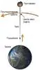

# Космический лифт
> 2019.05.12 [🚀](../index/index.md) [despace](index.md) → [Project](project.md)

**Table of contents:**

[TOC]

---

> <small>**Космический лифт** — русскоязычный термин. **Space elevator** — англоязычный эквивалент.</small>

**Косми́ческий лифт** — концепция гипотетического инженерного сооружения для [безракетного запуска грузов в космос](nrs.md). Данная конструкция основана на применении троса, протянутого от поверхности планеты к орбитальной станции, находящейся на ГСО. Впервые подобную мысль высказал Константин Циолковский в 1895 году.

Трос удерживается одним концом на поверхности планеты (Земли), а другим — в неподвижной относительно планеты точке выше геостационарной орбиты (ГСО) за счёт центробежной силы. По тросу поднимается подъёмник, несущий полезный груз. При подъёме груз будет ускоряться за счёт вращения Земли, что позволит на достаточно большой высоте отправлять его за пределы тяготения Земли.

От троса требуется чрезвычайно большая прочность на разрыв в сочетании с низкой плотностью. Углеродные нанотрубки по теоретическим расчётам представляются подходящим материалом. Если допустить пригодность их для изготовления троса, то создание космического лифта является решаемой инженерной задачей, хотя и требует использования передовых разработок и больших затрат иного рода. НАСА уже финансирует соответствующие разработки американского Института научных исследований, включая разработку подъёмника, способного самостоятельно двигаться по тросу. Предположительно, такой способ в перспективе может быть на порядки дешевле использования ракет‑носителей.

| |
|:-|
||

 

## Docs & links (TRANSLATEME ALREADY)
|Navigation|
|:-|
|**[FAQ](faq.md)**【**[SCS](scs.md)**·КК, **[SC (OE+SGM)](sc.md)**·КА】**[CON](contact.md)·[Pers](person.md)**·Контакт, **[Ctrl](control.md)**·Упр., **[Doc](doc.md)**·Док., **[Drawing](drawing.md)**·Чертёж, **[EF](ef.md)**·ВВФ, **[Error](error.md)**·Ошибки, **[Event](event.md)**·Событ., **[FS](fs.md)**·ТЭО, **[HF&E](hfe.md)**·Эрго., **[KT](kt.md)**·КТ, **[N&B](nnb.md)**·БНО, **[Project](project.md)**·Проект, **[QM](qm.md)**·БКНР, **[R&D](rnd.md)**·НИОКР, **[SI](si.md)**·СИ, **[Test](test.md)**·ЭО, **[TRL](trl.md)**·УГТ|
|*Sections & pages*|
|**【】**  <mark>NOCAT</mark>|

   1. Docs: …
   1. <https://en.wikipedia.org/wiki/Space_elevator>
