# Spaceport
> 2020.05.10 [🚀](../index/index.md) [despace](index.md) → [Spaceport](spaceport.md), [LV](lv.md)

**Table of contents:**

[TOC]

---
> <small>**Spaceport / Cosmodrome** — EN term. **Космодром** — RU analogue.</small>

A **spaceport** or **cosmodrome** is a site for [launching](lv.md) (or receiving) [spacecraft](sc.md). The word spaceport, & even more so cosmodrome, has traditionally been used for sites capable of launching spacecraft into orbit around Earth or on interplanetary trajectories.

| |*Activity*|*Spaceport*|*Km to  equator*|*Coordinates (location)*|
|:-|:-|:-|:-|:-|
|**AU**|Future|[Whalers Way](whalers_way.md)|3 900|34.91°S 135.65°E|
| |*Inactive*|Woomera|3 300|30°57′19″S 136°31′56″E|
| | | | | |
|**BR**|**Active**|Alcântara|260|02°20′22″S 44°25′03″W|
| | | | | |
|**CA**|Future|[Canso](canso.md)|5 000|45°20'10.7"N 60°59'40.4"W|
| | | | | |
|**CN**|**Active**|Jiuquan|5 000|40°58′03″N 100°16′43″E|
| |**Active**|Taiyuan|4 500|38°50′56.71″N 111°36′30.59″E|
| |**Active**|Wenchang|2 200|19°36′52.17″N 110°57′4.08″E|
| |**Active**|Xichang|3 200|28°14′45.66″N 102°1′35.60″E|
| | | | | |
|**EU**|**Active**|Esrange|7 550|67°53′38″N 21°6′25″E|
| |**Active**|Guiana (Kourou)|650|5°14′14″N 52°45′38″W|
| |*Inactive*|Hammaguir|3 450|30°53′37″N 3°02′09″W|
| |*Inactive*|San Marco (IL)|300|2°56′18″S 40°12′45″E|
| |Future|Shetland|6 800|60°47'55.2"N 0°49'10.2"W|
| |*Inactive*|Spaceport Cornwall|5 600|50°26'24.1"N 5°00'35.5"W|
| | | | | |
|**I11l**|*Inactive*|Sea Launch|0|0°00′N 154°00′W|
| | | | | |
|**IL**|**Active**|Palmachim|3 700|31°53′52″N 34°41′26″E|
| | | | | |
|**IN**|**Active**|Sriharikota|1 600|13°43′12″N 80°13′49″E|
| | | | | |
|**IQ**|*Inactive*|Al Anbar|3 700|32°46′55.9″N 44°17′58.6″E|
| | | | | |
|**IR**|**Active**|Semnan|4 300|35°14′4.56″N 53°55′19.56″E|
| | | | | |
|**JP**|**Active**|Taiki (Hokkaido Spaceport)|4 700|42°30'00.7"N 143°26'15.5"E|
| |**Active**|Tanegashima|3 400|30°24′00″N 130°58′12″E|
| |**Active**|Uchinoura|3 700|31°15′07″N 131°04′55″E|
| | | | | |
|**KP**|**Active**|Sohae|4 900|39°39′36″N 124°42′18″E|
| |**Active**|Tonghae|4 700|40°51′N 129°40′E|
| | | | | |
|**KR**|**Active**|Naro|4 000|34°25′54.72″N 127°32′6.25″E|
| | | | | |
|**RU,CIS**|**Active**|Baikonur|5 200|45°57′54″N 63°18′18″E|
| |**Active**|Dombarovsky (Yasny)|5 500|51°05′38″N 59°50′32″E|
| |**Active**|Kapustin Yar|5 400|48°35′09.6″N 45°43′12.0″E|
| |**Active**|Plesetsk|7 400|62°55′32″N 40°34′40″E|
| |*Inactive*|Svobodny|5 500|51°49′N 128°18′E|
| |**Active**|Vostochny|5 500|51°53′04.39″N 128°20′05.2″E|
| | | | | |
|**US**|**Active**|America|3 900|32°59′25″N 106°58′11″W|
| |**Active**|Canaveral|3 400|28°29′20″N 80°34′40″W|
| |**Active**|Kennedy|3 400|28°31′27″N 80°39′03″W|
| |**Active**|Kodiak|6 600|57°26′9″N 152°20′16″W|
| |**Active**|Kwajalein|1 000|~9°N 167°W|
| |**Active**|Rocket Lab LC1|4 700|39°15′41.4″S 177°51′53.6″E|
| |**Active**|SpaceX STLS|2 800|25°59′45.6″N 97°09′14.4″W|
| |**Active**|Vandenberg|4 200|34°43′58″N 120°34′05″W|
| |**Active**|Wallops|4 500|37°56′24.7″N 75°27′59.0″W|
| | | | | |
|**EQ**| |**Countries on the equator:**  ➀ Brazil  ➁ Gabon  ➂ Indonesia  ➃ Kenya  ➄ Colombia  ➅ Congo  ➆ São Tomé & Príncipe  ➇ Somalia  ➈ Uganda  ➉ Ecuador| |*Map of spaceports*  |

**Maps**

The name is given by analogy with an airport for aircraft. Usually spaceports occupy a large area at a distance from densely populated places, so that the stages that separate during flight do not harm. The most advantageous position of the spaceport is at the equator, so that the launch vehicle can use the energy of the Earth’s rotation: saving up to 10 % of fuel compared to average latitudes (the same launch vehicle can put a slightly larger payload into orbit). From the equator, it is possible to launch into orbit with any inclination. Since there are few countries on the equator, sea‑based spaceports have appeared.

**Cooperation:**

   - [Maritime Launch Services](contact/mls.md)

 

## Al-Anbar
> <small>**Al‑Anbar** — EN term. **Аль‑Анбар** — literal RU translation.</small>

**Iraq’s Al-Anbar Space Research Center** — Iraq’s launch site.

On December 5, 1989, the Middle eastern nation became the tenth to launch an artificial moon to orbit above Earth.
The satellite was the 48-ton, third stage of a three-stage rocket in a flight from Al-Anbar Space Research Center 50 miles west of Baghdad to a six-orbit spaceflight.

**Six Revs.** A U.S. nuclear-attack-warning sat spotted fiery exhaust from the rocket as it blasted up & away from Iraq. While the rocket did not leave a separate sat in orbit, it’s third stage swept around the Earth for 6 revolutions before falling out of orbit. North American Aerospace Defense Command tracked the 3rd stage around the globe. The launch made Iraq the 10th nation with a rocket powerful enough for space launches. It was the 1st time Iraq had exposed its space research.

**Scout‑like.** Iraq’s 75-ft., three-stage rocket probably was similar to a U.S. Scout rocket used to send small sats to low orbits.

**Military missiles.** Iraq’s space booster may have been a modified version of Argentina’s Condor ballistic missile. Such a missile could carry a nuclear warhead 1,240 miles. Iraq also had a 600-mi. missile built around the USSR’s Scud.

   - Scuds were launched by Iraq against Iran during their eight-year war in the 1980’s.
   - Iraq again launched Scuds, against Israel & Saudi Arabia, in the first Persian Gulf War in 1991.
   - Iraq launched ballistic missiles against Kuwait & the opposing Coalition Forces in the 2nd Persian Gulf War in 2003.

Al-Anbar Space Research Center & other Iraqi launch sites were damaged in the 1991 war, bringing to a halt Iraq’s ability to continue in the Middle East space race with Israel.

|*Characteristic*|*[Value](si.md)*|
|:-|:-|
|Activity|*Closed* (1989 ‑ 1991)|
|Coordinates|32.78220°N 44.29962°E|
|Distanse|3 700 ㎞ to the equator;  2 800 ㎞ to [LAV](contact/lav.md);  17 400 ㎞  to [JPL](contact/jpl.md);  50 ㎞ to Baghdad|
|Launch pads|1|
|[Launched vehicles](lv.md)|**Abid** <small>(modified version of Argentina’s Condor ballistic missile & USSR’s Scud rocket)</small>|
|Operator| |
| |[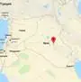](f/spaceport/al_anbar/map1.webp) 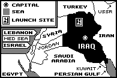|
| | <small>*Мировая карта космодромов*</small>|

 

## Alcântara
> <small>**Alcantara** — EN term. **Алкантара** — literal RU translation.</small>

**Alcântara Launch Center** *(Portuguese: Centro de Lançamento de Alcântara, CLA)* — the Brazilian spaceport in the state of Maranhão, on the North Atlantic coast of the country. Located closer to the equator than [Kourou](spaceport.md).

|*Characteristic*|*[Value](si.md)*|
|:-|:-|
|Activity|**Active** (1990 ‑ …)|
|[Launch vehicles](lv.md)|[Shavit](shavit.md) ┊ **Sonda** ┊ **VLS**, in perspective [Long March](long_march.md)・ [Proton](proton.md)|
|Operator|Brazilian Space Agency|
|Location|2°22′23″S 44°23′47″W  Alcantara, Maranhão, Brazil|
|Distance|260 ㎞ — to the equator;  11 400 ㎞ — to [Lavochkin](contact/lav.md);  8 800 ㎞ — to [JPL](contact/jpl.md);  22 ㎞ (460 ㎞ by road) — to the Brazilian Space Agency|
|Launch pad|9|
| |[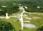](f/spaceport/alcantara/pic1.webp)  [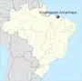](f/spaceport/alcantara/map1.webp)   [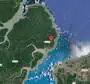](f/spaceport/alcantara/map2.webp)|
| ||

**Notes:**

   1. <http://www.cla.aer.mil.br/>
   1. <https://en.wikipedia.org/wiki/Alcântara_Launch_Center>

 

## America
> <small>**America** — EN term. **Америка** — literal RU translation.</small>

**Spaceport America** — formerly the **Southwest Regional Spaceport** — is a FAA-licensed spaceport located on 7 300 hectares of State Trust Land in the Jornada del Muerto desert basin in New Mexico, United States directly west & adjacent to U.S. Army’s White Sands Missile Range.

Spaceport America is «the world’s first purpose-built commercial spaceport», designed & constructed specifically for commercial users that had not previously been an airport or federal infrastructure of any kind.

|*Characteristic*|*[Value](si.md)*|
|:-|:-|
|Activity|**Active** (2011 ‑ …)|
|[Launch vehicles](lv.md)| |
|Operator|New Mexico Spaceport Authority|
|Location|32°59′25″N 106°58′11″W  desert in Sierra County, new Mexico, USA|
|Distance|3 900 ㎞ — to the equator;  12 800 ㎞ — to [Lavochkin](contact/lav.md);  1 100 ㎞ — to [JPL](contact/jpl.md)|
|Launch pad|1|
| |[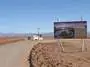](f/spaceport/america/pic1.webp)  [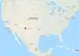](f/spaceport/america/map1.webp)   [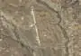](f/spaceport/america/map2.webp)|
| ||

**Notes:**

   1. <https://en.wikipedia.org/wiki/Spaceport_America>
   1. <http://www.spaceportamerica.com/>

 

## Baikonur
> <small>**Байконур** — RU term w/o analogues in English. **Baikonur** — English equivalent.</small>

**The Baikonur Cosmodrome** *(Kazakh: Байқоңыр «rich valley»)* is the world’s first & largest operational space launch facility. The [spaceport](spaceport.md) is located in the desert steppe of Baikonur, about 200 ㎞ east of the Aral Sea & north of the river Syr Darya. It is near the Tyuratam railway station & is about 90 m above sea level.

For a number of years, Baikonur has maintained its leading position in the world in terms of the number of launches: in particular, in 2015, 18 launch vehicles were launched from here during the year (the second place is taken by the [Canaveral](spaceport.md) cosmodrome (USA) with 17 launches per year, the third - [Guiana Space Center](spaceport.md) with 12 launches per year). In 2016, Cape Canaveral became the leader.

The spaceport is currently leased by the Kazakh Government to Russia until 2050, & is managed jointly by the Roscosmos State Corporation & the Russian Aerospace Forces.

|*Characteristic*|*[Value](si.md)*|
|:-|:-|
|Activity|**Active** (1955 ‑ …)|
|[Launch vehicles](lv.md)|[Zenit](zenit.md)・ [N1](n_1.md)・ [Proton](proton.md)・ [Soyuz](soyuz.md), as well as Dnepr, Kosmos, R-7, R-16, Rokot, Strela, UR-200, Tsyklon, [Energia](energia.md)|
|Operator|[Roskosmos](contact/roskosmos.md)|
|Location|45°57′54″N 63°18′18″E  Republic of Kazakhstan|
|Distance|5 200 ㎞ — to the equator;  2 200 ㎞ — to [Lavochkin](contact/lav.md);  18 200 ㎞ — to [JPL](contact/jpl.md)|
|Launch pad|19|
| |[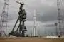](f/spaceport/baikonur/pic1.webp)  [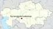](f/spaceport/baikonur/map1.webp)   [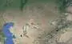](f/spaceport/baikonur/map2.webp)|
| ||

**Notes:**

   1. <https://en.wikipedia.org/wiki/Baikonur_Cosmodrome>

 

## Cape Canaveral Air Force Station
> <small>**Canaveral** — EN term. **Канаверал** — RU analogue.</small>

**Cape Canaveral Air Force Station (CCAFS)** is an installation of the United States Space Force’s 45th Space Wing. Headquarters — Patrick Air Force Base, Florida.

For GEO launches, the latitude of 28°27'N has a slight disadvantage compared to other launch sites located closer to the equator. The additional speed due to the rotation of the Earth is 405 ㎧ at Cape Canaveral against 465 ㎧ at the [Kourou](spaceport.md) spaceport. In the case of launches to a high‑inclination (polar) orbit, the latitude does not matter, but Cape Canaveral is not suitable due to the presence of settlements under the launch paths in this direction, so [Vandenberg Base](spaceport.md) is used for such launches(spaceport.md) on the opposite West coast of the United States.

|*Characteristic*|*[Value](si.md)*|
|:-|:-|
|Activity|**Active** (1940 ‑ …)|
|[Launch vehicles](lv.md)|[Atlas](atlas.md)・ [Delta](delta.md)・ [Falcon](falcon.md) ┊ **Titan**|
|Operator|Air Force Space Command|
|Location|28°28′03″N 80°33′59″W  Cape Canaveral, Florida, USA|
|Distance|3 400 ㎞ — to the equator;  11 000 ㎞ — to [Lavochkin](contact/lav.md);  3 800 ㎞ — to [JPL](contact/jpl.md)|
|Launch pad|13 (3 active)|
| |  [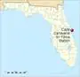](f/spaceport/canaveral/map1.webp)   |
| ||

**Notes:**

   1. <https://en.wikipedia.org/wiki/Cape_Canaveral_Air_Force_Station>

 

## Cornwall
> <small>**Cornwall** — EN term. **Корнуолл** — literal RU translation.</small>

Cornwall & Virgin Orbit are set to deliver the UK’s first horizontal Spaceport by 2021.

The location is suitable for creating a spaceport for a number of reasons:

   - it has one of the longest runways in the UK, with a length of 2744 m (an important parameter for horizontal launches),
   - it has direct access to sea & a low population density,
   - it has access to uncongested & clear segregated airspace.

Cornwall & Virgin Orbit are committing to a partnership seeking to deliver a horizontal launch Spaceport at Cornwall Airport Newquay, UK by 2021, creating a satellite technology cluster of national importance.

The spaceport will perform satellite operations & engage in a lunar mission to deliver payloads to the moon’s orbit.

|*Characteristic*|*[Value](si.md)*|
|:-|:-|
|Activity|**Inactive** (2021?: ‑ … )|
|[Launch vehicles](lv.md)|Virgin Orbit plane (modified Boeing 747) & LauncherOne rocket|
|Operator|UKSA / [ESA](esa.md)|
|Location|50°26′27″N 4°59′43″W  Newquay, UK|
|Distance|5 600 ㎞ — to the equator;  2 900 ㎞ — to [Lavochkin](contact/lav.md);  8 600 ㎞ — to [JPL](contact/jpl.md);  600 ㎞ — to ESA Headquarters in Paris|
|Launch pad|1 (runway)|
| |[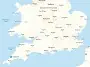](f/spaceport/cornwall/map.webp)   [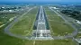](f/spaceport/cornwall/runway.webp)    [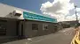](f/spaceport/cornwall/airport.webp)|
| ||

**Notes:**

   1. <https://spaceportcornwall.com/>
   1. <https://www.bbc.com/news/uk-england-cornwall-49733748>
   1. <https://spacecentre.co.uk/blog-post/uk-spaceport-faq/>
   1. <https://en.wikipedia.org/wiki/Newquay_Airport>

 

## Dombarovsky Air Base (Yasny)
> <small>**Ясный** — RU term w/o analogues in English. **Dombarovsky Air Base** — literal EN translation.</small>

**Dombarovsky** is a military airbase 5 ㎞ northwest of the village of Dombarovsky, near Yasny in Russia’s Orenburg Oblast. Operated by the Soviet Air Forces & later by the Russian Air Force, it hosts fighter interceptor squadrons & an [ICBM](icbm.md) base (which has been adapted for commercial satellite launches).

|*Characteristic*|*[Value](si.md)*|
|:-|:-|
|Activity|**Active** (2006 ‑ …)|
|[Launch vehicles](lv.md)|**Dnepr**, [ICBM](icbm.md)|
|Operator|Ministry of Defence (Russia)|
|Location|51°05′38″N 59°50′32″E  Yasnensky District, Orenburg Oblast, Russia|
|Distance|5 500 ㎞ — to the equator;  1 600 ㎞ — to [Lavochkin](contact/lav.md);  18 600 ㎞ — to [JPL](contact/jpl.md)|
|Launch pad|2|
| |[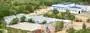](f/spaceport/dombarovsky/pic1.webp)  [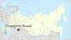](f/spaceport/dombarovsky/map1.webp)   [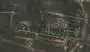](f/spaceport/dombarovsky/map2.webp)|
| ||

**Notes:**

   1. <https://en.wikipedia.org/wiki/Dombarovsky_Air_Base>

 

## Esrange Space Center
> <small>**Esrange Space Center** (short form **Esrange**) — EN term. **Космический центр Эсрейндж** — literal RU translation.</small>

**Esrange** — is a rocket range & research centre located about 40 ㎞ east of the town of Kiruna in northern Sweden & 200 ㎞ north of the Arctic Circle. It is a base for scientific research with high‑altitude balloons, investigation of the aurora borealis, sounding rocket launches, & satellite tracking.

The name of the facility was originally ESRANGE, which was an abbreviation for ESRO Sounding Rocket Launching Range.

Esrange was built in 1964 by ESRO, European Space Research Organisation, which later became European Space Agency by merging with ELDO, the European Launcher Development Organisation. The first rocket launch from Esrange occurred on 19 November 1966. In 1972, ownership was transferred to the newly started Swedish Space Corporation.

|*Characteristic*|*[Value](si.md)*|
|:-|:-|
|Activity|**Active as a polygon** (1966 ‑ …)|
|[Launch vehicles](lv.md)|Sounding & suborbital rockets, such as the **Skylark**, **Scua**, **Centaure** & other rocket lines|
|Operator|[ESA](contact/esa.md)|
|Location|67°53′38″N, 21°6′25″E |
|Distance|7 550 ㎞ — to the equator;  1 600 ㎞ — to [Lavochkin](contact/lav.md);  9 000 ㎞ — to [JPL](contact/jpl.md);  2 400 ㎞ — to ESA Headquarters in Paris|
|Launch pad|6|
| |[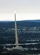](f/spaceport/esrange/skylark_launch.webp)  [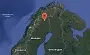](f/spaceport/esrange/map.webp)|
| ||

**Notes:**

   1. <https://en.wikipedia.org/wiki/Esrange>
   1. <https://www.sscspace.com/ssc-worldwide/esrange-space-center/>

 

## Guiana (Kourou)
> <small>**Kourou** — EN term. **Куру** — literal RU translation.</small>

**The Guiana Space Centre** (French: **Centre Spatial Guyanais** (**CSG**) ) is a French & European[spaceport](spaceport.md) to the northwest of Kourou in French Guiana, a region of France in South America, in a strip of territory 60 ㎞ long & 20 ㎞ wide between the cities of Kourou & Sinnamari, 50 ㎞ from the administrative center of French Guiana — Cayenne. Operational since 1968, it is particularly suitable as a location for a spaceport.

   - It is near the equator, at latitude 5°13'20"N, so that less energy is required to maneuver a spacecraft into an equatorial, geostationary orbit.
   -  It has open sea to the east. Rockets launch to the east to take advantage of the angular momentum provided by Earth’s rotation.

|*Characteristic*|*[Value](si.md)*|
|:-|:-|
|Activity|**Active** (1968 ‑ …)|
|[Launch vehicles](lv.md)|[Arian‑4, 5](arian.md)・ [Vega](vega.md)・ [Союз‑2](soyuz.md)|
|Operator|[ESA](contact/esa.md)|
|Location|5°13′20″N 52°46′25″W  Kourou, French Guiana|
|Distance|600 ㎞ — to the equator;  11 500 ㎞ — to [Lavochkin](contact/lav.md);  7 800 ㎞ — to [JPL](contact/jpl.md);  7 200 ㎞ — to ESA Headquarters in Paris|
|Launch pad|4|
| |[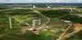](f/spaceport/kourou/pic1.webp)  [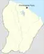](f/spaceport/kourou/map1.webp)   [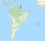](f/spaceport/kourou/map2.webp)|
| ||

**Notes:**

   1. <https://en.wikipedia.org/wiki/Guiana_Space_Centre>
   1. <http://www.cnes-csg.fr>

 

## Hammaguir
> <small>**Hammaguir** — EN term. **Хаммагир** — literal RU translation.</small>

**Hammaguir** (also written **Hamaguir** & **Hammaguira**) (Arabic: **حماقير‎**) is a former rocket testing centre, a French spaceport in Africa.

Between 1947 & 1967 there was a rocketlaunch site, the Interarmy Special Vehicles Test Centre (abbreviated CIEES in French), near Hammaguir, used by France for launching sounding rockets & the satellite carrier «Diamant» between 1965 & 1967. The first French satellite Astérix was launched from there in 1965.

|*Characteristic*|*[Value](si.md)*|
|:-|:-|
|Activity|**Inactive** (1947 ‑ 1967)|
|[Launch vehicles](lv.md)|Diamant|
|Operator|[ESA](contact/esa.md)|
|Location|30°54′N 3°2′W  Hammaguir, Algeria|
|Distance|3 450 ㎞ — to the equator;  4 200 ㎞ — to [Lavochkin](contact/lav.md);  10 100 ㎞ — to [JPL](contact/jpl.md);  2 100 ㎞ — to ESA Headquarters in Paris|
|Launch pad|1|
| |[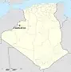](f/spaceport/hammaguir/map.webp)|
| ||

**Notes:**

   1. <https://en.wikipedia.org/wiki/Hammaguir>

 

## Jiuquan
> <small>**Jiuquan** — EN term. **Цзюцюа́нь** — literal RU translation.</small>

**Jiuquan Satellite Launch Center** (JSLC; *Chinese: 酒泉卫星发射中心*) is a Chinese space vehicle launch facility ([spaceport](spaceport.md)).

It is the largest spaceport in China (until 1984 — the only one) & the only one used in the national manned program. It also launches military missiles. The polygon at the cosmodrome has an area of 2 800 ㎞².

|*Characteristic*|*[Value](si.md)*|
|:-|:-|
|Activity|**Active** (1958 ‑ …)|
|[Launch vehicles](lv.md)|[Long March 1, 2, 4](long_march.md)|
|Operator|[CNSA](contact/cnsa.md)|
|Location|40°58′03″N 100°16′43″E  Gobi Desert, Inner Mongolia, China|
|Distance|5 000 ㎞ — to the equator;  5 500 ㎞ — to [Lavochkin](contact/lav.md);  14 400 ㎞ — to [JPL](contact/jpl.md);  1 400 ㎞ — to [CNSA](contact/cnsa.md)|
|Launch pad|7|
| |[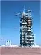](f/spaceport/jiuquan/pic1.webp)  [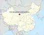](f/spaceport/jiuquan/map1.webp)   [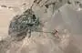](f/spaceport/jiuquan/map2.webp)|
| ||

**Notes:**

   1. <https://en.wikipedia.org/wiki/Jiuquan_Satellite_Launch_Center>

 

## Kapustin Yar
> <small>**Капустин Яр** — RU term w/o analogues in English. **Kapustin Yar** — English equivalent.</small>

**Kapustin Yar** is a missile test site in the North-Western part of the Astrakhan oblast of the Russian Federation.

|*Characteristic*|*[Value](si.md)*|
|:-|:-|
|Activity|**Active** (1946 ‑ …)|
|[Launch vehicles](lv.md)|Military missiles|
|Operator|Ministry of Defence (Russia)|
|Location|48.586°N 45.72°E  Astrakhan Oblast, Russia|
|Distance|5 400 ㎞ — to the equator;  1 000 ㎞ — to [Lavochkin](contact/lav.md);  18 000 ㎞ — to [JPL](contact/jpl.md)|
|Launch pad|4|
| |[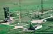](f/spaceport/kapustin_yar/pic1.webp)  [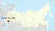](f/spaceport/kapustin_yar/map1.webp)|
| ||

**Notes:**

   1. <https://en.wikipedia.org/wiki/Kapustin_Yar>

 

## Kennedy Space Center
> <small>**Kennedy** — EN term. **Кеннеди** — literal RU translation.</small>

**The John F. Kennedy Space Center** (**KSC**, originally known as the **NASA Launch Operations Center**), located in Merritt Island, Florida, is one of ten National Aeronautics & Space Administrationfield centers. Since December 1968, KSC has been NASA’s primary launch center of human spaceflight. KSC is adjacent to [Cape Canaveral Air Force Station](spaceport.md).

At the moment, only 9 % of the area of the cosmodrome is used for its intended purpose, the rest of the territory is a wildlife reserve.

|*Characteristic*|*[Value](si.md)*|
|:-|:-|
|Activity|**Active** (1962 ‑ …)|
|[Launch vehicles](lv.md)|[Falcon](falcon.md)・ [Shuttle](shuttle.md)・ [SLS](sls.md)|
|Operator|[NASA](contact/nasa.md)|
|Location|28°31′26.61″N 80°39′3.06″W  Merritt Island, Florida, USA|
|Distance|3 400 ㎞ — to the equator;  11 000 ㎞ — to [Lavochkin](contact/lav.md);  3 700 ㎞ — to [JPL](contact/jpl.md)|
|Launch pad|2|
| |[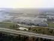](f/spaceport/kennedy/pic1.webp)  [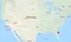](f/spaceport/kennedy/map1.webp)   [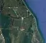](f/spaceport/kennedy/map2.webp)|
| ||

**Notes:**

   1. <https://en.wikipedia.org/wiki/Kennedy_Space_Center>

 

## Kodiak Launch Complex
> <small>**Kodiak** — EN term. **Кадьяк** — RU analogue.</small>

The **Pacific Spaceport Complex – Alaska** (**PSCA**), formerly known as the **Kodiak Launch Complex** (**KLC**), is a dual-use commercial & military spaceport for sub-orbital & orbital launch vehicles. The facility is owned & operated by the Alaska Aerospace Corporation, a public corporation of the State of Alaska, & is located on Kodiak Island in Alaska.

|*Characteristic*|*[Value](si.md)*|
|:-|:-|
|Activity|**Active** (1998 ‑ …)|
|[Launch vehicles](lv.md)|**Athena‑1** ┊ [Minotaur 4](minotaur.md) ┊ **different ICBMs**|
|Operator|United States Department of Defense|
|Location|57.435833°N 152.337778°W  Kodiak Island, Alaska, USA|
|Distance|6 600 ㎞ — to the equator;  11 200 ㎞ — to [Lavochkin](contact/lav.md);  3 700 ㎞ — to [JPL](contact/jpl.md)|
|Launch pad|2|
| |[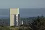](f/spaceport/kodiak/pic1.webp)  [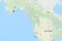](f/spaceport/kodiak/map1.webp)   [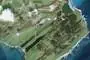](f/spaceport/kodiak/map2.webp)|
| ||

**Notes:**

   1. <https://en.wikipedia.org/wiki/Pacific_Spaceport_Complex_–_Alaska>

 

## Kwajalein
> <small>**Kwajalein** — EN term. **Кваджалейн** — RU analogue.</small>

The US Navy has hosted a naval base on Kwajalein Island, the southernmost part of the atoll, since World War II. It was the final resting place of the German cruiser Prinz Eugen after it survived the Operation Crossroads nuclear test in 1946. In the late 1950s, the US Army took over the base as part of their Nike Zeusanti-ballistic missile efforts, & since then the atoll has been widely used for missile tests of all sorts. Today it is part of the **Ronald Reagan Ballistic Missile Defense Test Site**, with various radars, tracking cameras, missile launchers & many support systems spread across many islands.

|*Characteristic*|*[Value](si.md)*|
|:-|:-|
|Activity|**Active** (1960 ‑ …)|
|[Launch vehicles](lv.md)|[Falcon 1](falcon.md)・ **different ICBMs**|
|Operator|United States Air Force|
|Location|8°43′N 167°44′E  Marshall islands|
|Distance|1 000 ㎞ — to the equator;  14 300 ㎞ — to [Lavochkin](contact/lav.md);  8 300 ㎞ — to [JPL](contact/jpl.md)|
|Launch pad|3:  ・Illeginni Island (9.08631°N 167.47303°E)  ・Roi-Namur Island (9.4012°N 167.4663°E)  ・Kwajalein Drop Zone (7.6500°N 167.7000°E)|
| |[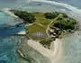](f/spaceport/kwajalein/pic1.webp)  [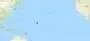](f/spaceport/kwajalein/map1.webp)   |
| ||

**Notes:**

   1. <https://en.wikipedia.org/wiki/Kwajalein_Atoll>
   1. 2013.07.27 [Трущобы Тихого Океана ⎆](https://masterok.livejournal.com/1205140.html)

 

## Naro
> <small>**Naro** — EN term. **Наро** — literal RU translation.</small>

**Naro Space Center** is a South Korean spaceport in South Jeolla’s Goheung County, operated by the state-run [Korea Aerospace Research Institute](contact/kari.md).

|*Characteristic*|*[Value](si.md)*|
|:-|:-|
|Activity|**Active** (2009 ‑ …)|
|[Launch vehicles](lv.md)|**KSLV**|
|Operator|[KARI](contact/kari.md)|
|Location|45°57′54″N 63°18′18″E  Goheung County, South Korea|
|Distance|4 000 ㎞ — to the equator;  8 300 ㎞ — to [Lavochkin](contact/lav.md);  12 500 ㎞ — to [JPL](contact/jpl.md);  230 ㎞ — to [KARI](contact/kari.md)|
|Launch pad|2|
| |  [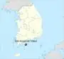](f/spaceport/naro/map1.webp)   [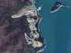](f/spaceport/naro/map2.webp)|
| ||

**Notes:**

   1. <https://en.wikipedia.org/wiki/Naro_Space_Center>

 

## Palmachim
> <small>**Palmachim** — EN term. **Пальмахим** — literal RU translation.</small>

**The Palmachim Airbase** (Hebrew: בָּסִיס **חֵיל-הַאֲוִויר פַּלְמַחִים**) is an Israeli military facility & [spaceport](spaceport.md) located near the cities of Rishon LeZion & Yavne on the Mediterranean coast. It is named after nearby Kibbutz Palmachim.

Palmachim is used to launch the «Shavit» space launch vehicle into retrograde orbit by launching over the Mediterranean, acting as Israel’s primary spaceport. The launchpad is situated at 31°53′04″N 34°40′49″E. This ensures that rocket debris falls into water, & that the rocket does not fire over regional neighboring countries near Israel that could use the technology. Palmachim is also used to test ballistic missiles, such as the Jericho.

|*Characteristic*|*[Value](si.md)*|
|:-|:-|
|Activity|**Active** (1971 ‑ …)|
|[Launch vehicles](lv.md)|[Shavit](shavit.md)|
|Operator|Israeli Air Force|
|Location|31°53′04″N 34°40′49″E  kibbutz Palmachim, Israel|
|Distance|3 700 ㎞ — to the equator;  2 600 ㎞ — to [Lavochkin](contact/lav.md);  16 100 ㎞ — to [JPL](contact/jpl.md);  25 ㎞ — to [ISA](contact/isa.md)|
|Launch pad|1|
| |[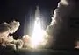](f/spaceport/palmachim/pic1.webp)  [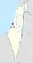](f/spaceport/palmachim/map1.webp)   [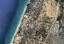](f/spaceport/palmachim/map2.webp)|
| ||

**Notes:**

   1. <https://en.wikipedia.org/wiki/Palmachim_Airbase>

 

## Plesetsk
> <small>**Плесецк** — RU term w/o analogues in English. **Plesetsk** — English equivalent.</small>

**Plesetsk Cosmodrome** is a Russian spaceport located in Mirny, Arkhangelsk Oblast, about 800 ㎞ north of Moscow & approximately 200 ㎞ south of Arkhangelsk, the cosmodrome dates from 1957.

The cosmodrome has an extensive network of roads & Railways, aviation equipment & a military airfield of the first class, which allows operating aircraft with a maximum landing weight of up to 220 tons, such as the Ilyushin Il-76, Tupolev Tu-154, communication facilities, including space.

|*Characteristic*|*[Value](si.md)*|
|:-|:-|
|Activity|**Active, closed to the public** (1957 ‑ …)|
|[Launch vehicles](lv.md)|[Angara](angara.md) ┊ **Vostok** ┊ **Kosmos** ┊ **R‑7, 9, 16** ┊ **Rokot** ┊ [Soyuz‑2](soyuz.md) ┊ **Tsyklon** ┊ different ICBMs|
|Operator|Ministry of Defence (Russia)|
|Location|62°55′32″N 40°34′40″E  Mirny, Arkhangelsk oblast, Russia|
|Distance|7 400 ㎞ — to the equator;  800 ㎞ — to [Lavochkin](contact/lav.md);  14 700 ㎞ — to [JPL](contact/jpl.md)|
|Launch pad|8|
| |[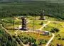](f/spaceport/plesetsk/pic1.webp)  [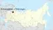](f/spaceport/plesetsk/map1.webp)   [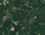](f/spaceport/plesetsk/map2.webp)|
| ||

**Notes:**

   1. <http://www.plesetzk.ru/>
   1. <https://en.wikipedia.org/wiki/Plesetsk_Cosmodrome>

 

## Rocket Lab LC1
> <small>**Rocket Lab LC1** — EN term. **Рокет Лаб эЛСи 1** — RU analogue.</small>

**Rocket Lab Launch Complex 1** is a commercial spaceport located in Mahia Peninsula on the North island of New Zealand. Officially, the cosmodrome opened on 09.26.2016.

Launch Complex 1 features a 50-tonne launch platform & tower, a hangar for the Electron rockets, & storage tanks for liquid oxygen & kerosene. During the test phase of launch operations, which began in May 2017, the exclusion zone would likely be an eight-kilometre (five-mile) radius from the pad, & would reduce in size once the site became commercially operational.

|*Characteristic*|*[Value](si.md)*|
|:-|:-|
|Activity|**Active** (2016 ‑ …)|
|[Launch vehicles](lv.md)|[Electron](electron.md)|
|Operator|[Rocket Lab](contact/rocket_lab.md)|
|Location|39.2609°S 177.8655°E  Mahia Peninsula, New Zealand|
|Distance|4 700 ㎞ — to the equator;  19 500 ㎞ — to [Lavochkin](contact/lav.md);  11 200 ㎞ — to [JPL](contact/jpl.md)|
|Launch pad|1|
| |[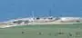](f/spaceport/rocket_lab_lc1/pic1.webp)  [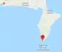](f/spaceport/rocket_lab_lc1/map1.webp)   [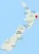](f/spaceport/rocket_lab_lc1/map2.webp)|
| ||

**Notes:**

   1. <https://en.wikipedia.org/wiki/Rocket_Lab_Launch_Complex_1>

 

## San Marco
> <small>**San Marco** — EN term. **Сан‑Марко** — literal RU translation.</small>

**The Luigi Broglio Space Center** (**BSC**) is an Italian-owned spaceport near Malindi, Kenya, named after its founder & Italian space pioneer Luigi Broglio. Developed in the 1960s through a partnership between the Sapienza University of Rome’s Aerospace Research Centre & [NASA](nasa.md), the BSC served as a spaceport for the launch of both Italian & international satellites (1967 – 1988). The center comprises a main offshore launch site, known as the **San Marco** platform, as well as two secondary control platforms & a communications ground station on the mainland.

The ground station is in use & continues to track NASA, ESA & Italian satellites. However, the two platforms fell into disrepair during the 1990s.

|*Characteristic*|*[Value](si.md)*|
|:-|:-|
|Activity|*Inactive* (1964 ‑ 1988)|
|[Launch vehicles](lv.md)|Virgin Orbit plane & LauncherOne rocket|
|Operator|Italian Space Agency|
|Location|2°56′18″S 40°12′45″E  marine platform, Malindi, Kenya|
|Distance|300 ㎞ — to the equator;  6 500 ㎞ — to [Lavochkin](contact/lav.md);  17 100 ㎞ — to [JPL](contact/jpl.md);  7 500 ㎞ — to ESA Headquarters in Paris|
|Launch pad|2|
| |[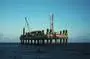](f/spaceport/san-marco/pic1.webp)  [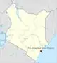](f/spaceport/san-marco/map1.webp)   |
| ||

**Notes:**

   1. <https://en.wikipedia.org/wiki/Broglio_Space_Centre>

 

## Sea launch
> <small>**Sea Launch** — EN term. **Морской старт** — translation to Russian.</small>

**Sea Launch** is a multinational spacecraft launch service that used a mobile maritime launch platform for equatorial launches of commercial payloads on specialized [Zenit-3SL](zenit.md) rockets through 2014.

It consists of an Assembly & command vessel (length 203 m, width 32 m, height 50 m, tonnage 27 000 tons, maximum speed 21 knots) & the Odyssey launch platform (length 133 m, width 67 m, height 60 m, tonnage 46 000 tons).

The idea of the sea launch site is to deliver the launch vehicle by sea to the equator, where there are the best conditions for launching. This method was used in 1964-1988 at the marine cosmodrome «[San‑Marko](San_Marco)», which was a stationary anchored platform near the equator in Kenyan territorial waters.

|*Characteristic*|*[Value](si.md)*|
|:-|:-|
|Activity|**Suspended from 2014, frozen from 2020** (1995 ‑ …)|
|[Launch vehicles](lv.md)|[Zenit-3SL](zenit.md)・ [Soyuz-5](soyuz.md)|
|Operator|International consortium Sea Launch Company (SLC)|
|Location|0°N 154°W  international waters of the Pacific ocean, near Christmas Island|
|Distance|0 ㎞ — to the equator;  19 300 ㎞ — to [Lavochkin](contact/lav.md);  5 600 ㎞ — to [JPL](contact/jpl.md)|
|Launch pad|1|
| |      |
| ||

**Notes:**

   1. [Sea Dragon](sea_dragon.md) — project of a super-heavy launch vehicle with a sea launch.
   1. <https://en.wikipedia.org/wiki/Sea_Launch>

 

## Semnan
> <small>**Semnan** — EN term. **Семнан** — literal RU translation.</small>

**Semnan**, also **Imam Khomeini Spaceport** — the Iranian missile range. It has a launcher for light-class launch vehicles. It is located in the Dasht-e Kavir desert, in the Semnan province, near the city of the same name in Northern Iran.

|*Characteristic*|*[Value](si.md)*|
|:-|:-|
|Activity|**Active** (2008 ‑ …)|
|[Launch vehicles](lv.md)|[Safir](safir.md) (Iran)・ [Simorgh](simorgh.md) (Iran)|
|Operator|Iranian Space Agency|
|Location|35°13′19″N 53°53′42″E  the Semnan province, Iran|
|Distance|4 300 ㎞ — to the equator;  2 700 ㎞ — to [Lavochkin](contact/lav.md);  18 800 ㎞ — to [JPL](contact/jpl.md);  250 ㎞ — to Iranian Space Agency|
|Launch pad|1|
| |     |
| ||

**Notes:**

   1. <https://en.wikipedia.org/wiki/Semnan_Space_Center>

 

## Shetland Space Center
> <small>**Shetland Space Center** — EN term. **Космический центр Шетланд** — literal RU translation.</small>

**Shetland Space Center (SSC)** plans to build & operate a satellite launch site & a ground station in Unst, Shetland, the UK’s most northerly island. It follows the identification in a major report for the UK Space Agency of Saxa Vord in Unst as the best location in the country for such a facility. SSC is already at work on a joint project with ArianeGroup to develop launch site proposals. Interest in our launch & ground station plans from the space industry, commercial & military, across the world is huge. We are working closely with the local community & planning authorities on next steps.

   - **The Rationale.** Saxa Vord in Unst, home to new RAF radar technology monitoring Northern Europe, is recognised as the ideal location for launching small rockets transporting satellites into [polar & sun-synchronous orbits](nnb.md). The northerly latitude also makes it a perfect spot for a ground station to datalink to existing satellites passing overhead.
   - **The Sites.** SSC has identified potential launch & ground station sites in north-east Unst as well as locations for ancillary support systems, and, with specialist support, is working towards securing operating licences & planning permissions for the necessary construction works.
   - **The Future.** Our aim is to have a fully functioning satellite launch facility in place by late 2021, with logistical support allowing commercial & military clients to operate from Unst. Prior to that we plan to have a ground station up & running, allowing us to harvest satellite data & provide a range of services to companies within the space industry & beyond.

|*Characteristic*|*[Value](si.md)*|
|:-|:-|
|Activity|Future (2017 ‑ …)|
|[Launch vehicles](lv.md)|…|
|Operator|Shetland Space Center|
|Location|60°47'55.2"N 0°49'10.2"W  Saxa Vord Resort Haroldswick, Unst, Shetland, Scotland, ZE2 9TJ|
|Distance|6 800 ㎞ — to the equator;  2 250 ㎞ — to [Lavochkin](contact/lav.md);  15 800 ㎞ — to [JPL](contact/jpl.md)|
|Launch pad|1 (1 active)|
| |     |
| ||

**Notes:**

   1. <https://shetlandspacecentre.com/>
   1. <https://www.facebook.com/shetlandspacecentre/>
   1. <https://twitter.com/shetland_space>
   1. <https://www.linkedin.com/company/shetland-space-centre>

 

## Sohae
> <small>**Sohae** — EN term. **Сохэ** — literal RU translation.</small>

**Sohae Satellite Launching Station** (Korean: **서해위성발사장**, also known as **Tongch'ang-dong Space Launch Center & Pongdong-ri**) is a rocket launching site in Tongch'ang-ri, Cholsan County, North Pyongan Province, North Korea. The base is located among hills close to the northern border with China. The second spaceport in the country (after [Tonghae](spaceport.md)).

|*Characteristic*|*[Value](si.md)*|
|:-|:-|
|Activity|**Active** (2011 ‑ …)|
|[Launch vehicles](lv.md)|[Unha-3](unha.md)|
|Operator|Korean Committee of Space Technology|
|Location|39.660°N 124.705°E  Phyŏnganbukto, North Korea|
|Distance|4 900 ㎞ — to the equator;  7 500 ㎞ — to [Lavochkin](contact/lav.md);  11 200 ㎞ — to [JPL](contact/jpl.md);  200 ㎞ — to Korean Committee of Space Technology|
|Launch pad|1|
| |     |
| ||

**Notes:**

   1. <https://en.wikipedia.org/wiki/Sohae_Satellite_Launching_Station>

 

## SpaceX STLS
> <small>**SpaceX STLS** — EN term. **Частный космодром SpaceX** — RU analogue.</small>

The **SpaceX South Texas Launch Site** is a rocket production facility, test site, & spaceport near Brownsville, Texas, on the US Gulf Coast approximately 35 ㎞ east of Brownsville, Texas, for the private use of [SpaceX](contact/spacex.md).

|*Characteristic*|*[Value](si.md)*|
|:-|:-|
|Activity|**Active** (2018 ‑ …)|
|[Launch vehicles](lv.md)|[Falcon](falcon.md)|
|Operator|[SpaceX](contact/spacex.md)|
|Location|25.996°N 97.154°W  Brownsville, Texas, USA|
|Distance|2 800 ㎞ — to the equator;  12 500 ㎞ — to [Lavochkin](contact/lav.md);  2 200 ㎞ — to [JPL](contact/jpl.md);  2 200 ㎞ — to [SpaceX](contact/spacex.md)|
|Launch pad|2|
| |     |
| ||

**Notes:**

   1. <https://en.wikipedia.org/wiki/SpaceX_South_Texas_Launch_Site>

 

## Sriharikota
> <small>**Sriharikota** — EN term. **Шрихарикота** — literal RU translation.</small>

**Satish Dhawan Space Centre** (**SDSC**) or **Sriharikota Range** (**SHAR**) is a rocket launch centre operated by Indian Space Research Organisation ([ISRO](contact/isro.md)). [Spaceport](spaceport.md) is located in Sriharikota in Andhra Pradesh. Sriharikota Range was renamed in 2002 after ISRO’s former chairman Satish Dhawan.

|*Characteristic*|*[Value](si.md)*|
|:-|:-|
|Activity|**Active** (1971 ‑ …)|
|[Launch vehicles](lv.md)|ASLV ┊ [GSLV](gslv.md)・ [PSLV](pslv.md) ┊ Rohini ┊ SLV|
|Operator|[ISRO](contact/isro.md)|
|Location|13°43′12″N 80°13′49″E  Sriharikota, India|
|Distance|1 600 ㎞ — to the equator;  6 400 ㎞ — to [Lavochkin](contact/lav.md);  16 600 ㎞ — to [JPL](contact/jpl.md);  300 ㎞ — to [ISRO](contact/isro.md)|
|Launch pad|3|
| |     |
| ||

**Notes:**

   1. <http://www.shar.gov.in/sdscshar/>
   1. <https://en.wikipedia.org/wiki/Satish_Dhawan_Space_Centre>

 

## Svobodny
> <small>**Свободный** — RU term w/o analogues in English. **Svobodny** — English equivalent.</small>

**Svobodny Cosmodrome** (Russian: Свобо́дный) was a Russianrocket launch site located approximately 15 km north of Svobodny, Amur Oblast. The cosmodrome was originally constructed as a launch site for intercontinental ballistic missiles called Svobodny-18. It was initially selected as a replacement for Baikonur Cosmodrome in the Kazakh Soviet Socialist Republic, which became independent as Kazakhstan after the dissolution of the Soviet Union. However the development of Svobodny was subsequently ended in 2007 in favour of a totally new space port, the [Vostochny](spaceport.md) Cosmodrome.

During the entire existence of the spaceport, five missile launches were made here. The last one was on April 25, 2006. Civil launches moved to [Vostochny](spaceport.md), military-on [Plesetsk](spaceport.md).

|*Characteristic*|*[Value](si.md)*|
|:-|:-|
|Activity|*Closed* (1996 ‑ 2007)|
|[Launch vehicles](lv.md)|**ICBM RS‑18** ┊ **Start**|
|Operator|[Roskosmos](contact/roskosmos.md)|
|Location|51°42′N 128°00′E  Tsiolkovsky, Amur oblast, Russia|
|Distance|5 500 ㎞ — to the equator;  6 700 ㎞ — to [Lavochkin](contact/lav.md);  12 500 ㎞ — to [JPL](contact/jpl.md)|
|Launch pad|1, 5 mines for ICBMs|
| |  |
| ||

**Notes:**

   1. <https://en.wikipedia.org/wiki/Svobodny_Cosmodrome>

 

## Taiki (Hokkaido Spaceport)
> <small>**Taiki** — EN term. **Тайки** — literal RU translation.</small>

**Taiki Aerospace Research Field** is a facility of the Japan Aerospace Exploration Agency. It is located at Taiki, Hokkaido, Japan. It is used, among other things, for rocket launches of Interstellar Technologies.

The **Hokkaido Spaceport (HOSPO)** will operate 2 launch sites for orbital & suborbital rocket launches, enabling frequent & reliable launches. HOSPO is already in operation & supporting launches & experiments of private companies, governments, & universities. Hokkaido Spaceport’s sales & PR is subcontracted to the [SPACE COTAN Co., Ltd](contact/space_cotan.md).

|*Characteristic*|*[Value](si.md)*|
|:-|:-|
|Activity|**Active** (1995? ‑ …)|
|[Launch vehicles](lv.md)|CAMUI, [H-II](h2.md)|
|Operator|[Japan Aerospace Exploration Agency](contact/jaxa.md)|
|Location|42°30′N 143°26′29″E   Taiki, Hokkaido, Japan|
|Distance|4 750 ㎞ — to the equator;  7 100 ㎞ — to [Lavochkin](contact/lav.md);  8 150 ㎞ — to [JPL](contact/jpl.md);  850 ㎞ — to the [JAXA](contact/jaxa.md) Headquarters, Tokyo|
|Launch pad|2|
| |  |
| ||

**Notes:**

   1. <https://hokkaidospaceport.com/>
   1. <https://ja.wikipedia.org/wiki/大樹町多目的航空公園>
   1. <https://en.wikipedia.org/wiki/Taiki_Aerospace_Research_Field>
   1. **Launch Support.** There are a variety of facilities, resources & support services that are available to assist your operations for both orbital & sub‑orbital launches. Facilities: Launch Pad, Launch Control Center, Range Control Center, Vehicle Trackking System, Vehicle Assemble Building, Satellite Assemble Building & firing test facilities etc.
   1. **Various Consulting.** We provide consulting services for the space development, knowledge on import & export, environmental requirements necessary for the rocket launches.
   1. **Utility Supply.** We procure & supply expected fuels for your rockets & spaceplanes. Fuel: CH₄ (LNG), LOX, GHe, LN₂, GN₂, GOX, Water, Powersource, etc

 

## Taiyuan
> <small>**Taiyuan** — EN term. **Тайюань** — literal RU translation.</small>

The **Taiyuan Satellite Launch Center** (TSLC) also known as **Base 25** (*Chinese: 二十五基地*), is a People’s Republic of China space & defence launch facility ([spaceport](spaceport.md)).

|*Characteristic*|*[Value](si.md)*|
|:-|:-|
|Activity|**Active** (1988 ‑ …)|
|[Launch vehicles](lv.md)|[Long March 1, 2, 4, 6](long_march.md)|
|Operator|[CNSA](contact/cnsa.md)|
|Location|38°50′56.71″N 111°36′30.59″E  Kelan County, Xinzhou, Shanxi Province, China|
|Distance|4 500 ㎞ — to the equator;  6 400 ㎞ — to [Lavochkin](contact/lav.md);  12 800 ㎞ — to [JPL](contact/jpl.md);  450 ㎞ — to [CNSA](contact/cnsa.md)|
|Launch pad|16|
| |     |
| ||

**Notes:**

   1. <https://en.wikipedia.org/wiki/Taiyuan_Satellite_Launch_Center>

 

## Tanegashima
> <small>**Tanegashima** — EN term. **Танэгасима** — literal RU translation.</small>

**The Tanegashima Space Center** (**種子島宇宙センター**, **Tanegashima Uchū Sentā**) (**TNSC**) is the largest rocket-launch complex in Japan with a total area of about 9.7 ㎞². It is located on the southeast coast of Tanegashima, an island approximately 40 ㎞ south of Kyushu. It was established in 1969 when the National Space Development Agency of Japan (NASDA) was formed, & is now run by [JAXA](contact/jaxa.md).

|*Characteristic*|*[Value](si.md)*|
|:-|:-|
|Activity|**Active** (1969 ‑ …)|
|[Launch vehicles](lv.md)|[H2](h2.md), H3|
|Operator|[JAXA](contact/jaxa.md)|
|Location|30°24′00″N 130°58′12″E  Tanegashima , Kagoshima Prefecture, Japan|
|Distance|3 400 ㎞ — to the equator;  8 700 ㎞ — to [Lavochkin](contact/lav.md);  10 900 ㎞ — to [JPL](contact/jpl.md);  1 000 ㎞ — to [JAXA](contact/jaxa.md)|
|Launch pad|2|
| |     |
| ||

**Notes:**

   1. <https://en.wikipedia.org/wiki/Tanegashima_Space_Center>

 

## Tonghae
> <small>**Tonghae** — EN term. **Тонхэ** — literal RU translation.</small>

**The Tonghae Satellite Launching Ground**, also known as **Musudan-ri**, is a rocketlaunching site in North Korea.

The orbital inclination is about 86°. The choice of the site location was influenced by factors such as sufficient distance from the demilitarized zone, minimizing the risk of missiles flying over the territory of neighboring countries, the overall distance from large residential areas, the absence of strong winds & steep temperature changes.

|*Characteristic*|*[Value](si.md)*|
|:-|:-|
|Activity|**Active** (1984 ‑ …)|
|[Launch vehicles](lv.md)|**Taepodong-1** ┊ [은하 2호 (Galaxy 2)](unha.md)|
|Operator|Korean Committee of Space Technology|
|Location|40°51′N 129°40′E  Hwadae County, North Hamgyong Province, North Korea|
|Distance|4 700 ㎞ — to the equator;  7 900 ㎞ — to [Lavochkin](contact/lav.md);  10 800 ㎞ — to [JPL](contact/jpl.md);  400 ㎞ — to Korean Committee of Space Technology|
|Launch pad|2|
| |     |
| ||

**Notes:**

   1. <https://en.wikipedia.org/wiki/Tonghae_Satellite_Launching_Ground>

 

## Uchinoura
> <small>**Uchinoura** — EN term. **Утиноура** — literal RU translation.</small>

**The Uchinoura Space Center** (**内之浦宇宙空間観測所**, **Uchinoura Uchū Kūkan Kansokusho**) is a space launch facility in the Japanese town of Kimotsuki, Kagoshima Prefecture. Before the establishment of the [JAXA space agency](contact/jaxa.md) in 2003, it was simply called the **Kagoshima Space Center** (**鹿児島宇宙空間観測所**) (**KSC**). All of Japan’s scientific satellites were launched from Uchinoura prior to the M-V launch vehicles being decommissioned in 2006. It continues to be used for suborbital launches, & has also been used for the Epsilon orbital launch vehicle. Additionally, the center has antennas for communication with interplanetary space probes.

|*Characteristic*|*[Value](si.md)*|
|:-|:-|
|Activity|**Active** (1962 ‑ …)|
|[Launch vehicles](lv.md)|**Japanese solid‑fuel launch vehicles**|
|Operator|[JAXA](contact/jaxa.md)|
|Location|31°15′07″N 131°04′55″E  Kyushu, Kagoshima Prefecture, Japan|
|Distance|3 700 ㎞ — to the equator;  8 000 ㎞ — to [Lavochkin](contact/lav.md);  10 100 ㎞ — to [JPL](contact/jpl.md);  1 000 ㎞ — to [JAXA](contact/jaxa.md)|
|Launch pad|5|
| |     |
| ||

**Notes:**

   1. <https://en.wikipedia.org/wiki/Uchinoura_Space_Center>

 

## Vandenberg
> <small>**Vandenberg** — EN term. **Ванденберг** — RU analogue.</small>

**Vandenberg Air Force Base** is a United States Space Force Base located 14.8 ㎞ northwest of Lompoc, California. Established in 1941, Vandenberg Air Force Base is a space launch base, launching spacecraft from the Western Range & also performs missile testing.

In addition to its military space launch mission, Vandenberg Air Force Base also performs space launches for civil & commercial space entities, such as NASA.

Vandenberg’s location is North of the Pacific ocean — as opposed to [the Kennedy Space Center](Kennedy.md), facilitates the launch of satellites into polar orbit. It is located in the course of the earth’s rotation, which makes the base well-suited for launching reconnaissance satellites.

|*Characteristic*|*[Value](si.md)*|
|:-|:-|
|Activity|**Active** (1941 ‑ …)|
|[Launch vehicles](lv.md)|[Atlas 5](atlas.md)・ [Delta 4](delta.md)・ [Falcon](falcon.md)・ [Minotaur](minotaur.md)・ [Pegasus](pegasus.md) ┊ **Taurus** ┊ **different ICBMs**|
|Operator|United States Air Force|
|Location|34°43′57″N 120°34′05″W  Santa Barbara County, California, USA|
|Distance|4 200 ㎞ — to the equator;  14 300 ㎞ — to [Lavochkin](contact/lav.md);  250 ㎞ — to [JPL](contact/jpl.md)|
|Launch pad|11 (6 active)|
| |     |
| ||

**Notes:**

   1. <https://en.wikipedia.org/wiki/Vandenberg_Air_Force_Base>

 

## Vostochny
> <small>**Восточный** — RU term w/o analogues in English. **Vostochny** — English equivalent.</small>

**The Vostochny Cosmodrome** is a Russian [spaceport](spaceport.md) (still partly under construction) on the 51st parallel north in the Amur Oblast, in the Russian Far East. It is intended to reduce Russia’s dependency on the [Baikonur Cosmodrome](spaceport.md) in Kazakhstan. The first launch took place on 28 April 2016 at 02:01 UTC. As of July 2019, five launch attempts have been made with four successes. The first Russian civil spaceport. The total area is about 700 ㎞².

Features:

   - The cosmodrome is located 11° South of [Plesetsk](spaceport.md), which allows to output loads of greater mass. The spaceport is located almost 6° North of Baikonur, which will lead to a decrease in the mass of cargo being withdrawn. However, since rocket from Baikonur started «around China» with the fall of the second stages of the Altai & are unable to fly at the best trajectory due East from the point of view of the mechanics of startup East is the opposite, at 0.4° South of Baikonur (the minimum inclination of the reference orbit at startup 51.2° on the East vs 51.6° at Baikonur).
   - The initial section of the launch vehicle’s flight path & the areas where the separated parts of the launch vehicle fall are located in sparsely populated areas of the territory of Russia or in neutral waters.

|*Characteristic*|*[Value](si.md)*|
|:-|:-|
|Activity|**Active** (2016 ‑ …)|
|[Launch vehicles](lv.md)|[Angara](angara.md)・ [Soyuz](soyuz.md)|
|Operator|[Roskosmos](contact/roskosmos.md)|
|Location|51°53′N 128°20′E  Tsiolkovsky, Amur oblast, Russia|
|Distance|5 500 ㎞ — to the equator;  6 700 ㎞ — to [Lavochkin](contact/lav.md);  12 500 ㎞ — to [JPL](contact/jpl.md)|
|Launch pad|3|
| |     |
| ||

**Notes:**

   1. <http://vostokdrom.ru/>
   1. <https://en.wikipedia.org/wiki/Vostochny_Cosmodrome>

 

## Wallops
> <small>**Wallops** — EN term. **Уоллопс** — RU analogue.</small>

Wallops Flight Facility is a rocket launch site on Wallops Island on the Eastern Shore of Virginia, United States, just east of the Delmarva Peninsula & approximately 160 ㎞ north-northeast of Norfolk. The facility is operated by the Goddard Space Flight Center in Greenbelt, Maryland, & primarily serves to support science & exploration missions for NASA & other Federal agencies.

It consists of three separate land plots with a total area of 25 ㎞². It was founded in 1945, the first successful launch was made on February 16, 1961.

|*Characteristic*|*[Value](si.md)*|
|:-|:-|
|Activity|**Active** (1945 ‑ …)|
|[Launch vehicles](lv.md)|[Antares](antares.md)・ [Minotaur](minotaur.md) ┊ **Scout**|
|Operator|The Goddard Space Flight Center, [NASA](contact/nasa.md)|
|Location|37°56′19″N 75°27′26″W  Wallops Island, Virginia, USA|
|Distance|4 500 ㎞ — to the equator;  9 200 ㎞ — to [Lavochkin](contact/lav.md);  4 000 ㎞ — to [JPL](contact/jpl.md)|
|Launch pad|7|
| |     |
| ||

**Notes:**

   1. <https://en.wikipedia.org/wiki/Wallops_Flight_Facility>

 

## Wenchang
> <small>**Wenchang** — EN term. **Вэньчан** — literal RU translation.</small>

The **Wenchang Spacecraft Launch Site** (*文昌航天发射场*) — China’s fourth [spaceport](spaceport.md).

**Advantages:**

   - low latitude (19.6°N);
   - coastal location (delivery of missiles by sea & marine areas of falling stages).

**Disadvantages:**

   - tropical climate (1 500 − 2 000 ㎜ of precipitation, 100 days of thunderstorms, periodic typhoons).

|*Characteristic*|*[Value](si.md)*|
|:-|:-|
|Activity|**Active** (2014 ‑ …)|
|[Launch vehicles](lv.md)|[LongMarch‑5, 7](long_march.md)|
|Operator|[CNSA](contact/cnsa.md)|
|Location|19°36′52.17″N 110°57′4.08″E  Wenchang, Hainan, China|
|Distance|2 200 ㎞ — to the equator;  8 100 ㎞ — to [Lavochkin](contact/lav.md);  13 900 ㎞ — to [JPL](contact/jpl.md);  2 400 ㎞ — to [CNSA](contact/cnsa.md)|
|Launch pad|3|
| |     |
| ||

**Notes:**

   1. <https://en.wikipedia.org/wiki/China_Wenchang_Spacecraft_Launch_Site>

 

## Woomera
> <small>**Woomera** — EN term. **Вумера** — literal RU translation.</small>

**Woomera** — Australian test site & [spaceport](spaceport.md), located in the Central part of the state of South Australia near the city of Woomera.

Minimum inclination: 82.0°. Maximum inclination: 84.0°.

|*Characteristic*|*[Value](si.md)*|
|:-|:-|
|Activity|**Active as a polygon** (1946 ‑ …)|
|[Launch vehicles](lv.md)|Europa‑1 ┊ Redstone ┊ Black Arrow|
|Operator|Royal Australian Air Force|
|Location|30°57′19″S 136°31′56″E  Woomera, Australia|
|Distance|3 300 ㎞ — to the equator;  15 400 ㎞ — to [Lavochkin](contact/lav.md);  13 700 ㎞ — to [JPL](contact/jpl.md);  17 600 ㎞ — to France|
|Launch pad|6|
| |     |
| ||

**Notes:**

   1. <https://en.wikipedia.org/wiki/RAAF_Woomera_Range_Complex>

 

## Xichang
> <small>**Xichang** — EN term. **Сичан** — literal RU translation.</small>

The **Xichang Satellite Launch Center** (XSLC), also known as the **Xichang Space Center**, is a People’s Republic of China space vehicle launch facility − [spaceport](spaceport.md), approximately 64 ㎞ northwest of Xichang, Liangshan Yi Autonomous Prefecture in Sichuan.

|*Characteristic*|*[Value](si.md)*|
|:-|:-|
|Activity|**Active** (1984 ‑ …)|
|[Launch vehicles](lv.md)|[Long March 2, 3](long_march.md)|
|Operator|[CNSA](contact/cnsa.md)|
|Location|28°14′45.66″N 102°1′35.60″E  Xichang, Liangshan Yi Autonomous Prefecture in Sichuan, China|
|Distance|3 200 ㎞ — to the equator;  6 700 to [Lavochkin](contact/lav.md);  15 500 ㎞ — to [JPL](contact/jpl.md);  1 900 ㎞ — to [CNSA](contact/cnsa.md)|
|Launch pad|3|
| |     |
| ||

**Notes:**

   1. <https://en.wikipedia.org/wiki/Xichang_Satellite_Launch_Center>

 

## Docs & links
|Navigation|
|:-|
|**[FAQ](faq.md)**【**[SCS](scs.md)**·КК, **[SC (OE+SGM)](sc.md)**·КА】**[CON](contact.md)·[Pers](person.md)**·Контакт, **[Ctrl](control.md)**·Упр., **[Doc](doc.md)**·Док., **[Drawing](drawing.md)**·Чертёж, **[EF](ef.md)**·ВВФ, **[Error](error.md)**·Ошибки, **[Event](event.md)**·Событ., **[FS](fs.md)**·ТЭО, **[HF&E](hfe.md)**·Эрго., **[KT](kt.md)**·КТ, **[N&B](nnb.md)**·БНО, **[Project](project.md)**·Проект, **[QM](qm.md)**·БКНР, **[R&D](rnd.md)**·НИОКР, **[SI](si.md)**·СИ, **[Test](test.md)**·ЭО, **[TRL](trl.md)**·УГТ|
|*Sections & pages*|
|**【[Spaceport](spaceport.md)】**  …  • • •  **Brazil:** ... ··· inactive: [Whalers Way](whalers_way.md) (3 900), [Woomera](spaceport.md) (3 300) ┊ **Brazil:** [Alcantara](spaceport.md) (260) ┊ **Canada:** [Canso](canso.md) (5 000) ┊ **China:** [Jiuquan](spaceport.md) (5 000), [Taiyuan](spaceport.md) (4 500), [Wenchang](spaceport.md) (2 200), [Xichang](spaceport.md) (3 200) ┊ **EU:** [Esrange](spaceport.md) (7 550), [Guiana (Kourou)](spaceport.md) (650) ··· inactive: [Hammaguir](spaceport.md) (3 450), [San Marco](spaceport.md) (300), [Spaceport Cornwall](spaceport.md) (5 600), [Shetland](spaceport.md) (6 800) ┊ **India:** [Sriharikota](spaceport.md) (1 600) ┊ **Int.:** … ··· inactive: [Sea Launch](spaceport.md) (0) ┊ **Iran:** [Semnan](spaceport.md) (4 300)) ┊ **Iraq:** … ··· inactive: [Al Anbar](spaceport.md) (3 700) ┊ **Israel:** [Palmachim](spaceport.md) (3 700) ┊ **Japan:** [Taiki](spaceport.md) (4 700), [Tanegashima](spaceport.md) (3 400), [Uchinoura](spaceport.md) (3 700) ┊ **Korea N.:** [Sohae](spaceport.md) (4 900), [Tonghae](spaceport.md) (4 700) ┊ **Korea S.:** [Naro](spaceport.md) (4 000) ┊ **RF,CIF:** [Baikonur](spaceport.md) (5 200), [Dombarovsky](spaceport.md) (5 500), [Kapustin Yar](spaceport.md) (5 400), [Plesetsk](spaceport.md) (7 400), [Vostochny](spaceport.md) (5 500) ··· inactive: [Svobodny](spaceport.md) (5 500) ┊ **USA:** [America](spaceport.md) (3 900), [Canaveral](spaceport.md) (3 400), [Kennedy](spaceport.md) (3 400), [Kodiak](spaceport.md) (6 600), [Kwajalein](spaceport.md) (1 000), [Rocket Lab LC1](spaceport.md) (4 700), [SpaceX STLS](spaceport.md) (2 800), [Vandenberg](spaceport.md) (4 200), [Wallops](spaceport.md) (4 500)|

   1. Docs: …
   1. <https://en.wikipedia.org/wiki/Spaceport>
   1. <https://en.wikipedia.org/wiki/List_of_rocket_launch_sites>
   1. 2017.08.21 [USA spaceports: features & photos ⎆](http://w-europe.org/kosmodromy-ssha-osobennosti-i-foto) — [archived ❐](f/archive/20170821_1.pdf) 2019.02.08
   1. 2013.11.30 [The most outstanding spaceports on our planet ⎆](http://www.novate.ru/blogs/301113/24707/) — [archived ❐](f/archive/20131130_1.pdf) 2019.02.08
   1. [Global Spaceports Map](https://www.google.ru/maps/d/viewer?:mid=14MsuNZFzkxK4u2k1dI_UJS350RU&hl=ru&ll=17.077798566440492 %2C74.66034064663495&z=2)
