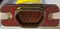

# SpaceWire
> 2021.01.14 [🚀](../index/index.md) [despace](index.md) → [Cable](cable.md), [Doc](doc.md), [GNC](gnc.md)

[TOC]

---

> <small>**SpaceWire** — EN term. **СпейсВайр** — literal RU translation.</small>

**SpaceWire** is a spacecraft communication network based in part on the IEEE 1355 standard of communications. It is coordinated by the European Space Agency (ESA) in collaboration with international space agencies including NASA, JAXA, & RKA. Within a SpaceWire network the nodes are connected through low‑cost, low‑latency, full‑duplex, point‑to‑point serial links, & packet switching wormhole routing routers. SpaceWire covers two (physical & data‑link) of the seven layers of the OSI model for communications.

**SpaceWire** is a standard for high‑speed links & networks for use onboard spacecraft, easing the interconnection of sensors, mass‑memories, processing units, downlink telemetry sub‑systems. SpaceWire equipment is connected together using SpaceWire links which are serial, high‑speed (2 ‑ 200 Mbits/sec), bi‑directional, full‑duplex. Application information is sent along a SpaceWire link in discrete packets. Control & time information can also be sent along SpaceWire links. SpaceWire is being widely used on many space missions by: [ESA](contact/esa.md), [NASA](contact/nasa.md), [JAXA](contact/jaxa.md), [CNSA](contact/cnsa.md). SpaceWire is defined in the European Cooperation for Space Standardization ECSS‑E‑ST‑50‑12C standard.

|*Standard*|*SpaceWire*|
|:--|:--|
|Connector types|Micro‑D|
|Creation date|2019 (rev.1), 2003 (initial)|
|Max. Binary Rate|2 ‑ 400 Mbit/s, with initial signalling rate of 10Mbit/s; Current radiation tolerant devices are capable of up to 200 Mbit/s data signalling rate with a data-rate of 160 Mbit/s per link or 152 Mbit/s bi‑directional per link|
|Max. Devices|1 (more with router)|
|Max. Distance|10 m|
|Network Topology|Electrical using [LVDS](lvds.md); a packet switching network that uses worm‑hole routing switches for routing packets across the network. There is no restriction on the topology of a SpaceWire network. A network is constructed from point‑to‑point links & routing switches|
|Physical Media|bi‑directional, using two twisted pairs in eachdirection|
|Voltage Levels| |
|**Pin**|**Name — Description**|
|Pin 1|DIN+ — Data In Pos.|
|Pin 2|SIN+ — Strobe In Pos.|
|Pin 3|Inner Shield — Ground|
|Pin 4|SOUT- — Strobe Out Neg.|
|Pin 5|DOUT- — Data Out Neg.|
|Pin 6|DIN- — Data In Neg.|
|Pin 7|SIN- — Strobe In Neg.|
|Pin 8|SOUT+ — Strobe Out Pos.|
|Pin 9|DOUT — Data Out Pos.|
| ||

The purpose of the SpaceWire standard is to:

   - facilitate the construction of high‑performance on‑board data handling systems,
   - help reduce system integration costs,
   - promote compatibility between data handling equipmentand subsystems,
   - encourage re‑use of data handling equipment across several different missions.

Key Features:

   - **SpaceWire is simple & can be implemented in ASICs or FPGAs.** SpaceWire uses data‑strobe encoding, where a serial data signal & a strobe signal are sent on two differential pairs. The strobe signal is defined so that clock recovery is achieved by simply XORing together the data & strobe signal. No phase‑locked loop is required making it easy to implement a SpaceWire interface in any digital ASIC or FPGA device. The use of [LVDS](lvds.md) for the physical level, allows complete SpaceWire devices including [LVDS](lvds.md) drivers & receivers to be implemented on a single chip.
   - **SpaceWire is small using few logic gates.** SpaceWire interfaces can be implemented in around 5000 to 8000 logic gates which is a small enough number to make it possible to include one or more SpaceWire interfaces together with application logic or a micro‑computer on a single chip.
   - **SpaceWire devices are radiation tolerant.** Several SpaceWire devices are available or are currently being designed in radiation tolerant ASIC technologies. SpaceWire interfaces have also been implemented in radiation tolerant FPGA devices.
   - **SpaceWire is low power.** SpaceWire uses Low Voltage Differential Signalling (LVDS) to help reduce power consumption at high‑speed. It also uses relatively few logic gates again helping to reduce power consumption.
   - **SpaceWire can be used as a simple point to point link.** SpaceWire is bi‑directional using two twisted pairs in each direction. SpaceWire can be used to implement simple point‑to‑point links or can be used to implement networks using routing switches connected by point‑to‑point links.
   - **SpaceWire can be used in an arbitrary topology network.** There is no restriction on the topology of a SpaceWire network. A network is constructed from point to point links & routing switches. When more than one link connects a pair of routing switches, group adaptive routing can be used to share the bandwidth of the links or to provide for fault tolerance, with rapid recovery from a link failure.
   - **SpaceWire routing switches use wormhole routing.** SpaceWire is a packet switching network that uses worm‑hole routing switches for routing packets across the network. Worm‑hole routing was adopted because it minimizes the amount of buffer memory needed in the routing switches, an important consideration for implementation in radiation tolerant chips where memory is at a premium.
   - **SpaceWire has fault isolation properties.** SpaceWire uses Low Voltage Differential Signalling (LVDS) as its physical layer. [LVDS](lvds.md) uses low voltage & low currents which provide good fault isolation capabilities. For example a short to ground or a short between two SpaceWire signals will not cause the transmitter to burn out.
   - **SpaceWire can recover rapidly from a link failure.** SpaceWire routers support group adaptive routing where traffic can be shared across two or more links connecting a pair of routing switches or a routing switch to a destination node. If one link in a group fails the packet currently being transmitted on that link is terminated by an Error End of Packet (EEP) & remainder of the packet not yet sent is split. The next packet to be sent will be automatically routed to a working link in the group.
   - **SpaceWire supports time distribution.** SpaceWire provides support for the distribution of time information to all nodes on a SpaceWire network. This can be done with a resolution of a few microseconds. A limited amount of event information can be sent along with time‑codes.

**Physical layer.**  
SpaceWire's modulation & data formats generally follow the data strobe encoding ‑ differential ended signaling (DS‑DE) part of the IEEE Std 1355‑1995. SpaceWire utilizes asynchronous communication & allows speeds between 2 Mbit/s & 200 Mbit/s, with initial signalling rate of 10Mbit/s. DS‑DE is well‑favored because it describes modulation, bit formats, routing, flow control, & error detection in hardware, with little need for software. SpaceWire also has very low error rates, deterministic system behavior, & relatively simple digital electronics. SpaceWire replaced old PECL differential drivers in the physical layer of IEEE 1355 DS‑DE by low‑voltage differential signaling (LVDS). SpaceWire also proposes the use of space‑qualified 9‑pin connectors.  
SpaceWire & IEEE 1355 DS‑DE allows for a wider set of speeds for data transmission, & some new features for automatic failover. The fail‑over features let data find alternate routes, so a spacecraft can have multiple data buses, & be made fault‑tolerant. SpaceWire also allows the propagation of time interrupts over SpaceWire links, eliminating the need for separate time discretes.

**Link layer.**  
Each transferred character starts with a Parity bit & a Data‑Control Flag bit. If Data‑Control Flag is a 0‑bit, an 8‑bit LSB character follows. Otherwise one of the control codes, including end of packet (EOP).

**Network layer.**  
The network data frames look as follows:  
*Address byte → Address byte… → Protocol ID → Frame data*  
One or more address bytes are used for the routing. Addresses are either physical ones (0‑31), or logical ones. The difference is that the physical addresses are deleted from the frame header during routing ‑ which is used for hop‑based routing (based on path specified in the frame itself). Logical addresses may be deleted as well, depending on the router configuration.

**Interconnection.**  
The hardware devices may be connected either directly, or via a SpaceWire router. In the former case, usually pairs of devices are used to guarantee a fail‑safe operation ‑ which is however handled by the software.  
A SpaceWire router is usually a crossbar switch‑type device, operating in wormhole switching mode. This also may limit the speed of the communication to the lowest common speed. The routing decisions are based on the programmed routing table & the initial incoming frame contents.

**Uses.**  
SpaceWire is used all around the globe. Its use began primarily in ESA projects, but it is currently used by NASA, JAXA, RKA, & many other organizations & companies. Some NASA projects using it include the James Webb Space Telescope, Swift's Burst Alert Telescope, the Lunar Reconnaissance Orbiter, LCROSS, the Geostationary Operational Environmental Satellite (GOES‑R), & the SCaN Testbed, previously known as the Communications, Navigation, & Networking Reconfigurable Testbed (CoNNeCT). It has also been selected by the United States Department of Defense for Operationally Responsive Space. SpaceWire initiatives are being coordinated between several Space Agencies in the frame of CCSDS in order to extend its communication model to the Network & Transport Layers of the OSI model.  
SpaceWire supports highly fault‑tolerant networks & systems, which is one reason for its popularity.

 

## (RU) СпейсВайр
**SpaceWire** — Стандарт SpaceWire (ECSS‑E‑ST‑50‑12C) — телекоммуникационная сеть для КА, основанная на части стандарта IEEE 1355. Координируется [ESA](contact/esa.md) в сотрудничестве с международными космическими агентствами, включая [NASA](contact/nasa.md), [JAXA](contact/jaxa.md) и Роскосмос. В сети SpaceWire узлы соединяются при помощи недорогих последовательных соединений типа точка‑точка, обладающих низкими задержками и работающих в дуплексном режиме, и коммутационными роутерами, осуществляющими маршрутизацию способом коммутации каналов. SpaceWire охватывает два (физический и канальный) из семи уровней сетевой модели OSI для коммуникаций.

**SpaceWire** —  международный стандарт коммуникаций бортового авиационного и космического оборудования, призванный заменить существующие [интерфейсы](interface.md) (такие, как [MIL‑STD‑1553В](mil_std_1553.md), ARINC, AFDX, [CAN](can.md)), не отвечающие современным требованиям по скорости передачи данных. Позволяет передавать данные со скоростью до 400 Мбит/с при расстоянии между узлами 10 м. SpaceWire разрабатывалась на основе стандартов IEEE1355‑1995 и TIA/EIA‑644 (LVDS) в соответствии с такими требованиями аэрокосмических применений, как:

   - устойчивость к отказам и сбоям;
   - высокие скорости передачи информации;
   - малые задержки доставки сообщений;
   - низкое энергопотребление;
   - электромагнитная совместимость;
   - поддержка систем реального времени и системных функций бортовых комплексов;
   - компактная реализация в СБИС.

**Архитектура.**  
Модуляция и представление данных в SpaceWire в целом похоже на кодирование передаваемых данных — части стандартов IEEE 1355—1995, описывающей дифференциальную передачу сигналов (DS‑DE). SpaceWire использует асинхронное соединение и обладает пропускной способностью 2 ‑ 400 Мбит/с. DS‑DE оказался предпочтительнее, так как он описывает модуляцию, битовые форматы, маршрутизацию, управление потоком и обнаружение и исправление ошибок на уровне оборудования, лишь с небольшой помощью ПО. Также SpaceWire обладает очень низким уровнем ошибок, определением состояния системы, а также относительно простой цифровой электроникой. На физическом уровне в SpaceWire используется низковольтная дифференциальная передача сигналов ([LVDS](LVDS.MD)) вместо устаревшей PECL, предусмотренной стандартом IEEE 1355 DS‑DE. В SpaceWire также предлагается использование 9‑штырьковых разъемов, применяемых в космической отрасли. SpaceWire и IEEE 1355 DS‑DE предусматривают более широкий диапазон скоростей для передачи данных, а также некоторые новые возможности автоматического аварийного переключения. Возможности преодоления отказа позволяют данным найти альтернативные пути передачи, так как космический модуль оснащен несколькими шинами данных, в результате чего обеспечивается отказоустойчивость. Кроме того, SpaceWire предусматривает размножение временных прерываний по соединениям SpaceWire, устраняя потребность в отдельных временных дискретных сигналах.

**Применение.**  
SpaceWire используется во многих проектах по всему миру. Её использование изначально началось в проектах ЕКА, и на данный момент она используется в NASA, JAXA, Роскосмоса, а также прочих компаниЯХ. Некоторые проекты NASA: Телескоп Джеймс Вебб, Burst Alert Telescope для Swift, дкщ, дскщыы, Geostationary Operational Environmental Satellite (GOES‑R) и Communications, Navigation, & Networking Reconfigurable Testbed (CoNNeCT). Она также выбрана Министерством обороны США для проекта Operationally Responsive Space.

**Протоколы.**  
ЕКА разработала черновую спецификацию для идентификатора протокола (Protocol ID). Нижеследующие протокольные идентификаторы утверждены в ECSS‑E‑ST‑50‑11:

   - 1: Remote Memory Access Protocol (RMAP)
   - 2: CCSDS Packet Transfer Protocol
   - 238: Proposal for Reliable Data Delivery Protocol (RDDP) (используется в проекте GOES‑R)
   - 239: Serial Transfer Universal Protocol (STUP) (используется в ASIC SMCS‑332)

 

## Docs & links
|Navigation|
|:--|
|**[FAQ](faq.md)**【**[SCS](scs.md)**·КК, **[SC (OE+SGM)](sc.md)**·КА】**[CON](contact.md)·[Pers](person.md)**·Контакт, **[Ctrl](control.md)**·Упр., **[Doc](doc.md)**·Док., **[Drawing](drawing.md)**·Чертёж, **[EF](ef.md)**·ВВФ, **[Error](error.md)**·Ошибки, **[Event](event.md)**·События, **[FS](fs.md)**·ТЭО, **[HF&E](hfe.md)**·Эрго., **[KT](kt.md)**·КТ, **[N&B](nnb.md)**·БНО, **[Project](project.md)**·Проект, **[QM](qm.md)**·БКНР, **[R&D](rnd.md)**·НИОКР, **[SI](si.md)**·СИ, **[Test](test.md)**·ЭО, **[TRL](trl.md)**·УГТ, **[Way](way.md)**·Пути|
|*Sections & pages*|
|**【[Cable](cable.md)】**  [CAN](can.md)・ [LVDS](lvds.md)・ [MIL‑STD‑1553](mil_std_1553.md)・ [RS‑232, 422, 485](rs_xxx.md)・ SpaceWire・ [ОТБКС](cable.md)|
|**【[Guidance, Navigation & Control (GNC)](gnc.md)】**  [CAN](can.md)・ [LVDS](lvds.md)・ [MIL‑STD‑1553](mil_std_1553.md) (МКО)・ [RS‑232, 422, 485](rs_xxx.md)・ SpaceWire・ [АСН, САН](ans.md)・ [БНО](nnb.md)[MIL‑STD‑1553](mil_std_1553.md) (МКО)[БАППТ](eas.md)・ [БКС](cable.md)・ [БУ](eas.md)・ [БШВ](time.md)・ [Гироскоп](iu.md)・ [Дальномер](doppler.md) (ИСР)・ [ДМ](iu.md)・ [ЗД](sensor.md)・ [Компьютер](obc.md) (ЦВМ, БЦВМ)・ [Магнитометр](sensor.md)・ [МИХ](mic.md)・ [МКО](mil_std_1553.md)・ [ПО](soft.md)・ [ПНА, ПОНА, ПСНА](devd.md)・ [СД](sensor.md)・ [Система координат](coord_sys.md)・ [СОСБ](devd.md)|

   1. Docs: …
   1. <http://spacewire.esa.int/> — SpaceWire homepage
   1. <https://en.wikipedia.org/wiki/SpaceWire>
   1. <https://en.wikipedia.org/wiki/D-subminiature>
   1. <https://multicore.ru/index.php?id=555>
