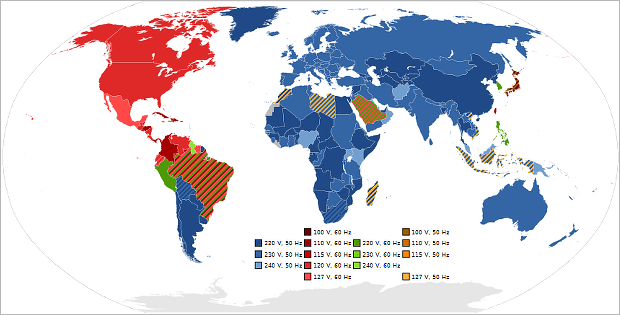

# Power system
> 2021.04.12 [🚀](../index/index.md) [despace](index.md) → [SPS](sps.md)

[TOC]

---

> <small>**Spacecraft power system (SPS), Power supply system (PSS)** — EN term. **Система электроснабжения (СЭС), Система электропитания (СЭП)** — RU analogue.</small>

**Spacecraft power system (SPS)** — a unit of [spacecraft](sc.md) & [SCS](scs.md) — provides [onboard equipment](sc.md) with electricity of the required rating & quality. Usually includes:

| | |
|:--|:--|
|**Generators  or  converters**|・[Electric battery](eb.md) (EB):     ╟ Capacitor     ╟ Galvanic cell     ╟ Fueled battery:     ║  ╟ Biofueled     ║  ╟ [Nuclear reactor](nr.md) (NR)     ║  ╟ [Radioisotope thermoelectric generator](rtg.md) (RTG)     ║  ╙ Other fueled sources     ╙ Rechargeable battery (AB)  ・Electro‑mechanical generator:    ╟ Flood & flows generator     ╟ [Rotor](iu.md)     ╙ [Wind turbine](wt.md) (WT)  ・Lightning receiver  ・Mirror system  ・[Solar panel](sp.md)     ╟ Optical rectenna     ╙ [Solar cell](sp.md)  ・Surface ionized by cosmic rays  ・Thermal‑differencies to electricity converter  ・Transmitting from Earth or re‑transmitter|
|**Storage  device**|・Electro‑mechanical accumulators  ・Heat accumulator  ・[Rechargable electric battery](eb.md) (EB)|
|**Supporting  structures**|・[Automation & stabilization unit](eas.md) (BAS / KAS)  ・Connectors  ・Electroautomatics  ・Wires|

**Sources of an electric energy:**

   - Bioenergy
   - Fuel
   - Geothermal
   - Heat
   - Hydroelectricity
   - Lightnings
   - Marine energy
   - Mechanical
   - Nuclear fuel
   - Solar wind
   - Solar radiation in different spectre
   - Wind

**Other matters:**

   - [Regulated / unregulated voltage](sps.md) (RV / UV)

## Designers, manufacturers

| | |
|:--|:--|
|**AE**|…|
|**AU**|…|
|**CA**|・[Baryon Dynamics](contact/baryon_dyn.md) — mostly for CubeSats  ・[Canadensys](contact/canadensys.md)|
|**CN**|…|
|**EU**|…|
|**IL**|…|
|**IN**|…|
|**JP**|・[Meisei](contact/meisei.md)|
|**KR**|…|
|**RU**|・SPS of an SC is produced by everyone who produces SC ([VNIIEM](contact/vniiem.md), [ISS](contact/iss_r.md), [LAV](contact/lav.md), etc.)  ・SPS sub‑item — see the corresponding sub‑item from the list above  ・[AVEKS](contact/aveks.md)|
|**SA**|…|
|**SG**|…|
|**US**|…|
|**VN**|…|

 

## Напряжение
> <small>**Напряжение / Напряжение электрическое** — русскоязычный термин. **Voltage** — англоязычный эквивалент.</small>  
> <small>**Номинальное напряжение** — русскоязычный термин. **Nominal voltage** — англоязычный эквивалент.</small>

**Электри́ческое напряже́ние** между точками A и B электрической цепи или электрического поля — физическая величина, значение которой равно работе эффективного электрического поля (включающего сторонние поля), совершаемой при переносе единичного пробного электрического заряда из точки A в точку B.

**Номинальное напряжение** — это базисное напряжение из стандартизированного ряда напряжений, определяющих уровень изоляции сети и электрооборудования. Действительные напряжения в различных точках системы могут несколько отличаться от номинального, однако они не должны превышать наибольшие рабочие напряжения, установленные для продолжительной работы.

**Номинальное напряжение** у источников и приёмников электроэнергии (генераторов, трансформаторов) — такое напряжение, на которое они рассчитаны в условиях нормальной работы. Номинальные напряжения электрических сетей и присоединяемых к ним источников и приёмников электрической энергии устанавливаются [ГОСТом](doc.md).

   1. <https://en.wikipedia.org/wiki/Mains_electricity>
   1. <https://en.wikipedia.org/wiki/Mains_electricity_by_country>
   1. <https://en.wikipedia.org/wiki/Volt>
   1. <https://en.wikipedia.org/wiki/Voltage>
   1. <https://ru.wikipedia.org/wiki/Напряжение>
   1. <https://ru.wikipedia.org/wiki/Номинальное_напряжение>
   1. <https://ru.wikipedia.org/wiki/Стандарты_напряжений_и_частот_в_разных_странах>
   1. <https://ru.wikipedia.org/wiki/Электрическое_напряжение>
   1. 2015.12.30 [Как получить отрицательное напряжение ⎆](https://hubstub.ru/circuit-design/109-kak-poluchit-otricatelnogo-napryazheniya.html) — [archived ❐](f/archive/20151230_1.pdf) 2019.02.22

### Номиналы
Ниже приведены применяемые номиналы напряжений.

||*Voltage, V*|
|:--|:--|
|**CN**|<mark>TBD</mark> |
|**EU**|230 (also in Asia, Africa & Australia)|
|**IN**|<mark>TBD</mark>|
|**JP**|100|
|**RU**|5 ‑ 12 — Напряжение на входе мелких [ЭРИ](elc.md), датчиков, схем.  27 — Напряжение на входе большинства приборов КА. В СССР были авиационные ГОСТы, где было 27 В. С тех пор по привычке. А ещё ниже 27 В не возникает дуга между контактами.  100 — Для работы с зарубежными приборами.  220 ‑ 240 — В розетках.|
|**US**|110 ‑ 120 — Унификация с авиационной промышленностью, да и вообще в США в розетках везде 110 В.|
| ||

The voltage produced by each electrochemical cell in a battery is determined by the chemistry of that cell. Cells can be combined in series for multiples of that voltage, or additional circuitry added to adjust the voltage to a different level. Mechanical generators can usually be constructed to any voltage in a range of feasibility.

Nominal voltages of familiar sources:

   - Nerve cell resting potential: ~0.075 V
   - Single-cell, rechargeable NiMH or NiCd battery: 1.2 V
   - Single-cell, non-rechargeable (e.g., AAA, AA, C, D): alkaline battery: 1.5 V; zinc-carbon battery: 1.56 V if fresh & unused
   - LiFePO₄ rechargeable battery: 3.3 V
   - Cobalt-based Lithium polymer rechargeable battery: 3.75 V
   - Transistor-transistor logic/CMOS (TTL) power supply: 5 V
   - USB: 5 V DC
   - PP3 battery: 9 V
   - Automobile battery systems are 2.1 V/cell; a “12V” battery is 6 cells or 12.6V; a “24V” battery is 12 cells or 25.2 V. Some antique vehicles use “6V” 3-cell batteries or 6.3 V.
   - Electric vehicle battery: 400 V when fully charged
   - Rapid transit third rail: 600 ‑ 750 V (see List of railway electrification systems)
   - High‑speed train overhead power lines: 25 ㎸ at 50 ㎐, & 25 ㎸ at 60 ㎐ for exceptions.
   - High‑voltage electric power transmission lines: 110 ㎸ & up (1.15 ㎹ was the record as of 2005)
   - Lightning: Varies greatly, often around 100 ㎹.

### СН/Нст
> <small>*Термины:*</small>
> <small>**Стабилизированное напряжение (СН)** — русскоязычный термин. **Regulated voltage** — англоязычный эквивалент.</small>  
> <small>**Нестабилизированное напряжение (Нст)** — русскоязычный термин. **Unregulated voltage** — англоязычный эквивалент.</small>

 

## Docs & links (TRANSLATEME ALREADY)
|Navigation|
|:--|
|**[FAQ](faq.md)**【**[SCS](scs.md)**·КК, **[SC (OE+SGM)](sc.md)**·КА】**[CON](contact.md)·[Pers](person.md)**·Контакт, **[Ctrl](control.md)**·Упр., **[Doc](doc.md)**·Док., **[Drawing](drawing.md)**·Чертёж, **[EF](ef.md)**·ВВФ, **[Error](error.md)**·Ошибки, **[Event](event.md)**·События, **[FS](fs.md)**·ТЭО, **[HF&E](hfe.md)**·Эрго., **[KT](kt.md)**·КТ, **[N&B](nnb.md)**·БНО, **[Project](project.md)**·Проект, **[QM](qm.md)**·БКНР, **[R&D](rnd.md)**·НИОКР, **[SI](si.md)**·СИ, **[Test](test.md)**·ЭО, **[TRL](trl.md)**·УГТ, **[Way](way.md)**·Пути|
|*Sections & pages*|
|**【[Spacecraft power system (SPS)](sps.md)】**  [Charge eff.](charge_eff.md)・ [EAS](eas.md)・ [EB](eb.md)・ [EMI, RFI](emi.md)・ [NR](nr.md)・ [Rotor](iu.md)・ [RTG](rtg.md)・ [Solar cell](sp.md)・ [SP](sp.md)・ [SPB/USPB](suspb.md)・ [Voltage](sps.md)・ [WT](wt.md) • • •  **RF/CIF:** [BAK‑01](eas_lst.md)・ [KAS‑LOA](eas_lst.md)|

   1. Docs: …
   1. <https://en.wikipedia.org/wiki/Space-based_solar_power>
   1. <https://ru.wikipedia.org/wiki/Система_энергоснабжения_космического_аппарата>
   1. <https://en.wikipedia.org/wiki/Sustainable_energy>
   1. <https://en.wikipedia.org/wiki/Renewable_energy>
