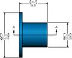
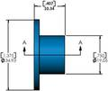
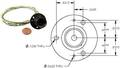
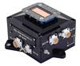
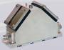
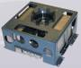

# Sun sensor (a list)
> 2019.07.31 [🚀](../index/index.md) [despace](index.md) → [Sensor](sensor.md)

[TOC]

---

A list of [Sun sensor](sensor.md).

## Current

 

### Cubesat — CSS (US)
> <small>**Coarse Sun Sensor (CSS)** — англоязычный термин, не имеющий аналога в русском языке. **Грубый солнечный датчик** — дословный перевод с английского на русский.</small>

**Coarse Sun Sensor (CSS)** — солнечный датчик, предназначенный для: 1) построения постоянной солнечной ориентации (ПСО) после отделения от [РБ](lv.md); 2) построения и поддержания ПСО, где при работе [научной аппаратуры](sc.md) ПСО используется в качестве рабочей ориентации; 3) построения и поддержания ПСО в нештатных ситуациях (НШС), когда парирование НШС в режиме инерциальной ориентации невозможно.  
Разработчик: [Space Micro](space_micro.md). Разработано в 1996 году. Активное применение.

|*Characteristics*|*[Value](si.md)  (CSS-01,02)*|
|:--|:--|
|Composition|Single unit|
|Consumption, W|0|
|Dimensions, ㎜|12.7 × 23.8 × 9|
|[Interfaces](interface.md)|0 ‑ 3.5 ㎃ (typical) current sources on 2 flying leads: 50” (1.27m) in length, M22759/ 33-26, 26 AWG wire|
|[Lifetime](lifetime.md)/Resource, h(y)|… / …|
|Mass, ㎏|0.02|
|[Overload](vibration.md), Grms|14.1 gRMS вибрации, 60 g ударные|
|[Rad.resist](ion_rad.md), ㏉ (㎭)| |
|[Reliability](qm.md) per [lifetime](lifetime.md)| |
|[Thermal range](tcs.md), ℃|−40 ‑ +93|
|[TRL](trl.md)|9|
|[Voltage](sps.md), V| |
|**【Specific】**|• • •|
|Accuracy|5°|
|Range °, ≥|120, круг|
|Ready mode| |
|Refresh rate, ㎐| |
| ||

**Notes:**

   1. [CSS datasheet ❐](f/sensor/c/css_sm_datasheet.pdf)
   1. <https://www.spacemicro.com/products/guidance-and-navigation.html>
   1. **Applicability:** ALEXIS・ CHIPSat・ HETE・ MOST・ STPSat-1

 

### Cubesat — MSS (US)
> <small>**Coarse Sun Sensor (CSS)** — англоязычный термин, не имеющий аналога в русском языке. **Грубый солнечный датчик** — дословный перевод с английского на русский.</small>

**Coarse Sun Sensor (CSS)** — солнечный датчик, предназначенный для: 1) построения постоянной солнечной ориентации (ПСО) после отделения от [РБ](lv.md); 2) построения и поддержания ПСО, где при работе [научной аппаратуры](sc.md) ПСО используется в качестве рабочей ориентации; 3) построения и поддержания ПСО в нештатных ситуациях (НШС), когда парирование НШС в режиме инерциальной ориентации невозможно.  
Разработчик: [Space Micro](space_micro.md). Разработано в 1996 году, активное применение.

|*Characteristics*|*[Value](si.md)  (MSS-01)*|*[Value](si.md)  (MSS-02)*|
|:--|:--|:--|
|Composition| | |
|Consumption, W|0|0|
|Dimensions, ㎜|34.9 × 19.1 × 24.3|34.9 × 19.1 × 10.3|
|[Interfaces](interface.md)|Four 0 ‑ 4.5 ㎃ (typical) current sources on five flying leads: 1.27 m in length, M22759/33-26, 26 AWG wire|Four 0 ‑ 4.5 ㎃ (typical) current sources on five flying leads: 1.27 m in length, M22759/33-26, 26 AWG wire|
|[Lifetime](lifetime.md)/Resource, h(y)|… / …|… / …|
|Mass, ㎏|0.036|0.026|
|[Overload](vibration.md), Grms|14.1 gRMS вибрации, 60 g ударные|14.1 gRMS вибрации, 60 g ударные|
|[Rad.resist](ion_rad.md), ㏉ (㎭)| | |
|[Reliability](qm.md) per [lifetime](lifetime.md)| | |
|[Thermal range](tcs.md), ℃|−40 ‑ +93|−40 ‑ +93|
|[TRL](trl.md)|9| |
|[Voltage](sps.md), V| | |
|**【Specific】**|• • •|• • •|
|Accuracy|1°| |
|Range °, ≥|48, круг|120, круг|
|Ready mode| | |
|Refresh rate, ㎐| | |
| |||
| || |

**Notes:**

   1. [MSS datasheet ❐](f/sensor/m/mss_sm_datasheet.pdf)
   1. <https://www.spacemicro.com/products/guidance-and-navigation.html>
   1. **Applicability:** ALEXIS・ FASTSAT・ HETE・ TERRIERS

 

### 347К (RU)
**Солнечный датчик (СД) 347К** предназначен для:

   1. первоначального построения **постоянной солнечной ориентации (ПСО)** после отделения от [РБ](lv.md);
   1. построения и поддержания ПСО на [КА](sc.md), где условия работы [научной аппаратуры](sc.md) предполагают использование ПСО в качестве рабочей ориентации;
   1. построения и поддержания ПСО в нештатных ситуациях, в случаях, когда парирование нештатной ситуации в режиме инерциальной ориентации невозможно.

Разработчик и изготовитель [Геофизика‑Космос](contact/geofizika_s.md). Разработан в 2011 году. Активное использование. Покупное изделие. (по состоянию на 20.06.2017)

|*Characteristic*|*[Value](si.md)*|
|:--|:--|
|Composition|Single unit|
|Consumption, W|5|
|Dimensions, ㎜|135 × 145 × 85|
|[Interfaces](interface.md)|[МКО](mil_std_1553.md) (МПИ) по ГОСТ Р 52070|
|[Lifetime](lifetime.md)/Resource, h(y)|166 440 (19) / 60 000 (6.84 лет)|
|Mass, ㎏|0.7|
|[Overload](vibration.md), Grms| |
|[Rad.resist](ion_rad.md), ㏉ (㎭)| |
|[Reliability](qm.md) per [lifetime](lifetime.md)|0.9969 за 3 года|
|[Thermal range](tcs.md), ℃| |
|[TRL](trl.md)| |
|[Voltage](sps.md), V|27 штатное (25 ‑ 28 допустимое)|
|**【Specific】**|• • •|
|Accuracy| |
|Range °, ≥|0 ‑ (91+2)° по углу α и 0 ‑ 360° по углу φ|
|Ready mode|через 10 s после подачи питания|
|Refresh rate, ㎐|5|
| ||

**Notes:**

   1. Прибор состоит из модуля фотоприёмного устройства (ФПУ), модуля процессора (МП) и модуля вторичного источника питания (МВИП) в виде единого конструктивного блока. Изделие обеспечивает следующие необходимые функциональные режимы: ➀ режим готовности; ➁ режим определения углового положения центра [Солнца](sun.md).
   1. Изделие формирует информацию об угловом положении Солнца в приборной системе координат, связанной с посадочной плоскостью изделия. В виде направляющих косинусов cos α, cos β, cos γ. Предельная погрешность определения углового положения Солнца в приборной системе координат (угол между измеренным и истинным направлениями на центр Солнца), включая методическую, инструментальную, шумовую составляющие, не превышает 1’.
   1. **Applicability:** [Венера‑Д](венера‑д.md)・ КА [Luna‑25](луна_25.md)・ КА [Luna‑26](луна_26.md)・ КА [Luna‑27](луна_27.md)

 

### CoSS (EU)
> <small>**Cosine Sun Sensor (CoSS)** — англоязычный термин, не имеющий аналога в русском языке. **Косинусный солнечный датчик** — дословный перевод с английского на русский.</small>

**Cosine Sun Sensor (CoSS)**, *косинусный солнечный датчик* — аналоговый солнечный датчик, предназначенный для: 1) построения постоянной солнечной ориентации (ПСО) после отделения от [РБ](lv.md); 2) построения и поддержания ПСО, где при работе [научной аппаратуры](sc.md) ПСО используется в качестве рабочей ориентации; 3) построения и поддержания ПСО в нештатных ситуациях (НШС), когда парирование НШС в режиме инерциальной ориентации невозможно.  
Разработчик [Bradford Engineering](contact/bradford_eng.md). Разработано  

|*Characteristics*|*[Value](si.md)  (CoSS)*|*[Value](si.md)  (CoSS-R)*|
|:--|:--|:--|
|Composition|Single unit|Single unit|
|Consumption, W|0 (пассивен)|0 (пассивен)|
|Dimensions, ㎜|30 × 30 × 15|45 × 37 × 6|
|[Interfaces](interface.md)| | |
|[Lifetime](lifetime.md)/Resource, h(y)|… / …|… / …|
|Mass, ㎏|0.024 (без кабеля);  0.05 (с кабелем 1.5 м)|0.017 (без кабеля)|
|[Overload](vibration.md), Grms|2 000|2 600|
|[Rad.resist](ion_rad.md), ㏉ (㎭)| | |
|[Reliability](qm.md) per [lifetime](lifetime.md)| | |
|[Thermal range](tcs.md), ℃|–50 ‑ +80 ℃|–55 ‑ +115 ℃|
|[TRL](trl.md)| | |
|[Voltage](sps.md), V| | |
|**【Specific】**|• • •|• • •|
|Accuracy|3°|3°|
|Range °, ≥|160 × 160|180 × 180|
|Ready mode| | |
|Refresh rate, ㎐| | |
| |||

**Notes:**

   1. [CoSS, ТО ❐](f/sensor/c:coss_datasheet.djvu) (2018)・ [CoSS‑R, ТО ❐](f/sensor/c:coss-r_datasheet.djvu) (2018)
   1. <http://bradford-space.com/products-aocs-cosine-sun-sensors.php>
   1. <http://bradford-space.com/products-aocs-redundant-sun-sensors.php>
   1. **Applicability:** Galileo・ Globalstar

 

### CSS (EU)
> <small>**Coarse Sun Sensors (CSS)** — англоязычный термин, не имеющий аналога в русском языке. **Грубый солнечный датчик** — дословный перевод с английского на русский.</small>

**Coarse Sun Sensors (CSS)**, *грубый солнечный датчик* — аналоговый солнечный датчик, предназначенный для: 1) построения постоянной солнечной ориентации (ПСО) после отделения от [РБ](lv.md); 2) построения и поддержания ПСО, где при работе [научной аппаратуры](sc.md) ПСО используется в качестве рабочей ориентации; 3) построения и поддержания ПСО в нештатных ситуациях (НШС), когда парирование НШС в режиме инерциальной ориентации невозможно.

Разработчик и изготовитель [Bradford Engineering](contact/bradford_eng.md). Разработано в 1970‑х годах покупное изделие

|*Characteristic*|*[Value](si.md)*|
|:--|:--|
|Composition|Single unit|
|Consumption, W|0|
|Dimensions, ㎜|110 × 110 × 30|
|[Interfaces](interface.md)|4 дублированных аналоговых сигнала|
|[Lifetime](lifetime.md)/Resource, h(y)|131 400 (15)|
|Mass, ㎏|0.225 (203 ‑ 248) ㎏|
|[Overload](vibration.md), Grms| |
|[Rad.resist](ion_rad.md), ㏉ (㎭)| |
|[Reliability](qm.md) per [lifetime](lifetime.md)| |
|[Thermal range](tcs.md), ℃|от −80 до +120 ℃|
|[TRL](trl.md)| |
|[Voltage](sps.md), V| |
|**【Specific】**|• • •|
|Accuracy|1.0 ‑ 1.5° (3σ)|
|Range °, ≥|± 90° × ± 90°, линейная зона ± 12° × ±12°|
|Ready mode| |
|Refresh rate, ㎐| |
| ||

**Notes:**

   1. [Описание от 28.07.2017 ❐](f/sensor/c/css_laspace-css-be-p-0001_issue_1.0.djvu)・ [CSS, ТО ❐](f/sensor/c/css_datasheet.djvu) (2017)
   1. <http://bradford-space.com/products/aocs/css/>
   1. **Applicability:** КА «Ямал» (ЕКА, 1975 г)・ [LRO](lunar_reconnaissance_orbiter.md)

 

### FSS (EU)
> <small>**Fine Sun Sensor (FSS)** — англоязычный термин, не имеющий аналога в русском языке. **Точный солнечный датчик** — дословный перевод с английского на русский.</small>

**Fine Sun Sensor (FSS)** — аналоговый солнечный датчик, предназначенный для: 1) построения постоянной солнечной ориентации (ПСО) после отделения от [РБ](lv.md); 2) построения и поддержания ПСО, где при работе [научной аппаратуры](sc.md) ПСО используется в качестве рабочей ориентации; 3) построения и поддержания ПСО в нештатных ситуациях (НШС), когда парирование НШС в режиме инерциальной ориентации невозможно.  
Разработчик [Bradford Engineering](contact/bradford_eng.md). Разработано в 2005 году Активное использование. Покупное изделие. (на 2018.03.28)

|*Characteristics*|*[Value](si.md)  (FSS)*|*[Value](si.md)  (Mini FSS)*|
|:--|:--|:--|
|Composition|Single unit|Single unit|
|Consumption, W|0.25|0 (пассивный)|
|Dimensions, ㎜|108 × 108 × 53|50 × 46 × 17|
|[Interfaces](interface.md)| | |
|[Lifetime](lifetime.md)/Resource, h(y)|43 800 (5) / …|43 800 (5) / …|
|Mass, ㎏|0.375|0.05|
|[Overload](vibration.md), Grms| | |
|[Rad.resist](ion_rad.md), ㏉ (㎭)|100 (10 000)|100 (10 000)|
|[Reliability](qm.md) per [lifetime](lifetime.md)|0.997|0.997|
|[Thermal range](tcs.md), ℃|–50 ‑ +85 ℃|–50 ‑ +85 ℃|
|[TRL](trl.md)| | |
|[Voltage](sps.md), V|± 15| |
|**【Specific】**|• • •|• • •|
|Accuracy|0.3° (3σ)|от 0.2 до 1.5° (3σ)|
|Range °, ≥|128 × 128|128 × 128|
|Ready mode| | |
|Refresh rate, ㎐| | |
||||

**Notes:**

   1. …
   1. **Applicability:** Galileo・ Globalstar

 

### FSS JO (EU)
> <small>**Fine Sun Sensor (FSS)** — англоязычный термин, не имеющий аналога в русском языке. **Точный солнечный датчик** — дословный перевод с английского на русский.</small>

**Fine Sun Sensor (FSS)** — солнечный датчик, предназначенный для: 1) построения постоянной солнечной ориентации (ПСО) после отделения от [РБ](lv.md); 2) построения и поддержания ПСО, где при работе [научной аппаратуры](sc.md) ПСО используется в качестве рабочей ориентации; 3) построения и поддержания ПСО в нештатных ситуациях (НШС), когда парирование НШС в режиме инерциальной ориентации невозможно.  
Разработчик и изготовитель [Jena‑Optronik](contact/jenaoptronik.md), EU. Разработано 2010 году. Активное применение.

|*Characteristics*|*[Value](si.md)  (FSS)*|
|:--|:--|
|Composition| |
|Consumption, W|0.4|
|Dimensions, ㎜|160 × 145 × 56|
|[Interfaces](interface.md)| |
|[Lifetime](lifetime.md)/Resource, h(y)|НОО: 113 880 (13) / …|
|Mass, ㎏|0.65|
|[Overload](vibration.md), Grms| |
|[Rad.resist](ion_rad.md), ㏉ (㎭)| |
|[Reliability](qm.md) per [lifetime](lifetime.md)| |
|[Thermal range](tcs.md), ℃|−30 ‑ +65|
|[TRL](trl.md)| |
|[Voltage](sps.md), V|14 (13 ‑ 15)|
|**【Specific】**|• • •|
|Accuracy|0.15°|
|Range °, ≥| |
|Ready mode| |
|Refresh rate, ㎐| |
| ||

**Notes:**

   1. [FSS Datasheet ❐](f/sensor/f/fss_jo_datasheet.pdf)
   1. **Applicability:** …

 

### OSD (RU)
> <small>**Оптический солнечный датчик (ОСД)** — RU term w/o analogues in English. **Optical sun sensor (OSD)** — literal EN translation.</small>

**Оптический солнечный датчик (ОСД)** предназначен для:

   1. первоначального построения **постоянной солнечной ориентации (ПСО)** после отделения от [РБ](lv.md);
   1. построения и поддержания ПСО на [КА](sc.md), где условия работы [научной аппаратуры](sc.md) предполагают использование ПСО в качестве рабочей ориентации;
   1. построения и поддержания ПСО в нештатных ситуациях, в случаях, когда парирование нештатной ситуации в режиме инерциальной ориентации невозможно.

Разработчик и изготовитель [ИКИ РАН](contact/iki_ras.md). Разработан в 2005 году. <mark>TBD</mark>

|*Characteristic*|*[Value](si.md)*|
|:--|:--|
|Composition|Single unit|
|Consumption, W|2.5|
|Dimensions, ㎜|120 × 112 × 73|
|[Interfaces](interface.md)|[МКО](mil_std_1553.md)|
|Mass, ㎏|0.65|
|[Lifetime](lifetime.md)/Resource, h(y)|131 400 (15) / 20 000 (2.28)|
|[Overload](vibration.md), Grms| |
|[Rad.resist](ion_rad.md), ㏉ (㎭)| |
|[Reliability](qm.md) per [lifetime](lifetime.md)| |
|[Thermal range](tcs.md), ℃| |
|[TRL](trl.md)| |
|[Voltage](sps.md), V| |
|**【Specific】**|• • •|
|Accuracy|при скорости до 0.1 °/s — 3”, при скорости до 1.0 °/s — 5”|
|Range °, ≥|± 60º в плоскости XOZ, ± 31º в плоскости YOZ|
|Ready mode|60 с после подачи питания|
|Refresh rate, ㎐|4|
| ||

**Notes:**

   1. [Технические характеристики ❐](f/sensor/o/osd_specs_2005.djvu) (ИКИ РАН, 2005)・ [О работе ОСД на борту КА «Фобос‑Грунт» ❐](f/sensor/o/osd_ppt_phobos-grunt.pdf) (ИКИ РАН, 2011)
   1. <http://ofo.ikiweb.ru/osd.php> — [archived ❐](f/sensor/o/ofo_ikiweb_ru_osd.pdf) 2019.02.15
   1. **Applicability:** КА «[Фобос‑Грунт](фобос_грунт.md)».

 

### SDP-1 (RU)
> <small>**СДП-1** — RU term w/o analogues in English. **SDP-1** — literal EN translation.</small>

**Солнечный датчик положения (СДП-1)** — солнечный датчик, предназначенный для: 1) построения постоянной солнечной ориентации (ПСО) после отделения от [РБ](lv.md); 2) построения и поддержания ПСО, где при работе [научной аппаратуры](sc.md) ПСО используется в качестве рабочей ориентации; 3) построения и поддержания ПСО в нештатных ситуациях (НШС), когда парирование НШС в режиме инерциальной ориентации невозможно.  
*Разработчик:* [МОКБ Марс](contact/mars_mokb.md). Разработано  

|*Characteristic*|*[Value](si.md)*|
|:--|:--|
|Composition|Single unit|
|Consumption, W|0.85|
|Dimensions, ㎜|93 × 33 × 54|
|[Interfaces](interface.md)| |
|[Lifetime](lifetime.md)/Resource, h(y)| |
|Mass, ㎏|0.4|
|[Overload](vibration.md), Grms| |
|[Rad.resist](ion_rad.md), ㏉ (㎭)| |
|[Reliability](qm.md) per [lifetime](lifetime.md)| |
|[Thermal range](tcs.md), ℃| |
|[TRL](trl.md)| |
|[Voltage](sps.md), V|15|
|**【Specific】**|• • •|
|Accuracy| |
|Range °, ≥|185° × 5°|
|Ready mode| |
|Refresh rate, ㎐| |
| ||

**Notes:**

   1. Предельная погрешность определения углового положения Солнца в приборной системе координат (угол между измеренным и истинным направлениями на центр Солнца), включая методическую, инструментальную, шумовую составляющие, не превышает 1°.
   1. **Applicability:** (2006) КазСат・ (2009) Экспресс‑МД1・ (2011) [Электро‑Л](электро_л.md)

 

### SX-SUNR-01 (RU)
**SX‑SUNR‑01** — солнечный датчик, предназначенный для: 1) построения постоянной солнечной ориентации (ПСО) после отделения от [РБ](lv.md); 2) построения и поддержания ПСО, где при работе [научной аппаратуры](sc.md) ПСО используется в качестве рабочей ориентации; 3) построения и поддержания ПСО в нештатных ситуациях (НШС), когда парирование НШС в режиме инерциальной ориентации невозможно.  
*Разработчик:* [Спутникс](contact/sputnix.md). Разработано  

|*Characteristic*|*[Value](si.md)*|
|:--|:--|
|Composition|Single unit|
|Consumption, W|0.05|
|Dimensions, ㎜|50 × 46 × 17|
|[Interfaces](interface.md)|[RS‑485](rs_xxx.md)|
|[Lifetime](lifetime.md)/Resource, h(y)| |
|Mass, ㎏|0.04|
|[Overload](vibration.md), Grms| |
|[Rad.resist](ion_rad.md), ㏉ (㎭)| |
|[Reliability](qm.md) per [lifetime](lifetime.md)| |
|[Thermal range](tcs.md), ℃|–40 ‑ +60|
|[TRL](trl.md)| |
|[Voltage](sps.md), V|5|
|**【Specific】**|• • •|
|Accuracy|1° (3σ)|
|Range °, ≥|60±1°|
|Ready mode| |
|Refresh rate, ㎐| |
| ||

**Notes:**

   1. [3D‑модель ❐](f/sensor/s/sx-sunr-01_3d_step.7z)・ [Чертёж ❐](f/sensor/s/sx-sunr-01_sketch1.png)・ [ТО и руководство пользователя ❐](f/sensor/s/sx-sunr-01_datasheet_manual.djvu)
   1. **Applicability:** …

 

### TDS (RU)

> <small>**Точный датчик Солнца (ТДС)** — RU term w/o analogues in English. **Precise sun sensor (TDS)** — literal EN translation.</small>

**Точный датчик Солнца (ТДС)** — солнечный датчик, предназначенный для: 1) построения постоянной солнечной ориентации (ПСО) после отделения от [РБ](lv.md); 2) построения и поддержания ПСО, где при работе [научной аппаратуры](sc.md) ПСО используется в качестве рабочей ориентации; 3) построения и поддержания ПСО в нештатных ситуациях (НШС), когда парирование НШС в режиме инерциальной ориентации невозможно.  
*Разработчик:* [МОКБ Марс](contact/mars_mokb.md). Разработано в 2008 году.

|*Characteristic*|*[Value](si.md)*|
|:--|:--|
|Composition|Single unit|
|Consumption, W|12|
|Dimensions, ㎜|200 × 177 × 96|
|[Interfaces](interface.md)|цифроаналоговые|
|[Lifetime](lifetime.md)/Resource, h(y)| |
|Mass, ㎏|2.3|
|[Overload](vibration.md), Grms| |
|[Rad.resist](ion_rad.md), ㏉ (㎭)| |
|[Reliability](qm.md) per [lifetime](lifetime.md)| |
|[Thermal range](tcs.md), ℃| |
|[TRL](trl.md)| |
|[Voltage](sps.md), V| |
|**【Specific】**|• • •|
|Accuracy| |
|Range °, ≥|60° × 60°|
|Ready mode| |
|Refresh rate, ㎐|8|
| ||

**Notes:**

   1. Предельная погрешность определения углового положения Солнца в приборной системе координат (угол между измеренным и истинным направлениями на центр Солнца), включая методическую, инструментальную, шумовую составляющие, не превышает 1’.
   1. **Applicability:** (2009) Коронас‑Фотон

 

## Archive

 

## Docs & links (TRANSLATEME ALREADY)
|Navigation|
|:--|
|**[FAQ](faq.md)**【**[SCS](scs.md)**·КК, **[SC (OE+SGM)](sc.md)**·КА】**[CON](contact.md)·[Pers](person.md)**·Контакт, **[Ctrl](control.md)**·Упр., **[Doc](doc.md)**·Док., **[Drawing](drawing.md)**·Чертёж, **[EF](ef.md)**·ВВФ, **[Error](error.md)**·Ошибки, **[Event](event.md)**·События, **[FS](fs.md)**·ТЭО, **[HF&E](hfe.md)**·Эрго., **[KT](kt.md)**·КТ, **[N&B](nnb.md)**·БНО, **[Project](project.md)**·Проект, **[QM](qm.md)**·БКНР, **[R&D](rnd.md)**·НИОКР, **[SI](si.md)**·СИ, **[Test](test.md)**·ЭО, **[TRL](trl.md)**·УГТ, **[Way](way.md)**·Пути|
|*Sections & pages*|
|**`Солнечный датчик (СД):`**  [ПЗр](fov.md)  • • •  (КА) **Европа:** [FSS](ss_lst.md) (650)・ [FSS](ss_lst.md) (50 ‑ 375)・ [CSS](ss_lst.md) (275)・ [CoSS](ss_lst.md) (15 ‑ 24)  ▮  **РФ:** [ТДС](ss_lst.md) (2 300)・ [347К](ss_lst.md) (700)・ [ОСД](ss_lst.md) (650)・ [СДП-1](ss_lst.md) (400)・ [SX-SUNR-01](ss_lst.md) (40)  *(Кубсаты) **США:** [MSS](ss_lst.md) (0.036)・ [CSS](ss_lst.md) (0.02)*|

   1. Docs: …
   1. <…>
