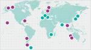
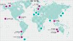

# SSC GGSN
> 2019.05.12 ┊ **🚀 [despace](index.md)** → [Swedish Space Corporation](swedish_sc.md), **[НС](scs.md)**

[TOC]

---

> <small>*Термины:* **Swedish Space Corporation's Global Ground Station Network (SSC GGSN)** — англоязычный термин, не имеющий аналога в русском языке. **Глобальная сеть наземных станций Шведской Космической Корпорации (SSC GGSN)** — дословный перевод с английского на русский.</small>

**Swedish Space Corporation's Global Ground Station Network (SSC GGSN)** — глобальная сеть НС [Swedish Space Corporation](swedish_sc.md).

|*Расположение станций*|*И с указанием диапазона*|
|:--|:--|
|   |   |

Основные станции:

   - **Clewiston.** USA, Florida, Clewiston, 26°44' N, 81°02' W. [Bands](rf.md): **S** (↑), **dual X** (↓).
   - **Dongara.** Australia, Dongara, 29° 03' S, 115°21' E. [Bands](rf.md): **S** (↑/↓), **X** (↑/↓), **Ku** (↑/↓), **Ka** (↑/↓).
   - **Esrange.** Sweden, Kiruna, 67° 53' N, 21° 04' E. [Bands](rf.md): **UHF** (↓), **S** (↑/↓), **X** (↓).
   - **Inuvik.** Canada, Inuvik, 68° 24' N, 133° 30' W. [Bands](rf.md): **S** (↑/↓), **X** (↑/↓).
   - **North Pole.** USA, Alaska, North Pole, 64° 48' N, 147° 39' W. [Bands](rf.md): **S** (↑/↓), **X** (↓).
   - **Punta Arenas.** Chile, Punta Arenas, 52°56' S, 70°51' W. [Bands](rf.md): **S** (↑/↓), **X** (↑/↓).
   - **Santiago.** Chile, Santiago de Chile, 33° 08' S, 70° 40' W. [Bands](rf.md): **S** (↑/↓), **C** (↑/↓), **Ka** (↑/↓).
   - **Siracha.** Thailand, Siracha, 13° 6' N, 100° 55' E. [Bands](rf.md): **S** (↑/↓), **X** (↓).
   - **South Point.** USA, Hawaii, South Point, 19°1' N, 155°40' W. [Bands](rf.md): **S** (↑/↓), **X** (↑/↓), **Ku** (↑/↓).
   - **Yatharagga.** Australia, Dongara, 29° 05' S, 115°35' E. [Bands](rf.md): **S** (↑/↓), **X** (↓), **Ka** (↓).

Станции с кооперацией:

   - O'Higgins, Antarctica
   - Fucino, Italy
   - Weilheim, Germany
   - Madrid, Spain
   - Hartebesthook, South Africa
   - Bengaluru, India
   - Hokkaido, Japan
   - Okinawa, Japan

 

## Docs & links (TRANSLATEME ALREADY)
|…°·•¹²³±×÷≤≥≈≠ ‑ −— ⎆✉ ❐“”’«»✔→✘☐☑├┕┆ 1 lb = 0.453592 kg; 1 g = 9.80665 m/s²|
|:--|
|<small>**[FAQ](faq.md)**, **[Cable](cable.md)**·БКС, **[Camera](camera.md)**·Камера, **[Comms](comms.md)**·Радиосв., **[Contact](contact.md)**·Контакт, **[Control](control.md)**·Управ., **[Doc](doc.md)**·Док., **[Doppler](doppler.md)**·ИСР, **[DS](ds.md)**·ЗУ, **[EB](eb.md)**·ХИТ, **[ECO](ecology.md)**·Экол., **[EF](ef.md)**·ВВФ, **[ElC](elc.md)**·ЭКБ, **[EMC](emc.md)**·ЭМС, **[Errors](error.md)**·Ошибки, **[Events](event.md)**·События, **[FS](fs.md)**·ТЭО, **[Fuel](fuel.md)**·Топливо, **[GNC](gnc.md)**·БКУ, **[GS](scs.md)**·НС, **[HF&E](hfe.md)**·Эргоном., **[IMU](imu.md)**·Гироскоп, **[Incubator](incubator.md)**·Инкуб., **[KT](kt.md)**·КТЕХ, **[LAG](lag.md)**·ПУC, **[LES](les.md)**·САСП, **[LS](ls.md)**·СЖО, **[LV](lv.md)**·РН, **[MAG](mag.md)**·Магнитом., **[MCC](mcc.md)**·ЦУП, **[Model](model.md)**·Модель, **[MSC](sc.md)**·ПКА, **[N&B](nnb.md)**·БНО, **[NR](nr.md)**·ЯР, **[OBC](obc.md)**·ЦВМ, **[OE](oe.md)**·БА, **[Patent](патент.md)**·Патент, **[Project](project.md)**·Проект, **[PS](ps.md)**·ДУ, **[QA](quality.md)**·QA, **[R&D](rnd.md)**·НИОКР, **[RAMS](rams.md)**·НиБ, **[Risk](risk.md)**·Риск, **[Robot](robotics.md)**·Робот, **[Rover](rover.md)**·Планетоход, **[RTG](rtg.md)**·РИТЭГ, **[RW](rw.md)**·ДМ, **[SARC](sarc.md)**·ПСК, **[Sensor](sensor.md)**·Датчик, **[SC](sc.md)**·КА, **[SCS](scs.md)**·КК, **[SGM](sgm.md)**·КММ, **[SI](si.md)**·СИ, **[Soft](soft.md)**·ПО, **[SP](sp.md)**·БС, **[Spaceport](spaceport.md)**·Космодром, **[SPS](sps.md)**·СЭС, **[SSS](sss.md)**·ГЗУ, **[TCS](tcs.md)**·СОТР, **[Test](test.md)**·ЭО, **[Timeline](timeline.md)**·Циклограмма, **[TMS](tms.md)**·ТМС, **[TOR](tor.md)**·ТЗ, **[TRL](trl.md)**·УГТ</small>|
|*Sections & pages*|
|**`Наземная станция (НС):`**  …    [CDSN](cdsn.md) ┊ [DSN](dsn.md) ┊ [ESTRACK](estrack.md) ┊ [IDSN](idsn.md) ┊ [SSC_GGSN](ssc_ggsn.md) ┊ [UDSC](udsc.md) |

**Docs:**

   1. …

**Links:**

   1. Notable interwikies — …
   1. <https://www.sscspace.com/ssc-worldwide/ground-station-network/>
