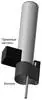
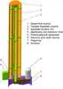
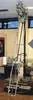
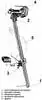
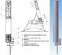
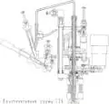
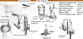

# Soil sampling system (a list)
> 2019.05.12 [🚀](../index/index.md) [despace](index.md) → [SSS](sss.md)

[TOC]

---

A list of [Soil sampling systems](sss.md).

   - Буровая установка

## Current

 

### LB-15 (RU)

**LB‑15** *(ru. ЛБ-15)* — soil sampling system (logging‑drilling rig) by GEOKHI RAS, TSNIIRTK. Designed in 2017.

|*Characteristics*|*[Value](si.md)  (LB‑15)*|
|:--|:--|
|Composition| |
|Consumption, W| |
|Dimensions, ㎜|2 000 × … × 2 000|
|[Interfaces](interface.md)| |
|[Lifetime](lifetime.md)/Resource, h(y)|… / …|
|Mass, ㎏|50 ‑ 70|
|[Overload](vibration.md), Grms| |
|[Rad.resist](ion_rad.md), ㏉ (㎭)| |
|[Reliability](qm.md) per [lifetime](lifetime.md)| |
|[Thermal range](tcs.md), ℃| |
|[TRL](trl.md)|1|
|[Voltage](sps.md), V| |
|**【Specific】**|• • •|
|Core sample ⌀, ㎜|20|
|Drilling depth, ㎜|1 500 ‑ 6 000|
|Drilling speed, ㎜/s, ≥| |
|Soil sample mass, g|・840 (core sample length 1 500 ㎜)  ・1 680 (core sample length 3 000 ㎜)  ・2 520 (core sample length 4 500 ㎜)  ・3 360 (core sample length 6 000 ㎜)|
|Soil sample volume, ㎜³| |
| ||||

**Notes:**

   1. [A part of Slyuta’s presentation ❐](f/sss/l/lb-15_presentation_2018_sluta.pdf) (Moscow, IKI RAS, 2018)
   1. **Applicability:** none.

 

## Archive

 

### LB-09 (RU)

**LB‑09** *(ru. ЛБ-09)* — soil sampling system. Designed in 1975.

|*Characteristics*|*[Value](si.md)  (LB-09)*|
|:--|:--|
|Composition| |
|Consumption, W|550 (average)|
|Dimensions, ㎜|3 200 × … × 3 200 |
|[Interfaces](interface.md)| |
|[Lifetime](lifetime.md)/Resource, h(y)|14/…|
|Mass, ㎏|55|
|[Overload](vibration.md), Grms| |
|[Rad.resist](ion_rad.md), ㏉ (㎭)| |
|[Reliability](qm.md) per [lifetime](lifetime.md)| |
|[Thermal range](tcs.md), ℃| |
|[TRL](trl.md)|9|
|[Voltage](sps.md), V| |
|**【Specific】**|• • •|
|Core sample ⌀, ㎜|10|
|Drilling depth, ㎜|2 600|
|Drilling speed, ㎜/s, ≥|2.5 (lunar soil)|
|Soil sample mass, g|170|
|Soil sample volume, ㎜³| |
| | |

**Notes:**

   1. [Presentation for SC Luna‑Grunt ❐](f/sss/2018_ikiran_sluta.djvu) (Moscow, IKI RAS, 2018, Slyuta E.N.)
   1. **Applicability:** «[Luna-24](луна_24.md)»

 

### LB-10 (RU)

**LB‑10** *(ru. ЛБ-10)* — soil sampling system (logging‑drilling rig) by KBOM. Designed in 1976.

|*Characteristics*|*[Value](si.md)  (LB-10)*|
|:--|:--|
|Composition| |
|Consumption, W| |
|Dimensions, ㎜| |
|[Interfaces](interface.md)| |
|[Lifetime](lifetime.md)/Resource, h(y)| |
|Mass, ㎏|244|
|[Overload](vibration.md), Grms| |
|[Rad.resist](ion_rad.md), ㏉ (㎭)| |
|[Reliability](qm.md) per [lifetime](lifetime.md)| |
|[Thermal range](tcs.md), ℃| |
|[TRL](trl.md)|9|
|[Voltage](sps.md), V| |
|**【Specific】**|• • •|
|Core sample ⌀, ㎜| |
|Drilling depth, ㎜|15 000|
|Drilling speed, ㎜/s, ≥| |
|Soil sample mass, g| |
|Soil sample volume, ㎜³| |
| ||

**Notes:**

   1. [Presentation for SC Luna‑Grunt ❐](f/sss/2018_ikiran_sluta.djvu) (Moscow, IKI RAS, 2018, Slyuta E.N.)
   1. **Applicability:** none.

 

### VB02 (RU)
**VB02** *(ru. ВБ02)* — soil sampling system by KBOM. Designed in 1981.

|*Characteristics*|*[Value](si.md)  (VB02)*|
|:--|:--|
|Composition| |
|Consumption, W|…, 3 А|
|Dimensions, ㎜|…|
|[Interfaces](interface.md)| |
|[Lifetime](lifetime.md)/Resource, h(y)|… / 204 s|
|Mass, ㎏|26.2|
|[Overload](vibration.md), Grms|300|
|[Rad.resist](ion_rad.md), ㏉ (㎭)| |
|[Reliability](qm.md) per [lifetime](lifetime.md)| |
|[Thermal range](tcs.md), ℃|−20 ‑ +600|
|[TRL](trl.md)|9|
|[Voltage](sps.md), V| |
|**【Specific】**|• • •|
|Core sample ⌀, ㎜|16|
|Drilling depth, ㎜|36|
|Drilling speed, ㎜/s, ≥| |
|Soil sample mass, g| |
|Soil sample volume, ㎜³|1 600|
| |    |

**Notes:**
   1. [Venera-D Lander payload instruments ❐](f/sss/v/vb02_doc02.pdf) ([Gerasimov](person.md), [Economou](person.md), Moscow, IKI RAS, 2019)
   1. [SSS brief description ❐](f/sss/v/vb02_doc01.pdf) (Moscow, IKI RAS, 2018)
   1. <http://www.russian.space/127/>
   1. The cavity with the vacuum opened after the completion of drilling, after which the samples of the breed under pressure of the Venus atmosphere suused inside the analyzers. The sample of rock was irradiated with radioactive isotopes of ²³⁸Pu & iron‑55, a 256‑channel amplitude analyzer was used.
   1. **Applicability:** “[Vega-2](vega_1_2.md)” (1984)・ “[Venera-13/14](venera_13_14.md)” (1981)

 

## Docs & links
|Navigation|
|:--|
|**[FAQ](faq.md)**【**[SCS](scs.md)**·КК, **[SC (OE+SGM)](sc.md)**·КА】**[CON](contact.md)·[Pers](person.md)**·Контакт, **[Ctrl](control.md)**·Упр., **[Doc](doc.md)**·Док., **[Drawing](drawing.md)**·Чертёж, **[EF](ef.md)**·ВВФ, **[Error](error.md)**·Ошибки, **[Event](event.md)**·События, **[FS](fs.md)**·ТЭО, **[HF&E](hfe.md)**·Эрго., **[KT](kt.md)**·КТ, **[N&B](nnb.md)**·БНО, **[Project](project.md)**·Проект, **[QM](qm.md)**·БКНР, **[R&D](rnd.md)**·НИОКР, **[SI](si.md)**·СИ, **[Test](test.md)**·ЭО, **[TRL](trl.md)**·УГТ, **[Way](way.md)**·Пути|
|*Sections & pages*|
|**【Soil sampling system (SSS)】**  [Logging](sss.md)・ [Stratification](sss.md) • • •  **RU:** [GZU-LR1](гзу_лр1.md)・ [LB-15](sss_lst.md) *([VB02](sss_lst.md)・ [LB-09](sss_lst.md)・ [LB-10](sss_lst.md))*|

   1. Docs: …
   1. <…>
