# Star tracker (a list)
> 2019.07.31 [🚀](../index/index.md) [despace](index.md) → [Sensor](sensor.md)

**Table of contents:**

[TOC]

---

A list of [Star tracker (sensor)](sensor.md).

## Current

 

### 348К (RU)
**348К** — звёздный датчик для определения и выдачи в [GNC](gnc.md) информации о положении и угловых скоростях системы координат (СК) изделия относительно геоцентрической СК.  
Разработчик [Геофизика‑Космос](contact/geofizika_s.md), RU. Разработано в <mark>TBD</mark> году. Активное использование.

|*Characteristics*|*[Value](si.md)  (348К)*|
|:-|:-|
|Composition|4 блока оптических (БО) 348К/01 и блока электронного (БЭ) 348К/02,   устанавливаемых снаружи КА и функционирующих в условиях космического пространства. БЭ состоит из 2 идентичных функционально независимых каналов. Один канал БЭ при штатной эксплуатации изделия находится в холодном резерве. Выбор рабочих БО и их количество определяется функциональными алгоритмами изделия.|
|Consumption, W|16 — штатное; 30 в течении 30 s — максимальное|
|Dimensions, ㎜|⌀140×209 (БО без бленды); 190 × 130 × 45 (БЭ)|
|[Interfaces](interface.md)| |
|[Lifetime](lifetime.md)/Resource, h(y)|… / …|
|Mass, ㎏|1.25 — БО; 0.95 — БЭ;  **Итого:** 4×1.25 + 0.95 = **5.95** или 2×1.25 + 0.95 = **3.45**|
|[Overload](vibration.md), Grms| |
|[Rad.resist](ion_rad.md), ㏉ (㎭)| |
|[Reliability](qm.md) per [lifetime](lifetime.md)|0.9969 за 3 года|
|[Thermal range](tcs.md), ℃| |
|[TRL](trl.md)|9|
|[Voltage](sps.md), V|27 (25 ‑ 28)|
|**【Specific】**|• • •|
|Accept. ang. speed, °/s| |
|Accuracy|14″ — по углам вокруг осей Хи, Yи, Zи при постоянной угловой скорости ω движения звёзд в полях зрения БО до 5 угл. мин./с;  15″ — по углам вокруг осей Хи, Yи, Zи при постоянной угловой скорости ω движения звёзд в полях зрения БО до 0.2 угл. град./с;  при этом максимальные (3σ) случайные составляющие погрешностей Δφ, Δθ, Δψ определения ориентации для указанных условий по углам вокруг осей Хи, Yи, Zи не превышают 11″ при ω до 5 угл. мин./с, 12″ при ω до 0.2 угл. град./с.|
|Back. brightn., ㏅/m²|…  для света с солнечным спектром|
|Delay, s, ≤|… (от середины интервала экспонирования до момента начала считывания БКУ)|
|[FOV](fov.md), °|(18°55´ ± 0.3°) × (18°55´ ± 0.3°)|
|Identification time, s|2 ‑ 120|
|Lens|Попадание в угловое поле одного любого из БО Солнца, Луны, Земли не влияет на заданные характеристики обнаружения и точности и не приводит к отказу и ухудшению характеристик|
|Output data| |
|Ready mode|60 с от подачи питания|
|Refresh rate, ㎐|5 (обеспечивается программно)|
| |[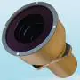](f/sensor/348k_pic1.webp)|

**Notes:**

   1. [3D‑модель БО ❐](f/sensor/348k_bo.stp)・ [3D‑модель БЭ ❐](f/sensor/348k_be.stp)・ [Чертежи ❐](f/sensor/348k_sketch.pdf) (БО, БЭ)
   1. <http://www.geofizika-cosmos.ru/napravleniya-deyatelnosti/optiko-elektronnye-pribory-orientacii-i-navigacii-kosmicheskih-apparatov/napravlenie-1.html>
   1. **Applicability:** [Luna‑26](луна_26.md)

 

### 360К (RU)
**360К** — звёздный датчик, предназначенный для определения ориентации [КА](sc.md) относительно звёздного неба.  
Разработчик [Геофизика‑Космос](contact/geofizika_s.md), RU. Разработано в <mark>TBD</mark> году. Разработка (предположительно в 2018‑2019 годам появятся характеристики). Покупное изделие. (по состоянию на 20.06.2017)

|*Characteristics*|*[Value](si.md)  (360К)*|
|:-|:-|
|Composition| |
|Consumption, W| |
|Dimensions, ㎜| |
|[Interfaces](interface.md)| |
|[Lifetime](lifetime.md)/Resource, h(y)|… / …|
|Mass, ㎏| |
|[Overload](vibration.md), Grms| |
|[Rad.resist](ion_rad.md), ㏉ (㎭)| |
|[Reliability](qm.md) per [lifetime](lifetime.md)| |
|[Thermal range](tcs.md), ℃| |
|[TRL](trl.md)| |
|[Voltage](sps.md), V| |
|**【Specific】**|• • •|
|Accept. ang. speed, °/s| |
|Accuracy| |
|Back. brightn., ㏅/m²|… для света с солнечным спектром|
|Delay, s, ≤|… (от середины интервала экспонирования до начала считывания БКУ)|
|[FOV](fov.md), °| |
|Identification time, s| |
|Lens| |
|Output data| |
|Ready mode| |
|Refresh rate, ㎐| |

**Notes:**

   1. …
   1. **Applicability:** КА «[Венера‑Д](венера‑д.md)»

 

### A-STR (EU)
> <small>**A-STR** — англоязычный термин, не имеющий аналога в русском языке. **A-STR** — дословный перевод с английского на русский.</small>

**A-STR** — звёздный датчик для определения и выдачи в [GNC](gnc.md) информации о положении и угловых скоростях системы координат (СК) изделия относительно геоцентрической СК.  
Разработчик [Leonardo](leonardo.md), EU. Разработано в 2001 году. Активное применение.

|*Characteristics*|*[Value](si.md)  (A-STR)*|
|:-|:-|
|Composition|Single unit (ОБ + БЭ)|
|Consumption, W|9 при 20 ℃, 13.5 при 60 ℃|
|Dimensions, ㎜|195 × 175 × 291 с блендой 40°|
|[Interfaces](interface.md)|[RS-422](rs_xxx.md), [MIL-STD-1553B](mil_std_1553.md)|
|[Lifetime](lifetime.md)/Resource, h(y)|ГСО: 157 680 (18) / …|
|Mass, ㎏|3.55 с блендой 40°|
|[Overload](vibration.md), Grms| |
|[Rad.resist](ion_rad.md), ㏉ (㎭)| |
|[Reliability](qm.md) per [lifetime](lifetime.md)|0.99787 (1 346 [FIT](qm.md)) или 0.99619 (2 415 [FIT](qm.md))|
|[Thermal range](tcs.md), ℃|−30 ‑ +60|
|[TRL](trl.md)|9|
|[Voltage](sps.md), V|… (20 ‑ 50)|
|**【Specific】**|• • •|
|Accept. ang. speed, °/s|2|
|Accuracy|63″ (0.1 °/s), 230″ (2 °/s)|
|Back. brightn., ㏅/m²| |
|Delay, s, ≤| |
|[FOV](fov.md), °|16.4 × 16.4|
|Identification time, s|6|
|Lens|MPP CCD|
|Output data| |
|Ready mode| |
|Refresh rate, ㎐|10|
| |[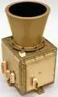](f/sensor/a/a_str_pic1.webp)|

**Notes:**

   1. [A-STR & AA-STR Datasheet ❐](f/sensor/a/a_aa_str_datasheet.pdf)
   1. **Applicability:** …

 

### AA-STR (EU)
> <small>**AA-STR** — англоязычный термин, не имеющий аналога в русском языке. **AA-STR** — дословный перевод с английского на русский.</small>

**AA-STR** — звёздный датчик для определения и выдачи в [GNC](gnc.md) информации о положении и угловых скоростях системы координат (СК) изделия относительно геоцентрической СК.  
Разработчик [Leonardo](leonardo.md), EU. Разработано в 2001 году. Активное применение.

|*Characteristics*|*[Value](si.md)  (AA-STR)*|
|:-|:-|
|Composition|Single unit (ОБ + БЭ)|
|Consumption, W|6 при 20 ℃, 13 при 60 ℃|
|Dimensions, ㎜|164 × 156 × 348 с блендой 25°|
|[Interfaces](interface.md)|[RS-422](rs_xxx.md), [MIL-STD-1553B](mil_std_1553.md)|
|[Lifetime](lifetime.md)/Resource, h(y)|ГСО: 157 680 (18) / …|
|Mass, ㎏|2.6 с блендой 40°|
|[Overload](vibration.md), Grms| |
|[Rad.resist](ion_rad.md), ㏉ (㎭)| |
|[Reliability](qm.md) per [lifetime](lifetime.md)|0.99866 (850 [FIT](qm.md)) или 0.99692 (1 950 [FIT](qm.md))|
|[Thermal range](tcs.md), ℃|−30 ‑ +60|
|[TRL](trl.md)|9|
|[Voltage](sps.md), V|… (20 ‑ 52) или  … (60 ‑ 110)|
|**【Specific】**|• • •|
|Accept. ang. speed, °/s|2|
|Accuracy|50″ (0.1 °/s), 288″ (2 °/s)|
|Back. brightn., ㏅/m²| |
|Delay, s, ≤| |
|[FOV](fov.md), °|20 × 20|
|Identification time, s|9|
|Lens|HAS APS|
|Output data| |
|Ready mode| |
|Refresh rate, ㎐|10|
| |[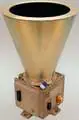](f/sensor/a/aa_str_pic1.webp)|

**Notes:**

   1. [A-STR & AA-STR Datasheet ❐](f/sensor/a/a_aa_str_datasheet.pdf)
   1. **Applicability:** …

 

### AD-1 (RU)
> <small>**АД-1** — русскоязычный термин, не имеющий аналога в английском языке. **AD-1** — дословный перевод с русского на английский.</small>

**АД‑1** — [звёздный датчик](sensor.md), предназначенный для определения ориентации [КА](sc.md) относительно звёздного неба.  
Разработчик [МОКБ Марс](contact/mars_mokb.md), RU. Разработано в 2005 году Активное использование.

|*Characteristics*|*[Value](si.md)  (АД-1)*|
|:-|:-|
|Composition| |
|Consumption, W|15|
|Dimensions, ㎜|⌀ 238 × 426|
|[Interfaces](interface.md)|[МКО](mil_std_1553.md)|
|[Lifetime](lifetime.md)/Resource, h(y)|… / …|
|Mass, ㎏|3.85|
|[Overload](vibration.md), Grms| |
|[Rad.resist](ion_rad.md), ㏉ (㎭)| |
|[Reliability](qm.md) per [lifetime](lifetime.md)| |
|[Thermal range](tcs.md), ℃| |
|[TRL](trl.md)| |
|[Voltage](sps.md), V|27 ± 4|
|**【Specific】**|• • •|
|Accept. ang. speed, °/s| |
|Accuracy|5 ‑ 15″;  до 15 одновременно отслеживаемых звёзд|
|Back. brightn., ㏅/m²|… для света с солнечным спектром|
|Delay, s, ≤|… (время от середины интервала экспонирования до момента начала считывания БКУ)|
|[FOV](fov.md), °|13 × 13|
|Identification time, s| |
|Lens| |
|Output data| |
|Ready mode| |
|Refresh rate, ㎐|0.5|
| |[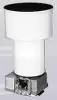](f/sensor/a/ad-1.webp)|

**Notes:**

   1. …
   1. **Applicability:** (2005) Монитор‑Э・ (2006) КазСатv・ (2009) Экспресс‑МД1・ (2011) [Электро‑Л](электро_л.md)

 

### ASTRO 10 (EU)
> <small>**ASTRO 10** — англоязычный термин, не имеющий аналога в русском языке. **АСТРО 10** — дословный перевод с английского на русский.</small>

**ASTRO 10** — звёздный датчик для определения и выдачи в [GNC](gnc.md) информации о положении и угловых скоростях системы координат (СК) изделия относительно геоцентрической СК.  
Разработчик [Jena‑Optronik](contact/jenaoptronik.md), EU. Разработано в <mark>TBD</mark> году. Активное применение.

|*Characteristics*|*[Value](si.md)  (ASTRO 10)*|
|:-|:-|
|Composition|1 ОБ, 1 БЭ|
|Consumption, W|8 (+7 для охладителя)|
|Dimensions, ㎜|ОБ ⌀140 × 264 для бленды 30°, ⌀130 × 205 для бленды 40°,  БЭ 150 × 145 × 75|
|[Interfaces](interface.md)|[RS-422](rs_xxx.md), [MIL-STD-1553B](mil_std_1553.md)|
|[Lifetime](lifetime.md)/Resource, h(y)|НОО: 105 120 (12) / …|
|Mass, ㎏|3.8 с блендой 30°, 3.55 с блендой 40°|
|[Overload](vibration.md), Grms| |
|[Rad.resist](ion_rad.md), ㏉ (㎭)| |
|[Reliability](qm.md) per [lifetime](lifetime.md)|0.99937 (600 [FIT](qm.md))|
|[Thermal range](tcs.md), ℃|−40 ‑ +40 (ОБ), −40 ‑ +50 (БЭ)|
|[TRL](trl.md)| |
|[Voltage](sps.md), V|28 (22 ‑ 60)|
|**【Specific】**|• • •|
|Accept. ang. speed, °/s|3|
|Accuracy|12″|
|Back. brightn., ㏅/m²| |
|Delay, s, ≤| |
|[FOV](fov.md), °|16.7 × 12.5|
|Identification time, s| |
|Lens|668 × 520|
|Output data| |
|Ready mode| |
|Refresh rate, ㎐| |
| |[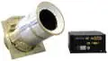](f/здa/astro_10_pic1.webp)|

**Notes:**

   1. [ASTRO 10 Datasheet ❐](f/sensor/a/astro_10_datasheet.pdf)
   1. **Applicability:** …

 

### ASTRO 15 (EU)
> <small>**ASTRO 15** — англоязычный термин, не имеющий аналога в русском языке. **АСТРО 15** — дословный перевод с английского на русский.</small>

**ASTRO 15** — звёздный датчик для определения и выдачи в [GNC](gnc.md) информации о положении и угловых скоростях системы координат (СК) изделия относительно геоцентрической СК.  
Разработчик [Jena‑Optronik](contact/jenaoptronik.md), EU. Разработано в 2010 году. Активное применение.

|*Characteristics*|*[Value](si.md)  (ASTRO 15)*|
|:-|:-|
|Composition|Single unit|
|Consumption, W|10 (+5 для охладителя)|
|Dimensions, ㎜|⌀192 × 496 для бленды 30°, ⌀192 × 552 для бленды 25°|
|[Interfaces](interface.md)|[RS-422](rs_xxx.md), [MIL-STD-1553B](mil_std_1553.md)|
|[Lifetime](lifetime.md)/Resource, h(y)|НОО: 131 400 (15) / …|
|Mass, ㎏|4.5 для 15 лет на ГСО или 4.35 для 5 лет на НОО,  1.5 для бленды 30°, 1.65 для бленды 25°|
|[Overload](vibration.md), Grms| |
|[Rad.resist](ion_rad.md), ㏉ (㎭)|для 25 лет на ГСО|
|[Reliability](qm.md) per [lifetime](lifetime.md)| |
|[Thermal range](tcs.md), ℃|−30 ‑ +55|
|[TRL](trl.md)|9|
|[Voltage](sps.md), V|… (30 ‑ 52)|
|**【Specific】**|• • •|
|Accept. ang. speed, °/s|2|
|Accuracy|10″|
|Back. brightn., ㏅/m²| |
|Delay, s, ≤| |
|[FOV](fov.md), °|13.8 × 13.8 физическое, 13.25 × 13.25 эффективное|
|Identification time, s|10|
|Lens|1024 × 1024|
|Output data| |
|Ready mode| |
|Refresh rate, ㎐| |
| |[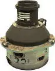](f/здa/astro_15_pic1.webp)|

**Notes:**

   1. [ASTRO 15 Datasheet ❐](f/sensor/a/astro_15_datasheet.pdf)
   1. **Applicability:** …

 

### ASTRO APS (EU)
> <small>**ASTRO APS** — англоязычный термин, не имеющий аналога в русском языке. **АСТРО АПС** — дословный перевод с английского на русский.</small>

**ASTRO APS** — звёздный датчик для определения и выдачи в [GNC](gnc.md) информации о положении и угловых скоростях системы координат (СК) изделия относительно геоцентрической СК.  
Разработчик [Jena‑Optronik](contact/jenaoptronik.md), EU. Разработано в 2013 году. Активное применение.

|*Characteristics*|*[Value](si.md)  (ASTRO APS)*|
|:-|:-|
|Composition|Single unit|
|Consumption, W|6 (+6 с охладителем)|
|Dimensions, ㎜|154 × 154 × 237|
|[Interfaces](interface.md)|[RS-422](rs_xxx.md), [MIL-STD-1553B](mil_std_1553.md)|
|[Lifetime](lifetime.md)/Resource, h(y)|НОО: 157 680 (18) / …|
|Mass, ㎏|2|
|[Overload](vibration.md), Grms| |
|[Rad.resist](ion_rad.md), ㏉ (㎭)|для 25 лет на ГСО|
|[Reliability](qm.md) per [lifetime](lifetime.md)|0.99927 (460 [FIT](qm.md))|
|[Thermal range](tcs.md), ℃|−30 ‑ +60|
|[TRL](trl.md)|9|
|[Voltage](sps.md), V|28|
|**【Specific】**|• • •|
|Accept. ang. speed, °/s|5|
|Accuracy|8″|
|Back. brightn., ㏅/m²| |
|Delay, s, ≤| |
|[FOV](fov.md), °|20|
|Identification time, s|10|
|Lens|1024 × 1024|
|Output data| |
|Ready mode| |
|Refresh rate, ㎐|16|
| |[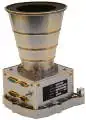](f/здa/astro_aps_pic1.webp)|

**Notes:**

   1. [ASTRO APS Datasheet ❐](f/sensor/a/astro_aps_datasheet.pdf)
   1. **Applicability:** …

 

### Auriga (EU)
> <small>**Auriga** — англоязычный термин, не имеющий аналога в русском языке. **Аурига** — дословный перевод с английского на русский.</small>

**Auriga** — звёздный датчик для определения и выдачи в [GNC](gnc.md) информации о положении и угловых скоростях системы координат (СК) изделия относительно геоцентрической СК.  
Разработчик [Sodern](contact/sodern.md), EU. Разработано в 2017 году. Активное применение.

Итоговый ЗД создаётся из нужных оптических блоков и БЭ.

|*Characteristics*|*[Value](si.md)  (Auriga, ОБ)*|*[Value](si.md)  (Auriga, БЭ)*|
|:-|:-|:-|
|Composition|1 ОБ|1 БЭ|
|Consumption, W|1| |
|Dimensions, ㎜|56 × 66 × 94|120 × 90 × 22|
|[Interfaces](interface.md)|SpaceWire| |
|[Lifetime](lifetime.md)/Resource, h(y)|НОО: 61 320 (7) / …|… / …|
|Mass, ㎏|0.21|0.35|
|[Overload](vibration.md), Grms| | |
|[Rad.resist](ion_rad.md), ㏉ (㎭)| | |
|[Reliability](qm.md) per [lifetime](lifetime.md)|0.99386 (< 1 000 FIT)| |
|[Thermal range](tcs.md), ℃|−30 ‑ +60| |
|[TRL](trl.md)| | |
|[Voltage](sps.md), V|5| |
|**【Specific】**|• • •|• • •|
|Accept. ang. speed, °/s|3| |
|Accuracy|11″| |
|Back. brightn., ㏅/m²| | |
|Delay, s, ≤| | |
|[FOV](fov.md), °| | |
|Identification time, s|11| |
|Lens| | |
|Output data| | |
|Ready mode| | |
|Refresh rate, ㎐|5| |
|[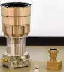](f/sensor/a/auriga_hydra_pic1.webp)|[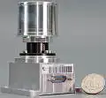](f/sensor/a/auriga_pic2.webp)|[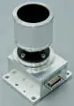](f/sensor/a/auriga_pic1.webp)|

**Notes:**

   1. [Auriga datasheet ❐](f/sensor/a/auriga_baseline_datasheet.pdf)・ [Sodern presentation 2017 ❐](f/sensor/sodern_presentation_2017.pdf)
   1. **[Видео ❐](f/sensor/a/auriga_logo_sodern.mkv)**
   1. **Applicability:** …

 

### BOKZ-MF (RU)
> <small>**БОКЗ‑МФ** — русскоязычный термин, не имеющий аналога в английском языке. **BOKZ‑MF** — дословный перевод с русского на английский.</small>

**Блок определения координат звёзд модифицированный (БОКЗ‑МФ)** — звёздный датчик, предназначенный для определения ориентации [КА](sc.md) относительно звёздного неба.  
Разработчик [ИКИ РАН](contact/iki_ras.md), RU. Разработано в 2006 году. Активное использование. Покупное изделие. (по состоянию на 20.06.2017)

|*Characteristics*|*[Value](si.md)  (БОКЗ-МФ)*|
|:-|:-|
|Composition|Single unit, включающий в себя следующие элементы:  ⒈ объектив «Астрар‑7С» (НРДК.202361.006);  ⒉ плата видеотракта (НРДК.468151.120) с фотоприемным устройством (ФПУ);  ⒊ плата процессора (НРДК.467489.008);  ⒋ плата вторичного источника питания (НРДК.436734.029);  ⒌ бленда (НРДК.203421.007);  ⒍ блок крышки (НРДК.323451.010).|
|Consumption, W|11|
|Dimensions, ㎜|247 × 179 × 180 без имитатора звёздного неба|
|[Interfaces](interface.md)| |
|[Lifetime](lifetime.md)/Resource, h(y)|41 000 (4 г 9 м) / 20 000 (2.28), не более 10 000 включений|
|Mass, ㎏|1.76 без имитатора звёздного неба;  3.25 с имитатором звёздного неба|
|[Overload](vibration.md), Grms| |
|[Rad.resist](ion_rad.md), ㏉ (㎭)| |
|[Reliability](qm.md) per [lifetime](lifetime.md)| |
|[Thermal range](tcs.md), ℃| |
|[TRL](trl.md)|9|
|[Voltage](sps.md), V|27 (23 ‑ 34)|
|**【Specific】**|• • •|
|Accept. ang. speed, °/s| |
|Accuracy|5″ σx,y  12″ σz|
|Back. brightn., ㏅/m²|0.01 для света с солнечным спектром|
|Delay, s, ≤|1 (от середины интервала экспонирования до начала считывания БКУ)|
|[FOV](fov.md), °| |
|Identification time, s|10|
|Lens| |
|Output data| |
|Ready mode|60 с от подачи питания|
|Refresh rate, ㎐|1|
| |[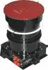](f/sensor/b/bokz-mf_pic1.webp) [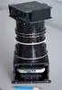](f/sensor/b/bokz-mf_pic2.webp)|

**Notes:**

   1. [3D‑модель ❐](f/sensor/b/bokz-mf_2011.7z)
   1. <http://www.iki.rssi.ru/ofo/page_navig.html>
   1. <http://ofo.ikiweb.ru/bokz.php>
   1. **1)** Подтверждается результатами экспериментов на стенде динамических испытаний.
   1. **2)** Подтверждается результатами обработки материалов, полученных при проведении наземных натурных испытаний.
   1. **3)** Подтверждается точностными расчётами.
   1. Прибор БОКЗ‑МФ без выхода из строя допускает попадание в своё поле зрения Солнца с угловым размером (от 18 до 50) угл. min на время не более 5 минут;
   1. Прибор БОКЗ‑МФ с частотой 1 Гц формирует матрицу направляющих косинусов относительно 2‑ой экваториальной системы координат при движении линии визирования относительно небесной сферы со скоростью от 0 град/сек до 1 град/сек.
   1. **Applicability:** КА [Luna‑27](луна_27.md)

*Предельно допустимая погрешность определения ориентации каждой из осей ПСК относительно второй экваториальной системы координат на момент середины интервала времени экспонирования за весь срок штатной эксплуатации (1 год) составляет:*

|*Параметр*|<small>*Угл. скорость (угл.мин./с)*|<small>*Предельная случайная составляющая погрешности (3σ)*|<small>*Систематическая составляющая погрешности*|<small>*Предельная суммарная погрешность*|
|:-|:-|:-|:-|:-|
|**Направление оси «OZ» ПСК**|0.00 **⁽¹⁾**  0.25 **⁽²⁾**  60.0 **⁽³⁾**|1.5 ‑ 2.0  6.0 ‑ 8.0  20.0 ‑ 25.0|5.0  5.0  5.0|6.5 ‑ 7.0  11.0 ‑ 13.0  25.0 ‑ 30.0|
|**Направление осей «OХ». «OY»**|0.00 **⁽¹⁾**  0.25 **⁽²⁾**  60.0 **⁽³⁾**|30.0 ‑ 35.0  45.0 ‑ 50.0  65.0 ‑ 70.0|15.0  15.0  15.0|45.0 ‑ 50.0  60.0 ‑ 65.0  80.0 ‑ 85.0|

 

### CT-2020 (US)
> <small>**CT-2020** — англоязычный термин, не имеющий аналога в русском языке. **CT-2020** — дословный перевод с английского на русский.</small>

**CT-2020** — звёздный датчик для определения и выдачи в [GNC](gnc.md) информации о положении и угловых скоростях системы координат (СК) изделия относительно геоцентрической СК.  
Разработчик [Ball A&T](contact/ball_at.md), US. Разработано в <mark>TBD</mark> году. В разработке.

|*Characteristics*|*[Value](si.md)  (CT-2020)*|
|:-|:-|
|Composition| |
|Consumption, W|8|
|Dimensions, ㎜| |
|[Interfaces](interface.md)|[1553](mil_std_1553.md), [RS-422](rs_xxx.md), [SpaceWire](spacewire.md)|
|[Lifetime](lifetime.md)/Resource, h(y)|… / …|
|Mass, ㎏|3|
|[Overload](vibration.md), Grms| |
|[Rad.resist](ion_rad.md), ㏉ (㎭)| |
|[Reliability](qm.md) per [lifetime](lifetime.md)| |
|[Thermal range](tcs.md), ℃| |
|[TRL](trl.md)| |
|[Voltage](sps.md), V|28 (варианты — 5 или 120)|
|**【Specific】**|• • •|
|Accept. ang. speed, °/s|8|
|Accuracy|1″|
|Back. brightn., ㏅/m²| |
|Delay, s, ≤| |
|[FOV](fov.md), °|15 × 15|
|Identification time, s| |
|Lens| |
|Output data| |
|Ready mode| |
|Refresh rate, ㎐|10|
| |[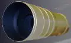](f/sensor/c/ct2020_pic1.webp)|

**Notes:**

   1. [CT-2020 fact sheet ❐](f/sensor/c/ct2020_d3408_0118.pdf)
   1. **Applicability:** …

 

### HAST (US)
> <small>**High Accuracy Star Tracker (HAST)** — англоязычный термин, не имеющий аналога в русском языке. **Высокоточный звёздный датчик (HAST)** — дословный перевод с английского на русский.</small>

**HAST** — звёздный датчик для определения и выдачи в [GNC](gnc.md) информации о положении и угловых скоростях системы координат (СК) изделия относительно геоцентрической СК.  
Разработчик [Ball A&T](contact/ball_at.md), US. Разработано в 1999 году. Активное применение.

|*Characteristics*|*[Value](si.md)  (HAST)*|
|:-|:-|
|Composition|1 Star sensor electronics unit (SSEU), 2 Star sensor heads (SSH)|
|Consumption, W| |
|Dimensions, ㎜| |
|[Interfaces](interface.md)| |
|[Lifetime](lifetime.md)/Resource, h(y)|43 800 (5) / …|
|Mass, ㎏|7.7|
|[Overload](vibration.md), Grms| |
|[Rad.resist](ion_rad.md), ㏉ (㎭)|до 10 000 протон/с/㎝²|
|[Reliability](qm.md) per [lifetime](lifetime.md)| |
|[Thermal range](tcs.md), ℃|SSEU: −15 ‑ +52, SSH: −1 ‑ +32, Заслонка: −26 ‑ +27, Затенение: −60 ‑ +27|
|[TRL](trl.md)|9|
|[Voltage](sps.md), V|28 (22 ‑ 36)|
|**【Specific】**|• • •|
|Accept. ang. speed, °/s|8 (ускорение 8 °/s²)|
|Accuracy|0.18″ для скорости ≤ 1 °/s; 0.50″ для скорости 1 ‑ 8 °/s|
|Back. brightn., ㏅/m²| |
|Delay, s, ≤| |
|[FOV](fov.md), °|8 × 8|
|Identification time, s| |
|Lens|c заслонками от Солнца и затенением|
|Output data| |
|Ready mode| |
|Refresh rate, ㎐|60 (8 опознаваемых звёзд) или 100 (4 звезды)|
| |[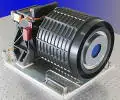](f/sensor/h/hast_pic1.webp)|

**Notes:**

   1. [HAST fact sheet ❐](f/sensor/h/hast_d1503_0118.pdf)
   1. **Applicability:** NASA Chandra X‑ray Observatory

 

### HE-5AS (EU)
> <small>**HE-5AS** — англоязычный термин, не имеющий аналога в русском языке. **HE-5AS** — дословный перевод с английского на русский.</small>

**HE-5AS** — звёздный датчик для определения и выдачи в [GNC](gnc.md) информации о положении и угловых скоростях системы координат (СК) изделия относительно геоцентрической СК.  
Разработчик [Terma A/S](contact/terma.md), EU. Разработано в (ранее 2000) году. Активное применение.

|*Characteristics*|*[Value](si.md)  (HE-5AS)*|
|:-|:-|
|Composition|1 ОБ, 1 БЭ|
|Consumption, W|1.5 ОБ, 5.5 БЭ|
|Dimensions, ㎜|⌀120 × 33 ОБ, 245 × 165 × 29|
|[Interfaces](interface.md)|[LVDS](lvds.md), [RS-422](rs_xxx.md), [MIL-STD-1553B](mil_std_1553.md)|
|[Lifetime](lifetime.md)/Resource, h(y)|… / …|
|Mass, ㎏|2.2 (1.0 ОБ, 1.2 БЭ)|
|[Overload](vibration.md), Grms| |
|[Rad.resist](ion_rad.md), ㏉ (㎭)|1 000 (100 000)|
|[Reliability](qm.md) per [lifetime](lifetime.md)| |
|[Thermal range](tcs.md), ℃|−40 ‑ +70|
|[TRL](trl.md)|9|
|[Voltage](sps.md), V|… (22 ‑ 34)|
|**【Specific】**|• • •|
|Accept. ang. speed, °/s|2|
|Accuracy|5″|
|Back. brightn., ㏅/m²| |
|Delay, s, ≤| |
|[FOV](fov.md), °|22|
|Identification time, s|3 ‑ 10|
|Lens| |
|Output data| |
|Ready mode| |
|Refresh rate, ㎐|4|
| |[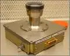](f/sensor/h/he_5as_pic1.webp) [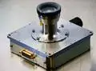](f/sensor/h/he_5as_pic2.webp) [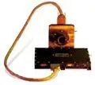](f/sensor/h/he_5as_pic3.webp)|

**Notes:**

   1. [HE-5AS specs ❐](f/sensor/h/he_5as_star_tracker.pdf)
   1. **Applicability:** …

 

### Horus (EU)
> <small>**Horus** — англоязычный термин, не имеющий аналога в русском языке. **Хорус** — дословный перевод с английского на русский.</small>

**Horus** — звёздный датчик для определения и выдачи в [GNC](gnc.md) информации о положении и угловых скоростях системы координат (СК) изделия относительно геоцентрической СК.  
Разработчик [Sodern](contact/sodern.md), EU. Разработано в 2019 году. Разработка.

|*Characteristics*|*[Value](si.md)  (Horus)*|
|:-|:-|
|Composition| |
|Consumption, W| |
|Dimensions, ㎜|140 × 140 × 240|
|[Interfaces](interface.md)|[MIL-STD-1553B](mil_std_1553.md)|
|[Lifetime](lifetime.md)/Resource, h(y)|НОО: 157 680 (18) / …|
|Mass, ㎏|5|
|[Overload](vibration.md), Grms| |
|[Rad.resist](ion_rad.md), ㏉ (㎭)| |
|[Reliability](qm.md) per [lifetime](lifetime.md)| |
|[Thermal range](tcs.md), ℃| |
|[TRL](trl.md)|7|
|[Voltage](sps.md), V|20 ‑ 100|
|**【Specific】**|• • •|
|Accept. ang. speed, °/s|2|
|Accuracy|2″|
|Back. brightn., ㏅/m²| |
|Delay, s, ≤| |
|[FOV](fov.md), °| |
|Identification time, s|10|
|Lens| |
|Output data| |
|Ready mode| |
|Refresh rate, ㎐| |
| |[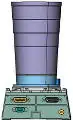](f/sensor/h/horus_pic1.webp)|

**Notes:**

   1. [Sodern presentation 2017 ❐](f/sensor/sodern_presentation_2017.pdf)
   1. **Applicability:** …

 

### Hydra (EU)
> <small>**Hydra** — англоязычный термин, не имеющий аналога в русском языке. **Гидра** — дословный перевод с английского на русский.</small>

**Hydra** — звёздный датчик для определения и выдачи в [GNC](gnc.md) информации о положении и угловых скоростях системы координат (СК) изделия относительно геоцентрической СК.  
Разработчик [Sodern](contact/sodern.md), EU. Разработано в 2012 году получен УГТ 9. Активное применение.

|*Characteristics*|*[Value](si.md)  (Hydra / Hydra-M)*|*[Value](si.md)  (Hydra-TC)*|
|:-|:-|:-|
|Composition|2 ОБ (до 3), 1 БЭ|2 ОБ (до 3), 1 БЭ|
|Consumption, W|8|8|
|Dimensions, ㎜|⌀147 × 283 ОБ, 170 × 146 × 103 БЭ|⌀147 × 283 ОБ, 194 × 166 × 159 БЭ|
|[Interfaces](interface.md)|[RS-422](rs_xxx.md), [MIL-STD-1553B](mil_std_1553.md)|[RS-422](rs_xxx.md), [MIL-STD-1553B](mil_std_1553.md)|
|[Lifetime](lifetime.md)/Resource, h(y)|НОО: 87 600 (10); ГСО: 157 680 (18)|НОО: 87 600 (10); ГСО: 157 680 (18)|
|Mass, ㎏|4.6 (2 ОБ по 1.4, 1 БЭ по 1.8)|6.7 (2 ОБ по 1.4, 1 БЭ по 3.9)|
|[Overload](vibration.md), Grms|28 случайные, 2 000 ударные|30 случайные, 2 350 ударные|
|[Rad.resist](ion_rad.md), ㏉ (㎭)| | |
|[Reliability](qm.md) per [lifetime](lifetime.md)|0.99968 (200 FIT)|0.99968 (200 FIT)|
|[Thermal range](tcs.md), ℃|−30 ‑ +60|−30 ‑ +60|
|[TRL](trl.md)| | |
|[Voltage](sps.md), V|… (21 ‑ 52)|… (21 ‑ 52)|
|**【Specific】**|• • •|• • •|
|Accept. ang. speed, °/s|10|7|
|Accuracy|2.1″|3.1″|
|Back. brightn., ㏅/m²| | |
|Delay, s, ≤| | |
|[FOV](fov.md), °|18.5|18.5|
|Identification time, s|1.5|2.5|
|Lens| | |
|Output data| | |
|Ready mode| | |
|Refresh rate, ㎐|16 ‑ 30|10 ‑ 30|
| |[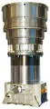](f/sensor/h/hydra_pic2.webp)| |

**Notes:**

   1. Hydra is available in four different versions:
      - **Hydra** baseline, suited to all missions, optimized for earth-observation and science missions.
      - **Hydra-TC**, designed for hardened radiation env. Fully redundant EU version for 2 OH, GEO shielding.
      - **Hydra-M**, cost-optimized. Light LEO version for 1 or 2 OH without Thermo-Electric Cooler.
      - **Hydra-CP** (centralized), optimized for easy S/C accommodation. Software hosted into On-Board Computer.
   1. [Hydra baseline datasheet ❐](f/sensor/h/hydra_baseline_datasheet.pdf)・ [Hydra-M datasheet ❐](f/sensor/h/hydra_m_datasheet.pdf)・ [Hydra-TC datasheet ❐](f/sensor/h/hydra_tc_datasheet.pdf)・ [Sodern presentation 2017 ❐](f/sensor/sodern_presentation_2017.pdf)
   1. <http://www.sodern.com/website/en/ref/Hydra_316.html>
   1. **Applicability:** …

| |
|:-|
|[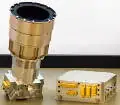](f/sensor/h/hydra_pic1.webp)  и **[Видео ❐](f/sensor/h/hydra_logo_sodern.mkv)**|

 

### mBOKZ‑2 (RU)
> <small>**мБОКЗ‑2** — RU term w/o analogues in English. **mBOKZ‑2** — literal EN translation.</small>

**мБОКЗ‑2** — звёздный датчик, предназначенный для определения ориентации [КА](sc.md) относительно звёздного неба.  
Разработчик [ИКИ РАН](contact/iki_ras.md), RU. Разработано в 2016 году, покупное изделие.

|*Characteristics*|*[Value](si.md)  (мБОКЗ-2)*|*[Value](si.md)  (мБОКЗ-2Р)*|
|:-|:-|:-|
|Composition|1 блок электроники (БЭ), 2 блока оптических (БО)|1 блок электроники, резервированный (БЭ), 2 блока оптических (БО)|
|Consumption, W|5|11|
|Dimensions, ㎜|БО 184 × 170 × 66; БЭ 200 × 135.5 × 126| |
|[Interfaces](interface.md)|[МКО](mil_std_1553.md) (МПИ) по ГОСТ Р 52070|[МКО](mil_std_1553.md) (МПИ) по ГОСТ Р 52070|
|[Lifetime](lifetime.md)/Resource, h(y)|46 000 (5.25) / 46 000 (5.25) / …| |
|Mass, ㎏|1.5 *(1 БЭ, 2 БО)*|3.6 *(1.4 БЭ, 2×1.1 БО)*|
|[Overload](vibration.md), Grms| | |
|[Rad.resist](ion_rad.md), ㏉ (㎭)| | |
|[Reliability](qm.md) per [lifetime](lifetime.md)|0.96 (5 лет), 0.98 (3 года), 0.991 (1 год)| |
|[Thermal range](tcs.md), ℃| | |
|[TRL](trl.md)|9|9|
|[Voltage](sps.md), V|27 ± 5|27|
|**【Specific】**|• • •|• • •|
|Accept. ang. speed, °/s|0.8 при начальной ориентации, 5 в режиме слежения|3|
|Accuracy|3″ — по направлению оптической оси;  20″ — вокруг направления оптической оси|0.8″ — по направлению оптической оси;  6″ — вокруг направления оптической оси|
|Back. brightn., ㏅/m²|… для света с солнечным спектром| |
|Delay, s, ≤|0.25 (от середины интервала экспонирования до момента начала считывания БКУ)| |
|[FOV](fov.md), °|20 × 20|… (30 — засветка бленды) |
|Identification time, s|3| |
|Lens|матрица КМОП 2048 × 2048; размер пикселя 5.5 мкм; f / D: 32 / 1.7|матрица КМОП 2048 × 2048; f / D: 32 / 1.5|
|Output data| | |
|Ready mode| | |
|Refresh rate, ㎐|4|4|
| |[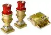](f/sensor/m/mbokz-2_01.webp)| |

**Notes:**

   1. [Отчёт о НИР «ВЕКТОР» ❐](f/sensor/m/2016_nir_vektor.pdf) (Москва, 2016)
   1. <http://ofo.ikiweb.ru/razrabotki/mbokz-2.html>
   1. <https://ru.wikipedia.org/wiki/Аист-2Д>
   1. **Applicability:** Аист‑2Д (старт 2016.04.28, ДЗЗ, полярная ОИСЗ 500 ㎞)

 

### MicroBOKZ (RU)
> <small>**МикроБОКЗ** — русскоязычный термин, не имеющий аналога в английском языке. **MicroBOKZ** — дословный перевод с русского на английский.</small>

**Микро блок определения координат звёзд модифицированный (МикроБОКЗ)** — звёздный датчик, предназначенный для определения ориентации [КА](sc.md) относительно звёздного неба.  
Разработчик [ИКИ РАН](contact/iki_ras.md), RU. Разработано в 2014 году. Активное использование. Покупное изделие.

|*Characteristics*|*[Value](si.md)  (МикроБОКЗ-Н)*|
|:-|:-|
|Composition|Single unit|
|Consumption, W|3.5|
|Dimensions, ㎜| |
|[Interfaces](interface.md)|[RS-422](rs_xxx.md) or SpaceWire|
|[Lifetime](lifetime.md)/Resource, h(y)| |
|Mass, ㎏|0.4|
|[Overload](vibration.md), Grms| |
|[Rad.resist](ion_rad.md), ㏉ (㎭)| |
|[Reliability](qm.md) per [lifetime](lifetime.md)| |
|[Thermal range](tcs.md), ℃| |
|[TRL](trl.md)|9|
|[Voltage](sps.md), V|5|
|**【Specific】**|• • •|
|Identification time, s| |
|Output data| |
|Accept. ang. speed, °/s|3|
|Delay, s, ≤| |
|Исполнение| |
|Lens|матрица КМОП 2048 × 2048; f / D: 22 / 1.5|
|[FOV](fov.md), °|… (30 ‑ 40 — засветка бленды)|
|Ready mode| |
|Accuracy|1.5″ — по направлению оптической оси;  8″ — вокруг направления оптической оси|
|Refresh rate, ㎐|4|
|Back. brightn., ㏅/m²| |

**Notes:**

   1. [3D‑модель ❐](f/sensor/b/bokz-mf_2011.7z)
   1. <http://www.iki.rssi.ru/ofo/page_navig.html>
   1. <http://ofo.ikiweb.ru/bokz.php>
   1. **Applicability:** …

 

### MIST (US)

> <small>**MIST** — англоязычный термин, не имеющий аналога в русском языке. **МИСТ** — дословный перевод с английского на русский.</small>

**MIST** — звёздный датчик для определения и выдачи в [GNC](gnc.md) информации о положении и угловых скоростях системы координат (СК) изделия относительно геоцентрической СК.  
Разработчик [Space Micro](space_micro.md). Разработано ранее 2017 года активное применение

|*Characteristics*|*[Value](si.md)  (MIST)*|
|:-|:-|
|Composition|Single unit (1 БЭ, 2 ОБ)|
|Consumption, W|4|
|Dimensions, ㎜|100 × 100 × 50|
|[Interfaces](interface.md)|[RS-422](rs_xxx.md), [SpaceWire](spacewire.md), [CAN](can.md)|
|[Lifetime](lifetime.md)/Resource, h(y)|НОО: 17 520 (2),  ГСО: 87 600 (10)|
|Mass, ㎏|0.55|
|[Overload](vibration.md), Grms| |
|[Rad.resist](ion_rad.md), ㏉ (㎭)|300 (30 000)|
|[Reliability](qm.md) per [lifetime](lifetime.md)|0.99|
|[Thermal range](tcs.md), ℃| |
|[TRL](trl.md)|9|
|[Voltage](sps.md), V| |
|**【Specific】**|• • •|
|Accept. ang. speed, °/s|5|
|Accuracy|10″|
|Back. brightn., ㏅/m²| |
|Delay, s, ≤| |
|[FOV](fov.md), °| |
|Identification time, s|1|
|Lens|High QE CMOS FPA|
|Output data| |
|Ready mode| |
|Refresh rate, ㎐|10|
| |[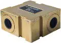](f/sensor/m/mist_pic1.webp)|

**Notes:**

   1. [MIST datasheet ❐](f/sensor/m/mist_datasheet.pdf)
   1. **Applicability:** …

 

### µSTAR (US)
> <small>**µSTAR** — англоязычный термин, не имеющий аналога в русском языке. **мюСТАР** — дословный перевод с английского на русский.</small>

**µSTAR** — звёздный датчик для определения и выдачи в [GNC](gnc.md) информации о положении и угловых скоростях системы координат (СК) изделия относительно геоцентрической СК.  
Разработчик [Space Micro](space_micro.md). Разработано в 2017 году, активное применение.

|*Characteristics*|*[Value](si.md)  (µSTAR-100M)*|*[Value](si.md)  (µSTAR-200M)*|*[Value](si.md)  (µSTAR-200H)*|*[Value](si.md)  (µSTAR-400M)*|
|:-|:-|:-|:-|:-|
|Composition| | | | |
|Consumption, W|5|10|10|18|
|Dimensions, ㎜|ОБ 150×150×232,  БЭ 179×75×112| | | |
|[Interfaces](interface.md)|[SpaceWire](spacewire.md)|[SpaceWire](spacewire.md)|[SpaceWire](spacewire.md)|[SpaceWire](spacewire.md)|
|[Lifetime](lifetime.md)/Resource, h(y)|НОО: 157 680 (18) / …|НОО: 157 680 (18) / …|НОО: 157 680 (18) / …|НОО: 157 680 (18) / …|
|Mass, ㎏|1.8 (0.9 ОБ, 0.9 БЭ)|2.1 (0.9 ОБ, 1.2 БЭ)|2.7 (1.5 ОБ, 1.2 БЭ)|3.3 (2.1 ОБ, 1.2 БЭ)|
|[Overload](vibration.md), Grms|10|10|10|10|
|[Rad.resist](ion_rad.md), ㏉ (㎭)|1 000 (100 000)| | | |
|[Reliability](qm.md) per [lifetime](lifetime.md)|0.99971 (140 [FIT](qm.md))|0.99971 (140 [FIT](qm.md))|0.99971 (140 [FIT](qm.md))|0.99971 (140 [FIT](qm.md))|
|[Thermal range](tcs.md), ℃|−24 ‑ +61|−24 ‑ +61|−24 ‑ +61|−24 ‑ +61|
|[TRL](trl.md)| | | | |
|[Voltage](sps.md), V| | | | |
|**【Specific】**|• • •|• • •|• • •|• • •|
|Accept. ang. speed, °/s| | | | |
|Accuracy|5″|5″|1″|5″|
|Back. brightn., ㏅/m²| | | | |
|Identification time, s| | | | |
|Delay, s, ≤| | | | |
|[FOV](fov.md), °| | | | |
|Lens|HAS2|HAS2|HAS2|HAS2|
|Output data| | | | |
|Ready mode| | | | |
|Refresh rate, ㎐|1|10|10|100|
| |[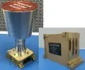](f/sensor/m/mustar_pic1.webp)| | | |

**Notes:**

   1. [µSTAR datasheet ❐](f/sensor/m/mustar_datasheet.pdf)
   1. **Applicability:** …

 

### SX-SR-MicroBOKZ (RU)
**SX‑SR‑MICRO_BOKZ** — звёздный датчик, предназначенный для определения ориентации [КА](sc.md) относительно звёздного неба.  
Разработчик [Спутникс](contact/sputnix.md), RU. Разработано  

|*Characteristics*|*[Value](si.md)  (SX-SR-MicroBOKZ)*|
|:-|:-|
|Composition|1 БЭ, 1 БО|
|Consumption, W|1 ‑ 2|
|Dimensions, ㎜|120 × 112 × 148|
|[Interfaces](interface.md)|[RS-422](rs_xxx.md), [CAN2B](can.md), [SpaceWire](spacewire.md)|
|[Lifetime](lifetime.md)/Resource, h(y)|… / …|
|Mass, ㎏|0.5|
|[Overload](vibration.md), Grms| |
|[Rad.resist](ion_rad.md), ㏉ (㎭)| |
|[Reliability](qm.md) per [lifetime](lifetime.md)| |
|[Thermal range](tcs.md), ℃|–40 ‑ +80 ℃|
|[TRL](trl.md)|2|
|[Voltage](sps.md), V|5 ± 0.3|
|**【Specific】**|• • •|
|Accept. ang. speed, °/s|0.5 ‑ 3 (режим определения начальной ориентации);  1 ‑ 6 (режим слежения)|
|Accuracy|1″ (СКО ошибка определения направления оптической оси);  6″ (СКО определения угла разворота вокруг оптической оси)|
|Back. brightn., ㏅/m²|… для света с солнечным спектром|
|[FOV](fov.md), °| |
|Identification time, s|3 ‑ 30|
|Lens| |
|Output data|кватернион ориентации и угловая скорость|
|Ready mode|10 с от подачи питания|
|Refresh rate, ㎐|от 1 до 10|
| |[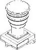](f/sensor/s/sx-sr-micro_bokz_pic1.webp)|

**Notes:**

   1. [Чертёж и описание ❐](f/sensor/s/sx-sr-micro_bokz_sputnix_ru.djvu)
   1. **Applicability:** …

 

### T1 (EU)
> <small>**T1** — англоязычный термин, не имеющий аналога в русском языке. **T1** — дословный перевод с английского на русский.</small>

**T1** — звёздный датчик для определения и выдачи в [GNC](gnc.md) информации о положении и угловых скоростях системы координат (СК) изделия относительно геоцентрической СК.  
Разработчик [Terma A/S](contact/terma.md), EU. Разработано в 2019 году. отработка

Итоговый ЗД создаётся из нужных оптических блоков и БЭ. БЭ одинаковые с [T1](st_lst.md).

|*Characteristics*|*[Value](si.md)  (T1, ОБ ⌀26 ㎜)*|*[Value](si.md)  (T1, ОБ ⌀26 ㎜)*|*[Value](si.md)  (T1, БЭ COTS)*|*[Value](si.md)  (T1, БЭ LEON3FT)*|
|:-|:-|:-|:-|:-|
|Composition|1 ОБ|1 ОБ|1 БЭ (CPU LEON3-FT)|1 БЭ (CPU LEON3-FT)|
|Consumption, W|0.75|0.75|1.25|2.5|
|Dimensions, ㎜|⌀125 × 165|⌀60 × 104|60 × 60 × 96|100 × 100 × 40|
|[Interfaces](interface.md)|[RS-422](rs_xxx.md), [SpaceWire](spacewire.md) 80 ㎒, CAN|[RS-422](rs_xxx.md), [SpaceWire](spacewire.md) 80 ㎒, CAN|для 1 ОБ|для 2 ОБ|
|[Lifetime](lifetime.md)/Resource, h(y)|НОО: 104 832 (12)  ГСО: 131 040 (15)|НОО: 104 832 (12)  ГСО: 131 040 (15)|НОО: 104 832 (12)  ГСО: 131 040 (15)|НОО: 104 832 (12)  ГСО: 131 040 (15)|
|Mass, ㎏|0.56|0.31|0.35|0.45|
|[Overload](vibration.md), Grms| | | | |
|[Rad.resist](ion_rad.md), ㏉ (㎭)| | | | |
|[Reliability](qm.md) per [lifetime](lifetime.md)| | | | |
|[Thermal range](tcs.md), ℃|−40 ‑ +60|−40 ‑ +60|−40 ‑ +70|−40 ‑ +70|
|[TRL](trl.md)|8|8|9|9|
|[Voltage](sps.md), V|5|5|5 ‑ 12|28 (20 ‑ 36)|
|**【Specific】**|• • •|• • •|• • •|• • •|
|Accept. ang. speed, °/s| | |3|3|
|Accuracy|1.5″|2″| | |
|Back. brightn., ㏅/m²| | | | |
|Delay, s, ≤| | | | |
|[FOV](fov.md), °|20|20| | |
|Identification time, s| 10|10| | |
|Lens|FaintStar 1024 × 1024|FaintStar 1024 × 1024| | |
|Output data| | | | |
|Ready mode| | | | |
|Refresh rate, ㎐|10|5| | |
|[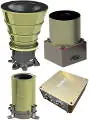](f/sensor/t/t1_pic1.webp)|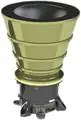|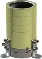|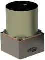|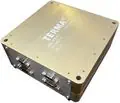|

**Notes:**

   1. [T1 options ❐](f/sensor/t/t1_two_pager_space_t1_star_tracker_options_a4.pdf)・ [T1 & T2 ❐](f/sensor/t/t1_t2_star_tracker_rev2.pdf)
   1. **Applicability:** …

### T2 (EU)
> <small>**T2** — англоязычный термин, не имеющий аналога в русском языке. **T2** — дословный перевод с английского на русский.</small>

**T2** — звёздный датчик для определения и выдачи в [GNC](gnc.md) информации о положении и угловых скоростях системы координат (СК) изделия относительно геоцентрической СК.  
Разработчик [Terma A/S](contact/terma.md), EU. Разработано в 2010 году, активное использование.

Итоговый ЗД создаётся из нужных оптических блоков и БЭ.

|*Characteristics*|*[Value](si.md)  (T2, ОБ)*|*[Value](si.md)  (T1, БЭ LEON3FT)*|
|:-|:-|:-|
|Composition|1 ОБ|1 БЭ (CPU LEON3-FT)|
|Consumption, W|0.5|2.5|
|Dimensions, ㎜|⌀92 × 68|100 × 100 × 40|
|[Interfaces](interface.md)|[RS-422](rs_xxx.md), [SpaceWire](spacewire.md) 20 ㎒, CAN|для 2 ОБ|
|[Lifetime](lifetime.md)/Resource, h(y)|НОО: 104 832 (12)  ГСО: 131 040 (15) / …|НОО: 104 832 (12)  ГСО: 131 040 (15) / …|
|Mass, ㎏|0.31|0.45|
|[Overload](vibration.md), Grms| | |
|[Rad.resist](ion_rad.md), ㏉ (㎭)| | |
|[Reliability](qm.md) per [lifetime](lifetime.md)| | |
|[Thermal range](tcs.md), ℃|−40 ‑ +70|−40 ‑ +70|
|[TRL](trl.md)|9|9|
|[Voltage](sps.md), V|5|28 (20 ‑ 36)|
|**【Specific】**|• • •|• • •|
|Accuracy|3.5″| |
|Accept. ang. speed, °/s| |3|
|Back. brightn., ㏅/m²| | |
|Delay, s, ≤| | |
|[FOV](fov.md), °|20| |
|Identification time, s|10| |
|Lens|FaintStar 512 × 512| |
|Output data| | |
|Ready mode| | |
|Refresh rate, ㎐|5| |
| | ||

**Notes:**

   1. [T1 & T2 ❐](f/sensor/t/t1_t2_star_tracker_rev2.pdf)
   1. **Applicability:** CryoSat-2 (2010)

 

## Archive

 

### SED26 (EU)
> <small>**SED26** — англоязычный термин, не имеющий аналога в русском языке. **СЭД26** — дословный перевод с английского на русский.</small>

**SED26** — звёздный датчик для определения и выдачи в [GNC](gnc.md) информации о положении и угловых скоростях системы координат (СК) изделия относительно геоцентрической СК.  
Разработчик [Sodern](contact/sodern.md), EU. Разработано в 1995 году. архивное изделие (вывод из эксплуатации в 2021 году).

|*Characteristics*|*[Value](si.md)  (SED26)*|
|:-|:-|
|Composition| |
|Consumption, W|7.5|
|Dimensions, ㎜|160 × 170 × 290|
|[Interfaces](interface.md)|[MIL-STD-1553B](mil_std_1553.md)|
|[Lifetime](lifetime.md)/Resource, h(y)|НОО: 157 680 (18) / …|
|Mass, ㎏|3.3|
|[Overload](vibration.md), Grms|25 случайные, 1 500 ударные|
|[Rad.resist](ion_rad.md), ㏉ (㎭)| |
|[Reliability](qm.md) per [lifetime](lifetime.md)|0.99605 ‑ 0.99866 (850 ‑ 2 500 [FIT](qm.md))|
|[Thermal range](tcs.md), ℃|−30 ‑ +60|
|[TRL](trl.md)|9|
|[Voltage](sps.md), V|… (20 ‑ 50)|
|**【Specific】**|• • •|
|Accept. ang. speed, °/s|20|
|Accuracy|15″|
|Back. brightn., ㏅/m²| |
|Delay, s, ≤| |
|[FOV](fov.md), °| |
|Identification time, s|3|
|Lens| |
|Output data| |
|Ready mode| |
|Refresh rate, ㎐|10|
| |[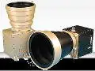](f/sensor/s/sed26_pic1.webp)|

**Notes:**

   1. …
   1. **Applicability:** …

 

## Docs & links (TRANSLATEME ALREADY)
|Navigation|
|:-|
|**[FAQ](faq.md)**【**[SCS](scs.md)**·КК, **[SC (OE+SGM)](sc.md)**·КА】**[CON](contact.md)·[Pers](person.md)**·Контакт, **[Ctrl](control.md)**·Упр., **[Doc](doc.md)**·Док., **[Drawing](drawing.md)**·Чертёж, **[EF](ef.md)**·ВВФ, **[Error](error.md)**·Ошибки, **[Event](event.md)**·Событ., **[FS](fs.md)**·ТЭО, **[HF&E](hfe.md)**·Эрго., **[KT](kt.md)**·КТ, **[N&B](nnb.md)**·БНО, **[Project](project.md)**·Проект, **[QM](qm.md)**·БКНР, **[R&D](rnd.md)**·НИОКР, **[SI](si.md)**·СИ, **[Test](test.md)**·ЭО, **[TRL](trl.md)**·УГТ|
|*Sections & pages*|
|**`Датчик:`**  [Видимая звёздная величина](app_mag.md)・ [ПЗр](fov.md) • • •  Star tracker. **Европа:** [ASTRO 15](st_lst.md) (6.15)・ [Hydra](st_lst.md) (4.6)・ [ASTRO 10](st_lst.md) (3.8)・ [A-STR](st_lst.md) (3.55)・ [AA-STR](st_lst.md) (2.6)・ [HE-5AS](st_lst.md) (2.2)・ [ASTRO APS](st_lst.md) (2)・ [Horus](st_lst.md) (1.6)・ [T2](st_lst.md) (0.8)・ [T1](st_lst.md) (0.6 ‑ 1)・ [Auriga](st_lst.md) (0.21)  ▮  **РФ:** [348К](st_lst.md) (3.45)・ [360К](st_lst.md) ()・ [АД-1](st_lst.md) (3.8)・ [БОКЗ-МФ](st_lst.md) (2.8)・ [мБОКЗ-2](мбокз_2.md) (1.5)・ [SX-SR-MicroBOKZ](st_lst.md) (0.5)  ▮  **США:** [HAST](st_lst.md) (7.7)・ [CT-2020](st_lst.md) (3)・ [µSTAR](st_lst.md) (2.1)・ [MIST](st_lst.md) (0.55) |

   1. Docs: …
   1. <…>
