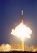
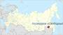

# Svobodny Cosmodrome
> 2019.05.01 [🚀](../index/index.md) [despace](index.md) → [Spaceport](spaceport.md)

[TOC]

---

> <small>**Свободный** — RU term w/o analogues in English. **Svobodny** — English equivalent.</small>

**Svobodny Cosmodrome** (Russian: Свобо́дный) was a Russianrocket launch site located approximately 15 km north of Svobodny, Amur Oblast. The cosmodrome was originally constructed as a launch site for intercontinental ballistic missiles called Svobodny-18. It was initially selected as a replacement for Baikonur Cosmodrome in the Kazakh Soviet Socialist Republic, which became independent as Kazakhstan after the dissolution of the Soviet Union. However the development of Svobodny was subsequently ended in 2007 in favour of a totally new space port, the [Vostochny](vostochny.md) Cosmodrome.

During the entire existence of the spaceport, five missile launches were made here. The last one was on April 25, 2006. Civil launches moved to [Vostochny](vostochny.md), military-on [Plesetsk](plesetsk.md).

|*Characteristic*|*[Value](si.md)*|
|:--|:--|
|Activity|*Closed* (1996 ‑ 2007)|
|[Launch vehicles](lv.md)|**ICBM RS‑18** ┊ **Start**|
|Operator|[Roskosmos](zz_roskosmos.md)|
|Location|51°42′N 128°00′E  Tsiolkovsky, Amur oblast, Russia|
|Distance|5 500 ㎞ — to the equator;  6 700 ㎞ — to [NPO Lavochkin](zz_lav.md);  12 500 ㎞ — to [JPL](zz_jpl.md)|
|Launch pad|1, 5 mines for ICBMs|
| |  |
| | <small>*World map of spaceports*</small>|

 

## Docs & links
|Navigation|
|:--|
|**[FAQ](faq.md)**【**[SCS](scs.md)**·КК, **[SC (OE+SGM)](sc.md)**·КА】**[CON](contact.md)·[Pers](person.md)**·Контакт, **[Ctrl](control.md)**·Упр., **[Doc](doc.md)**·Док., **[EF](ef.md)**·ВВФ, **[Error](error.md)**·Ошибки, **[Event](event.md)**·События, **[FS](fs.md)**·ТЭО, **[HF&E](hfe.md)**·Эрго., **[KT](kt.md)**·КТ, **[Model](model.md)**·Модель, **[N&B](nnb.md)**·БНО, **[Patent](патент.md)**·Пат., **[Project](project.md)**·Проект, **[QM](qm.md)**·БКНР, **[R&D](rnd.md)**·НИОКР, **[SI](si.md)**·СИ, **[Test](test.md)**·ЭО, **[TRL](trl.md)**·УГТ, **[Way](way.md)**·Пути|
|*Sections & pages*|
|**【[Spaceport](spaceport.md)】**  …  • • •  **Brazil:** ... ··· inactive: [Whalers Way](whalers_way.md) (3 900), [Woomera](woomera.md) (3 300) ┊ **Brazil:** [Alcantara](alcantara.md) (260) ┊ **Canada:** [Canso](canso.md) (5 000) ┊ **China:** [Jiuquan](jiuquan.md) (5 000), [Taiyuan](taiyuan.md) (4 500), [Wenchang](wenchang.md) (2 200), [Xichang](xichang.md) (3 200) ┊ **EU:** [Esrange](esrange.md) (7 550), [Guiana (Kourou)](kourou.md) (650) ··· inactive: [Hammaguir](hammaguir.md) (3 450), [San Marco](san_marco.md) (300), [Spaceport Cornwall](sp_cornwall.md) (5 600), [Shetland](shetland_sc.md) (6 800) ┊ **India:** [Sriharikota](sriharikota.md) (1 600) ┊ **Int.:** … ··· inactive: [Sea Launch](sea_launch.md) (0) ┊ **Iran:** [Semnan](semnan.md) (4 300)) ┊ **Iraq:** … ··· inactive: [Al Anbar](al_anbar.md) (3 700) ┊ **Israel:** [Palmachim](palmachim.md) (3 700) ┊ **Japan:** [Taiki](taiki.md) (4 700), [Tanegashima](tanegashima.md) (3 400), [Uchinoura](uchinoura.md) (3 700) ┊ **Korea N.:** [Sohae](sohae.md) (4 900), [Tonghae](tonghae.md) (4 700) ┊ **Korea S.:** [Naro](naro.md) (4 000) ┊ **RF,CIF:** [Baikonur](baikonur.md) (5 200), [Dombarovsky](dombarovsky.md) (5 500), [Kapustin Yar](kapustin_yar.md) (5 400), [Plesetsk](plesetsk.md) (7 400), [Vostochny](vostochny.md) (5 500) ··· inactive: [Svobodny](svobodny.md) (5 500) ┊ **USA:** [America](america.md) (3 900), [Canaveral](canaveral.md) (3 400), [Kennedy](kennedy.md) (3 400), [Kodiak](kodiak.md) (6 600), [Kwajalein](kwajalein.md) (1 000), [Rocket Lab LC1](rocket_lab_lc1.md) (4 700), [SpaceX STLS](spacex_stls.md) (2 800), [Vandenberg](vandenberg.md) (4 200), [Wallops](wallops.md) (4 500)|

   1. Docs: …
   1. Notable interwikies — …
   1. <https://en.wikipedia.org/wiki/Svobodny_Cosmodrome>
   1. <https://ru.wikipedia.org/wiki/Свободный_(космодром)>
